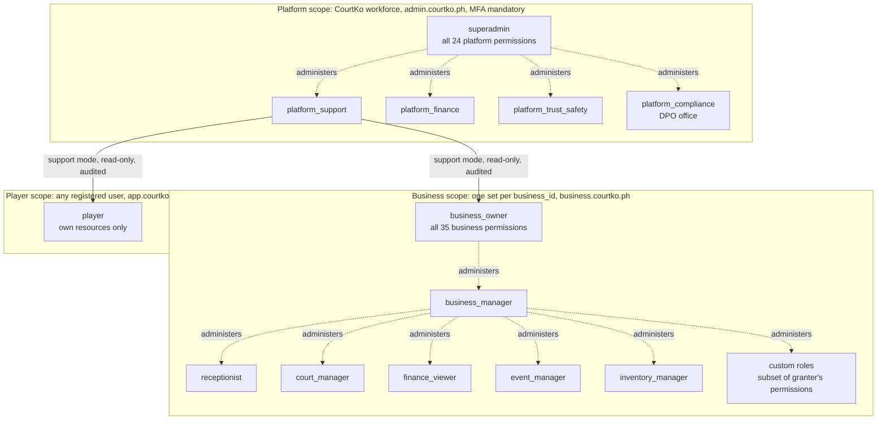
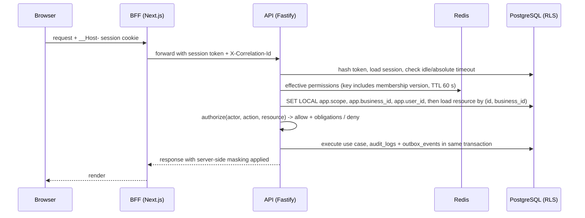

# 03 — Role & Permission Matrix

| | |
|---|---|
| Product | CourtKo (working name) — multi-tenant pickleball court booking marketplace, Philippines |
| Artifact | Design output 03 of 23 |
| Status | Draft for review. Describes the PRODUCTION system; the interactive demo mirrors these rules with synthetic data. |
| Last updated | 2026-09-30 |
| Related | [14 Security threat model](./14-security-threat-model.md) · [15 Privacy & retention](./15-privacy-data-retention-matrix.md) · [20 Testing strategy](./20-testing-strategy.md) · [23 Assumptions & decisions](./23-assumptions-and-decisions.md) · doc 10 (multi-tenant architecture) · doc 12 (ERD) · doc 13 (API design) |

## 1. Principles

1. **Deny by default.** An action is allowed only when a policy explicitly allows it. A route without a declared policy fails CI and refuses to register at startup.
2. **Server-side only.** Every API request is authorized inside `apps/api`. Hiding a button in the UI is a convenience, never a control. BFFs carry the session; they make no authorization decisions.
3. **Tenant isolation twice.** Application-layer scoping on every query **and** PostgreSQL Row-Level Security (`FORCE ROW LEVEL SECURITY`, non-owner app role, per-transaction `app.scope`, `app.business_id`, `app.user_id`).
4. **404 for foreign objects.** Objects in another business, or at a venue outside a venue-scoped assignment, return `NOT_FOUND`. `FORBIDDEN` (403) is returned only when the object is inside the actor's scope but the permission is missing.
5. **Split high-risk capabilities.** View vs contact (`customers.view` / `customers.view_contact`), request vs approve (`refunds.request` / `refunds.approve`), view vs manage (`finance.view_payouts` / `finance.manage_payout_account`), view vs export (`reports.view` / `reports.export`).
6. **Flat, explicit roles.** A role is a permission set. The hierarchy below is administrative (who may manage whom), not implicit inheritance.
7. **Strong authentication for power.** MFA gates, step-up re-authentication and maker-checker approvals protect critical actions.
8. **Everything sensitive is audited** (event list and record format in [doc 14 §10](./14-security-threat-model.md#10-audit-logging-specification)).

## 2. Role hierarchy



- One user account can be a player **and** a member of several businesses. Memberships are independent: roles in business A grant nothing in business B.
- Platform roles are assigned only to dedicated CourtKo workforce accounts (company email domain, MFA enforced). These accounts hold no business memberships and do not book as players (conflict-of-interest and blast-radius control; assumption A-11 in doc 23).
- "administers" edges show who may manage assignments, always subject to the no-escalation rule in §7.

## 3. Scope model

| Scope | Principal | Surface / host | API prefix | RLS context (`app.scope`) | Authentication |
|---|---|---|---|---|---|
| public | anonymous | web — courtko.ph | `/v1/public/*` | `public`: published venues, public availability only | none; rate-limited, WAF Bot Control |
| player | any registered user | web — app.courtko.ph | `/v1/me/*` | `player` + `app.user_id` | session; MFA optional; step-up for email/mobile/password/MFA changes and data export |
| business | member of the business in the path | business — business.courtko.ph | `/v1/businesses/{businessId}/*`, `/v1/staff/me/memberships` | `business` + `app.business_id` + `app.user_id` | session; MFA mandatory for business_owner, business_manager and any holder of an MFA-guarded permission |
| platform | CourtKo workforce | admin — admin.courtko.ph (WAF IP allowlist) | `/v1/admin/*` | `platform` + `app.user_id` | session (15 min idle); MFA mandatory; step-up for critical actions |
| system | worker jobs, webhook ingestion | worker; `/v1/webhooks/{provider}` | n/a | `system` via job-specific DB role | IAM task role; webhook token check (doc 14) |

Player capabilities are ownership-based rather than permission-coded:

| Capability | Rule enforced server-side |
|---|---|
| Profile, preferences, privacy settings | Self only |
| Create holds, checkouts, bookings, event registrations, orders | Self; verified email or mobile; not restricted for that business/venue (neutral `BOOKING_NOT_ALLOWED`); max 2 active holds (`HOLD_LIMIT_REACHED`) |
| Cancel / reschedule | Self; evaluated against the policy version accepted at checkout |
| View a booking as invited participant | Read-only summary; no payment details, no other participants' contact data |
| Write a review | Only after a `completed` booking by that user at that venue; one review per booking |
| Export or delete account | Self; step-up; financial-record exception ([doc 15 §8](./15-privacy-data-retention-matrix.md#8-data-subject-rights-workflows-and-slas)) |

## 4. Business permission catalog × role templates

Legend — roles: **BO** business_owner · **BM** business_manager · **RC** receptionist · **CM** court_manager · **FV** finance_viewer · **EM** event_manager · **IM** inventory_manager. ✓ granted by template, — not granted.
Scope: **V** may be venue-scoped; **B** business-wide only (requires an assignment with `venue_id` NULL).
Guard: **MFA** holder must have MFA enrolled for the permission to be effective · **Step-up** MFA re-verified within the last 5 minutes at execution · **Owner-only** assignable only to business_owner.

| # | Code | Meaning | Risk | Scope | Guard | BO | BM | RC | CM | FV | EM | IM |
|---|---|---|---|---|---|---|---|---|---|---|---|---|
| 1 | `business.view` | View business overview (implicit in every role) | low | V | — | ✓ | ✓ | ✓ | ✓ | ✓ | ✓ | ✓ |
| 2 | `business.settings.manage` | Edit business profile, policies, booking settings | medium | B | MFA | ✓ | ✓ | — | — | — | — | — |
| 3 | `venues.manage` | Create/edit venues, hours, special hours | medium | V | — | ✓ | ✓ | — | ✓ | — | — | — |
| 4 | `courts.manage` | Create/edit courts | medium | V | — | ✓ | ✓ | — | ✓ | — | — | — |
| 5 | `courts.block` | Create/remove court blocks & maintenance | medium | V | — | ✓ | ✓ | — | ✓ | — | — | — |
| 6 | `pricing.manage` | Manage pricing rules | high | V | MFA | ✓ | ✓ | — | — | — | — | — |
| 7 | `promotions.manage` | Manage business promo codes | medium | V | — | ✓ | ✓ | — | — | — | — | — |
| 8 | `bookings.view` | View bookings & calendar | low | V | — | ✓ | ✓ | ✓ | ✓ | — | ✓ | — |
| 9 | `bookings.create_walkin` | Create walk-in bookings (sends payment link) | medium | V | — | ✓ | ✓ | ✓ | — | — | — | — |
| 10 | `bookings.check_in` | Check players in | low | V | — | ✓ | ✓ | ✓ | — | — | — | — |
| 11 | `bookings.mark_no_show` | Mark no-shows | medium | V | — | ✓ | ✓ | ✓ | — | — | — | — |
| 12 | `bookings.cancel` | Venue-initiated cancellation (full refund) | high | V | MFA | ✓ | ✓ | — | — | — | — | — |
| 13 | `bookings.reschedule` | Reschedule on a customer's behalf | medium | V | — | ✓ | ✓ | — | — | — | — | — |
| 14 | `payments.view` | View payment status | low | V | — | ✓ | ✓ | ✓ | — | ✓ | — | — |
| 15 | `payments.confirm_status` | Trigger provider status re-check (never sets "paid") | medium | V | — | ✓ | ✓ | — | — | — | — | — |
| 16 | `refunds.request` | Request goodwill/exception refunds | high | V | MFA | ✓ | ✓ | — | — | — | — | — |
| 17 | `refunds.approve` | Approve refunds | high | B | MFA + Step-up | ✓ | — | — | — | — | — | — |
| 18 | `finance.view_summary` | Revenue, commission, fees, settlement summaries | medium | B | — | ✓ | ✓ | — | — | ✓ | — | — |
| 19 | `finance.view_payouts` | Payouts & statements | medium | B | — | ✓ | ✓ | — | — | ✓ | — | — |
| 20 | `finance.manage_payout_account` | Connect/change payout account | critical | B | Owner-only + Step-up + all-owner notification | ✓ | — | — | — | — | — | — |
| 21 | `reports.view` | View reports | low | V | — | ✓ | ✓ | — | — | ✓ | — | — |
| 22 | `reports.export` | Export reports (audited) | medium | V | Step-up if the export contains contact data | ✓ | ✓ | — | — | ✓ | — | — |
| 23 | `events.manage` | Manage events, divisions, registrations | medium | V | — | ✓ | ✓ | — | — | — | ✓ | — |
| 24 | `events.check_in` | Check in event participants | low | V | — | ✓ | ✓ | ✓ | — | — | ✓ | — |
| 25 | `products.manage` | Manage products & variants | medium | V | — | ✓ | ✓ | — | — | — | — | ✓ |
| 26 | `inventory.manage` | Adjust stock | medium | V | — | ✓ | ✓ | — | — | — | — | ✓ |
| 27 | `orders.fulfill` | Mark orders preparing/ready/claimed | low | V | — | ✓ | ✓ | ✓ | — | — | — | ✓ |
| 28 | `customers.view` | Customer list & history (no contact details) | medium | V | — | ✓ | ✓ | ✓ | — | — | ✓ | — |
| 29 | `customers.view_contact` | Customer email/phone (per-record reveal, audited) | high (PII) | V | MFA | ✓ | ✓ | — | — | — | — | — |
| 30 | `restrictions.view` | Restriction exists + reason category | medium | V | — | ✓ | ✓ | ✓ | — | — | — | — |
| 31 | `restrictions.manage` | Create/lift restrictions, see internal notes | high | V | MFA | ✓ | ✓ | — | — | — | — | — |
| 32 | `reviews.respond` | Reply to reviews | low | V | — | ✓ | ✓ | — | — | — | — | — |
| 33 | `staff.manage` | Invite/remove staff, assign roles (no escalation) | high | B | MFA + Step-up when granting high/critical | ✓ | ✓ | — | — | — | — | — |
| 34 | `roles.manage` | Create/edit custom roles | high | B | MFA + Step-up | ✓ | — | — | — | — | — | — |
| 35 | `audit.view` | View business audit log | medium | B | — | ✓ | ✓ | — | — | — | — | — |
| | **Permissions per template** | | | | | **35** | **32** | **10** | **5** | **6** | **5** | **4** |

Notes: business_manager = all except `finance.manage_payout_account`, `roles.manage`, `refunds.approve` (per brief). Guards marked MFA/Step-up beyond the brief's explicit ones (`refunds.approve`, `finance.manage_payout_account`) are the conservative production default (assumption A-12, doc 23).

## 5. Platform permission matrix

Legend: **SA** superadmin · **PS** platform_support · **PF** platform_finance · **PT** platform_trust_safety · **PC** platform_compliance.

| Code | Purpose | Guard | SA | PS | PF | PT | PC |
|---|---|---|---|---|---|---|---|
| `platform.overview.view` | Platform overview dashboard | — | ✓ | ✓ | — | — | — |
| `platform.businesses.view` | Search/inspect businesses and venues | — | ✓ | — | — | — | — |
| `platform.businesses.verify` | Approve/reject registrations; review verification documents (SPI) | MFA; SPI access audited | ✓ | — | — | — | ✓ |
| `platform.businesses.suspend` | Suspend/reactivate businesses | Step-up | ✓ | — | — | — | — |
| `platform.venues.moderate` | Unpublish/suspend listings, moderate venue content | — | ✓ | — | — | ✓ | — |
| `platform.users.view` | Inspect user accounts (contact masked, reveal audited) | — | ✓ | ✓ | — | ✓ | — |
| `platform.users.suspend` | Suspend/reactivate users and staff accounts | Step-up | ✓ | — | — | ✓ | — |
| `platform.bookings.view` | Inspect any booking and its history | — | ✓ | ✓ | — | — | — |
| `platform.transactions.view` | Payments, ledger, fees, commissions, refunds | — | ✓ | — | ✓ | — | — |
| `platform.reconciliation.run` | Run/resolve provider reconciliation | — | ✓ | — | ✓ | — | — |
| `platform.commissions.manage` | Global default and per-business commission agreements | Maker-checker + Step-up | ✓ | — | ✓ | — | — |
| `platform.payouts.manage` | Payout schedules, retries, holds; manual adjustments (maker-checker) | Step-up | ✓ | — | ✓ | — | — |
| `platform.refunds.approve` | Refunds > ₱5,000, after-payout refunds, platform-funded goodwill | Step-up | ✓ | — | ✓ | — | — |
| `platform.disputes.manage` | Chargebacks/disputes, evidence submission | — | ✓ | — | ✓ | — | — |
| `platform.reports.view` | Platform analytics and financial reports | — | ✓ | — | ✓ | — | — |
| `platform.reports.export` | Export platform reports (audited) | Step-up | ✓ | — | ✓ | — | — |
| `platform.moderation.manage` | Reviews, reports, moderation queue | — | ✓ | — | — | ✓ | — |
| `platform.restrictions.manage` | Platform-level restrictions and appeals | MFA | ✓ | — | — | ✓ | — |
| `platform.support.impersonate` | Start support-mode sessions (read-only) | Step-up + reason + ticket | ✓ | ✓ | — | — | — |
| `platform.security.view` | Security events, login anomalies, WAF summaries | — | ✓ | — | — | — | ✓ |
| `platform.audit.view` | Read all audit logs | — | ✓ | — | — | — | ✓ |
| `platform.config.manage` | Global settings, payment methods, fee pass-through toggles, policies, taxonomies, feature flags | Step-up; maker-checker for money-affecting settings | ✓ | — | — | — | — |
| `platform.promotions.manage` | Platform-funded promo codes and campaigns (budget caps) | MFA | ✓ | — | — | — | — |
| `platform.privacy.requests` | Data subject requests: access/export, correction, deletion, objection | Step-up to release an export | ✓ | — | — | — | ✓ |
| **Permissions per role** | | | **24** | **4** | **8** | **5** | **4** |

- An action permission implies read access to the records needed to perform it (e.g. `platform.businesses.verify` reads the verification case), not the broad search of `platform.businesses.view`.
- Roles without `platform.overview.view` land on their first permitted page (e.g. `/admin/transactions`).
- superadmin is held by at most two named individuals plus one sealed break-glass account (target); day-to-day work uses functional roles.

## 6. Venue-scoped assignments

`business_member_roles(business_member_id, role_id, venue_id)`; `venue_id` NULL = all current and future venues of the business.

```
effective(user, business, venue) =
    { business.view }
  ∪ ⋃ role_permissions(r)  for each (r, v) in business_member_roles(user, business)
                           where v IS NULL or v = venue
business-wide check (scope B) = only assignments with v IS NULL count
```

| Rule | Behaviour |
|---|---|
| Venue-scoped grant of a scope-B permission | Rejected with `VALIDATION_FAILED` |
| Resource venue | Derived from the DB row (booking → court → venue), never from query or body |
| Object at a venue outside the member's scope | `NOT_FOUND` (same as foreign tenant) |
| Lists, counts, calendars, reports | Filtered to the member's venues before aggregation |
| Business-wide resources (staff, roles, payouts, audit, settings) | Require business-wide assignment |
| Venue archived | Assignments become inert; history retained |

Worked example (synthetic user "Ana Reyes (SYNTHETIC)"): receptionist at venue A1 plus event_manager at all venues. At A2 she can view bookings (`bookings.view` via event_manager) and check in event participants, but a court-booking check-in at A2 returns `FORBIDDEN` (object in scope, permission missing); a booking of business B returns `NOT_FOUND`.

## 7. Custom roles

1. **Who.** Holders of `roles.manage` (template: business_owner only; the owner may delegate it through a custom role).
2. **Composition.** Any subset of the §4 catalog except owner-only permissions. `business.view` is always included. Each role needs a unique name and a description; system template names are reserved.
3. **No privilege escalation.** For every create/edit by actor A: `permissions(role) ⊆ effective(A, business-wide)`. For every assignment by A of role R to member M at scope S: `permissions(R) ⊆ effective(A, S)`, and A must hold a scope at least as broad as S. A may manage M only if `effective(M) ⊆ effective(A)` and M is not an owner. Nobody edits their own assignments. Violations return `FORBIDDEN` and emit `authz.escalation_blocked`.
4. **Owner-only (non-delegable).** Permission `finance.manage_payout_account`; actions: add/remove owners, transfer ownership (both parties confirm with step-up; 24 h cooling-off, target), accept a commission agreement, request a settlement-model change, close the business. The last owner cannot be removed.
5. **MFA-required.** A role containing an MFA-guarded permission may be assigned to a member without MFA, but the assignment stays `pending_mfa` and those permissions are not effective until enrollment.
6. **Step-up actions.** Payout account connect/change, refund approval, granting high/critical permissions, editing roles that contain them, exports containing contact data, ownership transfer, disabling one's own MFA.
7. **Limits and lifecycle.** Max 25 custom roles per business (target). Roles in use cannot be deleted until reassigned. Every change writes `role.updated` with before/after permission sets; effect is immediate (membership version bump invalidates the permission cache).
8. **Template governance.** System templates are platform-owned and versioned; businesses cannot edit them, only clone into custom roles. New catalog permissions are never auto-added to custom roles.

## 8. Separation of duties and maker-checker

| Action | Maker | Checker | Rules |
|---|---|---|---|
| Goodwill / exception refund (business) | `refunds.request` | `refunds.approve` | Maker ≠ checker; checker step-up. Within-policy player refunds are automatic. Single-owner business may self-approve ≤ ₱5,000 with step-up; flagged for platform review. |
| Refund > ₱5,000 or after payout | Business approval as above | `platform.refunds.approve` | Second line of approval (brief §5) |
| Commission change (global or per business) | `platform.commissions.manage` | Another holder of the same | Future effective date; owner notified; agreement snapshotted on bookings |
| Manual ledger adjustment | `platform.payouts.manage` | Another platform_finance or superadmin | Reversing journals only; reason + evidence reference |
| Money-affecting platform config (fee schedules, pass-through toggles, payment methods) | `platform.config.manage` | A second superadmin | Change cannot proceed without a second superadmin, by design |
| Payout account change | business_owner | none (owner-only) | Step-up; notify all owners by email and in-app; payouts held 48 h after change where the platform controls the destination (target) |
| Permanent business-level restriction | `restrictions.manage` | Owner or a second `restrictions.manage` holder | Temporary ≤ 30 days: single actor; `approved_by` recorded |
| Permanent platform ban | `platform.restrictions.manage` | Second holder | Appeal path mandatory |
| Account deletion with open financial items | `platform.privacy.requests` | platform_compliance or superadmin | Financial-record exception applied (doc 15) |
| Break-glass production DB access | Engineer request | Security lead | 1 h time-box, session recorded, post-use review |

Approval requests are bound to a hash of the exact payload (any edit resets approval), are single-use, and expire after 72 h (target). **Self-dealing blocks:** staff cannot approve, cancel, reschedule, discount or refund bookings/orders where they are the player, participant or purchaser, and cannot create or lift restrictions on themselves.

## 9. Support mode (impersonation)

| Rule | Specification |
|---|---|
| Permission | `platform.support.impersonate` (superadmin, platform_support) |
| Start conditions | Reason ≥ 15 characters + ticket reference + step-up MFA; subject chosen by user ID from a ticket, not free search |
| Duration | Max 30 minutes, not extendable; ends on admin logout or 15 min admin idle |
| Mode | Read-only: every non-GET request returns `SUPPORT_MODE_READ_ONLY`; GETs with side effects (report generation, downloads) also blocked |
| Blocked areas (read and write) | Credentials, sessions/devices, MFA and recovery codes, payout accounts (even masked), exports, refund actions, deletion. Refund status inside a booking remains readable. |
| Effective permissions | Intersection of the subject's permissions and a support read allowlist; contact data masked, restriction notes and SPI hidden |
| Eligible subjects | Players and business members; never platform staff or the admin's own account |
| Visibility | Persistent high-contrast banner "Support view — read-only — {admin} — ends {time}"; subject sees the session in their security log (recommended; decision D-24) |
| Audit | `support.session.started` / `ended` plus every request with actor = admin, subject = user, `support_session_id`, route, resource IDs, correlation ID |
| Defense in depth | Separate `support` session type bound to the admin session; support requests use a read-only DB role (SELECT grants only) |
| Review | platform_compliance reviews 100% of sessions weekly (target) |

## 10. Field-level visibility of PII and financial data

Legend: **Full** · **Reveal** = masked by default (`j***@example.com`, `+63 917 *** 0001`), unmasked per record with a `pii.revealed` audit event · **Exists** = restriction exists + reason category only · **Own** = the user's own data · **—** not visible.

| Role | Customer name | Customer email / mobile | Restriction exists + category | Restriction internal notes | Payout account (masked) | Payment method (masked) | Owner gov ID / verification docs | Full PAN, CVV, PINs, OTPs, passwords, TOTP secrets |
|---|---|---|---|---|---|---|---|---|
| player | Own; others' display names per privacy settings | Own | Own: neutral notice, period, appeal path | — (may be disclosable on an access request; confirm with counsel) | n/a | Own: brand, last 4, expiry | n/a | Never |
| receptionist | Booking context | — | Exists | — | — | Method type + status | — | Never |
| court_manager | Booking context | — | — | — | — | — | — | Never |
| event_manager | Registrants | — | — | — | — | — | — | Never |
| inventory_manager | Order display name | — | — | — | — | — | — | Never |
| finance_viewer | Payer display name | — | — | — | Bank, name initials, last 4 | Brand, last 4 | — | Never |
| business_manager | Full | Reveal | Exists | Full | Bank, name initials, last 4 | Brand, last 4 | — | Never |
| business_owner | Full | Reveal | Exists | Full | Bank, name initials, last 4 | Brand, last 4 | Own submission: status + masked number | Never |
| platform_support | Full | Reveal | — | — | — | Brand, last 4 | — | Never |
| platform_finance | Full | Reveal (payment/payout cases) | — | — | Bank, name initials, last 4 | Brand, last 4 | — | Never |
| platform_trust_safety | Full | Reveal | Exists (all businesses) | Platform restrictions: Full; business notes only in escalated appeals (audited) | — | — | — | Never |
| platform_compliance | Full | Reveal (DSAR) | Exists | Full for DSAR/appeals (audited) | Bank, name initials, last 4 | Brand, last 4 | Full (audited SPI access) | Never |
| superadmin | Full | Reveal | Exists | Full (audited) | Bank, name initials, last 4 | Brand, last 4 | Full (audited) | Never |
| support mode | Subject's view | Masked | Hidden | Hidden | Hidden | Brand only | Hidden | Never |

- The platform never receives PAN, CVV/CVC, e-wallet PINs, OTPs or bank passwords (hosted checkout / provider SDK). Passwords exist only as Argon2id hashes; TOTP secrets are envelope-encrypted and never re-displayed; recovery codes are shown once and stored hashed.
- "Masked details" = provider metadata only: provider name, method type, brand, last 4, expiry month/year if returned, verification status.
- Masking is applied server-side by the response serializer from policy obligations. Exports apply the same masks; contact columns appear only for `customers.view_contact` holders after step-up, and files are watermarked with exporter ID and correlation ID.
- Staff should write restriction notes as factual, professional records: they are personal data about the player (doc 15).

## 11. Access review cadence

| Population | Reviewer | Cadence (target) | Automatic controls |
|---|---|---|---|
| superadmin holders and break-glass account | Product owner + platform_compliance | Monthly | Alert on any assignment change; break-glass use pages security |
| Other platform roles | platform_compliance + function lead | Quarterly | Same-day removal on offboarding; dormant 30 days → suspended |
| Business staff and custom roles | business_owner via in-app review task | Quarterly prompt | No login 90 days → membership suspended, owner notified |
| Holders of high/critical business permissions | business_owner | Quarterly | Weekly digest of grants to all owners |
| Support-mode sessions | platform_compliance | Weekly, 100% | Alert when > 10 sessions/day or any blocked-area attempt |
| AWS IAM Identity Center, GitHub org, Xendit dashboard users | Security lead / engineering lead / finance lead | Quarterly | IAM Access Analyzer unused-access findings |

Review outcomes (keep, remove, change) are recorded as `access_review.completed` audit events and retained as compliance evidence.

## 12. Server-side enforcement



Policy function (pure, in `packages/domain`, zero dependencies):

```ts
export type Permission = BusinessPermission | PlatformPermission; // string unions generated from the catalog

export interface Actor {
  userId: string | null;
  kind: 'anonymous' | 'player' | 'staff' | 'platform' | 'system';
  mfa: { enrolled: boolean; lastVerifiedAt: Date | null };
  platformPermissions: ReadonlySet<PlatformPermission>;
  memberships: ReadonlyMap<string, {             // key: businessId
    status: 'active' | 'suspended';
    grants: ReadonlyArray<{ permission: BusinessPermission; venueId: string | null }>;
  }>;
  support?: { sessionId: string; adminUserId: string; expiresAt: Date };
}

export interface ResourceRef {
  type: ResourceType;                  // 'booking' | 'refund' | 'court' | 'payout_account' | ...
  id?: string;
  businessId: string | null;           // resolved from the DB row, never from the client
  venueId: string | null;
  subjectUserId?: string | null;       // e.g. booking.player_id, for self-dealing checks
}

export type Decision =
  | { effect: 'allow'; obligations: { audit: boolean; mask: readonly FieldMask[]; approval?: 'maker_checker' } }
  | { effect: 'deny'; code: 'UNAUTHENTICATED' | 'MFA_REQUIRED' | 'NOT_FOUND' | 'FORBIDDEN'
                           | 'SUPPORT_MODE_READ_ONLY' | 'APPROVAL_REQUIRED'; reason: string };

export function authorize(actor: Actor, action: Permission | 'self', resource: ResourceRef,
                          ctx: { now: Date; method: 'GET' | 'POST' | 'PUT' | 'PATCH' | 'DELETE' }): Decision;
```

Resource scope resolution:

1. `{businessId}` in the path must match an active membership; otherwise `NOT_FOUND` (unknown and foreign businesses look identical).
2. Load the object with `WHERE id = $1 AND business_id = $2` under RLS; nested chains (booking → court → venue → business) are verified in the same query. No row → `NOT_FOUND`.
3. Venue-scope check against the row's venue; outside scope → `NOT_FOUND`.
4. Permission, MFA/step-up, self-dealing and support-mode checks → `FORBIDDEN` / `MFA_REQUIRED` / `SUPPORT_MODE_READ_ONLY`.
5. `/v1/me/*`: ownership (`resource.subjectUserId = actor.userId`) or participant read-only.
6. `/v1/admin/*`: platform permission; RLS `platform` scope allows cross-tenant reads, while SPI tables additionally require the transaction flag `app.spi_access = 'on'`, set only when the decision grants `platform.businesses.verify` or `platform.privacy.requests`.

| Condition | Code (HTTP status per doc 13) |
|---|---|
| No or expired session | `UNAUTHENTICATED` |
| MFA not enrolled for the permission, or step-up older than 5 min | `MFA_REQUIRED` |
| Unknown ID, other business, or venue outside scope | `NOT_FOUND` |
| In scope, permission missing or self-dealing | `FORBIDDEN` |
| Write or blocked area during support mode | `SUPPORT_MODE_READ_ONLY` |
| Maker-checker action executed without approval | `APPROVAL_REQUIRED` (submission creates a pending approval) |
| Restricted player attempts to book or register | `BOOKING_NOT_ALLOWED` (neutral wording) |

Deny-by-default mechanics: every route declares `config.authz = { permission | 'self' | 'public', resource: loaderName }`; a Fastify `onRoute` hook aborts boot if it is missing; permission codes are compile-time unions; the app DB role has no `BYPASSRLS` and migrations run as a separate owner role; all denials emit an `authz.denied` security event (aggregated) that feeds cross-tenant-probing alerts (doc 22).

Tests (full plan in [doc 20 §7](./20-testing-strategy.md#7-authorization-matrix-testing-every-route-x-role)): table-driven unit tests generated from §4/§5; property-based escalation tests (random role edits never yield `granted ⊄ granter`); route-inventory test (no route without policy); every route × role fixture via Fastify `inject`; two-tenant isolation and raw-SQL RLS tests; support-mode and maker-checker tests.

---

## Addendum CR-01 (2026-10-06): Open Play and sport catalog permissions

| Code | Description | Risk | MFA | Owner | Manager | Receptionist | Court Mgr | Event Mgr |
|---|---|---|---|---|---|---|---|---|
| `openplay.view` | View sessions and the live desk | low | — | ✓ | ✓ | ✓ | ✓ | ✓ |
| `openplay.manage` | Create, edit, publish and cancel sessions. Assign replacement partners | medium | — | ✓ | ✓ | — | — | ✓ |
| `openplay.check_in` | Check players in (QR, search, manual with reason). Walk-ins | low | — | ✓ | ✓ | ✓ | — | ✓ |
| `openplay.run` | Assign courts, run the rotation, start/end games, record scores | low | — | ✓ | ✓ | ✓ | ✓ | ✓ |
| `openplay.attendance.correct` | Reverse or correct attendance (reason required) | medium | **Yes** | ✓ | ✓ | — | — | — |
| `platform.sports.manage` | Manage the sport catalog | high | **Yes** | SuperAdmin only | | | | |

Restriction status on the desk is visible only with `restrictions.view`. Social actions are personal-account actions and are never performed by staff on behalf of a business. See [doc 24 §6](24-change-impact-multisport.md).
