# 04 — Key User Journeys

| Field | Value |
|---|---|
| Document | 04 of 23 — Key user journeys |
| Status | Draft v1.0 |
| Owner | Product design with Product and Engineering |
| Last updated | 2026-09-30 |
| Related | [02 Personas](02-user-personas.md) · [03 Role & permission matrix](03-role-permission-matrix.md) · [07 Booking state machine](07-booking-state-machine.md) · [08 Payment state machine](08-payment-state-machine.md) · [09 Refund & payout flow](09-refund-and-payout-flow.md) · [13 API design](13-api-design.md) · [16 Wireframes](16-wireframes.md) · [23 Assumptions & decisions](23-assumptions-and-decisions.md) |

Conventions: statuses, permission codes and error codes are canonical identifiers from the design brief (`slot_held`, `bookings.cancel`, `SLOT_UNAVAILABLE`). Times are venue local time (`Asia/Manila`, UTC+08:00). Amounts are shown in pesos; the system stores centavos. "Fee" means the gateway fee; method fee rates are PLACEHOLDERS (illustrative: online banking flat ₱15.00, GCash 2.3%, Maya 2.0%; QR Ph and cards never carry a customer fee). Journeys that show a customer-paid fee illustrate pass-through ON; the default is OFF for every method until counsel confirms each one (doc 23 D-05), in which case the fee line reads "No fee" and the total equals the subtotal. All people, venues and codes are synthetic.

| # | Journey | Primary actor |
|---|---|---|
| J1 | Discover a nearby venue and book with add-ons, promo and e-wallet payment | Player (P1) |
| J2 | Payment delayed, browser closed, late payment after hold expiry | Player, system |
| J3 | Cancel within policy and receive a partial refund | Player |
| J4 | Reschedule a booking | Player |
| J5 | Business onboarding → verification → first venue → publish | Business owner (P4) |
| J6 | Receptionist daily operations: QR check-in, walk-in, no-show | Receptionist (P6) |
| J7 | Court maintenance block that conflicts with bookings | Business/court manager |
| J8 | Event creation → registration → capacity → waitlist promotion | Event manager (P7), players |
| J9 | Product add-on → preparing → ready → claim (double claim prevented) | Player, staff |
| J10 | Restricting a player and the neutral message they see | Business manager, player |
| J11 | Business approval, commission change with maker-checker, reconciliation mismatch | Platform finance (P8) |
| J12 | Support impersonation session | Platform support |
| J13 | Player data export and account deletion | Player, compliance |

---

## J1 — Discover a nearby venue and book with add-ons, promo and e-wallet payment

**Actor:** Bea (verified player). **Preconditions:** Pasig Pickle Hub is `published`, its business `active` and VAT-registered (prices include VAT), Standard policy v3, GCash, QR Ph and online banking enabled. **Trigger:** Wed, Sep 30, 2026, 9:02 PM — Bea wants a court for Saturday evening.

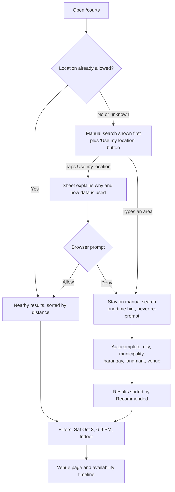

Steps:
1. **Location allowed:** coordinates are rounded to 3 decimals (about 110 m) and sent with the search request only; cards show "~2.4 km". **Location denied:** Bea types "Kapitolyo"; suggestions group barangay, landmark and venue matches. Neither path blocks booking.
2. She filters Sat, Oct 3, 6:00–9:00 PM, Indoor. The Pasig Pickle Hub card reads "Next: 7:00 PM · From ₱300/hr · 2 indoor courts free".
3. On the venue page she opens the availability timeline (`GET /v1/public/venues/{venueId}/availability?date=2026-10-03`) and selects Court 1, 7:00–8:00 PM (60 min, within the venue's 60–120 min limits and 30-min increments).
4. "Continue" requires sign-in; the selection survives the login round-trip.
5. `POST /v1/me/booking-holds` with an `Idempotency-Key`. The API checks: verified account, no active restriction in scope, duration/increment/advance-limit rules, fewer than 2 active holds. It releases stale holds and inserts a `booking_slots` row (exclusion constraint). Booking `draft` → `slot_held`, expiring 9:14 PM.
6. Review screen with a 10:00 countdown. Every change is re-quoted by the server: add-ons Paddle rental ×2 (₱200.00) and Bottled water ×2 (₱60.00), promo `WELCOME50` (−₱50.00; funded by the venue, not shown to Bea), VAT (12%, included) ₱65.36, method list with per-method fee. She picks GCash (+₱14.37). Total ₱624.37.
7. She ticks "I agree to the Standard cancellation policy (v3)". `POST /v1/me/checkouts` locks the quote and records the policy version. `POST /v1/me/checkouts/{checkoutId}/payment-sessions` creates the provider session (sub-account via `for-user-id`, split rule via `with-split-rule`, session expiry = hold expiry). Booking → `payment_pending`.
8. Redirect to the provider's hosted checkout; she authorizes in the GCash app and is redirected to `/app/checkout/{checkoutId}`, which shows "Confirming your payment…" and polls. The redirect itself changes nothing.
9. The webhook is verified, stored, acknowledged; the worker re-queries the provider and, in one transaction, captures the payment, confirms the booking (code `CK-9T2B6H`), finalizes the price snapshot, posts the ledger journal, marks the add-on order `paid`, records the promo redemption and writes outbox events.
10. The return page shows the QR and booking code; confirmation goes out in-app, by email and by SMS. The booking appears on the venue calendar.

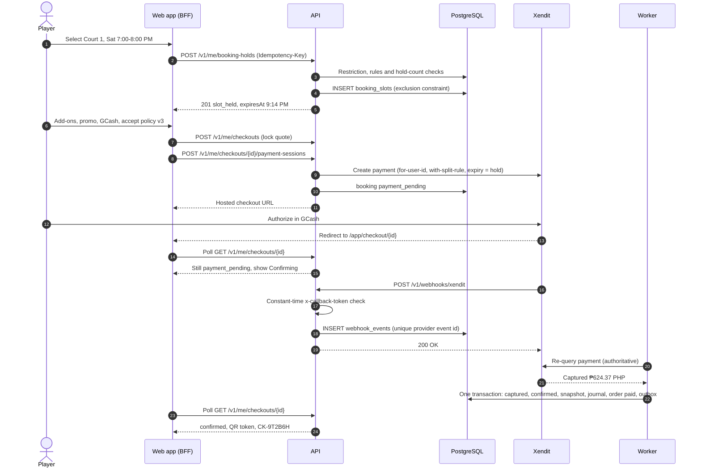

| Edge / error | System behavior | What the player sees |
|---|---|---|
| Slot taken between viewing and holding | Exclusion constraint rejects insert → `SLOT_UNAVAILABLE`; availability refreshed | "That time was just booked. Next open: 8:00 PM on Court 1, 7:00 PM on Court 2." |
| Already 2 active holds | `HOLD_LIMIT_REACHED` | "You already have 2 courts on hold. Finish or release one to continue." |
| Active restriction in scope | `BOOKING_NOT_ALLOWED` | Neutral copy (J10). No reason given. |
| Venue rule violated | `VALIDATION_FAILED` with field errors | "Bookings at this venue open up to 14 days ahead." |
| Promo invalid, expired or exhausted | `PROMO_INVALID` | "This code can't be used for this booking." Specific reason only when safe (expired, minimum spend). |
| Rate changed before the quote was locked | `QUOTE_EXPIRED`, new quote | "The price for this time changed from ₱400.00 to ₱450.00." Must re-confirm. |
| Add-on sold out | `OUT_OF_STOCK`, item removed, re-quote | "Bottled water is sold out and was removed. New total ₱562.95." (VAT line and GCash fee recomputed) |
| Policy not accepted | `POLICY_NOT_ACCEPTED` | Inline error on the checkbox |
| Method unavailable | `PAYMENT_METHOD_UNAVAILABLE` | "GCash is unavailable right now. Choose another method." |
| Provider down while creating the session | `PROVIDER_UNAVAILABLE`, hold kept | "We couldn't reach the payment provider. Your court is still held for 06:12." Retry button. |
| Double-tap on Pay | Same `Idempotency-Key` returns the same session | One redirect |
| Payment declined or cancelled in the wallet | Payment `failed`/`cancelled`; booking `payment_pending` → `slot_held` | "Payment didn't go through. Your court is still held for 04:50." |
| Hold expires before paying | `holds.expire` → `expired`, slot released | "Your hold ended. Pick a time again." |
| Player restricted during checkout, payment captured | `payment_pending` → `refund_pending`, automatic full refund | "We couldn't complete this booking. A full refund of ₱624.37 is on its way." |
| Confirmation transaction fails after capture | Job retries idempotently; ends `confirmed` or `refund_pending` | "Payment received — we're finishing your booking." |

---

## J2 — Payment delayed, browser closed, late payment after hold expiry

**Actor:** player, system. **Preconditions:** booking `payment_pending`, hold expiring at 9:14 PM, provider session with the same expiry, late-webhook grace 15 min.

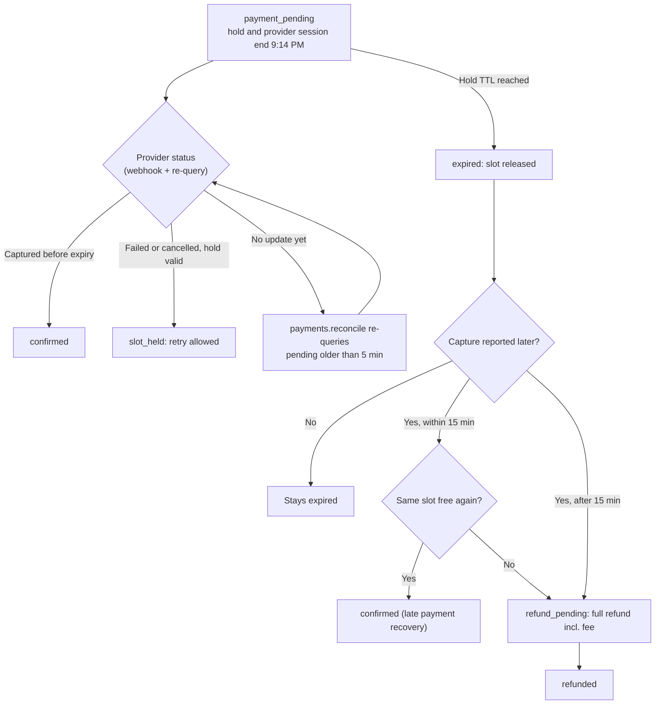

| Scenario | System behavior | Player experience |
|---|---|---|
| Browser closed after authorizing | Webhook and re-query confirm as usual | Push/email/SMS "Booking confirmed". Next app open shows it under Bookings. |
| Webhook delayed or lost | `payments.reconcile` re-queries pending payments older than 5 min | Return page after 60 s: "Still confirming. You can close this page — we'll notify you." |
| Captured within 15 min after expiry, slot still free | Re-acquire the same slot in one transaction; `expired` → `confirmed` | "Your payment arrived and your booking is confirmed." |
| Captured within 15 min after expiry, slot taken | `expired` → `refund_pending`; automatic full refund including the fee (platform absorbs) | "Your payment arrived after the hold ended and the court was taken. Full refund of ₱624.37 started." |
| Captured more than 15 min after expiry | Matched to the expired booking, always refunded in full; finance alert | Same refund message |
| Provider session expires unpaid | Payment `expired`; booking `expired` | "Your hold ended. No payment was taken." |
| Repeated failures or provider risk block | `payment_pending` → `failed` | "This payment couldn't be completed. Try another method or contact your wallet provider." |

Rules: the return URL carries no status; only verified server state is shown. A given checkout has at most one active payment session; retries after a failure create a new session under a new `Idempotency-Key` while the hold is valid.

---

## J3 — Cancel within policy and receive a partial refund

**Actor:** Bea. **Preconditions:** booking `CK-7Q4M2P`, Court 2, Sat, Oct 3, 6:00–7:00 PM, `confirmed`, paid ₱415.00 (₱400.00 court + ₱15.00 online-banking fee), Standard policy v3 accepted. **Trigger:** Sat, Oct 3, 8:00 AM (10 h before start).

1. Booking detail → "Cancel booking". The client requests `POST /v1/me/bookings/{id}/cancellation-quote`.
2. The quote uses the **accepted** policy version: tier "6–24 h before start: 50% of court fee". Refund ₱200.00; not refunded: ₱200.00 court fee and the ₱15.00 payment fee (disclosed at checkout). Destination: original payment method. Quote valid until 12:00 PM (the next tier boundary).
3. The refund preview modal shows the arithmetic; the destructive button reads "Cancel and refund ₱200.00"; focus starts on "Keep booking".
4. `POST /v1/me/bookings/{id}/cancel` with `Idempotency-Key` and the quote ID. In one transaction: `confirmed` → `refund_pending`, slot released, refund `requested` → `approved` (automatic, within policy), partial-refund journal, outbox events.
5. The worker calls the provider refund API (`processing`); webhook plus re-query confirm `succeeded`; booking → `partially_refunded`.
6. Money after refund: customer net ₱215.00; commission ₱10.00 (50% reversed); venue net ₱190.00; fee ₱15.00 retained to cover the provider fee.

Refund journal (centavos): Dr `venue:{business_id}:payable` 20,000 / Cr `platform:provider_clearing` 20,000 (partial_refund); Dr `platform:commission_revenue` 1,000 / Cr `venue:{business_id}:payable` 1,000 (platform_commission reversal).

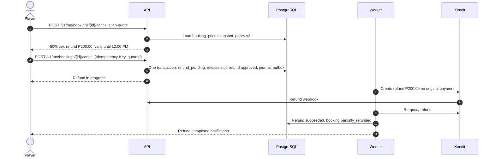

| Edge / error | System behavior | What the player sees |
|---|---|---|
| Tier boundary passes before confirming | `QUOTE_EXPIRED`; new quote | "The start time is now less than 6 hours away, so this cancellation is no longer refundable." |
| Less than 6 h before start | Refund ₱0.00 → `confirmed` → `cancelled` | "Cancelling now won't give a refund. You can still cancel to free the court for others." |
| Linked add-on order still `paid` (not preparing) | Order cancelled and refunded in full | Add-on refund shown as a separate line in the preview |
| Refund fails at the provider | Refund `failed`; alert to platform finance; retry or provider-supported alternative | "Your refund is taking longer than usual. No action needed — we'll update you." |
| Method cannot be refunded by API (possible for QR Ph; doc 23 D-30) | Provider-supported alternative route; the player confirms a destination through a provider-hosted form (never stored by CourtKo) | "Confirm where we should send your ₱200.00 refund." |
| Venue payout already sent | Venue payable goes negative; recovered from the next settlement | No difference for the player |
| Double-tap on Cancel | Idempotent; one cancellation | One confirmation |

---

## J4 — Reschedule a booking

**Actor:** Bea. **Preconditions:** `CK-7Q4M2P` `confirmed`, not yet rescheduled; now Fri, Oct 2, 3:00 PM (27 h before start). Policy: once per booking, at least 12 h before start, subject to availability, price difference charged or refunded.

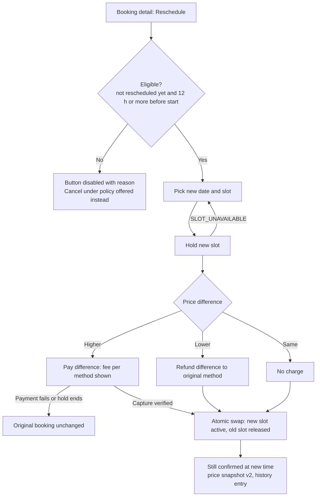

1. Bea picks Sun, Oct 4, 8:00–9:00 AM on Court 2 (off-peak ₱300.00/hr). A hold is placed on the new slot; the original stays active.
2. Preview: new court fee ₱300.00; difference −₱100.00 refunded to the original method; payment fee not refunded (player-initiated). Commission becomes ₱15.00.
3. `POST /v1/me/bookings/{id}/reschedule` (`Idempotency-Key`): in one transaction the new slot converts from hold to booking, the old slot is released, the booking stays `confirmed` with a new snapshot version and a history entry; `reschedule_count` = 1; a ₱100.00 refund is requested and approved within policy.
4. Higher-price variant: a payment session for the difference is created; the swap happens only after verified capture. If payment fails or the hold expires, nothing changes.

| Edge / error | Behavior |
|---|---|
| Less than 12 h before start or already rescheduled | Reschedule disabled with the reason; cancellation under policy remains available |
| New slot taken | `SLOT_UNAVAILABLE`; alternatives shown |
| Staff reschedules on the player's behalf (`bookings.reschedule`) | Does not consume the player's allowance; player notified with the new time |
| Venue changes price of the old slot after booking | Irrelevant: the difference is computed against the confirmed snapshot |

---

## J5 — Business onboarding → verification → first venue → publish

**Actor:** Joel (P4). **Trigger:** "Register your venue" on `/for-business`.

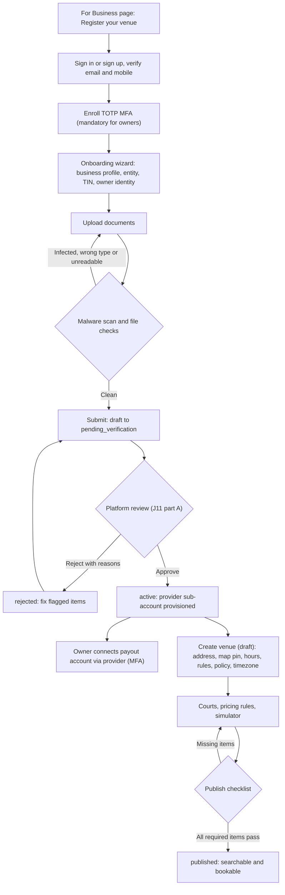

Documents (final list set in doc 15 and by counsel): DTI or SEC registration, business/Mayor's permit, BIR Certificate of Registration, valid government ID of the owner, proof of right to operate the venue. Files: PDF/JPEG/PNG, size-limited, scanned in a quarantine bucket before any reviewer can open them.

| Publish checklist item | Required |
|---|---|
| Business `active` and sub-account able to accept payments | Yes |
| At least one active court | Yes |
| Weekly operating hours and timezone | Yes |
| At least one base pricing rule covering opening hours | Yes |
| Cancellation policy selected | Yes |
| Map pin confirmed, address with city/municipality and barangay | Yes |
| Cover photo with alt text | Yes |
| Payout account connected | Recommended (warning only; funds stay in the venue's sub-account) |

| Edge / error | Behavior |
|---|---|
| Owner not enrolled in MFA | `MFA_REQUIRED` before any portal page loads |
| Name on documents does not match the registered name | Rejected with reason "Name mismatch"; only that item reopens |
| Registration number already linked to another business | Flagged to reviewers; not auto-rejected |
| Provider onboarding of the sub-account fails | Business stays `active` but publishing is blocked with "Payments not ready"; ops alert |
| Business later `suspended` | Venues hidden from search; new bookings blocked; by default future bookings are cancelled with full refunds including any fee (doc 23 D-34) |

---

## J6 — Receptionist daily operations

**Actor:** Mark (P6), `receptionist` at Pasig Pickle Hub. **Preconditions:** own account; signed in on the desk tablet; venue scope Pasig Pickle Hub.

**A. Check-in by QR (Rina A., synthetic, `CK-4R7N2K`, Court 3, 6:00–7:00 PM).**

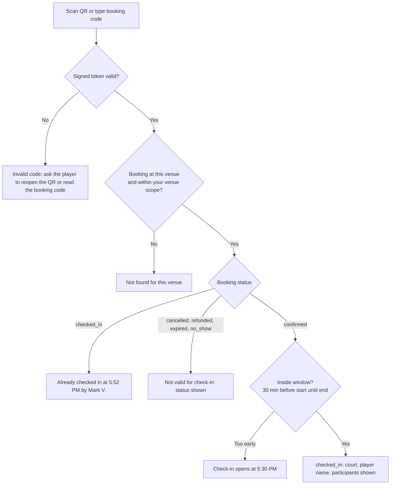

**B. Walk-in with payment link.**

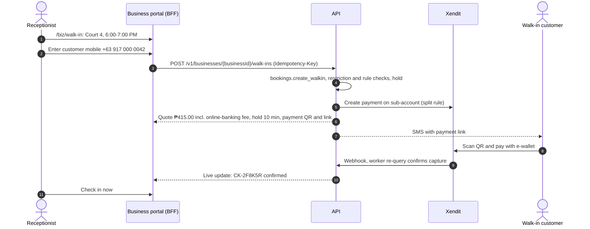

Walk-in customers are identified by mobile or email. If no account exists, a lightweight invited account receives the receipt and can be claimed later. Staff without `customers.view_contact` see matches only as "Existing customer (masked)". The on-screen QR is the default payment path; SMS payment links depend on doc 23 D-22 because Philippine telcos may block SMS that contain clickable links.

**C. Mark no-show.** At 6:15 PM (start + 15 min grace) "Mark no-show" becomes available for an unchecked booking. A confirm dialog states "No refund will be issued. The player will be notified." → `confirmed` → `no_show`; audit entry; neutral notification to the player.

| Edge / error | Behavior |
|---|---|
| Customer wants to pay cash | Not recorded as paid; nobody can mark a payment paid. A member with `courts.block` records the offline use as a court block with reason `offline_booking` (doc 23 D-29) |
| "Re-check payment" pressed (`payments.confirm_status`) | Triggers a provider re-query; never sets paid directly |
| Walk-in customer restricted | `BOOKING_NOT_ALLOWED`; staff sees "Booking not allowed for this customer. A manager can review." |
| Payment link unpaid when the hold ends | Booking `expired`; slot released; staff sees "Payment not received" |
| Tries to refund | Refund actions not rendered; direct API call returns `FORBIDDEN` (same-tenant, missing permission) |
| No-show attempted before grace ends | Action disabled with "Available at 6:15 PM"; API returns `INVALID_STATE_TRANSITION` |
| Shift change | "Switch user" ends the session; idle timeout 30 min |

---

## J7 — Court maintenance block that conflicts with bookings

**Actor:** a `business_manager` (has `courts.block`, `bookings.cancel`, `bookings.reschedule`). **Trigger:** roof leak over Court 4 (Covered); block needed Sun, Oct 4, 2:00–10:00 PM. **Conflicts:** three confirmed bookings (₱415.00 each) and one checkout in progress.

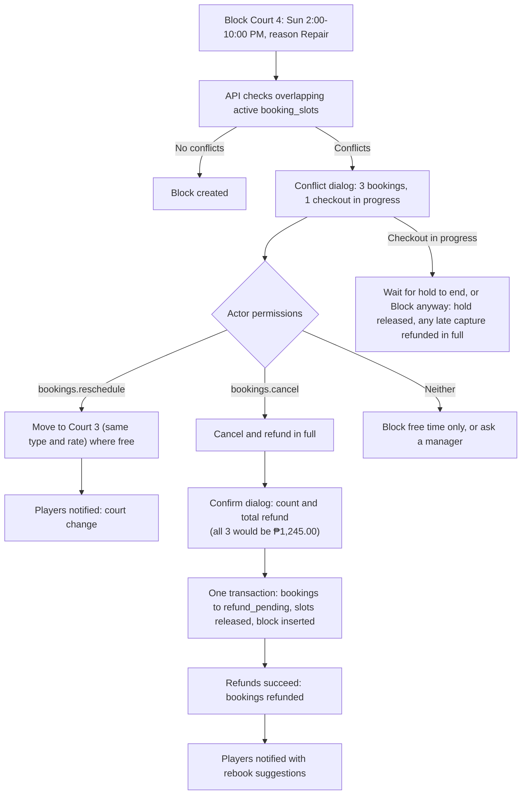

1. The dialog lists each conflict (time, masked customer name, amount) and, where Court 3 is free at the same time and rate, offers "Move to Court 3". Two bookings move; one cannot.
2. For the remaining booking the manager chooses "Cancel and refund in full". Reason `court_unavailable` → 100% refund including the fee (platform absorbs the fee).
3. Confirmation dialog: "Cancel 1 booking and refund ₱415.00. Players are notified immediately." After confirming, the block is inserted in the same transaction that releases the slots.
4. A `court_manager` (has `courts.block` but not `bookings.cancel`) sees the same conflict list with cancel actions disabled and "Requires bookings.cancel — ask a Business Manager". "Ask a manager" raises an Overview exception for members holding `bookings.cancel`.

| Edge / error | Behavior |
|---|---|
| A conflicting booking is already `checked_in` | Cannot be cancelled by the block flow; block must start after it ends or the manager handles it manually |
| Refund fails for one player | That refund `failed` and alerts; the block is unaffected |
| Two managers block overlapping ranges at once | Exclusion constraint lets exactly one succeed; the other gets `SLOT_UNAVAILABLE` and a refreshed conflict list |
| Weather closure for the whole venue | Special hours "Closed — weather" with the same conflict flow across all courts; refunds 100% including fee |

---

## J8 — Event creation → registration → capacity → waitlist promotion

**Actors:** Aileen (P7, `event_manager`), players. **Event:** "Friday Night Open Play — Intermediate", Fri, Oct 9, 7:00–10:00 PM, Courts 1–2, capacity 16, fee ₱250.00, waitlist on, offer window 2 h (default, configurable, never beyond registration close).

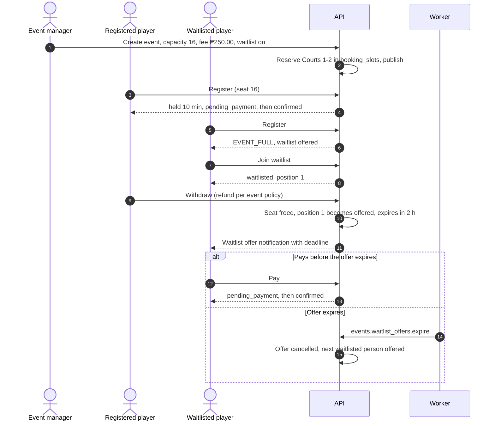

Rules: capacity counts `held`, `pending_payment`, `offered`, `confirmed` and `checked_in` registrations, so a seat can never be sold twice. Divisions carry their own capacity. Venue cancellation of the event refunds every registration in full. Event check-in uses `events.check_in` with the same QR flow as bookings.

| Edge / error | Behavior |
|---|---|
| Event fills while someone is paying | Their seat was held, so capacity is safe |
| Seat hold expires, then payment is captured | Re-acquire a seat if one is free; otherwise automatic full refund |
| Several seats free at once | Offers go to the next N people in FIFO order |
| Waitlisted player becomes restricted | Skipped for offers; neutral notice |
| Registration closes with open offers | Offers expire at close |

---

## J9 — Product add-on → preparing → ready → claim (double claim prevented)

**Actors:** Bea; staff with `orders.fulfill`. **Order:** `PU-3H8R6W`, add-ons from J1 (Paddle rental ×2, Bottled water ×2) for `CK-9T2B6H`.

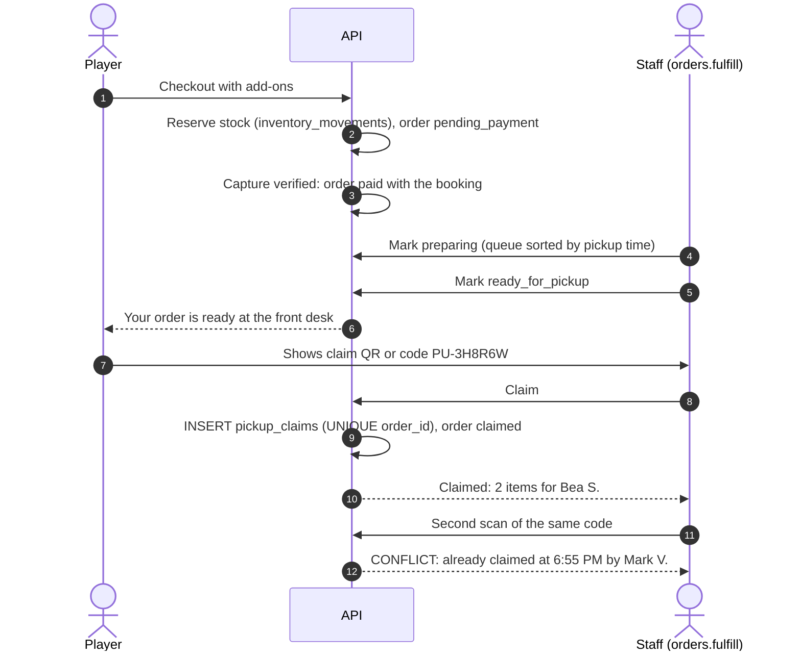

| Edge / error | Behavior |
|---|---|
| Stock runs out during checkout | `OUT_OF_STOCK` before payment; item removed and re-quoted |
| Venue cannot fulfil after payment | Staff cancels the item; refund of the item plus its proportional share of any customer-paid fee |
| One item of a combined order refunded | Order `partially_refunded`; ledger reverses only that item |
| Order unclaimed 2 h after the booking ends | Appears as an Overview exception; staff refunds (`refunds.request`) or extends; nothing automatic |
| A friend presents the code | Claim code is a bearer credential; staff sees the buyer's display name to confirm |

---

## J10 — Restricting a player and the neutral message they see

**Actors:** Pasig Pickle Hub manager (`restrictions.manage`); player Tony B. (synthetic) with four no-shows in 30 days.

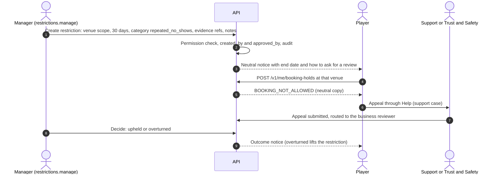

What the player sees (never the category, notes or evidence):
- Notice: "Your bookings at Pasig Pickle Hub are paused until Mon, Nov 2, 2026. If you think this is a mistake, you can ask CourtKo Support to review it."
- On booking attempt: "We can't complete this booking. This venue isn't taking bookings from your account right now. Contact Support if you need help."

Rules: temporary restrictions are approved by the creator (recorded as `approved_by`); permanent restrictions need a second member with `restrictions.manage` (or the owner, recorded). Existing future bookings stay valid unless the business cancels them as venue-initiated with a full refund. Staff with `restrictions.view` see "Restricted — Repeated no-shows (until Nov 2)"; only `restrictions.manage` sees notes. Other businesses see nothing. Platform-wide restrictions are created only under `platform.restrictions.manage`.

| Edge / error | Behavior |
|---|---|
| Restriction created while the player is mid-checkout | Checked again at confirmation; captured payment → `refund_pending`, full refund |
| Restriction end date passes | Status `expired` by job; player may book again |
| Staff without `restrictions.manage` opens notes | Not rendered; API omits the field |

---

## J11 — Business approval, commission change with maker-checker, reconciliation mismatch

**Actors:** platform compliance/finance (P8), a second authorized admin.

**A. Approve a business.** `/admin/businesses` queue → "Cebu Smash Courts Inc." (synthetic; `pending_verification`, submitted 1 day ago). The reviewer (`platform.businesses.verify`) opens each document in a watermarked viewer (each view audited), completes the checklist (registered name matches documents, TIN format, permit validity dates, owner ID matches the owner account), and approves. Status → `active`; provider sub-account provisioning is queued; the owner is notified. Rejection requires at least one structured reason per failed item.

**B. Change a commission agreement (maker-checker).**

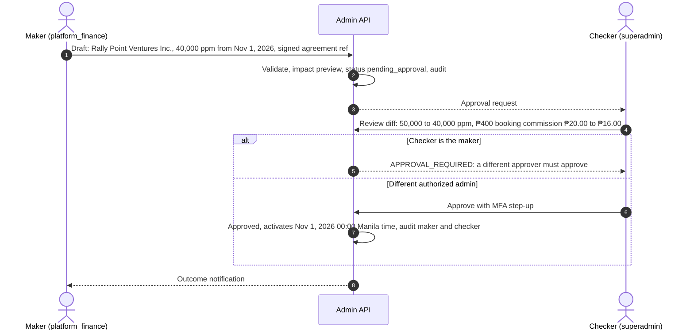

Bookings confirmed before Nov 1 keep their snapshotted 50,000 ppm even if played later.

**C. Review a reconciliation mismatch.**

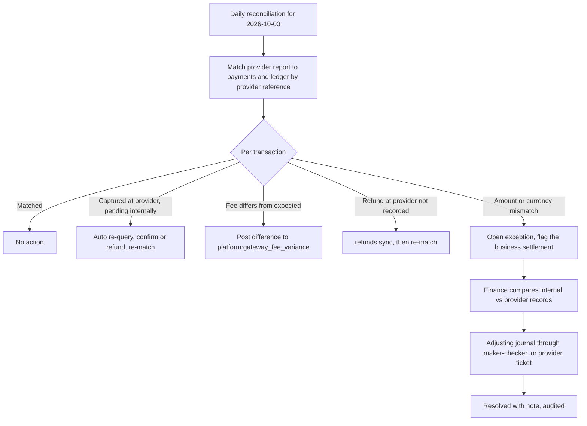

---

## J12 — Support impersonation session

**Actor:** Leo G. (synthetic, `platform_support`). **Trigger:** ticket `SUP-1042` — "My booking isn't showing" from Bea.

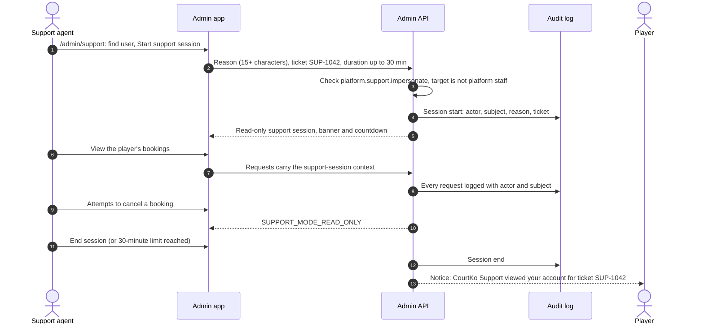

Always blocked in support mode (hidden and enforced server-side): viewing or changing credentials and MFA, payout accounts, exports, refunds, deletion. Write-enabled support sessions are not in MVP. The policy itself (cap, eligible roles, subject visibility) awaits approval under doc 23 D-24.

---

## J13 — Player data export and account deletion

**Actor:** a player; exceptions handled under `platform.privacy.requests`.

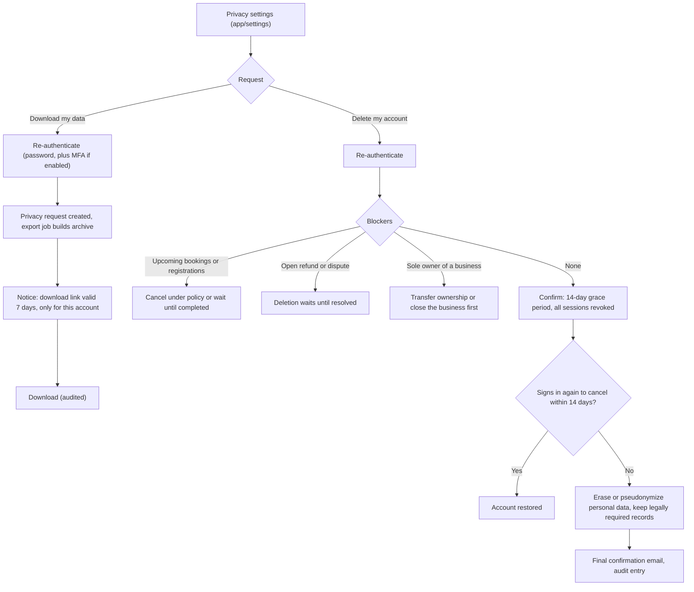

Export contents: profile, preferences and consent history, bookings, payments (masked method details only), refunds, orders, event registrations, reviews, notifications log, login history. After deletion: reviews remain as "Former player" without name or photo; payment, ledger and audit records are retained for the legal retention period (doc 15) under a pseudonymous reference; restrictions are kept only as long as the retention matrix allows.
