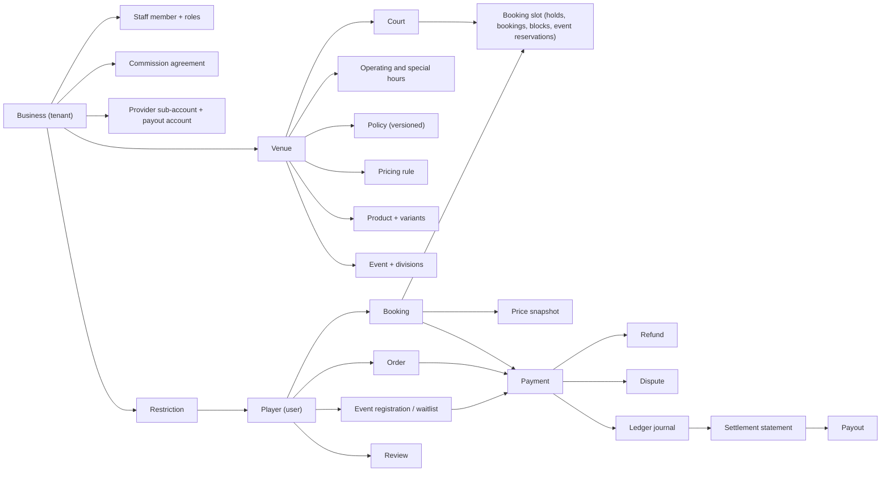

# 05 — Information Architecture

| Field | Value |
|---|---|
| Document | 05 of 23 — Information architecture |
| Status | Draft v1.0 |
| Owner | Product design (Senior UX/UI) |
| Last updated | 2026-09-30 |
| Related | [01 Product requirements](01-product-requirements.md) · [03 Role & permission matrix](03-role-permission-matrix.md) · [06 Sitemap](06-sitemap.md) · [12 Database ERD](12-database-erd.md) · [16 Wireframes](16-wireframes.md) · [17 Design system](17-design-system.md) · [23 Assumptions & decisions](23-assumptions-and-decisions.md) |

This document defines how CourtKo's content is structured, named, navigated and found. The physical data model is in doc 12; status labels and colors are in doc 17 §3.

## 1. Principles

1. **Task first.** Each experience is organized around its users' most frequent tasks (book, check in, reconcile), not around database tables.
2. **One vocabulary.** A concept has one name everywhere it appears to the same audience (§5). Player-facing and staff-facing labels may differ, but each is used consistently.
3. **Navigation reflects permission; it never enforces it.** Menus hide what a member cannot use; the API still authorizes every request.
4. **Time and money are always labeled.** Every time shows its zone context; every amount shows the peso sign and two decimals where money changes hands.
5. **Tenant context is always visible** in the business portal (business and venue switcher) so staff never act on the wrong venue.
6. **Shallow for players, dense for operators.** Player paths stay within three taps of a booking; business and admin screens favor tables, filters and bulk context.

## 2. Content and object model

### 2.1 Conceptual object map

### 2.2 Object catalog

| Object | What it is | Scope | Key user-facing attributes | Lifecycle (doc 17 §3) | Primary surfaces |
|---|---|---|---|---|---|
| Business | Legal entity that operates venues; the tenant | Platform | Trade name, verified badge, venues | Business status | Business portal header, admin Businesses |
| Venue | A physical location with courts | Tenant | Name, address with barangay and landmark, map pin, photos, amenities, rules, policy, hours, timezone | Venue status | Public venue page, business Venues |
| Court | A bookable playing area within a venue | Tenant | Name, format, environment, surface, tags | Active / inactive | Availability timeline, calendar rows |
| Operating / special hours | Weekly hours and date-specific exceptions | Tenant | Day, open–close, closure reason | Effective dates | Venue page, business Venues |
| Court block | Time a court cannot be booked | Tenant | Court, range, reason type, note | Active / removed | Calendar, Courts |
| Pricing rule | A rate that applies to matching time slices | Tenant | Name, type, scope, days, times, dates, priority, rate | Active / scheduled / ended | Pricing, simulator |
| Promotion | A promo code or campaign | Tenant or platform | Code, value, limits, validity, funded by (staff only) | Active / scheduled / ended | Checkout, Pricing › Promotions, admin Config |
| Policy | Cancellation/refund/no-show rules; versioned and immutable once published | Tenant (templates: platform) | Name, tiers, version | Published versions | Venue page, checkout, booking detail |
| Booking | A court reservation for a time range | Tenant + player | Booking code, court, date/time, participants, status, amounts | Booking status | Player Bookings, business Calendar/Bookings |
| Hold | Temporary reservation during checkout (10 min) | Tenant + player | Countdown | Part of booking lifecycle (`slot_held`) | Checkout |
| Price snapshot | Immutable price breakdown at confirmation | Tenant + player | Line items, totals, rate and agreement used | Versions (reschedule adds a version) | Receipt, statements |
| Payment | A provider transaction for a checkout | Tenant + player | Method (masked), amount, status, provider reference | Payment status | Player Payments, business Payments, admin Transactions |
| Refund | Money returned against a payment | Tenant + player | Amount, reason, destination, status | Refund status | Booking detail, Payments, admin Refunds |
| Dispute | Chargeback or provider dispute | Tenant | Amount, due date, evidence | Dispute status | business Payments, admin Disputes |
| Ledger journal | Balanced set of ledger entries | Platform (lines tagged by business) | Entry type, account, amount | Append-only | admin Transactions |
| Settlement statement | Per-business daily statement from ledger postings | Tenant | Lines, totals, provider references | Generated / final | business Payouts › Statements |
| Payout | Transfer of venue funds to the venue's bank | Tenant | Amount, bank (masked), status | Payout status | business Payouts, admin Payouts |
| Event | Tournament, league, clinic, training, open play, social, private | Tenant | Type, schedule, capacity, fee, divisions, skill range | Draft / published / unpublished / cancelled | Public Events, business Events |
| Registration / waitlist | A player's seat or place in line | Tenant + player | Status, position, offer deadline | Event registration status | Player Events, business Events |
| Product / variant | Item or service for pickup | Tenant | Name, price, stock, category, pickup instructions | Active / inactive | Venue page, checkout add-ons, business Products |
| Order / pickup claim | Purchase of products and its handover | Tenant + player | Items, claim code, status | Product order status | Player Orders, business Orders |
| Restriction | A business or platform limit on a player | Tenant or platform | Scope, period, reason category (staff), appeal | Restriction + appeal status | business Restrictions, admin Users |
| Review | Rating and text after a completed booking | Tenant + player | Stars, text, venue reply | Published / hidden | Venue page, business Reviews |
| Content report | A user report about a venue, event, product, review or user | Platform | Target, reason, status | Open / actioned / dismissed | admin Moderation |
| Notification | A message on one or more channels | User | Title, body, deep link, read state | Sent / read | Notifications center |
| Support case / session | Help ticket and optional support-mode session | Platform | Ticket reference, subject, reason, duration | Open / closed; session active / ended | admin Support |
| Audit log entry | Immutable record of a high-risk action | Platform + tenant | Actor, action, target, before/after, correlation ID | Append-only | business Audit Log, admin Audit Logs |
| Commission agreement | Effective-dated commercial terms for a business | Platform | Rate, commissionable items, fee bearer, settlement model | Draft / pending approval / approved / active / superseded / rejected | admin Commissions |

## 3. Navigation models

### 3.1 Public website (courtko.ph)
- **Header (desktop):** logo · Find a Court · Events · How It Works · For Business · Pricing · Log in · Sign up. Log in and Sign up open `app.courtko.ph`; players already signed in there land directly in the app (the public host cannot read the app host's host-only session cookie, by design).
- **Header (mobile):** logo · "Find a court" button · menu (same items).
- **Footer:** Help Center · Contact & Support · Terms · Privacy Notice · Cookie preferences · For Business Owners · Pricing · company details · "All prices in Philippine pesos (PHP)".
- Venue and event pages are public; selecting a slot hands over to `app.courtko.ph/app/book/:venueSlug`, which requires sign-in, and the selection survives the login round-trip.

### 3.2 Player app (app.courtko.ph/app)

| Breakpoint | Pattern | Items |
|---|---|---|
| < 1024 px | Bottom tab bar (5) + top bar | Home · Discover · Bookings · Events · Me. Top bar: back/title, notifications bell with unread count |
| ≥ 1024 px | Left sidebar | Home · Discover · Bookings · Events · Orders · Activity · Favorites · Notifications · Payments · Profile · Settings |

"Me" hub (mobile): Activity · Orders · Favorites · Payments · Profile · Settings · Help · surface switcher ("Open Business portal: Hub Sports Co.") · Log out. Orders are also linked from each booking that has add-ons.

### 3.3 Business portal and staff operations (business.courtko.ph)

Desktop sidebar (items hidden when the member lacks the permission, §9):

| Group | Items |
|---|---|
| Operate | Overview · Calendar · Bookings · Walk-in · Orders |
| Venue setup | Venues · Courts · Pricing · Events · Products |
| People | Customers · Restrictions · Staff · Reviews |
| Money | Payments · Payouts · Reports |
| Admin | Settings · Audit Log |

Mobile (< 768 px): top bar with business and venue switcher; bottom bar with up to four items plus "More". **Scan** opens the camera for booking check-in, event check-in and pickup claims; it is available to members holding `bookings.check_in`, `events.check_in` or `orders.fulfill`. System role templates use the bars below. Custom roles get their landing page followed by the next permitted items from this priority list: Overview, Calendar, Scan, Walk-in, Orders, Events, Bookings, Payments, Payouts, Reports.

| Role template | Landing page | Mobile bottom bar |
|---|---|---|
| `business_owner`, `business_manager` | Overview | Overview · Calendar · Scan · Walk-in · More |
| `receptionist` | Calendar (Today) | Calendar · Scan · Walk-in · Orders · More |
| `court_manager` | Calendar | Calendar · Courts · Overview · More |
| `finance_viewer` | Overview (money summary) | Overview · Payments · Payouts · Reports · More |
| `event_manager` | Events | Events · Scan · Calendar · Overview · More |
| `inventory_manager` | Orders | Orders · Scan · Products · Overview · More |
| Custom role | First permitted item in the priority list | Priority rule above |

### 3.4 SuperAdmin control center (admin.courtko.ph)
Desktop-first (≥ 1024 px; usable down to 768 px for read-only checks). Sidebar groups: **Overview** (Platform Overview) · **Tenants** (Businesses, Venues) · **People** (Users) · **Activity** (Bookings, Events, Products) · **Money** (Transactions, Commissions, Payouts, Refunds, Disputes) · **Insights** (Reports) · **Trust & safety** (Moderation, Support, Security, Audit Logs) · **System** (Platform Configuration). An environment label (Production / Staging) is always visible in the header.

## 4. Global elements

| Element | Where | Behavior and rules |
|---|---|---|
| Search | Public/player header: area or venue search. Business: "Find booking" (code or customer name). Admin: global lookup by ID, booking code, provider reference, email | Business search never returns other tenants' data. Contact search needs `customers.view_contact`. Admin lookups by email or phone are audited |
| Notifications center | Bell in every signed-in experience | Unread count, category filter, deep links (§7.5), mark read. Security and transactional notices cannot be muted |
| Account menu and surface switcher | Top-right avatar | Lists only surfaces the user can access: Player app and each business membership. Each surface has its own host-only session cookie; switching may require sign-in and MFA on that surface. Platform staff use separate workforce accounts with no memberships or bookings, so Admin never appears in this menu (doc 23 A-11) |
| Business switcher | Business portal header, for members of more than one business | Changes the `businessId` context; clears filters and open drawers; remembers the last business |
| Venue switcher | Business portal header | "All venues" or one venue, limited to the member's venue-scoped assignments; persists per user |
| Support-mode banner | Top of every page during a support session | Non-dismissible; shows subject, read-only state, ticket, time left, End session (doc 16 §21) |
| Environment banner | Non-production and the interactive demo | "Staging — synthetic data" / "Interactive demo — synthetic data" |
| Connectivity banner | All apps | "You're offline" with retry; payment and booking actions disabled while offline |
| Cookie preferences | First visit and footer | Only non-essential cookies need consent; choices stored and changeable |
| Help | Same position in every experience (footer and account menu) | Consistent help location (WCAG 2.2 SC 3.2.6) |
| Time-zone label | Calendars, booking details, statements | "All times in Manila time (UTC+08:00)" for venue context; admin and audit views show UTC and local |

## 5. Labeling

### 5.1 Conventions
1. **Booking, not reservation.** "Hold" is only the temporary checkout state.
2. **Venue vs business.** A venue is the place; a business is the company. Players rarely see "business" except on the verified badge and receipts.
3. **Money labels by audience.** Players see: Court fee, Add-ons, Discount, VAT (12%, included), Payment fee (method), Total. Businesses and admins also see: Booking base, Funded by, Platform commission, Gateway fee, Venue net.
4. **Never the word "ban" to players.** Internally "Restriction"; to players "Your bookings at … are paused". No reason category or notes are ever shown to the player.
5. **Buttons start with a verb and name the outcome:** "Pay ₱624.37", "Cancel and refund ₱200.00", "Keep booking".
6. **Status text always accompanies status color** (doc 17 §3).
7. **Every date shows weekday and month in words** ("Sat, Oct 3, 2026"); never numeric-only dates.
8. **Codes are uppercase with a prefix:** booking `CK-7Q4M2P`, pickup `PU-3H8R6W`, support ticket `SUP-1042`.

### 5.2 Glossary

| Term | Meaning | Audience | Internal identifier |
|---|---|---|---|
| Hold | Temporary reservation of a slot while checking out (10 min, max 2 per player) | All | `booking_holds`, status `slot_held` |
| Booking code | Short human-readable code used at the desk | All | `bookings.booking_code` |
| Check-in QR | Signed, expiring token encoding the booking for scanning | Player, staff | signed QR token |
| Check-in window | From 30 min before start until end | Staff | venue booking settings |
| No-show grace | 15 min after start before a no-show can be marked | Staff | venue booking settings |
| Buffer | Cleanup time after a booking, included in the occupied range | Business | `occupied_range` |
| Walk-in | Booking created by staff at the desk, paid by link or QR | Staff | `bookings.source = walk_in` |
| Court block | Time a court is unavailable (maintenance, repair, weather, private use, closure, event) | Staff | `court_blocks` |
| Special hours | Date-specific hours or closures | Business | `venue_special_hours` |
| Pricing rule | Rate for matching days, times and dates, with a priority | Business | `pricing_rules` |
| Quote | Server-computed price for a selection; locked at checkout for the hold's life | All | checkout quote |
| Price snapshot | Immutable breakdown stored when a booking is confirmed | Business, admin | `booking_price_snapshots` |
| Policy version | The exact cancellation policy text and tiers accepted at checkout | All | policy version ID |
| Court fee / Booking base | Sum of court-time charges before discounts | Player / business | `booking_base` |
| Funded by | Who pays for a discount: venue or platform | Business, admin | `funded_by` |
| Commissionable base | Amount the commission is calculated on | Business, admin | `commissionable_base` |
| Platform commission | CourtKo's fee from the venue, per agreement | Business, admin | `platform_commission` |
| Payment fee / Gateway fee | Provider fee for the payment method; shown before payment when passed to the player | Player / business | `gateway_fee` |
| Venue net | What the venue earns after discounts it funds, commission, fees it bears, refunds and adjustments | Business, admin | `venue_net` |
| Settlement statement | Daily statement of a business's ledger postings | Business, admin | `settlements` |
| Payout | Transfer of venue funds to its bank account | Business, admin | `payouts` |
| Sub-account | The business's account at the payment provider | Business, admin | provider sub-account reference |
| Reconciliation | Matching provider records to CourtKo's ledger | Admin | `payments.reconcile` |
| Date basis | Which date a report counts by: booking, play, payment, settlement, payout or refund date | Business, admin | report parameter |
| Restriction | A time-bound or permanent limit on a player's bookings in a scope | Staff, admin | `venue_user_restrictions` |
| Appeal | A player's request to review a restriction | Player, staff | appeal status |
| Support mode | Time-limited, read-only, audited view of a user's account by platform support | Admin, affected user | support session |
| Maker-checker | A change proposed by one authorized person and approved by another | Admin | approval request |
| Waitlist offer | A time-limited chance to take a freed event seat | Player | registration status `offered` |
| Claim code | Code or QR used to collect a pickup order | Player, staff | `pickup_claims` |
| Verified business | Badge for businesses whose documents CourtKo reviewed and approved | Player | business status `active` |

## 6. Taxonomies

Platform-managed lists are edited in `/admin/config` (`platform.config.manage`). Codes are stable; labels can be localized.

| Taxonomy | Values (code — label) | Notes |
|---|---|---|
| Court format | `full` — Full court; `half` — Half court | Maps the brief's "full/half" court types |
| Court environment | `indoor` — Indoor; `covered` — Covered (roofed, open sides); `outdoor` — Outdoor | Maps "indoor/outdoor/covered" |
| Court surface | `acrylic_hard` — Acrylic hard court; `concrete` — Concrete; `modular_tile` — Modular sport tile; `wood` — Wood (gym floor); `other` — Other | |
| Court tags (custom) | Business-defined, moderated, max 5 per court (e.g. "Shared lines (multi-sport)", "Tournament-grade", "Beginner-friendly") | Maps "custom" court types |
| Event type | `tournament`, `league`, `clinic`, `training`, `open_play`, `social`, `private` | `private` events are never listed publicly |
| Amenities | `parking`, `motorcycle_parking`, `restrooms`, `showers`, `changing_rooms`, `lockers`, `drinking_water`, `food_drinks`, `air_conditioning`, `fans`, `night_lights`, `seating`, `pro_shop`, `paddle_rental`, `ball_machine`, `coaching`, `wifi`, `first_aid`, `cctv`, `wheelchair_access`, `accessible_restroom` | Accessibility amenities are also filters |
| Product category | `food`, `drinks` (incl. water), `merchandise`, `balls`, `paddle_rental`, `equipment`, `services` | |
| Block reason | `maintenance`, `repair`, `weather`, `private_use`, `closure`, `event`, `offline_booking`, `other` (note required) | `event` is created by the event itself; `offline_booking` records cash or desk use with no payment, ledger or commission entries (doc 23 D-29) |
| Restriction reason category | `repeated_no_shows`, `conduct`, `safety_incident`, `facility_damage`, `payment_abuse`, `venue_rules`, `other` (notes required) | Never shown to the player |
| Content report reason | `inaccurate_listing`, `unsafe_venue`, `inappropriate_content`, `spam_or_fake`, `harassment`, `fraud_or_scam`, `privacy_violation`, `other` | |
| Skill level (self-declared) | Beginner (about 2.0–2.5), Intermediate (3.0–3.5), Advanced (4.0–4.5), Expert (5.0+) | Always labeled "self-declared" |
| Rating source | `self_declared`, `venue_verified` (P2), `external` (P2, official partner API with user authorization), `platform_recreational` (P3) | Source label shown next to every rating |
| Cancellation policy | Standard, Flexible, Strict, Non-refundable | Versioned; tiers in doc 01 REF-01 |
| Location hierarchy | Region → Province (or NCR) → City/Municipality → Barangay, using PSGC codes from the Philippine Statistics Authority; plus free-text landmark | Drives manual search and address forms |

## 7. URL and route conventions

### 7.1 Hosts
The routes in [06 Sitemap](06-sitemap.md) are canonical and identical in the interactive demo. Production serves **the same paths** on each surface's host, so links, analytics and tests carry over unchanged (the provider return URL is `https://app.courtko.ph/app/checkout/{id}`, doc 08):

| Surface | Demo path | Production URL |
|---|---|---|
| Public site | `/`, `/courts`, `/venues/:slug`, … | `https://courtko.ph` + same path |
| Player app | `/app/...` | `https://app.courtko.ph/app/...` — same `apps/web` deployment as the public site; player sign-in pages (`/login`, `/signup`, `/verify`, `/mfa`, `/forgot`, `/reset`) are served on this host so its host-only session cookie is set there, and `courtko.ph/login` redirects to it |
| Business portal | `/biz/...` | `https://business.courtko.ph/biz/...` (Next.js `basePath: '/biz'`) |
| SuperAdmin | `/admin/...` | `https://admin.courtko.ph/admin/...` (Next.js `basePath: '/admin'`) |
| API | — | `https://api.courtko.ph/v1/...` (internal for BFF traffic; public only for webhooks and future native apps) |
| Mock provider | `/pay/:sessionId` | Does not exist; production uses the provider's hosted checkout |

### 7.2 Paths
- Lowercase kebab-case; plural nouns for collections (`/bookings`), ID for detail (`/bookings/:id`).
- Venues use slugs (`/venues/pasig-pickle-hub`), unique platform-wide; renamed slugs 301-redirect from the old slug.
- Internal IDs are opaque and non-sequential. Booking codes are for people at the desk and never used as URL keys.
- In-page views (tabs, drawers) use query parameters: `/biz/pricing?tab=simulator`, `/biz/bookings?booking={id}`.

### 7.3 Query parameters
- Searches are shareable: `/courts?area=pasig&date=2026-10-03&from=18:00&to=21:00&env=indoor&sort=soonest`.
- Dates are ISO `YYYY-MM-DD`; times are 24-hour `HH:mm` in venue local time.
- Never in any URL: personal data, tokens (except single-use verification and reset links), or coordinates. "Near me" appears as `near=me`; coordinates are rounded to 3 decimals, sent in the request body, and redacted from access logs.

### 7.4 Localization
en-PH at launch. fil-PH (Phase 2): public marketing pages under a `/fil` prefix; the apps follow the profile language setting.

### 7.5 Deep links
| Trigger | Link |
|---|---|
| Booking confirmation, reminder, court change | `/app/bookings/:id` |
| Product ready | `/app/orders/:id` |
| Waitlist offer | `/app/events` (offer card with deadline) |
| Payment failure while hold valid | `/app/checkout/:id` |
| Staff exception (e.g. block request) | `/biz/bookings?booking={id}` or the Overview exception |
| Business approval | `/biz` (Overview) |

All deep links require sign-in on the target surface. Provider return URLs point to `/app/checkout/:id`; any status parameters on them are ignored.

## 8. Search and filter facets

### 8.1 Find a Court

| Facet | Values | Default |
|---|---|---|
| Location | Near me (if allowed) · city/municipality/barangay (PSGC) · landmark · venue name | Last used area |
| Distance | 2 · 5 · 10 · 25 km | 10 km (near me or area centroid only) |
| Date | Today · Tomorrow · next 14 days · calendar | Today (venue local date) |
| Time window | Any · Morning 6–12 · Afternoon 12–5 · Evening 5–10 · Late 10–12 · custom | Any |
| Duration | 30 · 60 · 90 · 120 min (as allowed by venue) | 60 |
| Price per hour | Range | Any |
| Environment | Indoor · Covered · Outdoor | Any |
| Format / surface | Full · Half / surface list | Any |
| Amenities | Multi-select from taxonomy | None |
| Rating | 4.5+ · 4.0+ · 3.5+ | Any |
| Events | Has open play or clinic this week | Off |
| Accessibility | Wheelchair access · Accessible restroom | Off |

Sort: **Recommended** (default), Nearest (location only), Soonest available, Lowest price, Highest rated. Recommended ranks by availability for the chosen time, then distance or area match, then rating (weighted by review count). There is no paid placement; a "How results are ranked" help link explains this.

### 8.2 Events
Type · date range · skill level · format (singles, doubles, mixed) · fee (free, paid, range) · location · availability (spots left, waitlist open). Sort: Soonest, Nearest, Lowest fee.

### 8.3 Business lists

| List | Facets | Default sort |
|---|---|---|
| Bookings | Date basis (play date default; booking date; payment date) · status · court · source (online, walk-in) · payment status · has add-ons · search by code or name | Play start ascending |
| Orders | Status · pickup date · product | Pickup time ascending |
| Customers | Last visit · bookings count · restricted (with `restrictions.view`) · name search (contact search only with `customers.view_contact`) | Last visit descending |
| Payments | Status · method · date basis (payment or refund date) · amount range | Payment date descending |
| Reports | Date basis selector is required; venue; granularity | — |

### 8.4 SuperAdmin lists
Businesses (status, verification age, settlement model, city) · Users (status, role, created date) · Transactions (date basis, status, method, business, provider reference) · Reconciliation (exception type, age, status) · Refunds (status, above ₱5,000, after payout) · Moderation (reason, target type, status, age) · Audit (actor, action, target type, scope, date range, correlation ID).

## 9. Permission-to-navigation mapping

### 9.1 Business portal

| Item | Route | Visible when the member holds | Further gating inside the page |
|---|---|---|---|
| Overview | `/biz` | `business.view` (every role) | Money tiles: `finance.view_summary`; exceptions filtered to actions the member can take |
| Calendar | `/biz/calendar` | `bookings.view` | Create block: `courts.block`; walk-in: `bookings.create_walkin`; check-in: `bookings.check_in` |
| Bookings | `/biz/bookings` | `bookings.view` | Cancel: `bookings.cancel`; reschedule: `bookings.reschedule`; no-show: `bookings.mark_no_show`; re-check payment: `payments.confirm_status`; contact: `customers.view_contact` |
| Walk-in | `/biz/walk-in` | `bookings.create_walkin` | — |
| Orders | `/biz/orders` | `orders.fulfill` | Refund an item: `refunds.request` |
| Venues | `/biz/venues` | `venues.manage` | Publish requires business `active` |
| Courts | `/biz/courts` | `courts.manage` or `courts.block` | Block-only mode with `courts.block` alone |
| Pricing | `/biz/pricing` | `pricing.manage` or `promotions.manage` | Rules and Simulator tabs: `pricing.manage`; Promotions tab: `promotions.manage` |
| Events | `/biz/events` | `events.manage` or `events.check_in` | Check-in-only mode with `events.check_in` alone |
| Products | `/biz/products` | `products.manage` or `inventory.manage` | Stock adjustments: `inventory.manage` |
| Customers | `/biz/customers` | `customers.view` | Contact columns: `customers.view_contact`; restrict: `restrictions.manage` |
| Restrictions | `/biz/restrictions` | `restrictions.view` | Create, lift, notes: `restrictions.manage` |
| Staff | `/biz/staff` | `staff.manage` | Roles tab: `roles.manage` |
| Reviews | `/biz/reviews` | `business.view` | Reply: `reviews.respond` |
| Payments | `/biz/payments` | `payments.view` | Request refund: `refunds.request`; approve: `refunds.approve` (MFA) |
| Payouts | `/biz/payouts` | `finance.view_payouts` | Payout account: `finance.manage_payout_account` (Owner, MFA); statement download: `reports.export` |
| Reports | `/biz/reports` | `reports.view` | Financial reports: `finance.view_summary`; export: `reports.export` |
| Settings | `/biz/settings` | `business.settings.manage` | — |
| Audit Log | `/biz/audit` | `audit.view` | — |
| Onboarding | `/biz/onboarding` | `business_owner` while the business is `draft`, `pending_verification` or `rejected` | — |

### 9.2 SuperAdmin

| Item | Route | Visible with | Further gating |
|---|---|---|---|
| Platform Overview | `/admin` | `platform.overview.view` | Tiles filtered by other permissions |
| Businesses | `/admin/businesses` | `platform.businesses.view` or `platform.businesses.verify` | Approve/reject: `.verify`; suspend/reactivate: `platform.businesses.suspend` |
| Venues | `/admin/venues` | `platform.venues.moderate` | — |
| Users | `/admin/users` | `platform.users.view` | Suspend: `platform.users.suspend`; platform restriction: `platform.restrictions.manage` |
| Bookings · Events · Products | `/admin/bookings`, `/admin/events`, `/admin/products` | `platform.bookings.view` | Listing moderation: `platform.moderation.manage` |
| Transactions | `/admin/transactions` | `platform.transactions.view` | Run or resolve reconciliation: `platform.reconciliation.run` |
| Commissions | `/admin/commissions` | `platform.commissions.manage` | Approval only by a different holder (maker-checker) |
| Payouts | `/admin/payouts` | `platform.payouts.manage` | — |
| Refunds | `/admin/refunds` | `platform.refunds.approve` | — |
| Disputes | `/admin/disputes` | `platform.disputes.manage` | — |
| Reports | `/admin/reports` | `platform.reports.view` | Export: `platform.reports.export` |
| Moderation | `/admin/moderation` | `platform.moderation.manage` | — |
| Support | `/admin/support` | `platform.support.impersonate` or `platform.privacy.requests` | Support sessions: `.impersonate`; Privacy requests tab: `platform.privacy.requests` |
| Security | `/admin/security` | `platform.security.view` | — |
| Audit Logs | `/admin/audit` | `platform.audit.view` | — |
| Platform Configuration | `/admin/config` | `platform.config.manage` or `platform.promotions.manage` | Promotions tab: `platform.promotions.manage` |

Landing pages: `superadmin` and `platform_support` → Overview; `platform_finance` → Transactions; `platform_trust_safety` → Moderation; `platform_compliance` → Businesses (verification queue).

### 9.3 Rules
1. Visibility is computed from the member's effective permissions for the **current business and venue scope**, fetched from `/v1/staff/me/memberships`; the API re-checks every call.
2. A permission-less deep link shows "You don't have access to this page" (same tenant) — never another tenant's data. Objects outside the member's tenant return "Not found".
3. Actions the member cannot take are not rendered; when showing why matters (e.g. the conflict dialog in J7), the action is shown disabled with the missing permission named in plain words.
4. Role changes take effect on the next request; open pages re-fetch memberships and re-render navigation.
