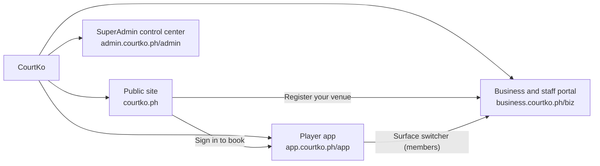
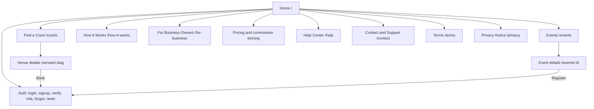
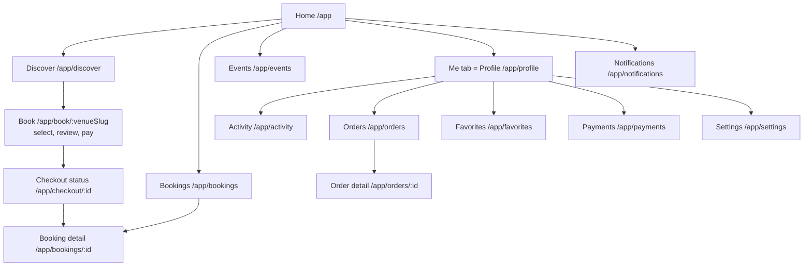

# 06 — Sitemap

| Field | Value |
|---|---|
| Document | 06 of 23 — Sitemap |
| Status | Draft v1.0 |
| Owner | Product design |
| Last updated | 2026-09-30 |
| Related | [05 Information architecture](05-information-architecture.md) (navigation, host mapping, permission mapping) · [03 Role & permission matrix](03-role-permission-matrix.md) · [13 API design](13-api-design.md) · [16 Wireframes](16-wireframes.md) |

Routes are the canonical routes shared by the interactive demo and production. Production serves the same paths on each surface's host: public on `courtko.ph`, player on `app.courtko.ph` (`/app/...`), business on `business.courtko.ph` (`/biz/...`), admin on `admin.courtko.ph` (`/admin/...`) — doc 05 §7.1.

Column key — **Auth:** No · Player (signed in; "verified" = email or mobile verified) · Member (active member of the current business) · Platform (platform staff, MFA, admin IP allowlist). **Permission:** exact codes; "or" means either grants the page, with finer gating inside (doc 05 §9).

## 1. Top level

## 2. Public website

| Route | Page | Purpose | Auth | Permission | Key components | Primary actions |
|---|---|---|---|---|---|---|
| `/` | Home | Entry point; search and highlights | No | — | Search (area + date), "Use my location", venue rails (nearby or popular), events this week, how-it-works strip, business call-to-action | Search, open venue, sign up |
| `/courts` | Find a Court | Discover venues by location, date, time and filters | No | — | Filter bar / bottom sheet, list/map segmented control, venue cards, map, sort, live results count | Filter, sort, switch to map, open venue, favorite (prompts sign-in) |
| `/venues/:slug` | Venue details | Everything needed to decide and book | No (booking needs Player) | — | Gallery, verified badge, rating, address with landmark, amenities, rules, policy summary, courts, availability timeline, events, products, reviews, sticky "Check availability" | Select slot, book, favorite, share, report listing |
| `/events` | Events | Browse public events | No | — | Event filters, event cards | Open event |
| `/events/:id` | Event details | Decide and register | No (registration needs Player) | — | Schedule, divisions, spots left or waitlist, fee, rules, policy, organizer, venue map | Register, join waitlist, share |
| `/how-it-works` | How It Works | Explain booking, verified payment, cancellations | No | — | Steps, policy explainer, FAQ | Find a court |
| `/for-business` | For Business Owners | Venue acquisition | No | — | Benefits, onboarding steps, document checklist, FAQ | Register your venue |
| `/pricing` | Pricing and commission | Transparent commission explanation | No | — | Canonical example (₱400 → ₱415 → ₱380), calculator (rate, method, discount funder) | Calculate, register venue |
| `/help` | Help Center | Self-service answers | No | — | Search, categories, articles, "How results are ranked" | Search, contact support |
| `/terms` | Terms | Versioned terms of use | No | — | Document with version and change log | — |
| `/privacy` | Privacy Notice | Data Privacy Act notice, location explanation, DPO contact | No | — | Sections, cookie preferences link | Manage cookies |
| `/contact` | Contact and Support | Reach support | No (ticket history needs Player) | — | Form (rate-limited, challenge on risk), channels, hours | Submit request |
| `/login` | Log in | Authenticate | No | — | Email or mobile + password, OTP option, Google, remember me | Log in |
| `/signup` | Sign up | Create account | No | — | Email or mobile, password with meter, terms and privacy acknowledgement, marketing opt-in (unchecked) | Create account |
| `/verify` | Verify | Verify email or mobile | Pending user | — | OTP input, resend with cooldown | Verify |
| `/mfa` | MFA | TOTP challenge or enrollment | Password step done | — | OTP input, recovery-code option, enrollment QR | Verify, use recovery code |
| `/forgot` | Forgot password | Start reset | No | — | Email or mobile input; identical response whether or not the account exists | Send reset link |
| `/reset` | Reset password | Set a new password | Single-use token | — | Password with meter | Save password |

Player sign-in pages are served on `app.courtko.ph` so the player session cookie is set on that host. The business and admin apps serve their own sign-in, MFA and reset pages under their base paths (for example `/biz/login`, `/admin/mfa`); admin has no public sign-up.

## 3. Player app

| Route | Page | Purpose | Auth | Permission | Key components | Primary actions |
|---|---|---|---|---|---|---|
| `/app` | Home | Next booking first, quick rebook | Player | — | Next-booking card with QR shortcut, rebook chips, favorites rail, events for you | Show QR, rebook, discover |
| `/app/discover` | Discover | Signed-in discovery with favorites and history | Player | — | Same as `/courts` plus "Book again" | Search, filter, open venue |
| `/app/book/:venueSlug` | Book (select → review → pay) | Choose slot, add-ons, promo and method; accept policy; pay | Player (verified) | — | Stepper, date chips, availability timeline, slot chips, hold countdown, add-ons, promo field, price breakdown, method picker with per-method fee, policy acceptance | Hold slot, apply promo, pay |
| `/app/checkout/:id` | Checkout status | Processing and return page; shows verified server state only | Player | — | Status panel, countdown, confirmation with QR, retry, receipt link | Retry payment, view booking, add to calendar |
| `/app/bookings` | Bookings | Upcoming, past and cancelled bookings | Player | — | Segmented control, booking cards | Open booking, rebook |
| `/app/bookings/:id` | Booking detail | QR, details, receipt, history, changes | Player (booking owner) | — | QR display, booking code, price breakdown, accepted policy, status history, participants | Show QR, reschedule, cancel with refund preview, add participants, review after completion, receipt |
| `/app/events` | My events | Registrations, waitlists and offers | Player | — | Registration cards, waitlist position, offer countdown | Pay offer, withdraw, show QR |
| `/app/orders` | Orders | Product orders | Player | — | Order cards | Open order |
| `/app/orders/:id` | Order detail | Items, status, claim code | Player (order owner) | — | Status stepper, claim QR and code, pickup instructions | Show claim code, cancel when allowed |
| `/app/activity` | Activity | Personal stats and history | Player | — | KPI tiles, charts with table view, rating card with source labels, visibility control | Change visibility, open history |
| `/app/favorites` | Favorites | Saved venues | Player | — | Venue cards | Open venue, remove |
| `/app/notifications` | Notifications | Inbox | Player | — | List, category filter | Open, mark read |
| `/app/profile` | Profile ("Me" tab) | Profile; hub links on mobile | Player | — | Avatar, display name, self-declared skill level, hub links, surface switcher | Edit profile |
| `/app/payments` | Payments | Payment history, receipts, refunds | Player | — | List with filters | Download receipt, view refund status |
| `/app/settings` | Settings | Account, security, privacy, notifications, cookies | Player | — | Tabs; sessions and login history; export and deletion | Change password, manage MFA, revoke sessions, export data, delete account |

## 4. Business and staff portal

```mermaid
flowchart TD
    ONB["Onboarding /biz/onboarding"] --> OV["Overview /biz"]
    OV --> OP["Operate"]
    OP --> CAL["Calendar /biz/calendar"]
    OP --> BKS["Bookings /biz/bookings"]
    OP --> WI["Walk-in /biz/walk-in"]
    OP --> ORS["Orders /biz/orders"]
    OV --> SU["Venue setup"]
    SU --> VEN["Venues /biz/venues"]
    SU --> CRT["Courts /biz/courts"]
    SU --> PRC["Pricing /biz/pricing"]
    SU --> EVS["Events /biz/events"]
    SU --> PRD["Products /biz/products"]
    OV --> PPL["People"]
    PPL --> CUS["Customers /biz/customers"]
    PPL --> RST["Restrictions /biz/restrictions"]
    PPL --> STF["Staff /biz/staff"]
    PPL --> REV["Reviews /biz/reviews"]
    OV --> MON["Money"]
    MON --> PAY["Payments /biz/payments"]
    MON --> PO["Payouts /biz/payouts"]
    MON --> RPT["Reports /biz/reports"]
    OV --> ADMN["Admin"]
    ADMN --> SET["Settings /biz/settings"]
    ADMN --> AUD["Audit Log /biz/audit"]
```

| Route | Page | Purpose | Auth | Permission | Key components | Primary actions |
|---|---|---|---|---|---|---|
| `/biz/onboarding` | Onboarding | Register and verify the business | Member (owner) | `business_owner` while `draft`, `pending_verification` or `rejected` | Stepper, forms, file upload with scan status, status tracker, rejection reasons | Save, submit, resubmit flagged items |
| `/biz` | Overview | Decisions and exceptions first, then today, then money | Member | `business.view` | Exception list, today summary, KPI tiles (`finance.view_summary`), alerts | Resolve exception, open item |
| `/biz/calendar` | Calendar | Courts × time | Member | `bookings.view` | Resource timeline, legend (color + pattern), day/week, venue switcher, booking drawer | Open booking, create block (`courts.block`), walk-in (`bookings.create_walkin`), check in |
| `/biz/bookings` | Bookings | Find and manage bookings | Member | `bookings.view` | Data table, filters with date basis, detail drawer | Check in, mark no-show, cancel, reschedule, re-check payment |
| `/biz/walk-in` | Walk-in | Desk booking paid by link or QR | Member | `bookings.create_walkin` | Court and time picker, contact field, server price breakdown, payment QR, live status | Send link, show QR, check in |
| `/biz/courts` | Courts | Courts and blocks | Member | `courts.manage` or `courts.block` | Court list, court form, Blocks tab, conflict dialog | Add or edit court, create block |
| `/biz/venues` | Venues | Venue profile, hours, special hours, policies, publish | Member | `venues.manage` | Venue form, hours editor, special hours, media, publish checklist | Edit, publish, unpublish |
| `/biz/pricing` | Pricing | Rules, simulator, promotions | Member | `pricing.manage` or `promotions.manage` | Rule table, rule editor, conflict warnings, simulator, promo table | Create rule, simulate, create promo |
| `/biz/events` | Events | Events, registrations, waitlists | Member | `events.manage` or `events.check_in` | Event list, event editor, registrations, waitlist, announcement composer | Create or copy event, publish, announce, check in |
| `/biz/products` | Products | Catalog and stock | Member | `products.manage` or `inventory.manage` | Product table, variant editor, stock movements | Create product, adjust stock |
| `/biz/orders` | Orders | Fulfilment queue | Member | `orders.fulfill` | Queue by pickup time, status actions, claim scanner | Mark preparing, ready, claimed |
| `/biz/customers` | Customers | Customer list and history | Member | `customers.view` | Table (contact masked without `customers.view_contact`), history drawer | View history, restrict (`restrictions.manage`) |
| `/biz/restrictions` | Restrictions | Restrictions and appeals | Member | `restrictions.view` | Table, restriction form, appeal queue | Create, lift, decide appeal (`restrictions.manage`) |
| `/biz/staff` | Staff | Members and roles | Member | `staff.manage` | Members table, invite drawer, role editor (`roles.manage`), permission matrix | Invite, assign roles and venue scopes, deactivate, create custom role |
| `/biz/payments` | Payments | Payment and refund status | Member | `payments.view` | Table with date basis, detail drawer with provider references | Re-check status (`payments.confirm_status`), request refund (`refunds.request`), approve refund (`refunds.approve`) |
| `/biz/payouts` | Payouts | Payouts and settlement statements | Member | `finance.view_payouts` | Payout list, Statements tab, payout account card | Download statement (`reports.export`), change payout account (`finance.manage_payout_account`) |
| `/biz/reports` | Reports | Analytics and exports | Member | `reports.view` | Report catalog, required date-basis selector, charts with table view | Run, export (`reports.export`) |
| `/biz/reviews` | Reviews | Reviews and replies | Member | `business.view` | Review list, reply editor | Reply (`reviews.respond`), report review |
| `/biz/settings` | Settings | Business profile, booking settings, policies, payment methods, notifications | Member | `business.settings.manage` | Tabs and forms | Save |
| `/biz/audit` | Audit Log | Business audit trail | Member | `audit.view` | Filterable table, row drawer with before/after, integrity check | Filter, verify chain, export (`reports.export`) |

## 5. SuperAdmin control center

```mermaid
flowchart TD
    AO["Platform Overview /admin"] --> TEN["Tenants"]
    TEN --> AB["Businesses /admin/businesses"]
    TEN --> AV["Venues /admin/venues"]
    AO --> AU["Users /admin/users"]
    AO --> ACTV["Activity"]
    ACTV --> ABK["Bookings /admin/bookings"]
    ACTV --> AEV["Events /admin/events"]
    ACTV --> APR["Products /admin/products"]
    AO --> MNY["Money"]
    MNY --> ATX["Transactions /admin/transactions"]
    MNY --> ACM["Commissions /admin/commissions"]
    MNY --> APO["Payouts /admin/payouts"]
    MNY --> ARF["Refunds /admin/refunds"]
    MNY --> ADS["Disputes /admin/disputes"]
    AO --> ARP["Reports /admin/reports"]
    AO --> TS["Trust and safety"]
    TS --> AMO["Moderation /admin/moderation"]
    TS --> ASU["Support /admin/support"]
    TS --> ASE["Security /admin/security"]
    TS --> AAU["Audit Logs /admin/audit"]
    AO --> ACF["Platform Configuration /admin/config"]
```

All admin routes require Platform auth: mandatory MFA, 15-minute idle timeout, WAF IP allowlist.

| Route | Page | Purpose | Auth | Permission | Key components | Primary actions |
|---|---|---|---|---|---|---|
| `/admin` | Platform Overview | Alerts and queues first, then KPIs and health | Platform | `platform.overview.view` | Alert list, queue tiles, KPI tiles with date basis, job and webhook health | Open alert or queue |
| `/admin/businesses` | Businesses | Verification queue and tenant list | Platform | `platform.businesses.view` or `platform.businesses.verify` | Queue table, verification review (document viewer + checklist) | Approve, reject, suspend, reactivate |
| `/admin/venues` | Venues | Listing moderation | Platform | `platform.venues.moderate` | Table, listing preview | Unpublish, suspend |
| `/admin/users` | Users | Players and staff | Platform | `platform.users.view` | Table, user detail, sessions, restrictions | Suspend (`platform.users.suspend`), platform restriction (`platform.restrictions.manage`) |
| `/admin/bookings` | Bookings | Cross-tenant inspection | Platform | `platform.bookings.view` | Table, detail with snapshot, payments, ledger references | Inspect |
| `/admin/events` | Events | Cross-tenant events | Platform | `platform.bookings.view` | Table, detail | Inspect, moderate (`platform.moderation.manage`) |
| `/admin/products` | Products | Cross-tenant products and orders | Platform | `platform.bookings.view` | Table, detail | Inspect, moderate |
| `/admin/transactions` | Transactions | Payments, ledger, reconciliation | Platform | `platform.transactions.view` | Tabs: Payments, Ledger, Reconciliation | Re-query provider, resolve exception (`platform.reconciliation.run`) |
| `/admin/commissions` | Commissions | Default rate and business agreements | Platform | `platform.commissions.manage` | Agreements table, editor, approval diff with impact preview | Propose; approve (different admin, MFA) |
| `/admin/payouts` | Payouts | Payout monitoring | Platform | `platform.payouts.manage` | Table, failure queue | Retry, investigate |
| `/admin/refunds` | Refunds | Refunds needing platform approval | Platform | `platform.refunds.approve` | Queue (> ₱5,000, after payout) | Approve, reject (MFA) |
| `/admin/disputes` | Disputes | Chargebacks and disputes | Platform | `platform.disputes.manage` | Table, evidence pack builder | Submit evidence, record outcome |
| `/admin/reports` | Reports | Platform analytics | Platform | `platform.reports.view` | Report catalog, date-basis selector | Run, export (`platform.reports.export`) |
| `/admin/moderation` | Moderation | Reported content queue | Platform | `platform.moderation.manage` | Queue with target preview | Hide, dismiss, escalate |
| `/admin/support` | Support | Cases, support sessions, privacy requests | Platform | `platform.support.impersonate` or `platform.privacy.requests` | Case list, session starter, Privacy requests tab | Start support session, process privacy request |
| `/admin/security` | Security | Security events and alerts | Platform | `platform.security.view` | Event stream, alert rules | Investigate |
| `/admin/audit` | Audit Logs | Platform-wide audit trail | Platform | `platform.audit.view` | Table, row drawer, integrity verification | Verify chain, export (`platform.reports.export`) |
| `/admin/config` | Platform Configuration | Settings, providers and methods, fees, taxonomies, policies, holidays, promotions, content, flags | Platform | `platform.config.manage` or `platform.promotions.manage` | Tabs and forms; fee and pass-through changes go through maker-checker | Edit, submit for approval |

## 6. Demo-only route

| Route | Page | Purpose | Auth | Notes |
|---|---|---|---|---|
| `/pay/:sessionId` | Mock payment provider (sandbox) | Stands in for Xendit hosted checkout in the interactive demo | Demo session | Clearly labeled "Sandbox — no real money". Simulates success, failure, delay, closed browser, duplicate webhook and late payment. **Not deployed in production.** |

## 7. In-page views (tabs, drawers, dialogs)

| Route | Views |
|---|---|
| `/app/book/:venueSlug` | Steps Select → Review → Pay; sign-in gate; hold-expired dialog |
| `/app/bookings/:id` | Refund-preview (cancel) dialog; reschedule sheet; participants sheet; receipt; review form (after completion) |
| `/app/settings` | Account · Security (password, MFA, sessions, login history) · Privacy (visibility, location, export, delete) · Notifications · Cookies |
| `/biz/calendar` | Booking drawer; block dialog; block conflict dialog; quick walk-in; scan sheet |
| `/biz/bookings` | Detail drawer (`?booking={id}`); cancel dialog; no-show confirm; reschedule sheet |
| `/biz/courts` | Courts · Blocks |
| `/biz/venues` | Profile · Hours · Special hours · Policies · Media · Publish checklist |
| `/biz/pricing` | Rules · Simulator · Promotions (`?tab=`) |
| `/biz/events` | Events · Registrations · Waitlist · Announcements |
| `/biz/products` | Products · Stock movements |
| `/biz/staff` | Members · Roles; invite drawer; role editor |
| `/biz/payouts` | Payouts · Statements · Payout account |
| `/biz/settings` | Business profile · Booking settings · Policies · Payment methods · Notifications |
| `/admin/businesses` | Queue · All businesses · Verification review |
| `/admin/transactions` | Payments · Ledger · Reconciliation |
| `/admin/commissions` | Default rate · Agreements · Pending approvals |
| `/admin/support` | Cases · Support sessions · Privacy requests |
| `/admin/config` | General · Providers and methods · Fees · Taxonomies · Policies · Holidays · Promotions · Content · Feature flags |

## 8. System pages and states

| State | When | Content |
|---|---|---|
| Not found | Unknown route, or an object outside the user's tenant or ownership | "We can't find that page." Search and home links. Same response for "does not exist" and "not yours" |
| No access | Same-tenant page without the permission | "You don't have access to this page. Ask your business owner to update your role." |
| Session expired | Idle or absolute timeout | Sign in again and return to the same page (unsaved admin forms are not restored) |
| Step-up required | High-risk action needs fresh MFA (`MFA_REQUIRED`) | MFA challenge, then the action resumes |
| Error | Server error | "Something went wrong. Please try again." plus "Ref: {correlationId}" |
| Maintenance | Planned downtime | Status message and expected end time |
| Offline | No connectivity | Banner; booking and payment actions disabled |

## 9. Candidate detail routes (production, not in the demo)

The demo uses drawers. Production may add deep-linkable detail pages where drawers are too small; the verification review needs a full page from MVP.

| Route | Reason | Permission |
|---|---|---|
| `/admin/businesses/:id` | Verification review split view (documents + checklist) — MVP | `platform.businesses.verify` or `platform.businesses.view` |
| `/admin/transactions/:id`, `/admin/refunds/:id`, `/admin/disputes/:id` | Shareable references in finance and support work | As parent page |
| `/admin/commissions/:agreementId` | Approval links for the checker | `platform.commissions.manage` |
| `/biz/bookings/:id`, `/biz/events/:id`, `/biz/customers/:id` | Links from notifications and exports | As parent page |
| `/biz/payouts/statements/:date` | Statement permalink | `finance.view_payouts` |
