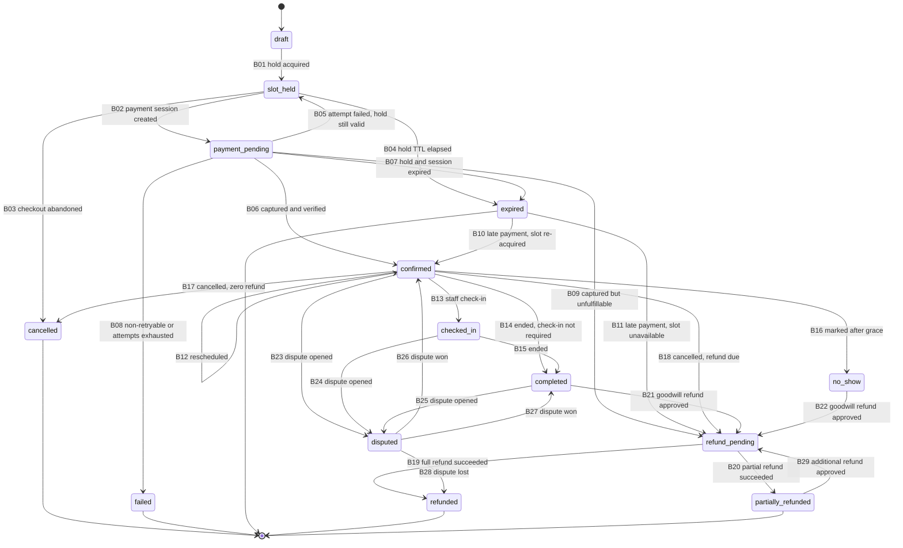
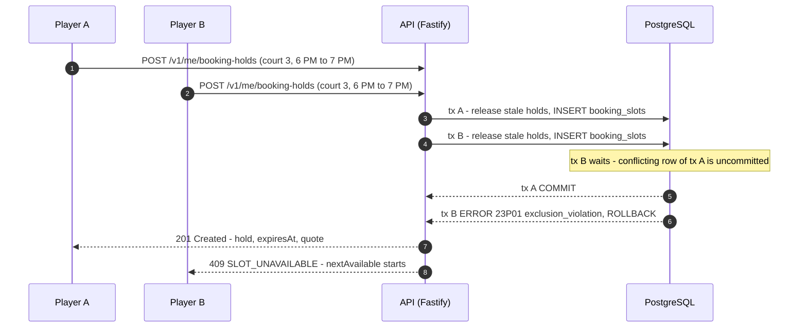

# 07 — Booking State Machine

| Item | Value |
|---|---|
| Document | 07 of 23, CourtKo design package |
| Scope | Production booking lifecycle: statuses, transitions, invariants, concurrency, protected scenarios, timing |
| Canonical sources | Design brief §3 (statuses and transitions), §5 (policies and timing); [`schema.sql`](schema.sql) |
| Related | [08 Payment state machine](08-payment-state-machine.md), [09 Refund and payout flow](09-refund-and-payout-flow.md), [10 Multi-tenant architecture](10-multi-tenant-architecture.md), [12 Database ERD](12-database-erd.md), [13 API design](13-api-design.md) |
| Demo note | The interactive demo runs this same state machine in the browser against a mock provider. This document describes the production system. |

The booking state machine lives in `packages/domain` (pure TypeScript, no I/O) and is enforced a second time in
PostgreSQL by the guard trigger `app.tg_guard_booking_transition()`. The trigger accepts only the pairs listed in §3 and
accepts money-backed transitions only in the `system` scope, meaning the worker after it has verified the payment with
the provider.

## 1. Status catalog

| Status | Meaning | Court occupied (active `booking_slots` row) | Player-facing label | Terminal |
|---|---|---|---|---|
| `draft` | Aggregate created; no slot yet. Exists only inside the hold transaction (B01); staff walk-in drafts may persist up to 24 h | No | none | No |
| `slot_held` | Court reserved for this checkout until `booking_holds.expires_at` | Yes (hold) | "Reserved — pay by 6:10 PM" | No |
| `payment_pending` | Provider payment session exists; awaiting customer action or provider result | Yes (hold) | "Confirming your payment" | No |
| `confirmed` | Payment captured **and** verified server-side | Yes | "Confirmed" | No |
| `checked_in` | Staff checked the player in | Yes | "Checked in" | No |
| `completed` | Play time ended | Yes (retained as history) | "Completed" | No (goodwill refund, dispute) |
| `cancelled` | Checkout abandoned, or cancelled with zero refund | No | "Cancelled" | Yes |
| `refund_pending` | A refund is due and being processed | Released if the refund happens before play, retained otherwise | "Refund in progress" | No |
| `partially_refunded` | Part of the booking entitlement refunded | As above | "Partially refunded" | Yes (may accept an additional approved refund, B29) |
| `refunded` | Full booking entitlement refunded, or dispute lost | As above | "Refunded" | Yes |
| `no_show` | Staff marked no-show after the grace period | Yes (retained) | "No-show" | No (goodwill refund) |
| `disputed` | Chargeback or dispute open | Unchanged | "Under review" | No |
| `failed` | Non-retryable payment failure, or attempts exhausted | No | "Payment failed" | Yes |
| `expired` | Hold and provider session expired unpaid | No | "Reservation expired" | Yes, unless a late payment arrives (B10/B11) |

**Booking status vs payment status.** Booking status tracks the booking *entitlement*; payment status (doc 08) tracks
*money*. `refunded` means 100% of the refundable booking amount for the applied trigger and tier was returned.
Canonical example (synthetic): a player cancels at least 24 h before start under the Standard policy on a ₱415.00
payment (₱400.00 base plus a ₱15.00 QR Ph gateway fee, disclosed as non-refundable for player cancellations). The refund
is ₱400.00, so the booking becomes `refunded` while the payment becomes `partially_refunded` (₱400.00 of ₱415.00).

## 2. State diagram



Notes on mapping the brief to transition codes:

- B26/B27 implement the brief's single rule "disputed → completed | confirmed: dispute won (restore prior status)".
  `bookings.pre_dispute_status` is restored as follows: `confirmed` with end time still in the future → `confirmed` (B26);
  `checked_in`, `completed`, or any booking whose end time has passed → `completed` (B27).
- B29 implements the brief's terminal-state note that `partially_refunded` "may still accept an additional approved refund".
- Codes B01–B29 are stored in `booking_status_history.transition_code` and used in tests, logs and support tooling.

## 3. Transition catalog

Every transition runs through one protocol (§5.3). It locks the booking row, validates the pair and its guards in
`packages/domain`, updates with a `version` check, appends a `booking_status_history` row (every transition, so it is
not repeated in the tables below), and writes outbox events in the same transaction.

### 3.1 Trigger, actor and guards

| Code | From → To | Trigger | Actor | Guards (all must hold; failure → error code) |
|---|---|---|---|---|
| B01 | `draft` → `slot_held` | `POST /v1/me/booking-holds`; staff: `POST /v1/businesses/{businessId}/walk-ins` | Player; staff with `bookings.create_walkin` | Account active and contact verified (`UNAUTHENTICATED`); `app.fn_booking_eligibility(...)` is true (`BOOKING_NOT_ALLOWED`, neutral wording); business `active`, venue `published`, court `active` (`NOT_FOUND`); range inside operating/special hours, not a closure, start in the future and within `advance_booking_days`, duration within min/max and a multiple of `slot_increment_minutes` (`VALIDATION_FAILED`); holder has fewer than 2 unexpired active holds (`HOLD_LIMIT_REACHED`); exclusion constraint passes (`SLOT_UNAVAILABLE`) |
| B02 | `slot_held` → `payment_pending` | `POST /v1/me/checkouts/{checkoutId}/payment-sessions` | Player, or guest via walk-in payment link | Hold active and unexpired (`HOLD_EXPIRED`); checkout `open` and client `quoteSha256` equals stored quote, quote unexpired (`QUOTE_EXPIRED`); `policy_accepted_at` set (`POLICY_NOT_ACCEPTED`); method enabled for venue and provider (`PAYMENT_METHOD_UNAVAILABLE`); eligibility re-checked (`BOOKING_NOT_ALLOWED`); provider circuit closed (`PROVIDER_UNAVAILABLE`, hold untouched); `attempt_no` ≤ 3; no other in-flight payment (a replay returns the existing session) |
| B03 | `slot_held` → `cancelled` | `DELETE /v1/me/booking-holds/{holdId}` | Player | Caller owns the hold; no payment in flight. A `payment_pending` booking first returns to `slot_held` via B05 once the provider confirms the attempt was not captured |
| B04 | `slot_held` → `expired` | `holds.expire` job (every 1 min), or inline `app.fn_release_stale_holds()` inside another hold transaction | System | `booking_holds.expires_at` ≤ now; no payment in flight |
| B05 | `payment_pending` → `slot_held` | Worker handling a verified failure or cancel; API when session creation definitively fails | System | Provider re-query shows failed/cancelled (not captured); hold unexpired; `attempt_no` < 3 |
| B06 | `payment_pending` → `confirmed` | Worker after webhook + provider re-query, or `payments.reconcile` | System | Re-query status maps to `captured`; amount and currency equal the locked checkout total; provider account equals the business's sub-account; booking still `payment_pending` with its active slot; eligibility still true (otherwise B09) |
| B07 | `payment_pending` → `expired` | `holds.expire` | System | Hold expired; provider re-query shows not captured (pending/expired), or provider unreachable (expire anyway; late payment recovery B10/B11 covers a later capture) |
| B08 | `payment_pending` → `failed` | Worker | System | Non-retryable provider failure (risk block, channel rejection), or third failed attempt |
| B09 | `payment_pending` → `refund_pending` | Worker | System | Capture verified, but at confirmation time the player is restricted (eligibility false) or the booking is otherwise unfulfillable |
| B10 | `expired` → `confirmed` | Worker (late webhook or reconcile) | System | Capture verified; detected ≤ `expired_at` + 15 min (late-webhook grace); start still in the future; eligibility true; re-insert of the same court/range passes the exclusion constraint |
| B11 | `expired` → `refund_pending` | Worker | System | Capture verified and any B10 guard fails |
| B12 | `confirmed` → `confirmed` | `POST /v1/me/bookings/{id}/reschedule`; staff with `bookings.reschedule` | Player; staff | `reschedule_count` < policy allowance (1); now ≤ start − 12 h (staff may override with a recorded reason); target slot passes every B01 guard; price decrease → partial refund; price increase → top-up payment captured before the swap (§5.5) |
| B13 | `confirmed` → `checked_in` | `POST /v1/businesses/{businessId}/bookings/{id}/check-in` | Staff with `bookings.check_in` (venue-scoped) | Now within [start − 30 min, end]; signed QR token valid, or booking code matches; booking in the staff member's venue scope |
| B14 | `confirmed` → `completed` | `bookings.complete` job (every 5 min) | System | `ends_at` ≤ now and `venues.check_in_required` = false |
| B15 | `checked_in` → `completed` | `bookings.complete` | System | `ends_at` ≤ now |
| B16 | `confirmed` → `no_show` | `POST /v1/businesses/{businessId}/bookings/{id}/no-show` | Staff with `bookings.mark_no_show` | Now ≥ start + `no_show_grace_minutes` (15); not checked in |
| B17 | `confirmed` → `cancelled` | `POST /v1/me/bookings/{id}/cancel` (quote = 0) | Player | Cancellation quote from the *accepted* policy version is ₱0.00; now < start |
| B18 | `confirmed` → `refund_pending` | Player cancel with quote > 0; staff `POST /v1/businesses/{businessId}/bookings/{id}/cancel` (`bookings.cancel`, venue-initiated, 100% including gateway fee); system for court unavailable or weather | Player; staff; system | Refund amount > 0; refund row created with approval routing per doc 09 §2 |
| B19 | `refund_pending` → `refunded` | Worker on `refund.succeeded` + re-query | System | Refund succeeded and cumulative refunds cover 100% of the entitlement |
| B20 | `refund_pending` → `partially_refunded` | Worker | System | Refund succeeded and entitlement only partly refunded |
| B21 | `completed` → `refund_pending` | Staff goodwill refund: `refunds.request` then `refunds.approve` | Staff; platform finance | Approved `approval_requests` row, approver ≠ requester; above ₱5,000.00 or after payout also needs `platform.refunds.approve` |
| B22 | `no_show` → `refund_pending` | As B21 | As B21 | As B21 |
| B23–B25 | `confirmed` / `checked_in` / `completed` → `disputed` | Provider dispute notification or report ingestion; platform finance manual entry (`platform.disputes.manage`), executed by the worker | System | `disputes` row created; `pre_dispute_status` := current status |
| B26 | `disputed` → `confirmed` | Dispute resolved as won | System | `pre_dispute_status` = `confirmed` and end time in the future |
| B27 | `disputed` → `completed` | Dispute resolved as won | System | Otherwise (see §2 notes) |
| B28 | `disputed` → `refunded` | Dispute resolved as lost | System | Provider reports the chargeback final |
| B29 | `partially_refunded` → `refund_pending` | As B21 | As B21 | Cumulative refunds < booking total |

### 3.2 Side effects

`history` (the `booking_status_history` row) is written on every transition and omitted below. "Audit" lists
additional `audit.audit_logs` records (high-risk actions, doc 14).

| Code | Slot (`booking_slots` / `booking_holds`) | Ledger (doc 09 §10) | Notifications | Outbox event(s) | Audit |
|---|---|---|---|---|---|
| B01 | Release stale overlapping holds, then INSERT active slot with `hold_expires_at` = now + 600 s; INSERT active hold | none | none | `booking.slot_held` | none; metric `booking_slot_conflicts_total` on 23P01; `double_booking_attempt` security event only on anomalous per-user rate |
| B02 | Extend hold and slot `hold_expires_at` to max(current, now + provider minimum session TTL), capped at hold creation + 1,200 s | none | none | `payment.created`, `booking.payment_pending` | none |
| B03 | Release slot (`checkout_abandoned`); hold `released` | none | none | `booking.cancelled` (handler releases promo and stock reservations) | none |
| B04 | Release slot (`hold_expired`); hold `expired` | none | In-app only, if the checkout screen is open | `booking.expired` | none |
| B05 | Unchanged (hold keeps running) | none | "Payment didn't go through — try again" (in-app, email) | `payment.failed` or `payment.cancelled`, `booking.payment_retry` | none |
| B06 | Slot `hold_expires_at` := NULL (permanent); hold `converted` | Capture journal; provider-fee journal once the actual fee is known; variance at reconciliation | Player: confirmation + receipt (email, in-app, push). Venue: in-app "new booking" | `payment.captured`, `booking.confirmed`, `receipt.issue` | `payment.capture` (system actor, provider references) |
| B07 | Release slot (`hold_expired`); hold `expired` | none | "Reservation expired — you were not charged" (email, in-app) | `booking.expired`; payment watch continues for the late-webhook grace | none |
| B08 | Release slot (`payment_failed`); hold `released` | none | Payment failure (email, in-app) | `booking.failed`, `payment.failed` | none |
| B09 | Release slot (`restriction_unfulfillable`) | Capture journal now; refund journal on refund success; platform absorbs any provider fee not returned | Neutral: "We couldn't complete this booking. A full refund is on its way." | `payment.captured`, `booking.refund_pending`, `refund.requested` | `booking.unfulfillable_refund` |
| B10 | INSERT a new active slot for the same court and range (exclusion must pass); `late_payment_recovered` = true | Capture journal | Confirmation + receipt noting the late payment | `booking.confirmed` (`lateRecovery: true`) | `booking.late_payment_recovered` |
| B11 | none (slot already released) | Capture journal, then refund journal: full amount including gateway fee | "Payment arrived after your reservation expired and the slot was taken. Full refund started." | `booking.refund_pending`, `refund.requested` | `booking.late_payment_refund` |
| B12 | One transaction: release old slot (`rescheduled`), INSERT new slot; new superseding price snapshot | Decrease: partial refund (`reschedule_difference`). Increase: capture journal for the top-up | Player and venue: reschedule confirmation | `booking.rescheduled` | `booking.reschedule` when staff-initiated |
| B13 | none | none | none | `booking.checked_in` | none |
| B14, B15 | Retained (history) | none | Review invitation (respects preferences) | `booking.completed` | none |
| B16 | Retained | none (no automatic refund) | Neutral "Marked as no-show" (in-app, email) | `booking.no_show` | `booking.mark_no_show` |
| B17 | Release (`cancelled`) | none (venue keeps revenue per accepted policy) | Cancellation confirmation | `booking.cancelled` | Staff/platform actor only |
| B18 | Release (`cancelled`) if before start; retained otherwise | Refund journal posted on refund success (B19/B20), not on request | Cancellation + "refund started"; venue-initiated adds the reason (weather, court unavailable) | `booking.refund_pending`, `refund.requested` | `booking.cancel` for venue-initiated, court unavailable, weather |
| B19, B20 | none | Refund journal (`refund` / `partial_refund`), proportional commission reversal | "Refund completed" (email, in-app) | `refund.succeeded`, `booking.refunded` / `booking.partially_refunded` | none (refund approval audited earlier) |
| B21, B22, B29 | Retained | On refund success | "Refund started" | `booking.refund_pending`, `refund.requested` | `refund.request`, `refund.approve` |
| B23–B25 | Retained | `dispute_adjustment` journal if the provider debits funds at dispute open (provider-dependent, to be verified) | Venue owner, `platform_finance` alert | `dispute.opened`, `booking.disputed` | `dispute.open` |
| B26, B27 | Retained | `dispute_won` journal reversing any dispute adjustment | Venue owner, `platform_finance` | `dispute.won` | `dispute.resolve` |
| B28 | Retained | `chargeback` journal (liability per agreement), dispute fee | Venue owner, `platform_finance` | `dispute.lost`, `booking.refunded` | `dispute.resolve` |

## 4. Invariants

Each invariant is enforced at the strongest available layer (database first) and verified by a test in the
booking-concurrency and payment-webhook suites (doc 20).

| ID | Invariant | Enforcement |
|---|---|---|
| I1 | A booking is `confirmed` (or later: `checked_in`, `completed`, `no_show`, `disputed`) only if a captured payment for its checkout was verified server-side (provider re-query recorded in `payments.last_verified_at`) | Guard trigger: transitions into `confirmed` only in `system` scope. Worker confirms only after re-query. Reconciliation class `status_mismatch` alerts on any violation |
| I2 | Exactly one active `booking_slots` row per booking in `slot_held`, `payment_pending`, `confirmed` or `checked_in`; none in `draft`, `cancelled`, `expired` or `failed` | Partial unique index `booking_slots_one_active_per_booking` (at most one) + deferred constraint trigger `trg_bookings_slot_invariant` (exactly one / zero at COMMIT) |
| I3 | No two active occupancy rows on the same court overlap (holds, bookings, maintenance blocks, event reservations) | `EXCLUDE USING gist (court_id WITH =, occupied_range WITH &&) WHERE (status = 'active')` |
| I4 | At most one in-flight payment attempt per checkout | Partial unique index `payments_one_in_flight_per_checkout` (`created`, `pending`, `authorized`) |
| I5 | The amount charged equals the locked quote, and the confirmed booking's pricing never changes | Payment session amount taken from `checkouts.total_minor`. `booking_price_snapshots` is append-only; a reschedule adds a superseding snapshot |
| I6 | Every captured payment ends in exactly one outcome: confirmed booking(s) for its checkout, or a refund | Worker logic (B06/B09/B10/B11) + reconciliation alert if a captured payment has neither within 15 min |
| I7 | Every money movement is posted exactly once, and every journal balances | `ledger_journals.idempotency_key` UNIQUE (`capture:{paymentId}`, `refund:{refundId}`, ...) + deferred balance trigger |
| I8 | The cancellation policy version shown before payment is stored with the booking | CHECK `bookings_policy_before_payment`: policy version, acceptance time, commission rate and checkout are required from `payment_pending` on |
| I9 | Only the transitions in §3 can occur | `app.tg_guard_booking_transition()` (allowed pairs + system-only money transitions); domain `assertTransition()` |
| I10 | A booking, its slot, court, venue and payment belong to the same business | Composite same-tenant foreign keys (`(business_id, court_id)` → `courts (business_id, id)`, etc.) + RLS `WITH CHECK` |
| I11 | A player holds at most 2 unexpired active holds | Per-user advisory transaction lock + count in the hold transaction |

## 5. Concurrency design

### 5.1 Occupancy model

- `booking_slots.play_range` = `[start, end)` (what the customer plays).
- `booking_slots.occupied_range` = `[start, end + venues.cleanup_buffer_minutes)` (what the court is unavailable for).
  With a 10-minute buffer, an 18:00–19:00 booking occupies 18:00–19:10, so the next bookable start is 19:10 or the next
  increment the availability engine offers after it.
- Half-open ranges (`'[)'`) make back-to-back bookings legal when the buffer is 0: 18:00–19:00 and 19:00–20:00 do not overlap.
- Holds are not a separate occupancy type. A hold is the booking's slot row with `hold_expires_at` set. Confirmation
  clears `hold_expires_at`, so the same physical row carries the booking from hold to play. Maintenance blocks
  (`occupant_type = 'court_block'`) and event court reservations (`occupant_type = 'event'`) use the same table and
  therefore the same exclusion constraint.
- Released rows are kept (`status = 'released'`, `release_reason`) for audit and analytics. The partial exclusion
  constraint ignores them.

### 5.2 Hold acquisition (B01): one transaction, READ COMMITTED

```sql
BEGIN;
SET LOCAL app.scope = 'player';
SET LOCAL app.user_id = '0190f5a2-7c1e-7d3a-9a41-2b7d5f0c9e11';          -- synthetic
SET LOCAL lock_timeout = '2s';
-- 1. Serialize this user's hold attempts (max 2 active holds).
SELECT pg_advisory_xact_lock(hashtextextended('holds:' || '0190f5a2-7c1e-7d3a-9a41-2b7d5f0c9e11', 0));
SELECT count(*) FROM app.booking_holds
 WHERE holder_user_id = app.app_current_user_id() AND status = 'active' AND expires_at > now();   -- must be < 2
-- 2. Restrictions (neutral boolean; no restriction rows visible to the player).
SELECT app.fn_booking_eligibility(app.app_current_user_id(), $business_id, $venue_id, 'booking');
-- 3. Release stale holds on this court that overlap the requested range, in THIS transaction.
SELECT app.fn_release_stale_holds($court_id, tstzrange($start, $end_plus_buffer, '[)'), $correlation_id);
-- 4. Aggregate + occupancy. The exclusion constraint is the arbiter.
INSERT INTO app.bookings (id, business_id, venue_id, court_id, player_user_id, booker_display_name, booking_code,
                          starts_at, ends_at, play_local_date, status)
     VALUES ($booking_id, $business_id, $venue_id, $court_id, app.app_current_user_id(), 'Juan D.', 'K7M2Q9XA',
             $start, $end, $local_date, 'draft');
INSERT INTO app.booking_slots (business_id, venue_id, court_id, occupant_type, booking_id, play_range, occupied_range, hold_expires_at)
     VALUES ($business_id, $venue_id, $court_id, 'booking', $booking_id,
             tstzrange($start, $end, '[)'), tstzrange($start, $end_plus_buffer, '[)'), now() + interval '600 seconds');
     -- SQLSTATE 23P01 (exclusion_violation) => ROLLBACK => 409 SLOT_UNAVAILABLE with next available starts
INSERT INTO app.booking_holds (business_id, venue_id, court_id, booking_id, holder_user_id, expires_at)
     VALUES ($business_id, $venue_id, $court_id, $booking_id, app.app_current_user_id(), now() + interval '600 seconds');
UPDATE app.bookings SET status = 'slot_held' WHERE id = $booking_id;   -- B01; guard trigger validates the pair
INSERT INTO app.booking_status_history (...) VALUES (...);             -- transition_code 'B01'
INSERT INTO app.outbox_events (...) VALUES (...);                      -- booking.slot_held
UPDATE app.idempotency_keys SET state = 'completed', response_status = 201, response_body = $body WHERE scope = $s AND idem_key = $k;
COMMIT;                                                                -- deferred slot-invariant trigger runs here
```

`app.fn_release_stale_holds()` is `SECURITY DEFINER` (owner `app_definer`), because the player's RLS scope cannot see
other players' bookings. It selects bookings whose active slot on this court overlaps the range and whose
`hold_expires_at` ≤ now. It locks them with `FOR UPDATE OF b SKIP LOCKED`, then releases slot and hold, sets the booking
to `expired` (B04 or B07), and writes history and outbox rows. A booking the worker is confirming at that moment is
skipped rather than waited on. In that race the new insert waits on the in-flight row, and when the worker commits the
confirmation the insert fails with 23P01, which is the correct outcome. Inline expiry of a `payment_pending` hold does
not re-query the provider. It relies on provider session expiry being equal to hold expiry (§5.4). A capture that
races the expiry is handled by late payment recovery (B10/B11).

### 5.3 Transition protocol (every transition after B01)

1. `SELECT id, status, version, ... FROM app.bookings WHERE id = $1 FOR UPDATE` (row lock; `lock_timeout` 2 s).
2. `packages/domain` checks `assertTransition(from, to)` and the guards of §3.1 using locked data only. External calls
   (provider, maps, notifications) never happen while locks are held; they happen before (reads) or after (via outbox).
3. `UPDATE app.bookings SET status = $to, ... WHERE id = $1 AND version = $expectedVersion`. Zero rows means a concurrent
   change: re-read and re-evaluate once, then `409 CONFLICT`. For staff edits the client sends `If-Match: "<version>"`
   (doc 13 §2.10).
4. Slot and hold changes, `booking_status_history`, `outbox_events`, and ledger journals (worker only) in the same
   transaction.
5. `COMMIT`. Deferred triggers verify slot invariant I2 and journal balance I7.

**Lock order (deadlock avoidance).** `checkouts` → `bookings` (ascending id) → `booking_slots` → `booking_holds` →
`payments` → `refunds` → ledger inserts. Background sweeps use `FOR UPDATE SKIP LOCKED` so they never wait on user
transactions. SQLSTATE 40P01 (deadlock), 40001 (serialization) and 55P03 (lock timeout) are retried up to 3 times with
jittered backoff (50–400 ms), then surfaced as `409 CONFLICT`. Isolation is READ COMMITTED everywhere. Correctness comes
from row locks, the exclusion constraint, unique indexes and deferred triggers rather than from SERIALIZABLE isolation,
which would add retry storms under checkout load without adding protection here.

### 5.4 Hold, quote and provider-session alignment

- Hold TTL: 600 s from hold creation. The quote (`checkouts.quote_expires_at`) is locked until the hold expires.
- The provider session expiry equals the hold expiry. **Provider constraint (to be verified against current Xendit API
  docs):** Xendit Payment Sessions reportedly require `expires_at` at least 10 minutes in the future
  ([Create a session](https://docs.xendit.co/apidocs/create-session)). A hold that enters `payment_pending` at minute 8
  would otherwise outlive the provider minimum, so B02 performs a one-time extension:
  `expires_at := max(expires_at, now + payments.provider_min_session_ttl_seconds)`, capped at
  `booking.max_hold_lifetime_seconds` (1,200 s) after hold creation. The same instant is written to `booking_holds`,
  `booking_slots.hold_expires_at` and the provider request, so "provider session expiry = hold expiry" still holds.
- The CHECK `booking_holds_expiry` rejects any hold longer than 30 minutes, as a backstop against configuration errors.

### 5.5 Reschedule (B12)

| Price delta | Procedure |
|---|---|
| Equal or lower | One transaction: lock booking → release old slot (`rescheduled`) → INSERT new slot (exclusion) → new superseding price snapshot → `reschedule_count + 1`. A lower price creates a partial refund (`refund_trigger = 'reschedule_difference'`); the booking stays `confirmed` |
| Higher | Top-up checkout for the difference (`checkout_items.item_type = 'court_booking'`, same booking). The old slot stays held by the booking. After the top-up capture is verified, the worker performs the equal-price swap transaction. If the target slot was taken in the meantime, the top-up is refunded in full (including gateway fee) and the original booking is unchanged. The UI states that the new time is secured only when payment completes. **Phase 2:** a dedicated reschedule hold that reserves the target slot during the top-up |

### 5.6 Simultaneous checkout for the same slot



### 5.7 Background expiry (`holds.expire`, every minute)

1. Select up to 500 candidates: `booking_holds.status = 'active' AND expires_at <= now()`, ordered by `expires_at` (no lock).
2. For `payment_pending` candidates, re-query the provider outside any transaction (10 s timeout, circuit breaker).
3. Per booking, open a transaction, lock with `FOR UPDATE SKIP LOCKED`, and re-check. If captured → B06, or B09 if
   unfulfillable. If not captured → B04/B07. If the provider is unreachable → B07, and the payment stays under watch by
   `payments.reconcile` until the late-webhook grace ends.
4. Idempotent: a booking already transitioned by another worker or by an inline cleanup is skipped. The `booking.expired`
   outbox handler releases promo redemptions (`promotion_redemptions.status = 'released'`) and stock reservations
   (`inventory_movements` of type `reservation_release`).

## 6. Protected scenarios

| # | Scenario (product brief §3, §20) | Risk | Mechanism | Outcome for the user |
|---|---|---|---|---|
| 1 | Double booking | Two customers own the same court time | Exclusion constraint on `booking_slots` covering holds, bookings, blocks and events | Impossible by construction |
| 2 | Simultaneous checkout, same slot | Race between two hold inserts | Same constraint; the loser's insert waits, then fails 23P01 (§5.6) | Loser gets `409 SLOT_UNAVAILABLE` with alternatives |
| 3 | Repeated payment submissions (double tap, refresh) | Two provider charges | `Idempotency-Key` on `POST .../payment-sessions` (replay returns the stored response); partial unique index on in-flight payments; provider `Idempotency-Key` = `payments.provider_idempotency_key` | Same session returned; one charge |
| 4 | Duplicate webhooks | Double confirmation or double ledger | `webhook_events UNIQUE(provider, provider_event_id)`; booking row lock + status check; journal `idempotency_key` | Second delivery is a no-op (recorded as `ignored`) |
| 5 | Payment succeeds but confirmation fails (crash, deploy, DB error) | Paid but unbooked | Webhook row stays unprocessed and is retried with backoff; `payments.reconcile` finds captured payments with unconfirmed bookings (`status_mismatch`) and auto-heals via B06/B09/B10/B11; I6 alert after 15 min | Booking confirms seconds to minutes later, or is refunded in full |
| 6 | Booking succeeds but payment pending | Unpaid confirmed booking | Not representable: `confirmed` requires a verified capture (I1, guard trigger). Walk-ins stay `payment_pending` until the payment link is paid; `payments.confirm_status` only triggers a re-query | Staff see "awaiting payment", never a false "paid" |
| 7 | Browser closed during payment | Lost confirmation | Confirmation never depends on the redirect; webhook + re-query + reconcile | Confirmation arrives by email/push; `/app/checkout/:id` shows the final state on return |
| 8 | Expired checkout session | Payment against a stale quote or released slot | Provider session expiry = hold expiry (§5.4); `HOLD_EXPIRED` / `QUOTE_EXPIRED` on new attempts | Player restarts from the availability view |
| 9 | Payment retries | Unbounded attempts, orphan sessions | B05 back to `slot_held` (hold keeps its original expiry); max 3 attempts per checkout, then B08; each attempt is a new `payments` row with its own provider idempotency key | Clear retry within the same reservation |
| 10 | Rate change during checkout | Price differs from what was shown | Quote locked in `checkouts` + `booking_price_snapshots` until hold expiry; pricing edits apply only to new quotes; payment amount = locked total | Pays exactly the displayed total; a new hold shows new rates |
| 11 | Maintenance block created during checkout | Court blocked while a customer pays | Block insert conflicts with the active hold (exclusion). The API returns `409 CONFLICT` listing holds (with expiry) and confirmed bookings. Staff can cancel confirmed bookings with a full refund (`court_unavailable`, B18) and schedule the block; the `courts.apply_block` job retries at the earliest hold expiry. If that hold confirms first, it is cancelled with a full refund and a "maintenance conflict" notification | Holder completes payment; venue sees why the block is pending |
| 12 | Booking during maintenance | Customer books a blocked court | Block slot is active; the hold insert fails 23P01; availability hides blocked ranges | Slot never offered |
| 13 | User banned during checkout | Restricted user completes a booking | Eligibility checked at B01 and B02 (`BOOKING_NOT_ALLOWED`, neutral) and again at confirmation; a capture after restriction → B09 automatic full refund | Neutral message; full refund if already paid |
| 14 | Payment succeeds after checkout timeout | Paid after release | Late payment recovery: B10 (re-acquire the same slot within the 15 min grace) or B11 (full refund including gateway fee) | Confirmed, or fully refunded, with an explicit message |
| 15 | Provider temporarily unavailable | Holds consumed by failing payments; false failures | Circuit breaker on the Xendit adapter; `PROVIDER_UNAVAILABLE` before any session is created, hold untouched; reconcile resumes when closed (doc 08 §8) | "Payments are temporarily unavailable"; reservation kept until its expiry |
| 16 | Product out of stock during checkout | Overselling add-ons | Stock reserved at checkout creation (`stock_reserved` with CHECK ≤ `stock_on_hand`); `OUT_OF_STOCK` at quote time; reservation released on expiry | Told before paying |
| 17 | Event reaches capacity during payment | Over-registration | `event_divisions.occupied_count` row-locked, counts `held` + `pending_payment` + `offered` + `confirmed` + `checked_in`, CHECK ≤ capacity; `EVENT_FULL` at hold time | Seat held while paying; never oversold |
| 18 | Cross-business access to a booking | IDOR | RLS + object-level authorization; foreign IDs return `404 NOT_FOUND` (doc 10 §6) | No information leak |

## 7. Timing parameters

Defaults are stored in `app.platform_settings` (key shown) or on the venue (column shown). Changes are audited
(`platform.config.manage`).

| Parameter | Default | Where | Notes |
|---|---|---|---|
| Hold TTL | 600 s | `booking.hold_ttl_seconds` | From hold creation |
| Max active holds per user | 2 | `booking.max_active_holds_per_user` | Unexpired `active` holds |
| Provider minimum session TTL | 600 s | `payments.provider_min_session_ttl_seconds` | Provider-dependent, to be verified |
| Max hold lifetime | 1,200 s (3,600 s with the accessibility setting) | `booking.max_hold_lifetime_seconds` | Hold TTL plus all extensions (player and B02); CHECK backstop 60 min |
| Player hold extension | +300 s per tap, up to 10 taps, only while the checkout is `open` | `booking.hold_extension_seconds`, `booking.max_hold_extensions` | Reconciles D-33 (WCAG 2.2 SC 2.2.1): warn at 2 min remaining. Each extension is capped by the max hold lifetime; the UI shows "maximum reached" instead of silently failing |
| Late-webhook grace | 900 s | `payments.late_webhook_grace_seconds` | Window for B10; after it, a late capture is always refunded (B11) |
| Payment attempts per checkout | 3 | `payments.max_attempts_per_checkout` | Then B08 |
| Pending payment sweep | every 5 min for pending > 300 s | `payments.pending_sweep_after_seconds` | `payments.reconcile` |
| Hold expiry job | every 1 min | `holds.expire` schedule | Batches of 500, `SKIP LOCKED` |
| Completion job | every 5 min | `bookings.complete` schedule | B14/B15 |
| Reminders | 24 h and 2 h before start | `booking.reminder_offsets_minutes` | `bookings.remind`, deduplicated by `notifications.dedupe_key` |
| Check-in window | 30 min before start until end | `venues.check_in_opens_minutes` | B13 |
| No-show grace | 15 min after start | `venues.no_show_grace_minutes` | B16 |
| Reschedule | once, ≥ 12 h before start | `cancellation_policy_versions.reschedule_*` | B12 |
| Cancellation tiers (Standard) | ≥ 24 h 100%; 6–24 h 50%; < 6 h 0% | `cancellation_policy_versions.tiers` | Accepted version stored on the booking |
| Idempotency key retention | 24 h | `idempotency.ttl_seconds` | Doc 13 §2.6 |
| Row lock timeout (booking tx) | 2 s | `SET LOCAL lock_timeout` | Then retry, then `409 CONFLICT` |
| API statement timeout | 5 s | role setting `app_api` | Doc 11 |
| Webhook acknowledgement | < 2 s target (Xendit treats no response within 30 s as failed) | API | Doc 08 §4 |

## 8. Open points for doc 23

| Topic | Current decision | Needs |
|---|---|---|
| Check-in-required venues | Bookings still `confirmed` 24 h after end appear in the business Exceptions queue; no automatic transition (the brief allows only staff-marked no-show) | Product owner confirmation |
| Price-increase reschedule | Top-up before swap; target slot not reserved during top-up (§5.5) | Phase 2 reschedule holds |
| Provider minimum session TTL | One-time hold extension up to 1,200 s | Verify Xendit minimum and maximum `expires_at` for Payment Sessions and per-channel limits |
| Cash payments for walk-ins | Not supported (all payments digital per product brief) | Confirm with venues during pilot |

## Reconciliation note: hold extensions (doc 23 D-33)

Earlier drafts allowed only the one-time B02 extension. D-33 adds repeatable player extensions for accessibility. Both are now bounded by the same `booking.max_hold_lifetime_seconds`, measured from hold creation, so a slot can never be held longer than the configured lifetime:

1. Player extensions (`POST /v1/me/checkouts/{id}/hold-extensions`) are allowed only in `open`, add 300 s each, and stop at the cap.
2. The B02 extension on payment start sets `expires_at = min(max(expires_at, now + provider_min_ttl), created_at + max_lifetime)`.
3. The default cap is 1,200 s. Venues or events can declare a high-demand release ("essential time limit" exception, D-33). Users who turn on "More time to complete tasks" in accessibility settings get 3,600 s.

The interactive demo implements steps 1 and 2 with a 20-minute cap.

