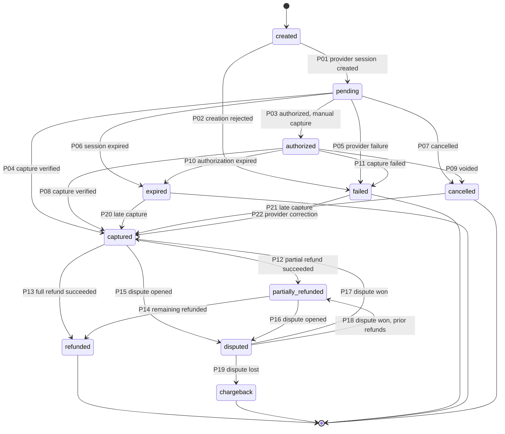
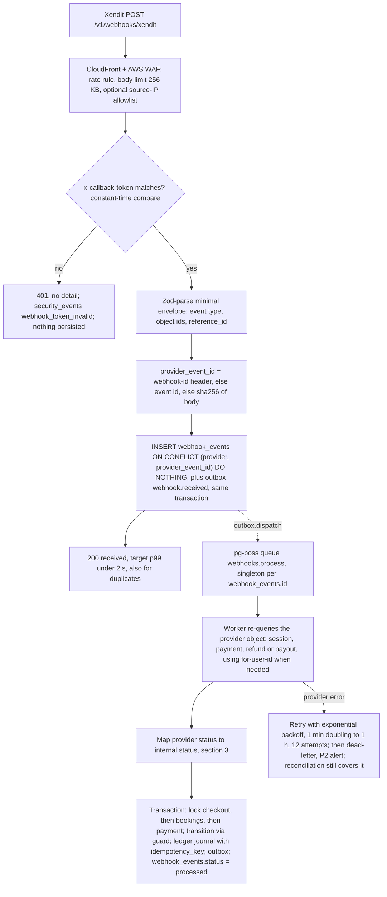
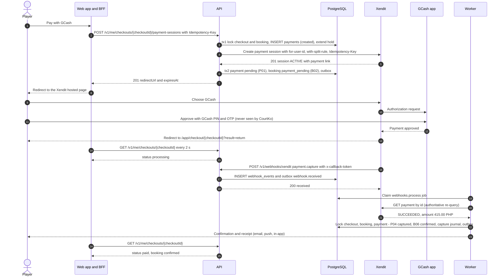
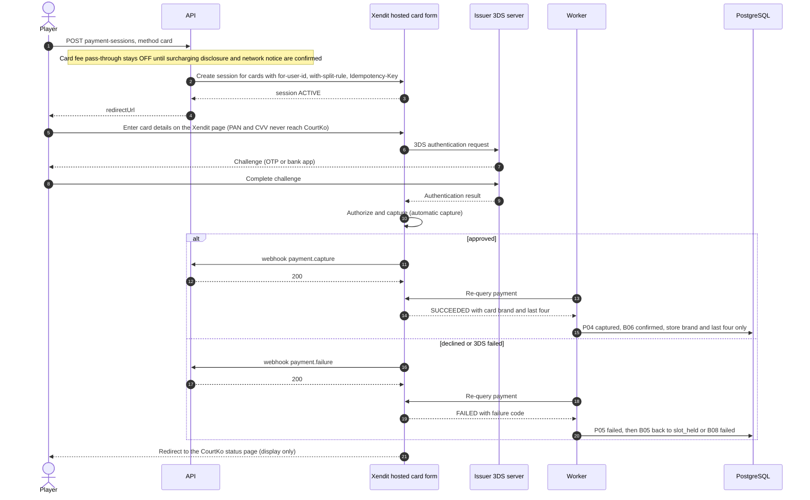
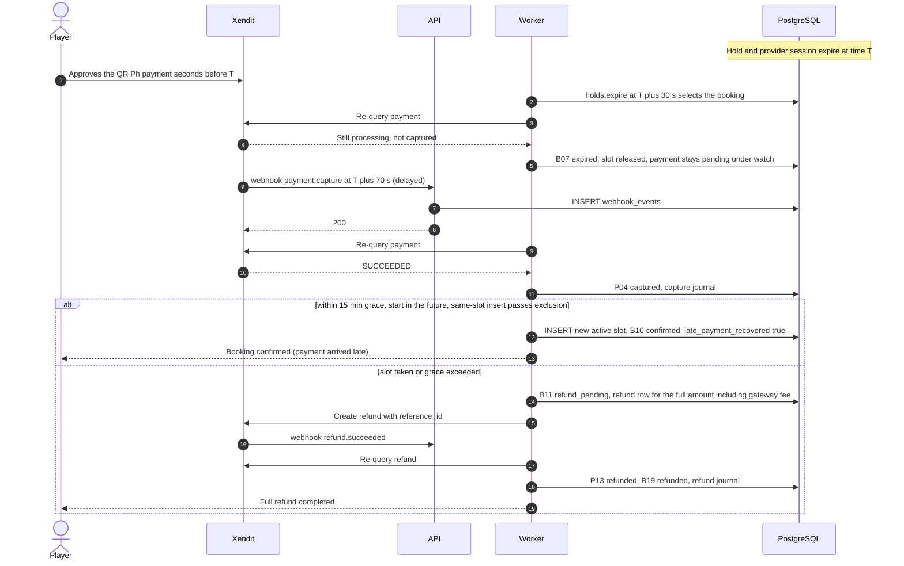
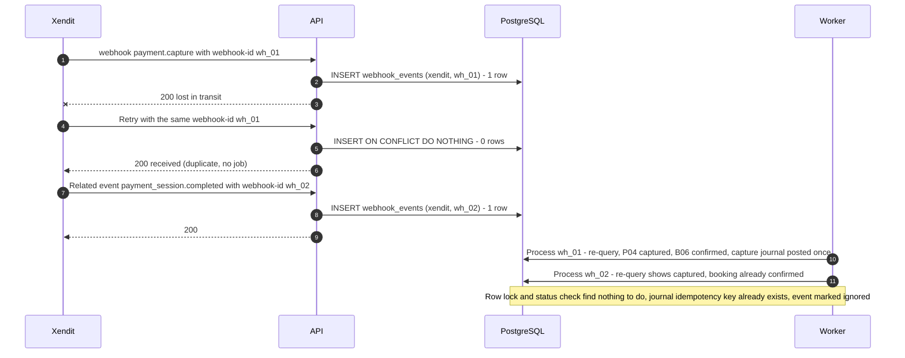
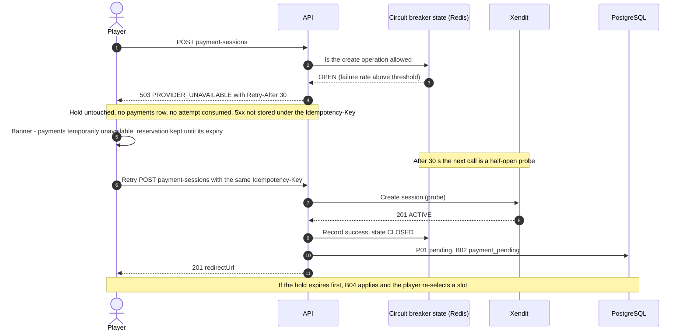

# 08 — Payment State Machine

| Item | Value |
|---|---|
| Document | 08 of 23, CourtKo design package |
| Scope | Payment statuses and transitions, provider mapping, webhook pipeline, idempotency toward the provider, reconciliation, outage handling, refund/dispute interplay, key sequences |
| Provider | Xendit xenPlatform (first adapter, `packages/payments/xendit`) behind the `PaymentGateway` port; `packages/payments/mock` for dev/test and the interactive demo |
| Account status | **No Xendit account exists yet.** API keys, callback tokens, sub-account ids, split-rule ids, channel availability and fee rates are PLACEHOLDERS until contracting |
| Related | [07 Booking state machine](07-booking-state-machine.md), [09 Refund and payout flow](09-refund-and-payout-flow.md), [11 System architecture](11-system-architecture.md), [13 API design](13-api-design.md), [`schema.sql`](schema.sql) |

> **Verification status.** Provider behaviour in this document was checked on 2026-09-30 against public Xendit
> documentation search results (direct page fetching was unavailable to the author). Every Xendit object name, status,
> event name, header and limit is marked **to be verified against current Xendit API docs** and must be confirmed in
> the Xendit test environment before build step 8 (payment integration). Source URLs are listed in §11.

## 1. Principles

1. **Never mark paid from a redirect.** The browser return URL is display-only. Money states are entered only by the
   worker (`system` DB scope) after an authoritative server-side re-query of the provider. The guard trigger
   `app.tg_guard_payment_transition()` rejects `authorized`, `captured`, `partially_refunded`, `refunded`, `disputed`
   and `chargeback` in any other scope.
2. **Webhooks are untrusted notifications.** Xendit authenticates webhooks with a shared per-account token
   (`x-callback-token`), not a payload signature. A valid token proves the sender knows the token; it does not prove the
   payload is current or untampered in transit beyond TLS. The payload is only used to locate the object to re-query.
3. **Hosted collection only.** Card data, CVV, OTPs, wallet PINs and bank credentials are entered on Xendit-hosted
   pages or SDK components. CourtKo stores provider tokens and masked metadata (brand, last four, expiry month/year)
   only (PCI DSS SAQ A target, doc 14).
4. **Minor units everywhere.** Internal amounts are `bigint` centavos with `currency char(3)`. The adapter converts to
   the provider's representation at the boundary (Xendit PHP amounts are decimal major units, to be verified), using
   integer arithmetic only.
5. **The ledger is the financial record.** `payments.status` is an operational status. Money is represented by
   balanced, append-only journals (doc 09 §10).
6. **Idempotent in both directions.** Inbound: `webhook_events UNIQUE(provider, provider_event_id)`, row locks and
   journal idempotency keys. Outbound: a stable provider idempotency key per attempt (§5).

## 2. Statuses and transitions

### 2.1 Status catalog

| Status | Meaning | Money captured | Terminal |
|---|---|---|---|
| `created` | Attempt row written; provider call not yet confirmed | No | No |
| `pending` | Provider session or payment request exists; awaiting customer action (redirect, QR scan, 3DS) or provider processing | No | No |
| `authorized` | Card authorized, not captured (manual-capture mode only; MVP uses automatic capture, so this state is transient or unused) | No (funds reserved) | No |
| `captured` | Funds captured; verified by provider re-query | Yes | No |
| `failed` | Provider reported a failure, or creation failed definitively | No | Yes, unless P22 |
| `expired` | Session or request expired without capture | No | Yes, unless late capture (P20) |
| `cancelled` | Session/request cancelled (customer or CourtKo) | No | Yes, unless P21 |
| `partially_refunded` | Captured, with refunds < amount | Yes (net) | No |
| `refunded` | Refunds = amount | Net zero | Yes |
| `disputed` | Chargeback/dispute open at the card network or issuer | Contested | No |
| `chargeback` | Dispute lost; funds reversed to the cardholder | Reversed | Yes |

### 2.2 State diagram



The brief's rule "dispute won returns to `captured`" is P17. P18 is a derived rule: if refunds had already been paid
out before the dispute, the payment returns to `partially_refunded` so that `refunded_minor` stays truthful.

### 2.3 Transition table

"Evidence" is the provider state that must be observed **by re-query**, never taken from a webhook payload alone.

| Code | From → To | Evidence / trigger | Actor (DB scope) | Guards | Side effects |
|---|---|---|---|---|---|
| P01 | `created` → `pending` | Provider create call returned a session/request id | API (`player` / `business`) | Response matches our `reference_id` | Store provider ids, `checkout_url`, `expires_at`; booking B02 |
| P02 | `created` → `failed` | Non-retryable 4xx on create, or create retries exhausted | API / worker | Not retryable | Booking B05 (retry allowed) or B08 |
| P03 | `pending` → `authorized` | Status `AUTHORIZED` (manual capture only) | Worker (`system`) | Capture mode = manual | Outbox `payment.authorized`; no ledger (memo only) |
| P04 | `pending` → `captured` | Status `SUCCEEDED` | Worker (`system`) | Amount and currency = checkout total; account = business sub-account | Booking B06/B09/B10/B11; capture journal; commissions accrued; outbox `payment.captured` |
| P05 | `pending` → `failed` | Status `FAILED` | Worker | Failure code classified (§3.3) | Booking B05 (retryable) or B08 |
| P06 | `pending` → `expired` | Session/request `EXPIRED` | Worker | No capture on any attempt for the checkout | Booking B07 if not already expired |
| P07 | `pending` → `cancelled` | Session/request `CANCELED` (customer abandon, or CourtKo cancel before B03) | Worker / API | Not captured | Booking B05 |
| P08 | `authorized` → `captured` | Capture succeeded | Worker | As P04 | As P04 |
| P09 | `authorized` → `cancelled` | Void confirmed | Worker | Not captured | Booking B05/B08 |
| P10 | `authorized` → `expired` | Authorization expired | Worker | Not captured | Booking B07 |
| P11 | `authorized` → `failed` | Capture failed | Worker | Not captured | Booking B05/B08 |
| P12 | `captured` → `partially_refunded` | Refund `SUCCEEDED`, cumulative < amount | Worker | Refund row belongs to this payment | Refund journal; `refunded_minor` += amount; booking B19/B20 |
| P13 | `captured` → `refunded` | Refund `SUCCEEDED`, cumulative = amount | Worker | As P12 | As P12 |
| P14 | `partially_refunded` → `refunded` | Refund `SUCCEEDED`, cumulative = amount | Worker | As P12 | As P12 |
| P15 | `captured` → `disputed` | Dispute opened (provider notification, report or manual entry) | Worker | `disputes` row exists | Booking B23–B25 where allowed; refunds blocked; optional `dispute_adjustment` journal |
| P16 | `partially_refunded` → `disputed` | As P15 | Worker | As P15 | Booking status unchanged if already `partially_refunded` (dispute tracked on payment and `disputes`) |
| P17 | `disputed` → `captured` | Dispute won, `refunded_minor` = 0 | Worker | Dispute `won` | Booking B26/B27; `dispute_won` journal |
| P18 | `disputed` → `partially_refunded` | Dispute won, `refunded_minor` > 0 | Worker | Dispute `won` | As P17 |
| P19 | `disputed` → `chargeback` | Dispute lost | Worker | Dispute `lost` | Booking B28; `chargeback` journal; dispute fee |
| P20 | `expired` → `captured` | Status `SUCCEEDED` after we recorded expiry (race at expiry) | Worker | Re-query confirms capture | Booking B10 or B11 (late payment recovery) |
| P21 | `cancelled` → `captured` | Status `SUCCEEDED` after cancellation (race) | Worker | As P20 | As P20 |
| P22 | `failed` → `captured` | Provider corrected an earlier failure (reconciliation only) | Worker | Re-query + reconciliation exception recorded | As P20; P2 alert |

Refunds are **not** accepted while a payment is `disputed` (`409 CONFLICT`). A dispute reported on a fully `refunded`
payment is not a state transition; it becomes a `reconciliation_exceptions` row for manual review.

## 3. Mapping Xendit objects to internal statuses

**All rows in this section are to be verified against current Xendit API docs.** Xendit exposes several overlapping
products. CourtKo's default is **Payment Sessions** (hosted checkout, positioned by Xendit as the successor to
Invoices/Payment Links), with the **Payments API** (payment requests, `api-version: 2024-11-11`) used for re-query and
saved-token charges. Legacy **Invoices** are supported by the adapter only as a fallback.

### 3.1 Payment collection

| Xendit object | Xendit status or event | Internal `payments.status` | Notes |
|---|---|---|---|
| Payment Session | `ACTIVE` | `pending` | Returned on create; `payment_link_url` stored as `checkout_url` |
| Payment Session | `COMPLETED` / webhook `payment_session.completed` | No direct change: **re-query** the session's payment and map that | "Completed" is not treated as proof of capture |
| Payment Session | `EXPIRED` / webhook `payment_session.expired` | `expired` | Only if no attempt of the checkout is captured |
| Payment Session | `CANCELED` | `cancelled` | |
| Payment request / payment (Payments API) | `ACCEPTING_PAYMENTS`, `REQUIRES_ACTION` | `pending` | `REQUIRES_ACTION`: redirect, QR or 3DS pending |
| Payment request / payment | `AUTHORIZED` / webhook `payment.authorization` | `authorized` (manual capture), otherwise ignored until capture | MVP uses automatic capture |
| Payment request / payment | `SUCCEEDED` / webhook `payment.capture` (also documented as `payment.succeeded`; confirm which name applies) | `captured` | The only evidence accepted for P04/P08/P20–P22 |
| Payment request / payment | `FAILED` / webhook `payment.failure` | `failed` | `failure_code` classified per §3.3 |
| Payment request / payment | `EXPIRED` | `expired` | Race with a late capture is documented by Xendit ("Delayed webhooks") |
| Payment request / payment | `CANCELED` | `cancelled` | |
| Invoice (legacy fallback) | `PENDING` / `PAID` / `SETTLED` / `EXPIRED` | `pending` / `captured` / sets `provider_settled_at` / `expired` | `PAID` = paid but not yet in balance; `SETTLED` = in balance |
| Payment token (saved method) | `ACTIVE`, `PENDING`, `REQUIRES_ACTION`, `EXPIRED`, `CANCELED`, `FAILED` | `payment_method_tokens.status` `active` / `pending` / `pending` / `expired` / `revoked` / `failed` | Tokens hold masked metadata only |

### 3.2 Refunds, splits, settlement, payouts, disputes

| Xendit object | Status or event | Internal effect |
|---|---|---|
| Refund | `PENDING` | `refunds.status = 'processing'` |
| Refund | `SUCCEEDED` / `refund.succeeded` | `refunds.status = 'succeeded'` → P12/P13/P14 |
| Refund | `FAILED` / `refund.failed` (reasons include `INSUFFICIENT_BALANCE`, `ACCOUNT_ACCESS_BLOCKED`, `ACCOUNT_NOT_FOUND`, `DUPLICATE_ERROR`, `REFUND_FAILED`) | `refunds.status = 'failed'`; retry policy (doc 09 §4) |
| Refund | `CANCELLED` | `refunds.status = 'failed'`, `failure_code = 'CANCELLED'` |
| Split payment (per route) | Split status webhook `COMPLETED` / `FAILED` | `payments.split_status`. No journal: master and sub-account balances are both inside `platform:provider_clearing` (doc 09 §8.1). `FAILED` raises the `split_failed` reconciliation class |
| Transaction (Transactions API) | `settlement_status` `PENDING` / `EARLY_SETTLED` / `SETTLED` | `payments.provider_settled_at` (settlement-date report basis) |
| Transaction (Transactions API) | type `CHARGEBACK` | Dispute ingestion fallback (§9) |
| Payout (Payouts API v2) | `ACCEPTED`, `REQUESTED` | `payouts.status = 'processing'` |
| Payout | `SUCCEEDED` | `paid` |
| Payout | `FAILED`, `CANCELLED` | `failed` (`failure_code` e.g. `INSUFFICIENT_BALANCE`, `INVALID_DESTINATION`, `REJECTED_BY_CHANNEL`) |
| Payout | `REVERSED` (bank return after success) | `reversed` |
| Card dispute | No dedicated dispute webhook confirmed. Sources: dashboard notification, Transactions API `CHARGEBACK`, provider report, manual entry by `platform_finance` | `disputes` row → P15/P16; evidence deadline reportedly 30 days |

### 3.3 Failure-code classification (adapter table, provider-dependent)

| Class | Examples (to be verified per channel) | Booking effect |
|---|---|---|
| Retryable by the customer | Customer cancelled on the wallet page, insufficient wallet balance, OTP timeout, 3DS abandoned, issuer soft decline | B05 back to `slot_held` (attempt + 1) |
| Retryable by CourtKo | Provider 5xx, timeout, rate limit | Adapter retry with the same idempotency key; no attempt consumed |
| Non-retryable | Risk/fraud block, card reported lost/stolen, channel disabled for the merchant, account blocked | B08 `failed` |
| Unknown code | Anything unmapped | Treated as customer-retryable; P3 alert to extend the table |

## 4. Webhook processing pipeline



| Step | Rule | Rationale |
|---|---|---|
| 1. Edge | Path `/v1/webhooks/*` is the only public API path besides future native-app routes. WAF rate rule 600 requests / 5 min per IP (initial target). Optional IP allowlist: Xendit provides source IPs on request through support (to be verified) | Limits abuse before application code runs |
| 2. Authenticate | Compare `x-callback-token` with the live token from AWS Secrets Manager using `crypto.timingSafeEqual` over SHA-256 digests of both values (equal length, constant time). Accept `current` or `previous` during rotation. The header value is never logged or stored | Constant time avoids timing oracles; digesting equalizes length |
| 3. Parse | Strict Zod schema for the envelope only (event name, ids, `reference_id`, `business_id`/sub-account id). Unknown events are stored with `status = 'ignored'` | The rest of the payload is not trusted |
| 4. Deduplicate | `provider_event_id` from the `webhook-id` header (Xendit documents it for idempotency); `UNIQUE(provider, provider_event_id)` | Xendit retries up to 6 times with exponential backoff, and automatic retry can continue for 24 h |
| 5. Persist | `webhook_events` stores `headers_redacted` (no token), `payload_redacted` (customer name, email, phone and masked account fields removed) and `payload_sha256`, in the same transaction as the outbox row | Payload kept for audit without PII |
| 6. Acknowledge | Return `200 {"received": true}` immediately; no provider calls inline | Xendit marks a webhook failed after 30 s without response |
| 7. Verify | The worker re-queries the provider with the master key (and `for-user-id` for sub-account objects). Only the re-query result drives transitions. The payload's amount or status is never used | Authoritative server-side verification |
| 8. Transition | One transaction in lock order (doc 07 §5.3). Replays find the target state already reached and record `ignored` | Exactly-once effects on top of at-least-once delivery |
| 9. Failure | Re-query failures retry with backoff (12 attempts over about 24 h), then dead-letter with a P2 alert. `payments.reconcile` independently sweeps pending payments every 5 minutes | Webhook loss is survivable |

## 5. Idempotency toward the provider

| Operation | Idempotency mechanism (to be verified) | Key value | Retry behaviour |
|---|---|---|---|
| Create payment session / payment request | `Idempotency-Key` request header (documented as required on the Payments API create call) and `reference_id` | `pay_{payments.id}` (stored in `payments.provider_idempotency_key`); `reference_id = payments.id` | On timeout or 5xx: retry once with the same key; if still unknown, look up by `reference_id` before any new attempt. A new attempt (B05) always creates a new `payments` row and key |
| Create split rule | `reference_id` per route | `split_{payments.id}` | Created before the payment call; reused on retry |
| Refund | `reference_id` (plus `Idempotency-Key` if supported for refunds) | `rf_{refunds.id}` (`refunds.provider_idempotency_key`) | On unknown outcome, query by `reference_id` first |
| Payout / withdrawal | `idempotency-key` header (documented for Payouts API v2) | `po_{payouts.id}` (`payouts.provider_idempotency_key`) | Retry with the same key; `DUPLICATE_ERROR` means an earlier request with that key exists, so query it |
| Balance transfer, master ↔ sub-account (split repair, refund funding, receivable recovery; Option A) | Unique `reference` per transfer (a reused reference is rejected) | `tr_{sourceType}_{sourceId}`, e.g. `tr_refund_{refundId}` | Transfers execute immediately and cannot be cancelled; on an unknown outcome, look up by reference before retrying |

Xendit reportedly caches the result of a keyed request, including 4xx responses. A request that failed validation must
therefore be corrected under a **new** attempt and key, never replayed.

## 6. Creating a payment on xenPlatform (Option A, `provider_split`)

1. Resolve the business's active `payment_provider_accounts` row (sub-account id = `for-user-id`). If none is active,
   return `PAYMENT_METHOD_UNAVAILABLE`. Suspended businesses cannot take new payments (doc 10 §11).
2. Compute the platform share from the locked quote, which is also the split-rule amount:
   `platform_share = platform_commission + customer_paid_gateway_fee` if xenPlatform fees are billed to the **master**
   account, or `platform_share = platform_commission` if fees are deducted from the **sub-account** (Xendit's default
   direct deduction). Both configurations leave the venue with `venue_net`. Canonical example: ₱415.00 paid → sub-account
   fee ₱15.00 deducted → split ₱20.00 to master → venue keeps ₱380.00.
3. Create a flat-amount split rule (`POST /split_rules`, currency `PHP`, one route to the master account). Xendit
   calculates the split from the amount **after transaction fees**, and the split must leave enough for the fees, or it
   fails at settlement (to be verified). Per-payment rules keep commission exact when it is based on the booking base
   rather than on the total.
4. Create the Payment Session with headers `for-user-id`, `with-split-rule` (support on Payment Sessions to be
   verified; the Payments API supports it) and `Idempotency-Key`. Body (illustrative, field names to be verified):

```json
{
  "reference_id": "0190f5b1-3c2d-7e4f-8a9b-1c2d3e4f5a6b",
  "session_type": "PAY",
  "mode": "PAYMENT_LINK",
  "currency": "PHP",
  "amount": 415.00,
  "country": "PH",
  "expires_at": "2026-10-03T10:10:00Z",
  "allowed_payment_channels": ["QRPH"],
  "success_return_url": "https://app.courtko.ph/app/checkout/0190f5b0-9a8b-7c6d-8e5f-4a3b2c1d0e9f?result=return",
  "cancel_return_url": "https://app.courtko.ph/app/checkout/0190f5b0-9a8b-7c6d-8e5f-4a3b2c1d0e9f?result=cancel",
  "metadata": { "checkout_id": "0190f5b0-9a8b-7c6d-8e5f-4a3b2c1d0e9f", "business_id": "0190f59e-1111-7aaa-8bbb-222233334444" }
}
```

5. Settlement and fees: xenPlatform may charge an in-house transfer fee on inter-account movements (reported as 0.5%,
   capped at ₱35 per transfer) and a sub-account activity fee. Whether split routes incur these is **provider-dependent
   and must be confirmed**. Any fee CourtKo bears is recorded as `platform:gateway_fee_expense` at reconciliation.
6. Option B (`platform_payout`) omits `for-user-id` and the split rule: funds land in the master account and venues are
   paid by `settlements.generate` and payouts (doc 09 §8.3). Option B is disabled by default pending legal review
   (possible BSP Operator of Payment Systems registration under RA 11127).

## 7. Reconciliation

### 7.1 Pending sweep: `payments.reconcile`, every 5 minutes

| Selection | Action |
|---|---|
| `payments.status IN ('created','pending','authorized')` and `updated_at` older than 300 s | Re-query; apply P01–P11; B-transitions as in doc 07 |
| Payments of bookings `expired` within the last 15 min (late-webhook grace) | Re-query; a capture triggers B10/B11 |
| `captured` payments whose checkout is not `paid` and has no refund (I6) | Re-run the confirmation handler (auto-heal); P1 alert if still inconsistent after 15 min |
| `refunds` in `approved` / `processing` / `failed` (retry-eligible) | Delegated to `refunds.sync` |
| `payouts` in `scheduled` / `processing` | Delegated to `payouts.sync` |

Each run writes a `reconciliation_runs` row (`run_type = 'pending_sweep'`) with counts in `stats`.

### 7.2 Daily provider match: 02:00 Asia/Manila, previous local day

1. For the master account and each active sub-account (`for-user-id`), fetch the Transactions API list (types
   `PAYMENT`, `REFUND`, `CHARGEBACK`, `TRANSFER_IN`/`TRANSFER_OUT`, `WITHDRAWAL`/`DISBURSEMENT`, with fees and settlement
   status) and/or generate the Report API balance/transaction report. Store the raw file as an `uploads` row (S3
   `reports` bucket), referenced by `reconciliation_runs.report_upload_id`.
2. Match provider rows to internal rows by `reference_id` (= internal id), then by provider id.
3. Compare amount, currency, status, fee and settlement status. Record each mismatch in
   `reconciliation_exceptions` with its class.
4. Post fee journals: the actual provider fee (`provider_fee` journal), and any difference from the quoted fee
   (`fee_variance` journal to `platform:gateway_fee_variance`).
5. Publish the SuperAdmin reconciliation report (`/admin/transactions` → Reconciliation). A run with open P1 exceptions
   blocks settlement finalization for the affected businesses.

### 7.3 Mismatch classes

| Class (`recon_exception_class`) | Example | Auto-heal | Action / severity |
|---|---|---|---|
| `missing_internal` | Provider payment whose `reference_id` matches no internal row, e.g. a lost create response | Yes, if `reference_id` resolves to a `payments.id`: attach ids, then transition | Otherwise P2: investigate dashboard-created charges |
| `missing_provider` | Internal `captured` payment absent from the provider report | No | Re-check next run (`settlement_timing`); P1 if still missing |
| `status_mismatch` | Provider `SUCCEEDED`, internal `pending`/`expired`/`cancelled` | Yes: forward transition (P04/P20/P21) + B-transitions | Log. Reverse direction (provider failed, internal captured): never auto-downgrade, P1 |
| `amount_mismatch` / `currency_mismatch` | Captured amount ≠ checkout total | No | P1; freeze the business's settlement lines |
| `fee_variance` | Actual fee ₱15.30 vs quoted ₱15.00 | Yes, if within ₱1.00 or 1%: `fee_variance` journal | Above threshold: P3 review of `fee_schedules` |
| `duplicate_capture` | Two captured payments for one checkout (e.g., a late capture after a retry) | Yes: automatic full refund of the later payment (`refund_trigger = 'duplicate_payment'`, platform absorbs non-returned fees) | P3 notice |
| `orphan_refund` | Provider refund without an internal refund row (dashboard refund) | No | P2; create the refund record from provider data after review |
| `split_failed` | Split route `FAILED`; the platform share stayed in the venue sub-account | Yes: balance transfer of the platform share from sub-account to master (`reference = tr_{paymentId}`); no journal (both balances are inside `platform:provider_clearing`) | P2 if the transfer fails. If the venue withdraws first, its payable goes negative and is recovered per doc 09 §5 |
| `payout_mismatch` | Payout status or amount differs | Forward status only | Amount difference: P1 |
| `settlement_timing` | Captured but not settled beyond the expected window | n/a | P3 informational |

Auto-heal rules: forward, provider-verified transitions only. Never delete or edit ledger lines (corrections are
reversing journals). Every auto-heal writes `reconciliation_exceptions.auto_heal_action` and an audit row.

## 8. Provider outage handling

| Concern | Design (initial targets, to be tuned with load tests) |
|---|---|
| Timeouts | Connect 3 s, response 10 s. Reads retry twice with jitter; creates retry once on timeout, with the same idempotency key |
| Circuit breaker | Per operation group (`create`, `query`, `refund`, `payout`). Opens at ≥ 50% failures over ≥ 20 calls in 60 s, or 5 consecutive timeouts. Stays open 30 s, then half-open probes 1 call per 10 s. State in Redis, shared across tasks |
| Checkout while open | `POST .../payment-sessions` returns `503 PROVIDER_UNAVAILABLE` with `Retry-After`. No `payments` row, no attempt consumed, hold neither extended nor released. UI: "Payments are temporarily unavailable. Your reservation is kept until 6:10 PM." |
| Discovery and holds | Unaffected. Optional degraded banner behind feature flag `payments.degraded_banner` |
| In-flight payments | Xendit retries webhooks for up to 24 h. Reconcile resumes when the breaker half-opens. Late payment recovery (B10/B11) resolves captures after expiry |
| Refunds and payouts | Queued (`approved` / `scheduled`); `refunds.sync` and `payouts.sync` resume automatically; customers see "processing" |
| Alerting | Breaker open > 5 min: P1 page. Webhook 4xx/5xx spike: P2. Reconcile lag > 30 min: P2 (doc 22) |

## 9. Refunds, disputes and chargebacks: status interplay

| Event | `refunds.status` | `payments.status` | `bookings.status` | `disputes.status` |
|---|---|---|---|---|
| Cancellation within policy (refund > 0) | `approved` (auto) or `pending_approval` | unchanged | `refund_pending` (B18) | n/a |
| Refund submitted | `processing` | unchanged | `refund_pending` | n/a |
| Refund succeeded, partial | `succeeded` | `partially_refunded` (P12) | `refunded` or `partially_refunded` by entitlement (B19/B20) | n/a |
| Refund succeeded, cumulative = amount | `succeeded` | `refunded` (P13/P14) | `refunded` | n/a |
| Refund failed | `failed` (retry schedule, doc 09 §4) | unchanged | stays `refund_pending`; alert after final retry | n/a |
| Dispute opened on a captured payment | new refunds rejected; `approved` refunds held | `disputed` (P15) | `disputed` (B23–B25) if `confirmed`/`checked_in`/`completed`; otherwise unchanged | `open` |
| Evidence submitted | n/a | `disputed` | `disputed` | `evidence_submitted` |
| Dispute won | held refunds released | `captured` (P17) or `partially_refunded` (P18) | restored (B26/B27) | `won` |
| Dispute lost | held refunds cancelled (funds already returned) | `chargeback` (P19) | `refunded` (B28) | `lost` |

**Dispute ingestion (provider-dependent).** Card chargebacks can reportedly be raised up to about 6 months after
purchase and must be answered within about 30 days. Xendit's pricing policy states a USD 25 chargeback dispute fee
from 1 October 2026, regardless of outcome (to be verified against the signed contract). Until a dispute webhook is
confirmed, disputes enter through the daily Transactions API sweep (`CHARGEBACK`), dashboard notifications forwarded to
`platform_finance`, or manual entry (`platform.disputes.manage`). All three create the `disputes` row, and the worker
applies the transition.

## 10. Sequences

### 10.1 E-wallet happy path (GCash through a Payment Session)



### 10.2 Card payment with 3-D Secure



### 10.3 Late webhook (payment completes at hold expiry)



### 10.4 Duplicate webhook



### 10.5 Provider temporarily unavailable



## 11. Sources (Xendit public documentation, retrieved via search on 2026-09-30)

| Topic | URLs |
|---|---|
| Payments API, statuses, webhooks, idempotency | [How Payments API work](https://docs.xendit.co/docs/how-payments-api-work), [Payment webhook notification](https://docs.xendit.co/apidocs/payment-webhook-notification), [Get payment request](https://docs.xendit.co/apidocs/get-payment-request), [Create payment](https://docs.xendit.co/apidocs/create-payment), [Create payment request](https://docs.xendit.co/apidocs/create-payment-request), [Error scenarios](https://docs.xendit.co/docs/error-scenarios), [Delayed webhooks](https://docs.xendit.co/docs/delayed-webhooks) |
| Payment Sessions | [Overview](https://docs.xendit.co/docs/payment-sessions-overview), [How payment sessions work](https://docs.xendit.co/docs/how-payment-sessions-work), [Create a session](https://docs.xendit.co/apidocs/create-session), [Get a session](https://docs.xendit.co/apidocs/get-session), [Migrate from Invoices](https://docs.xendit.co/docs/migrate-to-payment-session) |
| Invoices (legacy) | [PAID vs SETTLED](https://help.xendit.co/hc/en-us/articles/4410287394713-What-is-the-difference-between-the-PAID-and-SETTLED-status-on-my-invoice) |
| Webhook security and delivery | [Handling webhooks](https://docs.xendit.co/docs/handling-webhooks), [Validate webhooks](https://help.xendit.co/hc/en-us/articles/360038072991-How-to-validate-if-the-webhook-is-sent-from-Xendit), [Integration security](https://docs.xendit.co/docs/integration-security), [IP allowlist](https://docs.xendit.co/docs/ip-allowlist) |
| xenPlatform accounts, split rules, fees, transfers | [Split payments](https://docs.xendit.co/docs/split-payments), [Split rules how-to](https://help.xendit.co/hc/en-us/articles/10390264065561-How-Do-I-Use-Split-Payment-Feature-to-Charge-Splits-Commission-Fee), [for-user-id](https://help.xendit.co/hc/en-us/articles/10534695308185-How-Do-I-Use-for-user-id-Parameter-to-Do-Transaction-as-Master-Account-on-Behalf-of-my-Sub-Account), [Managed vs owned](https://help.xendit.co/hc/en-us/articles/6787784288665-What-is-the-difference-between-managed-and-owned-sub-accounts), [Create account](https://docs.xendit.co/apidocs/create-account), [xenPlatform fees](https://docs.xendit.co/docs/xenplatform-fees), [xenPlatform fee amounts](https://help.xendit.co/hc/en-us/articles/4413990486041-How-Much-is-XenPlatform-Fee), [Fees billed to master](https://help.xendit.co/hc/en-us/articles/4407834040601-Can-I-make-all-fee-Xendit-fee-and-XenPlatform-fee-billed-to-Master-account), [Transfers](https://docs.xendit.co/xenplatform/transfers) |
| Refunds | [Refund a payment request](https://docs.xendit.co/apidocs/refund-payment-request), [Refund webhook](https://docs.xendit.co/apidocs/refund-webhook-notification), [Refund guide](https://docs.xendit.co/docs/refund-payment-request), [QR refund rules](https://help.xendit.co/hc/en-us/articles/17209624920345-How-to-refund-a-QR-Code-transaction-using-API) |
| Payouts and withdrawals | [Payouts](https://docs.xendit.co/docs/integration-payouts), [Payout status lifecycle](https://docs.xendit.co/docs/payout-status-lifecycle), [Create a payout](https://docs.xendit.co/apidocs/create-payout), [Withdraw from OWNED sub-account](https://help.xendit.co/hc/en-us/articles/10797376149273-How-Do-I-Withdraw-My-Money-from-My-OWNED-Sub-Account) |
| Reconciliation | [List transactions](https://docs.xendit.co/apidocs/list-transactions), [Balance report](https://docs.xendit.co/docs/balance-report) |
| Disputes and pricing | [Disputes and chargebacks](https://docs.xendit.co/docs/handling-disputes-and-chargeback), [Manage chargebacks](https://docs.xendit.co/docs/managing-chargebacks), [Xendit pricing policy](https://help.xendit.co/hc/en-us/articles/59516240127129-Xendit-Pricing-Policy) |
| PH channels | [Available payment channels](https://docs.xendit.co/docs/available-payment-channels) |

## 12. Provider items to confirm before build step 8 (feeds doc 23)

| # | Item | Why it matters |
|---|---|---|
| 1 | Sub-account type: MANAGED vs OWNED for PH venues (KYC ownership, dashboard access, withdrawals, refunds on behalf) | Onboarding flow, payout model, liability (doc 09 §6) |
| 2 | `with-split-rule` support on Payment Sessions (vs Payments API only) | Determines hosted-checkout integration path |
| 3 | Whether split routes incur the xenPlatform in-house transfer fee; fee billing to master vs sub-account | Commission economics; `fee_variance` volume |
| 4 | Exact success event name (`payment.capture` vs `payment.succeeded`) and Payment Session event set | Webhook router |
| 5 | Payment Session `expires_at` minimum/maximum per channel | Hold extension rule (doc 07 §5.4) |
| 6 | Refund support, partial refunds, refund windows and fee return per PH channel (QR Ph, GCash, Maya, GrabPay, ShopeePay, cards, direct debit) | `payment_method_types` capabilities; refund calculations (doc 09 §3) |
| 7 | Dispute notification mechanism and chargeback fee | Dispute ingestion (§9) |
| 8 | Webhook source IP list availability | WAF allowlist |
| 9 | Idempotency header support on refunds | Refund retry safety (§5) |
| 10 | Token portability (a token saved at master level used for a sub-account payment) | Saved methods across venues |
