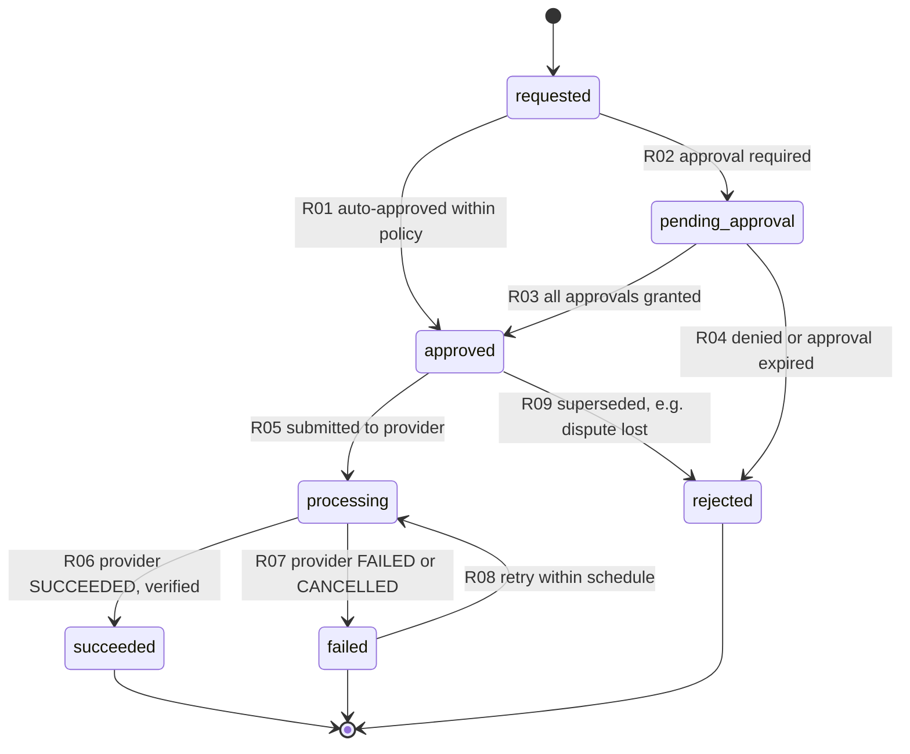
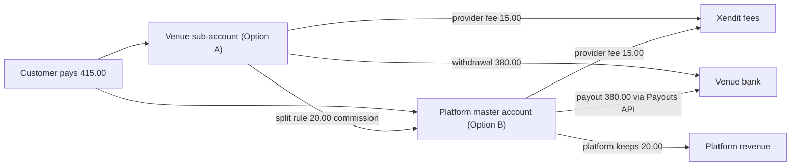

# 09 — Refund and Payout Flow

| Item | Value |
|---|---|
| Document | 09 of 23, CourtKo design package |
| Scope | Refund lifecycle and approvals, refund calculation with worked examples, refund failures, refunds after payout, chargebacks, manual adjustments, settlement and payouts (Option A and Option B), settlement statements, ledger journals |
| Related | [07 Booking state machine](07-booking-state-machine.md), [08 Payment state machine](08-payment-state-machine.md), [12 Database ERD](12-database-erd.md), [`schema.sql`](schema.sql) |
| Money conventions | Integer centavos (`bigint`, suffix `_minor`), `currency` on every row, rates in parts-per-million (5% = 50,000 ppm), half-up rounding once per computed component, BigInt intermediate math, no floating point |
| Status of numbers | All examples use **synthetic** data. Gateway fee values come from a **PLACEHOLDER** fee schedule (QR Ph: 0 ppm + 1,500 centavos fixed, passed through to the customer) until the Xendit contract is signed. Examples assume a non-VAT-registered venue; a VAT-registered venue with VAT-inclusive prices adds an informational "VAT (12%, included)" line and the amounts do not change |

Labels used in this document: **[provider-dependent]** means the behaviour must be confirmed with Xendit.
**[regulatory]** means it must be confirmed with legal or tax counsel before launch.

## 1. Principles

1. Refunds go to the **original payment method**. `refund_destination = 'platform_credit'` is disabled until it is
   legally and contractually cleared **[regulatory]**. `provider_payout_link` is the fallback only when the original
   method cannot be refunded (§4).
2. A gateway fee is withheld from a refund only when the accepted policy version disclosed it as non-refundable before
   payment **and** that is permitted for the method **[regulatory]**. Venue-initiated, court-unavailable, weather,
   system-failure, organizer cancellations and all unfulfillable bookings refund the fee in full. By default the
   platform absorbs it.
3. The refund amount is computed on the server from the **accepted policy version** stored on the booking
   (`bookings.cancellation_policy_version_id`), never from the client and never from the current policy.
4. Every refund is a `refunds` row. It is posted to the ledger only when the provider confirms success (a re-query
   after `refund.succeeded`), as a balanced journal that reverses commission proportionally by default.
5. The ledger is never edited. Corrections are reversing journals; manual adjustments need maker-checker approval (§7).
6. Venue balances can go negative. A negative `venue:{business_id}:payable` balance is a **receivable**, recovered from
   future settlements first (§5).

## 2. Refund lifecycle

### 2.1 Statuses

| Status | Meaning |
|---|---|
| `requested` | Created by a cancellation, a goodwill request or a system trigger |
| `pending_approval` | Waiting for one or more approvals (`approval_requests`) |
| `approved` | Cleared for submission; queued for `refunds.sync` |
| `processing` | Submitted to the provider (status `PENDING`) |
| `succeeded` | Provider confirmed (re-query); journal posted |
| `failed` | Provider rejected it, or retries are exhausted (§4) |
| `rejected` | Approval denied or expired, or superseded (for example by a lost chargeback) |

| Code | Transition | Actor | Guards / side effects |
|---|---|---|---|
| R01 | `requested` → `approved` | System | Matrix §2.2 says automatic; amounts computed per §3 |
| R02 | `requested` → `pending_approval` | System | `approval_requests` row(s) with `required_permission`; notify approvers |
| R03 | `pending_approval` → `approved` | Approver(s) | Approver ≠ requester (CHECK `approval_requests_four_eyes`); MFA step-up (`refunds.approve` and `platform.refunds.approve` require MFA) |
| R04 | `pending_approval` → `rejected` | Approver / system | Reason required; approvals expire after 72 h. The booking stays in its current status; if the refund was a policy entitlement, a P2 alert fires (entitlements are not discretionary) |
| R05 | `approved` → `processing` | Worker (`refunds.sync`) | Payment not `disputed`; provider refund created with `reference_id` = `refunds.id` and idempotency key `rf_{refunds.id}`. Option A: the platform share is first moved from master to sub-account (§8.2) |
| R06 | `processing` → `succeeded` | Worker | Re-query `SUCCEEDED`; refund journal (§10); payment P12/P13/P14; booking B19/B20; notify customer and venue |
| R07 | `processing` → `failed` | Worker | Failure code recorded; retry schedule §4 |
| R08 | `failed` → `processing` | Worker / `platform_finance` | Retry budget left, or corrected funding |
| R09 | `approved` → `rejected` | System | Dispute opened or lost on the payment; funds already returned by the network |

### 2.2 Approval matrix

The threshold is ₱5,000.00 (`refunds.platform_approval_threshold_minor` = 500,000). "After payout" means the venue's
funds for the payment were already withdrawn or paid out (`refunds.after_payout = true`).

| Trigger (`refund_trigger`) | Initiated by | ≤ ₱5,000.00 and before payout | > ₱5,000.00 or after payout |
|---|---|---|---|
| `player_cancellation` (within the accepted policy) | Player | Automatic | + `platform.refunds.approve` |
| `venue_cancellation`, `court_unavailable`, `weather` | Staff with `bookings.cancel` (MFA step-up), or system for weather/court incidents | Automatic (the cancel action is the authorization) | + `platform.refunds.approve` |
| `event_cancellation` | Staff with `events.manage` | Automatic | + `platform.refunds.approve` |
| `product_cancellation` | Player (before `preparing`) or staff with `orders.fulfill` | Automatic | + `platform.refunds.approve` |
| `reschedule_difference` | Player or staff (`bookings.reschedule`) | Automatic | + `platform.refunds.approve` |
| `goodwill` (outside policy) | Staff with `refunds.request` | `refunds.approve` by a different member | `refunds.approve` + `platform.refunds.approve` |
| `system_failure` | `platform_finance` declares an incident | `platform.refunds.approve` | `platform.refunds.approve` |
| `restriction_unfulfillable`, `late_payment_unfulfillable`, `duplicate_payment` | System | Automatic | + `platform.refunds.approve`, flagged urgent (target decision within 4 business hours) |

Rules: an approver must hold the permission for the refund's business (and venue, if the assignment is
venue-scoped). Support mode can never request or approve refunds (doc 10 §8). Every request, approval, rejection and
submission is written to `audit.audit_logs`.

## 3. Refund calculation

### 3.1 Rules (implemented in `packages/domain/refunds`)

Definitions per refunded item (`checkout_items` row): `paid` = gross − venue-funded discount − platform-funded discount
+ exclusive tax. `venue_credit` = gross − venue-funded discount (what the venue payable was credited at capture).
`tier_ppm` = the refundable share from the accepted policy tier or trigger (1,000,000 = 100%).

| Rule | Formula / behaviour |
|---|---|
| C1 Entitlement | `entitled = round_half_up(paid × tier_ppm ÷ 1,000,000)` |
| C2 Gateway fee, player-initiated | `0` if the accepted version has `gateway_fee_refundable_on_player_cancel = false` (disclosed before payment); otherwise as C3 |
| C3 Gateway fee, venue/platform/organizer fault or unfulfillable | Whole checkout refunded: the full customer-paid fee. One item of several: `round_half_up(customer_fee × refunded_paid ÷ checkout_paid)` |
| C4 Commission reversal (default: proportional) | `round_half_up(item_commission × tier_ppm ÷ 1,000,000)`. "Retain commission on refunds" is a possible future agreement option, off by default |
| C5 Venue payable reduction | `round_half_up(venue_credit × tier_ppm ÷ 1,000,000)` |
| C6 Platform-funded discount reversal | Derived, not rounded: `C5 − C1` (the platform recovers its subsidy share) |
| C7 Shares | `venue_share = C5 − C4`; `platform_share = amount − venue_share` (may be negative when a platform promo is reversed); CHECK `refunds_shares_sum` |
| C8 Amount | `amount = C1 + fee refund (C2/C3)`; components stored in `refunds.*_refund_minor`; CHECK `refunds_components_sum` |
| C9 Caps | Cumulative refunds ≤ item `paid` (`checkout_items_refund_bound`) and ≤ payment amount (`payments_refund_bound`) |
| C10 Provider fee on refunds **[provider-dependent]** | Xendit reportedly does not return its original fee and VAT for QR refunds that are partial or made more than 24 h after payment. Any fee not returned is borne by the platform (`platform:gateway_fee_expense` stays). A returned fee is posted at reconciliation |

Rounding is applied once per computed component (C1, C3, C4, C5). Derived components (C6, C7) are computed by
subtraction, so every refund journal balances exactly.

### 3.2 Worked examples (synthetic)

Canonical checkout (used unless stated): base ₱400.00 (40,000), gateway fee ₱15.00 (1,500) paid by the customer,
customer total ₱415.00 (41,500), commission 5% = ₱20.00 (2,000), venue net ₱380.00 (38,000).

**E1 — Player cancels ≥ 24 h before start (Standard, 100% of base, fee non-refundable as disclosed)**

| Component | Calculation | Centavos |
|---|---|---:|
| Entitlement (C1) | 40,000 × 1,000,000 ÷ 1,000,000 | 40,000 |
| Gateway fee refund (C2) | disclosed non-refundable | 0 |
| **Refund amount** | | **40,000** |
| Commission reversal (C4) | 2,000 × 100% | 2,000 |
| Venue payable reduction (C5) | 40,000 × 100% | 40,000 |
| Venue share (C7) | 40,000 − 2,000 | 38,000 |
| Platform share (C7) | 40,000 − 38,000 | 2,000 |

Result: booking `refunded` (full entitlement), payment `partially_refunded` (40,000 of 41,500). The platform keeps the
₱15.00 gateway fee recovery, which offsets the provider fee it paid.

**E2 — Player cancels 6–24 h before start (Standard, 50%)**

| Component | Calculation | Centavos |
|---|---|---:|
| Entitlement | 40,000 × 500,000 ÷ 1,000,000 | 20,000 |
| Gateway fee refund | non-refundable | 0 |
| **Refund amount** | | **20,000** |
| Commission reversal | 2,000 × 50% | 1,000 |
| Venue share | 20,000 − 1,000 | 19,000 |
| Platform share | 20,000 − 19,000 | 1,000 |

Result: booking and payment `partially_refunded`. The venue keeps ₱190.00 net and the platform keeps ₱10.00 commission.

**E3 — One item of a combined order (venue cancels a paddle rental add-on)**

Checkout: court booking 40,000 (commissionable) + 2 × bottled water at 5,000 = 10,000 + 1 × paddle rental 15,000
(products are not commissionable under the default agreement). Items paid = 65,000; fee 1,500; total 66,500; commission
2,000; venue net 63,000. The venue cannot supply the paddle (`product_cancellation`, venue fault).

| Component | Calculation | Centavos |
|---|---|---:|
| Entitlement | 15,000 × 100% | 15,000 |
| Gateway fee refund (C3, proportional) | round_half_up(1,500 × 15,000 ÷ 65,000) = round_half_up(346.15) | 346 |
| **Refund amount** | | **15,346** |
| Commission reversal | item not commissionable | 0 |
| Venue share | 15,000 − 0 | 15,000 |
| Platform share | 15,346 − 15,000 | 346 |

Result: order `partially_refunded` (`order_items.refunded_quantity = 1`), payment `partially_refunded`, booking
unchanged (`confirmed`).

**E4 — Venue-initiated full refund (court lighting failure, `venue_cancellation`)**

| Component | Calculation | Centavos |
|---|---|---:|
| Entitlement | 40,000 × 100% | 40,000 |
| Gateway fee refund (C3, whole checkout) | full | 1,500 |
| **Refund amount** | | **41,500** |
| Commission reversal | 2,000 × 100% | 2,000 |
| Venue share | 40,000 − 2,000 | 38,000 |
| Platform share | 41,500 − 38,000 (commission 2,000 + fee 1,500) | 3,500 |

Result: booking and payment `refunded`. The platform absorbs the ₱15.00 fee unless the provider returns its own fee
(C10). A future agreement may assign venue-initiated fee refunds to the venue **[commercial decision]**.

**E5 — Event cancellation by the organizer (weather)**

Open-play registration ₱250.00 (25,000); fee 1,500; total 26,500. This business's agreement has
`applies_to_events = true`, so commission = 5% × 25,000 = 1,250.

| Component | Calculation | Centavos |
|---|---|---:|
| Entitlement | 25,000 × 100% | 25,000 |
| Gateway fee refund | full (organizer cancellation) | 1,500 |
| **Refund amount** | | **26,500** |
| Commission reversal | 1,250 × 100% | 1,250 |
| Venue share | 25,000 − 1,250 | 23,750 |
| Platform share | 26,500 − 23,750 | 2,750 |

Result: `event_registrations.status = 'refunded'`, payment `refunded`. Waitlist offers are not issued for a cancelled event.

**E6 — Product order cancelled by the player before preparation**

Standalone pickup order: 2 × outdoor balls 3-pack at 36,000 = 72,000; fee 1,500; total 73,500; not commissionable.

| Component | Calculation | Centavos |
|---|---|---:|
| Entitlement | 72,000 × 100% (cancelled before `preparing`) | 72,000 |
| Gateway fee refund | player-initiated, disclosed non-refundable | 0 |
| **Refund amount** | | **72,000** |
| Venue share / platform share | | 72,000 / 0 |

Result: order `refunded`, payment `partially_refunded` (72,000 of 73,500); `inventory_movements` type `return`,
quantity +2. After `ready_for_pickup`, product refunds are goodwill only.

**E7 — Partial refund with a platform-funded promo code**

Platform promo "CK50" (₱50.00 off, `funded_by = 'platform'`). Base 40,000; platform discount 5,000; customer pays
35,000 + 1,500 fee = 36,500. The commissionable base is not reduced by platform-funded discounts, so commission = 2,000.
The venue payable is credited 40,000 and the platform books 5,000 of promotions expense. The player cancels 6–24 h before start (50%).

| Component | Calculation | Centavos |
|---|---|---:|
| Entitlement (C1) | 35,000 × 50% | 17,500 |
| Gateway fee refund | non-refundable | 0 |
| **Refund amount** | | **17,500** |
| Commission reversal (C4) | 2,000 × 50% | 1,000 |
| Venue payable reduction (C5) | 40,000 × 50% | 20,000 |
| Platform discount reversal (C6) | 20,000 − 17,500 | 2,500 |
| Venue share | 20,000 − 1,000 | 19,000 |
| Platform share | 17,500 − 19,000 | −1,500 |

Check: after the refund the venue keeps 38,000 − 19,000 = 19,000 (exactly 50% of its net), and the platform bears half
the promo (2,500).

## 4. Refund failure handling

| Failure (Xendit reasons, to be verified) | Class | Automatic handling | Escalation |
|---|---|---|---|
| Provider 5xx, timeout, `REFUND_FAILED` without detail | Transient | `refunds.sync` retries with the same `reference_id` / idempotency key at +5 min, +30 min, +2 h, +12 h, +24 h (5 attempts) | After attempt 2: customer gets "refund delayed". After attempt 5: `failed`, P2 alert to `platform_finance` |
| `INSUFFICIENT_BALANCE` (Option A: sub-account balance too low) | Funding | Platform funds the shortfall with a master → sub-account transfer (`tr_refund_{refundId}`), up to `refunds.auto_fund_limit_minor` (proposed ₱20,000.00), then retries; the venue receivable follows from the journal (§5) | Above the limit: `platform.refunds.approve` decision |
| `DUPLICATE_ERROR` | Already exists | Query by `reference_id` and adopt the existing provider refund | None |
| `ACCOUNT_ACCESS_BLOCKED`, `ACCOUNT_NOT_FOUND` (customer wallet closed or blocked), channel without refund support, refund window elapsed (cards reportedly up to 365 days, some wallets 90 days) **[provider-dependent]** | Permanent | Mark `failed`; create a replacement refund with `refund_destination = 'provider_payout_link'`. The customer receives a provider-hosted payout link to enter their own bank or e-wallet destination (CourtKo never stores it) | Needs `platform.refunds.approve`; audited |
| Payment `disputed` | Blocked | Refund held (`approved`, not submitted) until the dispute resolves (R09 if lost) | `platform_finance` |

A failed refund posts **no** journal; only success moves money in the ledger. The booking stays `refund_pending`
until a refund succeeds. SLO (initial target): 95% of approved refunds submitted to the provider within 1 hour.
Settlement of the refund to the customer's account depends on the channel **[provider-dependent]**.

## 5. Refund after payout

When the venue's share has already left the provider (Option A withdrawal or Option B payout), a refund still debits
`venue:{business_id}:payable`. The balance goes negative and becomes a receivable.

| Step | Event | Venue payable balance (centavos) |
|---|---|---:|
| 1 | Capture of the canonical booking (J1) | +38,000 |
| 2 | Payout / withdrawal of 38,000 (J6) | 0 |
| 3 | Venue-initiated full refund of 41,500 after payout (J4) | −38,000 (receivable) |
| 4 | Next statement: opening −38,000, new net credits +50,000 | +12,000 → payout 12,000 |

Recovery order (policy; recorded in the commercial agreement **[regulatory]** for the right of set-off):

1. **Offset** against future settlements (automatic: `settlements.generate` carries the negative closing balance into
   the next statement's `opening_balance_minor`; payouts run only on a positive `net_payable_minor`).
2. **Option A, OWNED sub-accounts:** the platform initiates withdrawals, so it withdraws only the positive payable balance.
   **Option A, MANAGED sub-accounts:** the venue controls withdrawals. The master pulls the receivable from the
   sub-account balance by transfer once funds are available (the right to transfer from MANAGED sub-accounts is to be
   verified) **[provider-dependent]**. Transfers between master and sub-accounts are internal to `platform:provider_clearing`
   and post no journal (§8.1).
3. **Collections** after 14 days without sufficient offset: request payment through a provider payment link to the
   master account. Receipt posts a `receivable_offset` journal (Dr `platform:provider_clearing` / Cr venue payable,
   entry type `venue_payable`).
4. **Escalation** at 30 / 60 / 90 days: reminders, payout hold, suspension of new bookings under the agreement
   (`platform.businesses.suspend`, maker-checker), then legal collection. A write-off is a `manual_adjustment` journal
   (Dr `platform:adjustments` / Cr venue payable), approved per §7.

Controls: after-payout refunds always require `platform.refunds.approve` (§2.2). Under Option B, fronting a refund uses
master-account funds; the platform must keep an operating float of its own funds at least equal to outstanding venue
receivables, so that other venues' pending payouts are never used **[regulatory: trust/escrow accounting]**.

## 6. Chargebacks and disputes

### 6.1 Who bears what (configurable per commercial agreement; defaults shown)

| Dispute category (from network reason code) | Default liable party (`disputes.liability`) | Dispute fee borne by | Rationale |
|---|---|---|---|
| Service not provided, venue closed, quality of service | `venue` | Venue | The venue controls delivery |
| Customer disputes a no-refund outcome under the accepted policy | `venue` (platform supplies evidence: accepted policy version, timestamps, check-in data) | Venue | Policy is the venue's; evidence usually wins |
| Duplicate or incorrect charge caused by CourtKo systems | `platform` | Platform | Platform fault |
| Refund approved but not delivered | Party responsible for the failure (usually `platform`) | Same | Operational fault |
| Card fraud (card not present) | Per network liability shift: 3DS-authenticated transactions usually shift liability to the issuer. Otherwise `platform` (the platform chose the payment flow and risk controls) | Platform | **[provider-dependent]** |
| Mixed or unclear | `shared` (`liability_rule` records the split) | Split | Decided by `platform_finance` (`platform.disputes.manage`) |

Commission on a lost chargeback is reversed proportionally (the platform does not earn commission on reversed funds).
The dispute fee is reportedly USD 25 per card dispute from 1 October 2026, regardless of outcome (placeholder
₱1,450.00 in examples) **[provider-dependent]**.

### 6.2 Workflow

1. Ingest (webhook if available, daily Transactions API `CHARGEBACK` sweep, dashboard forward, or manual entry) →
   `disputes` row (`open`, `evidence_due_at`) → payment P15/P16 → booking B23–B25 where applicable.
2. Payout hold: the disputed amount is excluded from the venue's next payout (a statement line "Dispute hold", not a
   journal) until resolution.
3. Evidence pack assembled automatically: accepted policy version and disclosure hash, booking timeline
   (`booking_status_history`), check-in record, receipt, communications log. Uploads are stored as
   `upload_purpose = 'dispute_evidence'`. Submitted by `platform_finance` before `evidence_due_at` (reportedly about 30
   days) → `evidence_submitted`.
4. Ledger, depending on provider behaviour **[provider-dependent]**:
   - Provider debits funds only when the dispute is lost: nothing is posted at open; on loss, a `chargeback` journal (J5).
   - Provider debits funds at open: a `dispute_adjustment` journal at open, with the same lines as J5 and entry type
     `dispute_adjustment`. If won, a `dispute_won` journal reverses it exactly. If lost, nothing further is posted.
5. Resolution: won → P17/P18, B26/B27. Lost → P19, B28. The dispute fee journal is posted per §6.1 either way.

## 7. Manual adjustments (maker-checker)

| Aspect | Rule |
|---|---|
| Use cases | Goodwill credit to a venue (e.g. a platform outage), correcting a misposted fee, recovering an overpayment, write-off of an unrecoverable receivable, tax corrections |
| Who | Maker: platform user with `platform.payouts.manage`. Checker: a **different** platform user holding the same permission (`approval_requests.required_permission`); both MFA step-up. Venue staff cannot create ledger adjustments |
| Request content | `approval_requests.action = 'manual_adjustment'`; `payload` = the exact journal lines; `payload_sha256`; reason ≥ 10 characters; supporting upload |
| Execution | After approval the worker posts the payload verbatim as `journal_type = 'manual_adjustment'` with `approval_request_id` (required by CHECK `ledger_journals_manual_needs_approval`) and an idempotency key `adj_{approvalRequestId}` |
| Visibility | Appears on the venue statement as an "Adjustment" line with the reason; venue owner notified |
| Correction | Never edited; a `reversal` journal (`reverses_journal_id`) through the same approval flow |
| Audit | `approval.request`, `approval.decide`, `ledger.post_manual` rows in `audit.audit_logs` with before/after balances |

## 8. Funds model, settlement and payouts

### 8.1 Funds model

- `platform:provider_clearing` = all marketplace funds held at the provider: the master account **and** all venue
  sub-accounts.
- `venue:{business_id}:payable` = the venue's claim on those funds.
- A **payout** is money leaving the provider for a venue's bank: an Option A sub-account withdrawal or an Option B
  platform payout. It is the only event that discharges the venue payable against `provider_clearing`.
- Split routing and master ↔ sub-account transfers move money *inside* `provider_clearing` and post no journal. They
  are tracked operationally (`payments.split_status`, transfer references) and reconciled daily.

### 8.2 Option A — `provider_split` (default, MVP)

| Stage | Behaviour | CourtKo records |
|---|---|---|
| Capture | Payment created with `for-user-id` = venue sub-account and `with-split-rule` (doc 08 §6). Funds land in the sub-account; the Xendit fee is deducted from the receiving account by default **[provider-dependent]** | Capture journal (J1); `payments.split_status = 'pending'` |
| Split | Platform share routed to master when the transaction settles; one webhook per route **[provider-dependent]** | `split_status` `completed`/`failed`; `split_failed` recovery (doc 08 §7.3) |
| Balance | Venue funds sit in the venue's sub-account. MANAGED: visible to the venue in its own Xendit dashboard. OWNED: visible only through CourtKo `/biz/payouts` | Balance via Transactions/Balance API for statements |
| Withdrawal, MANAGED | Venue-initiated or Xendit auto-withdrawal to the venue's bank (Xendit holds the venue's KYC and bank details) | `payouts.sync` imports `WITHDRAWAL` transactions → `payouts` (`payout_kind = 'sub_account_withdrawal'`) + payout journal (J6) |
| Withdrawal, OWNED | OWNED sub-accounts reportedly cannot hold a withdrawal bank account in Xendit. The platform withdraws via the Payouts/Disbursement API with `for-user-id` to the venue's verified `payout_accounts` row, on schedule (default weekly on Tuesday, settled funds only, minimum ₱1,000.00) | `payouts` row (`scheduled` → `processing` → `paid`); payout journal on `paid` |
| Refunds | Executed against the sub-account. The platform share (commission reversal + refunded gateway fee) is first transferred master → sub-account (`tr_refund_{refundId}`) | Refund journal on success |
| Why default | The platform never holds venue funds, which avoids the RA 11127 operator-of-payment-system question in the MVP **[regulatory: confirm with counsel]** | |

### 8.3 Option B — `platform_payout` (supported by the ledger, disabled by default)

| Stage | Behaviour |
|---|---|
| Capture | Funds land in the master account (no `for-user-id`, no split rule) |
| Statement | `settlements.generate` (daily) builds the running statement per business. Weekly close: Monday to Sunday by **payment captured date** (Asia/Manila), finalized on Monday |
| Eligibility | Only provider-`SETTLED` funds (`payments.provider_settled_at` not null); excludes dispute holds and any business with open P1 reconciliation exceptions; minimum payout ₱1,000.00 (smaller balances carry forward) |
| Payout | Tuesday 10:00 Asia/Manila: `payouts` row `scheduled` → Payouts API v2 (`idempotency-key: po_{payoutId}`) → `processing` → `paid` (Xendit `SUCCEEDED`) |
| Payout account change | `finance.manage_payout_account` (Owner only, MFA, notification to all owners) → `approval_requests` (`payout_account_change`) → verification → 48 h cooling-off (`payout_accounts.payouts_paused_until`) |
| Failure | `FAILED` / `CANCELLED` (e.g. `INVALID_DESTINATION`, `REJECTED_BY_CHANNEL`): `failed` + J7 journal returning the amount to the venue payable; owner notified ("payout failed"); retry as a new `payouts` row (`retry_of_payout_id`) after the account is fixed |
| Reversal | `REVERSED` after `SUCCEEDED` (bank return, dormant account): `reversed` + J7b journal; same notification and retry path |
| Withholding | If applicable, a `withholding` journal (J9) at payout; BIR Form 2307 issued to the venue **[regulatory]** |

### 8.4 Regulatory and provider dependencies

| Item | Applies to | Dependency |
|---|---|---|
| Operator of Payment System registration (RA 11127 and BSP rules on OPS registration) | Option B (platform holds and settles funds for venues); possibly Option A depending on facts | **[regulatory]** confirm with counsel before enabling Option B |
| Trust/escrow segregation of venue funds; operating float for fronted refunds | Option B | **[regulatory]** |
| Withholding on e-marketplace remittances (BIR RR 16-2023: 1% of one-half of gross remittances, with a ₱500,000 annual threshold and a sworn-declaration exemption) | Whoever is the withholding agent: the platform (Option B) or possibly the provider as digital financial services provider (Option A) | **[regulatory]** tax counsel; `businesses.withholding_applicable`, `withholding_exempt_until` |
| Invoicing: VAT on platform commission, and invoices for the customer-paid gateway fee (EOPT Act, RA 11976) | Both | **[regulatory]** |
| Books and records retention (NIRC Sec. 235 as amended by RA 11976: 5 years from the filing deadline, longer while a case is pending) | Both | Ledger retained 10 years by default (doc 12 §4) **[regulatory]** |
| Merchant verification duties for e-marketplaces (Internet Transactions Act, RA 11967) | Onboarding | **[regulatory]** |
| MANAGED vs OWNED sub-accounts; withdrawal, transfer and refund capabilities per type | Option A | **[provider-dependent]** |

## 9. Settlement statement

### 9.1 Structure

A statement (`settlements` row + `settlement_lines`) is generated per business per period by `settlements.generate`
(daily running draft; finalized at period close). It is downloadable as PDF/CSV (`statement_upload_id`) from
`/biz/payouts` (`finance.view_payouts`) and `/admin/payouts`.

| Section | Content | Source |
|---|---|---|
| Header | Business display and legal name, TIN last four, settlement model, period (venue-local dates + UTC instants), currency, status (`draft`, `finalized`, `paid`, `partially_paid`, `carried_forward`, `void`), generated/finalized timestamps | `settlements`, `businesses` |
| Summary | Opening balance, gross sales, venue-funded discounts, platform commission (net of reversals), venue-borne gateway fees, refunds, chargebacks, adjustments, withholding, **net payable**, paid, **closing balance** | `settlements.*_minor` |
| Lines | One row per ledger effect with every date basis shown | `settlement_lines` → `financial_ledger_entries` |
| Holds | Dispute holds and payout-account cooling-off (informational; reduce the payable available for payout, not the balance) | `disputes`, `payout_accounts` |
| References | Provider payment/refund/payout references for each line; CourtKo booking codes | `payments`, `refunds`, `payouts` |

Formulas (CHECK constraints `settlements_net_formula`, `settlements_closing_formula`):
`net_payable = opening + gross_sales − venue_discounts − commission − venue_fee − refunds − chargebacks + adjustments − withholding`
and `closing = net_payable − paid`.

### 9.2 Date bases (never mixed)

| Line type | Inclusion date (determines the period) | Other dates shown for information |
|---|---|---|
| `booking`, `product`, `event`, `venue_discount`, `commission`, `venue_fee` | Payment date: `payment_captured_at` | Booking date (`booking_created_at`), play date (`play_starts_at`), settlement date (`provider_settled_at`) |
| `refund`, `commission_reversal` | Refund date: `refund_succeeded_at` | Payment date, play date |
| `chargeback`, `dispute_reversal` | Dispute resolution journal `effective_at` | Payment date |
| `adjustment`, `withholding` | Journal `effective_at` | Approval reference |
| `payout`, `failed_payout` | Payout date: `payout_paid_at` (failure: `failed_at`) | Settlement date of included funds |
| `carry_forward` | Period start | Previous statement id |

### 9.3 Sample statement (synthetic; Option B; venue "Kalye Pickle Club, Pasig", not VAT-registered)

Period: Monday 5 October to Sunday 11 October 2026 (Asia/Manila). Payout: Tuesday 13 October 2026.

| # | Line type | Description | Booking created | Play start | Payment captured | Refund succeeded | Amount (centavos) |
|---|---|---|---|---|---|---|---:|
| 1 | `booking` | K7M2Q9XA, Court 1, 1 h | 2026-10-04 | 2026-10-09 18:00 | 2026-10-05 | n/a | +40,000 |
| 2 | `commission` | 5% of 40,000 | | | 2026-10-05 | n/a | −2,000 |
| 3 | `booking` | P3R8W2ZD, Court 2, 1.5 h | 2026-10-06 | 2026-10-08 19:00 | 2026-10-06 | n/a | +60,000 |
| 4 | `commission` | 5% of 60,000 | | | 2026-10-06 | n/a | −3,000 |
| 5 | `booking` | M9T4H6QC, Court 1, 1 h | 2026-10-07 | 2026-10-10 07:00 | 2026-10-07 | n/a | +40,000 |
| 6 | `venue_discount` | Promo KALYE10 (venue-funded, 10%) | | | 2026-10-07 | n/a | −4,000 |
| 7 | `commission` | 5% of 36,000 | | | 2026-10-07 | n/a | −1,800 |
| 8 | `product` | Order W5N2H8KD, 2 × bottled water | 2026-10-07 | n/a | 2026-10-07 | n/a | +10,000 |
| 9 | `refund` | K7M2Q9XA cancelled 10 h before start (50%) | | | 2026-10-05 | 2026-10-09 | −20,000 |
| 10 | `commission_reversal` | 50% of line 2 | | | | 2026-10-09 | +1,000 |
| 11 | `adjustment` | Goodwill credit for the 8 Oct app outage (approval AR-2026-0042) | | | | n/a | +50,000 |
| 12 | `payout` | Payouts API, BDO ••••1234 | | | | n/a | −170,200 |

| Summary | Centavos |
|---|---:|
| Opening balance | 0 |
| Gross sales (lines 1, 3, 5, 8) | 150,000 |
| Venue-funded discounts (line 6) | −4,000 |
| Platform commission, net of reversals (lines 2, 4, 7, 10) | −5,800 |
| Gateway fees borne by venue | 0 |
| Refunds (line 9) | −20,000 |
| Chargebacks | 0 |
| Adjustments (line 11) | +50,000 |
| Withholding tax (below the RR 16-2023 threshold) | 0 |
| **Net payable** | **170,200** |
| Paid (line 12) | −170,200 |
| **Closing balance** | **0** |

Option A variant: line 12 becomes a sub-account withdrawal (`sub_account_withdrawal`, imported for MANAGED or executed
for OWNED sub-accounts), and the statement adds an informational "Balance in your Xendit sub-account" line.

## 10. Ledger journals

### 10.1 Chart of accounts

| Account | Type | Normal balance | Meaning |
|---|---|---|---|
| `platform:provider_clearing` | Asset | Debit | Marketplace funds at the provider (master + sub-accounts) |
| `platform:commission_revenue` | Revenue | Credit | Commission earned |
| `platform:gateway_fee_recovery` | Revenue | Credit | Gateway fee paid by customers (pass-through) |
| `platform:gateway_fee_expense` | Expense | Debit | Actual provider fees |
| `platform:gateway_fee_variance` | Expense | Debit | Actual minus quoted fee (either sign) |
| `platform:promotions_expense` | Expense | Debit | Platform-funded discounts |
| `platform:chargeback_losses` | Expense | Debit | Chargebacks and dispute fees borne by the platform |
| `platform:adjustments` | Expense | Debit | Approved manual adjustments and write-offs borne by the platform |
| `platform:withholding_tax_payable` | Liability | Credit | Tax withheld from venue remittances, owed to BIR |
| `venue:{business_id}:payable` | Liability | Credit | Owed to the venue; a negative balance is a receivable |

Every journal below balances (deferred trigger `trg_fle_journal_balanced`) and carries an idempotency key:
`capture:{paymentId}`, `fee:{paymentId}`, `fee_var:{paymentId}:{runId}`, `refund:{refundId}`, `payout:{payoutId}`,
`payout_failed:{payoutId}`, `payout_reversed:{payoutId}`, `chargeback:{disputeId}`, `dispute_fee:{disputeId}`,
`adj:{approvalRequestId}`, `wht:{payoutId}`, `recv:{paymentId}`, `reversal:{journalId}`.
Amounts are centavos.

### J1 — Capture (canonical; `journal_type = 'capture'`, effective at `captured_at`)

| # | Account | Entry type | Dr | Cr |
|---|---|---|---:|---:|
| 1 | `platform:provider_clearing` | `customer_charge` | 41,500 | |
| 2 | `venue:{business_id}:payable` | `booking_base` | | 40,000 |
| 3 | `venue:{business_id}:payable` | `platform_commission` | 2,000 | |
| 4 | `platform:commission_revenue` | `platform_commission` | | 2,000 |
| 5 | `platform:gateway_fee_recovery` | `gateway_fee` | | 1,500 |
| | **Total** | | **43,500** | **43,500** |

Venue payable after J1: 40,000 − 2,000 = 38,000 (venue net).

### J1b — Capture with a venue-funded discount (10%: base 40,000, discount 4,000, commissionable base 36,000)

| # | Account | Entry type | Dr | Cr |
|---|---|---|---:|---:|
| 1 | `platform:provider_clearing` | `customer_charge` | 37,500 | |
| 2 | `venue:{business_id}:payable` | `booking_base` | | 40,000 |
| 3 | `venue:{business_id}:payable` | `discount` | 4,000 | |
| 4 | `venue:{business_id}:payable` | `platform_commission` | 1,800 | |
| 5 | `platform:commission_revenue` | `platform_commission` | | 1,800 |
| 6 | `platform:gateway_fee_recovery` | `gateway_fee` | | 1,500 |
| | **Total** | | **43,300** | **43,300** |

Venue net = 40,000 − 4,000 − 1,800 = 34,200. The venue-funded discount is subtracted exactly once; it reduces the
commissionable base rather than being deducted again from the net (brief §4 note for doc 23).

### J1c — Capture with a platform-funded discount (E7: base 40,000, platform discount 5,000)

| # | Account | Entry type | Dr | Cr |
|---|---|---|---:|---:|
| 1 | `platform:provider_clearing` | `customer_charge` | 36,500 | |
| 2 | `platform:promotions_expense` | `discount` | 5,000 | |
| 3 | `venue:{business_id}:payable` | `booking_base` | | 40,000 |
| 4 | `venue:{business_id}:payable` | `platform_commission` | 2,000 | |
| 5 | `platform:commission_revenue` | `platform_commission` | | 2,000 |
| 6 | `platform:gateway_fee_recovery` | `gateway_fee` | | 1,500 |
| | **Total** | | **43,500** | **43,500** |

### J2 — Provider fee (`provider_fee`, posted when the actual fee is known) and J2b — fee variance

| # | Account | Entry type | Dr | Cr |
|---|---|---|---:|---:|
| 1 | `platform:gateway_fee_expense` | `gateway_fee` | 1,500 | |
| 2 | `platform:provider_clearing` | `gateway_fee` | | 1,500 |
| | **Total J2** | | **1,500** | **1,500** |
| 3 | `platform:gateway_fee_variance` | `gateway_fee` | 30 | |
| 4 | `platform:provider_clearing` | `gateway_fee` | | 30 |
| | **Total J2b** (actual fee 1,530 vs quoted 1,500; separate journal `fee_variance`) | | **30** | **30** |

### J3 — Refunds (`refund`)

E1, full entitlement, player ≥ 24 h (refund 40,000):

| # | Account | Entry type | Dr | Cr |
|---|---|---|---:|---:|
| 1 | `venue:{business_id}:payable` | `refund` | 40,000 | |
| 2 | `venue:{business_id}:payable` | `platform_commission` | | 2,000 |
| 3 | `platform:commission_revenue` | `platform_commission` | 2,000 | |
| 4 | `platform:provider_clearing` | `refund` | | 40,000 |
| | **Total** | | **42,000** | **42,000** |

E2, partial 50% (refund 20,000):

| # | Account | Entry type | Dr | Cr |
|---|---|---|---:|---:|
| 1 | `venue:{business_id}:payable` | `partial_refund` | 20,000 | |
| 2 | `venue:{business_id}:payable` | `platform_commission` | | 1,000 |
| 3 | `platform:commission_revenue` | `platform_commission` | 1,000 | |
| 4 | `platform:provider_clearing` | `partial_refund` | | 20,000 |
| | **Total** | | **21,000** | **21,000** |

E3, one item of a combined order with a proportional fee refund (refund 15,346):

| # | Account | Entry type | Dr | Cr |
|---|---|---|---:|---:|
| 1 | `venue:{business_id}:payable` | `partial_refund` | 15,000 | |
| 2 | `platform:gateway_fee_recovery` | `gateway_fee` | 346 | |
| 3 | `platform:provider_clearing` | `partial_refund` | | 15,346 |
| | **Total** | | **15,346** | **15,346** |

E7, partial refund with platform-funded promo (refund 17,500):

| # | Account | Entry type | Dr | Cr |
|---|---|---|---:|---:|
| 1 | `venue:{business_id}:payable` | `partial_refund` | 20,000 | |
| 2 | `venue:{business_id}:payable` | `platform_commission` | | 1,000 |
| 3 | `platform:commission_revenue` | `platform_commission` | 1,000 | |
| 4 | `platform:promotions_expense` | `discount` | | 2,500 |
| 5 | `platform:provider_clearing` | `partial_refund` | | 17,500 |
| | **Total** | | **21,000** | **21,000** |

### J4 — Refund after payout (E4 venue-initiated full refund of 41,500, after J6)

| # | Account | Entry type | Dr | Cr |
|---|---|---|---:|---:|
| 1 | `venue:{business_id}:payable` | `refund` | 40,000 | |
| 2 | `venue:{business_id}:payable` | `platform_commission` | | 2,000 |
| 3 | `platform:commission_revenue` | `platform_commission` | 2,000 | |
| 4 | `platform:gateway_fee_recovery` | `gateway_fee` | 1,500 | |
| 5 | `platform:provider_clearing` | `refund` | | 41,500 |
| | **Total** | | **43,500** | **43,500** |

Balances after J1 + J2 + J6 + J4: venue payable −38,000 (receivable, §5); `provider_clearing` −39,500
(= −38,000 fronted for the venue − 1,500 absorbed provider fee); commission revenue 0; fee recovery 0; fee expense
1,500 (the platform's loss unless the provider returns its fee).

### J5 — Chargeback, dispute lost (venue liable; provider debits on loss) and J5b — dispute fee

| # | Account | Entry type | Dr | Cr |
|---|---|---|---:|---:|
| 1 | `venue:{business_id}:payable` | `chargeback` | 40,000 | |
| 2 | `venue:{business_id}:payable` | `platform_commission` | | 2,000 |
| 3 | `platform:commission_revenue` | `platform_commission` | 2,000 | |
| 4 | `platform:gateway_fee_recovery` | `gateway_fee` | 1,500 | |
| 5 | `platform:provider_clearing` | `chargeback` | | 41,500 |
| | **Total J5** | | **43,500** | **43,500** |
| 6 | `venue:{business_id}:payable` | `dispute_adjustment` | 145,000 | |
| 7 | `platform:provider_clearing` | `dispute_adjustment` | | 145,000 |
| | **Total J5b** (placeholder dispute fee ₱1,450.00, separate `dispute_fee` journal) | | **145,000** | **145,000** |

Platform-liable variant: J5 becomes Dr `platform:chargeback_losses` 41,500 / Cr `platform:provider_clearing` 41,500,
and the fee is Dr `platform:chargeback_losses` / Cr `platform:provider_clearing`. The venue payable is untouched. If the
provider debits funds at dispute **open**, the same lines are posted at open with entry type `dispute_adjustment`, and a
win posts the exact reversal (`dispute_won`) (§6.2).

### J6 — Payout (Option B payout at submission, or Option A withdrawal)

| # | Account | Entry type | Dr | Cr |
|---|---|---|---:|---:|
| 1 | `venue:{business_id}:payable` | `payout` | 38,000 | |
| 2 | `platform:provider_clearing` | `payout` | | 38,000 |
| | **Total** | | **38,000** | **38,000** |

After J1 + J2 + J6: venue payable 0; `provider_clearing` 2,000, which equals the platform's retained commission.
Option B payouts post J6 when submitted (`processing`), because the provider reserves the balance then. Imported MANAGED
withdrawals post J6 on import.

### J7 — Failed payout (`payout_failed`) and J7b — reversed payout (`payout_reversed`)

| # | Account | Entry type | Dr | Cr |
|---|---|---|---:|---:|
| 1 | `platform:provider_clearing` | `failed_payout` | 38,000 | |
| 2 | `venue:{business_id}:payable` | `failed_payout` | | 38,000 |
| | **Total J7** | | **38,000** | **38,000** |
| 3 | `platform:provider_clearing` | `reversed_payout` | 38,000 | |
| 4 | `venue:{business_id}:payable` | `reversed_payout` | | 38,000 |
| | **Total J7b** (bank returned a `SUCCEEDED` payout) | | **38,000** | **38,000** |

### J8 — Manual adjustment (goodwill credit ₱500.00; `approval_request_id` required)

| # | Account | Entry type | Dr | Cr |
|---|---|---|---:|---:|
| 1 | `platform:adjustments` | `manual_adjustment` | 50,000 | |
| 2 | `venue:{business_id}:payable` | `manual_adjustment` | | 50,000 |
| | **Total** | | **50,000** | **50,000** |

### J9 — Withholding (only if applicable and confirmed by tax counsel; placeholder 1% × 50% of a 40,000 remittance)

| # | Account | Entry type | Dr | Cr |
|---|---|---|---:|---:|
| 1 | `venue:{business_id}:payable` | `tax` | 200 | |
| 2 | `platform:withholding_tax_payable` | `tax` | | 200 |
| | **Total** | | **200** | **200** |

### J10 — Receivable collected through a payment link (`receivable_offset`)

| # | Account | Entry type | Dr | Cr |
|---|---|---|---:|---:|
| 1 | `platform:provider_clearing` | `venue_payable` | 38,000 | |
| 2 | `venue:{business_id}:payable` | `venue_payable` | | 38,000 |
| | **Total** | | **38,000** | **38,000** |

### Corrections

A misposted journal is never updated or deleted: `app.tg_forbid_mutation()` blocks UPDATE, DELETE and TRUNCATE, and
runtime roles have no UPDATE grant. The correction is a `reversal` journal with mirrored lines and
`reverses_journal_id` set (at most one reversal per journal, UNIQUE). A correct journal is then posted if needed.
Manual corrections follow §7.
