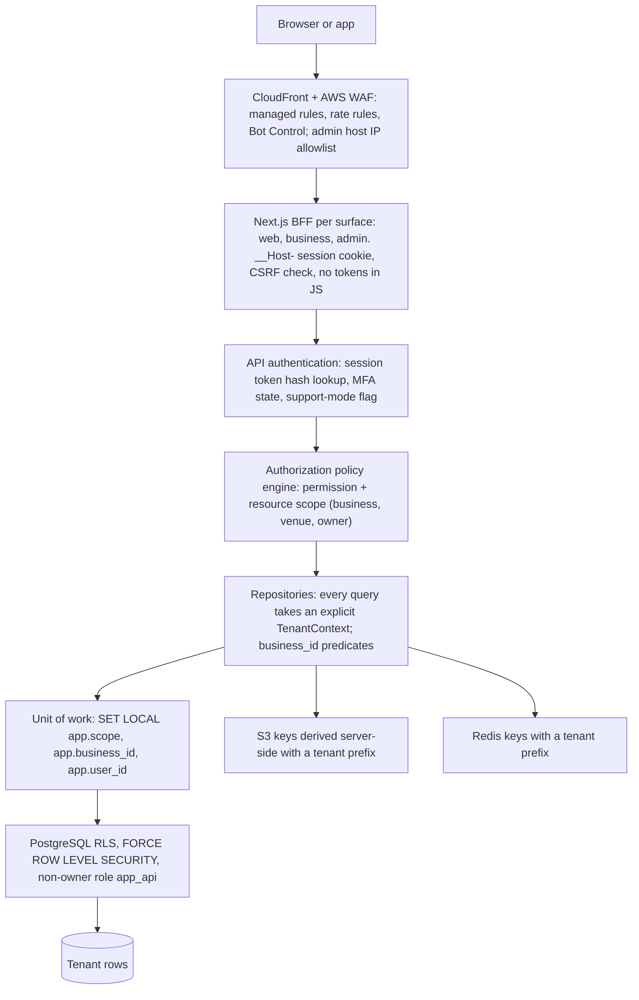
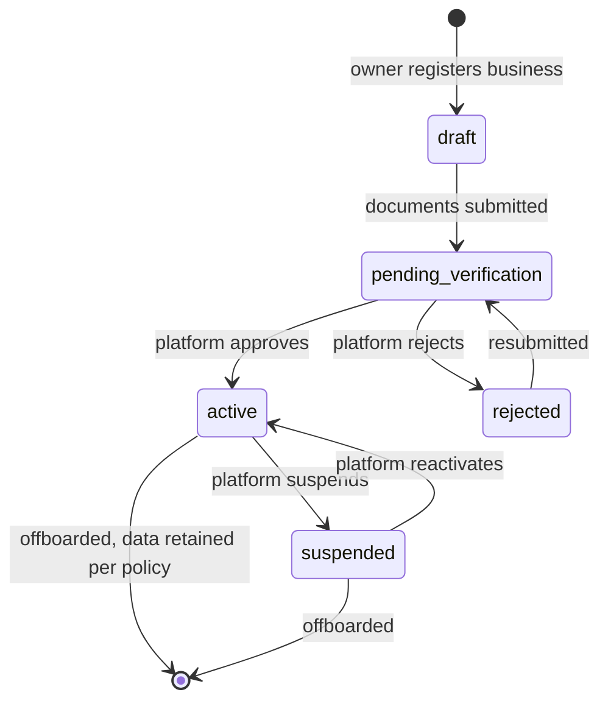

# 10 — Multi-Tenant Architecture

| Item | Value |
|---|---|
| Document | 10 of 23, CourtKo design package |
| Scope | Tenancy model, isolation layers, database roles and session context, Row-Level Security, object-level authorization, cross-tenant patterns, support mode, tenant context in caches, files and jobs, rate limits, noisy-neighbor controls, tenant lifecycle, isolation testing |
| Related | [11 System architecture](11-system-architecture.md), [12 Database ERD](12-database-erd.md), [13 API design](13-api-design.md), [`schema.sql`](schema.sql) (sections 5–7) |
| Requirement anchor | Product brief item 6: "Each business is logically isolated so its users, courts, bookings, payments, reports, and configurations cannot be accessed by another business." |

## 1. Tenancy model

| Decision | Choice |
|---|---|
| Tenant | A **business** (`businesses.id`). Everything a business owns carries `business_id` |
| Sub-scope | **Venue** (`venues.id`) inside a business. Staff role assignments may be limited to venues (`business_member_roles.venue_id`, NULL = all venues) |
| Storage model | One PostgreSQL database, one shared schema (`app`), `business_id` discriminator column on every tenant-owned table |
| Global (non-tenant) data | Identity (`users` and per-user tables), platform reference data (PSGC locations, amenities, court/event types, payment method catalog), platform configuration, provider webhooks |
| Players | Not tenant members. A player's bookings live in each business's tenant partition and are reachable through player-ownership policies (§7) |

**Alternatives considered**

| Model | Pros | Cons | Verdict |
|---|---|---|---|
| Shared schema + `business_id` + RLS | One migration path, cheap per tenant, cross-tenant platform reporting and player views are natural, fits a few thousand small tenants | Isolation depends on correct policies (mitigated by FORCE RLS, non-owner role, automated tests) | **Chosen** |
| Schema per tenant | Stronger logical separation | Migrations × N tenants, connection/search_path complexity, cross-tenant queries (player history, platform reports) become UNIONs | Rejected for MVP |
| Database per tenant | Strongest isolation, per-tenant restore | Cost and operations overhead are not justified for small venues | Rejected; revisit for Phase 3 enterprise/franchise accounts |

## 2. Scopes and principals

Every database transaction runs in exactly one **scope**, set by `packages/db` with `SET LOCAL` at the start of the
transaction (§4). The scope determines which RLS policies can match.

| `app.scope` | Principal | Set when | `app.business_id` | `app.user_id` | Typical access |
|---|---|---|---|---|---|
| `public` | Anonymous visitor | Public API and discovery | none | none | Published venues, active courts, pricing for quotes, availability occupancy, published events and products |
| `player` | Authenticated user acting as a customer | `/v1/me/*` | none | caller | Own profile, bookings, holds, checkouts, payments, orders, registrations across all businesses, plus public reads |
| `business` | Staff member acting for one business | `/v1/businesses/{businessId}/*` after membership check | the business | caller | Rows of that business only; permissions and venue scope narrowed by the policy engine |
| `platform` | Platform staff (SuperAdmin and platform roles) | `/v1/admin/*` after role + MFA check | none (or target business for scoped reads) | caller | All tenants; writes to money tables only through audited services |
| `system` | Worker jobs | `apps/worker` only | none, or per-item | none | Cross-tenant sweeps (holds, reconciliation, notifications). Honored only when the login role is `app_worker` or `courtko_migrator` (`app.app_scope()` checks `session_user`) |

Unset or invalid context makes `app.app_scope()` return `'none'`, so every policy evaluates to false: **fail closed**.

## 3. Isolation layers (defence in depth)



| Layer | Control | Failure it contains |
|---|---|---|
| 1 Edge | AWS WAF managed rule groups, rate-based rules, Bot Control; `admin.courtko.ph` restricted to an IP allowlist | Volumetric abuse, credential stuffing, admin exposure |
| 2 BFF per surface | Separate Next.js apps and hosts; host-only `__Host-` cookies per surface (SameSite Lax for web/business, Strict for admin); the BFF forwards only to its surface's API prefix | Cross-surface session reuse, CSRF |
| 3 API authentication | Opaque 256-bit session token, SHA-256 hash lookup via `app.fn_auth_resolve_session()`; idle and absolute timeouts; MFA required for platform and owner/manager roles | Stolen or expired sessions |
| 4 Authorization engine | `authorize(actor, permission, resource)` in `packages/domain/rbac`: membership active, role grants the permission, venue scope includes `resource.venue_id`, support-mode restrictions, MFA freshness for high-risk permissions | Privilege escalation, horizontal access inside a tenant |
| 5 Repository scoping | Repository methods require a `TenantContext`; queries always include `business_id = $ctx.businessId`; lint rule forbids raw SQL outside `packages/db` | Developer mistakes in queries |
| 6 PostgreSQL RLS | `ENABLE` + `FORCE ROW LEVEL SECURITY` on every tenant table; app connects as non-owner `app_api` / `app_worker`; per-transaction settings | Missing predicates, SQL injection blast radius, IDOR through a forgotten filter |
| 7 Same-tenant foreign keys | Composite FKs such as `(business_id, court_id)` → `courts (business_id, id)` | A row of tenant A pointing at tenant B's parent |
| 8 Envelope encryption context | Sensitive fields (TIN, restriction notes, guest contacts, MFA secrets) encrypted with KMS data keys bound to an encryption context `{business_id}` or `{user_id}` | Ciphertext copied across tenants cannot be decrypted |
| 9 Storage, cache, jobs, logs | Tenant-prefixed keys, tenant context in job payloads, `business_id` on spans and logs with PII redaction (§9) | Leakage through side channels |

## 4. Database roles and session context

| Role | Login | Owns objects | RLS | Used by |
|---|---|---|---|---|
| `courtko_migrator` | Yes (CI/CD migration job only) | All schema objects | Subject to RLS (FORCE); data migrations run with `app.scope = 'system'` | Forward-only migrations (expand/contract) |
| `app_rw` | No | Nothing | Subject | Privilege group for runtime roles |
| `app_api` | Yes (member of `app_rw`) | Nothing | Subject; cannot use `system` scope | `apps/api` |
| `app_worker` | Yes (member of `app_rw`) | Nothing | Subject; may use `system` scope | `apps/worker` |
| `app_definer` | No | Vetted `SECURITY DEFINER` functions only | Granted narrowly by `TO app_definer` policies | `app.fn_*` helpers (§5.4) |
| `app_reporting` | Yes | Nothing | Subject; `default_transaction_read_only = on` | Reporting read replica |

No runtime role has `BYPASSRLS`, table ownership, `TRUNCATE`, or `UPDATE`/`DELETE` on append-only tables. Credentials
come from IAM database authentication or Secrets Manager rotation.

**Session context contract.** Settings are always transaction-local (`SET LOCAL` / `set_config(..., true)`), so a
pooled connection (RDS Proxy in transaction mode, or the Node pool) can never carry a previous request's tenant.

```ts
// packages/db/src/unit-of-work.ts (sketch)
export async function withTenantTx<T>(ctx: TenantContext, fn: (tx: Tx) => Promise<T>): Promise<T> {
  // Support mode is read-only in the database too: the transaction starts as BEGIN READ ONLY
  // (access mode must be set before the first query of the transaction).
  const builder = ctx.supportSessionId ? db.transaction().setAccessMode('read only') : db.transaction();
  return builder.execute(async (tx) => {
    await sql`select set_config('app.scope', ${ctx.scope}, true),
                     set_config('app.business_id', ${ctx.businessId ?? ''}, true),
                     set_config('app.user_id', ${ctx.userId ?? ''}, true)`.execute(tx);
    return fn(tx);
  });
}
```

`TenantContext` is created only by the authorization middleware from the verified session and the route. Handlers
cannot construct it, and a lint rule rejects `set_config('app.` outside `packages/db`.

## 5. Row-Level Security

### 5.1 Policy families

| Family | Tables (examples) | Rule |
|---|---|---|
| `tenant_isolation` (read/write) | `venues`, `courts`, `court_blocks`, `bookings`, `booking_slots`, `checkouts`, `payments`, `refunds`, `orders`, `events`, `pricing_rules`, `venue_user_restrictions`, … | `platform`/`system`, or `business` scope with `business_id = app.business_id` |
| `tenant_read` + `platform_write` | `commission_agreements`, `fee_schedules`, `payment_provider_accounts`, `commissions`, `settlements`, `settlement_lines`, `payouts`, `disputes`, `payment_events`, `ledger_journals` | The business reads its own rows; only `platform`/`system` write |
| `template_read` | `roles`, `role_permissions`, `holidays`, `cancellation_policies`, `cancellation_policy_versions`, `commission_agreements`, `fee_schedules`, `promotions` | Platform templates (`business_id IS NULL`) readable in any valid scope |
| `player_own` / `player_via_*` | `bookings`, `booking_holds`, `checkouts`, `payments`, `orders`, `event_registrations`, … and children (`booking_slots`, `booking_price_snapshots`, `checkout_items`, `order_items`, `refunds`) | `player` scope and the owner column = `app.user_id` (children through the parent) |
| `public_read` | `businesses` (active), `venues` (published), `courts`, hours, amenities, `pricing_rules` (active), `events` (published), `products` (active), `reviews` (published), `booking_slots` (active occupancy only) | `public`/`player` scope; published or active rows only |
| `self_access` | `user_profiles`, `sessions`, `notifications`, `consents`, `payment_method_tokens`, … | Owner column = `app.user_id`; secret-bearing tables (`mfa_factors`, `mfa_recovery_codes`, `verification_tokens`, `push_subscriptions`) are not readable in platform scope |
| Ledger special | `financial_ledger_entries`, `ledger_accounts` | A business reads only its own `venue:%` lines; posting only in `platform`/`system` |
| Append-only | `outbox_events`, `audit.audit_logs`, `audit.security_events` | Any valid scope may INSERT (business scope only for its own `business_id`); reads restricted |
| `definer_access` | Tables the vetted functions need | `TO app_definer USING (true)`; effective rights limited by grants |

### 5.2 Representative policies (from `schema.sql`)

```sql
-- Tenant isolation (generated for every read/write tenant table)
CREATE POLICY tenant_isolation ON app.bookings
  USING ((SELECT app.app_scope()) IN ('platform', 'system')
         OR ((SELECT app.app_scope()) = 'business' AND business_id = (SELECT app.app_current_business_id())))
  WITH CHECK ((SELECT app.app_scope()) IN ('platform', 'system')
         OR ((SELECT app.app_scope()) = 'business' AND business_id = (SELECT app.app_current_business_id())));

-- A player sees and acts on their own bookings in every business
CREATE POLICY player_own ON app.bookings
  USING ((SELECT app.app_scope()) = 'player' AND player_user_id = (SELECT app.app_current_user_id()))
  WITH CHECK ((SELECT app.app_scope()) = 'player' AND player_user_id = (SELECT app.app_current_user_id()));

-- Children follow the parent (the sub-select is itself filtered by the parent's policies)
CREATE POLICY player_via_booking ON app.booking_price_snapshots
  USING ((SELECT app.app_scope()) = 'player'
         AND booking_id IN (SELECT b.id FROM app.bookings b WHERE b.player_user_id = (SELECT app.app_current_user_id())));

-- Public discovery: only published venues
CREATE POLICY public_read ON app.venues FOR SELECT
  USING ((SELECT app.app_scope()) IN ('public', 'player') AND status = 'published' AND deleted_at IS NULL);

-- Business reads only its own venue-payable ledger lines; posting is platform/system only
CREATE POLICY venue_lines_read ON app.financial_ledger_entries FOR SELECT
  USING ((SELECT app.app_scope()) = 'business' AND business_id = (SELECT app.app_current_business_id())
         AND account_code LIKE 'venue:%');
CREATE POLICY platform_post ON app.financial_ledger_entries
  USING ((SELECT app.app_scope()) IN ('platform', 'system'))
  WITH CHECK ((SELECT app.app_scope()) IN ('platform', 'system'));

-- Helper: fail closed on missing or invalid context; 'system' only for worker/migrator logins
CREATE OR REPLACE FUNCTION app.app_scope() RETURNS text LANGUAGE plpgsql STABLE AS $fn$
DECLARE s text := nullif(current_setting('app.scope', true), '');
BEGIN
  IF s IS NULL OR s NOT IN ('public','player','business','platform','system') THEN RETURN 'none'; END IF;
  IF s = 'system' AND session_user NOT IN ('app_worker','courtko_migrator') THEN RETURN 'none'; END IF;
  IF s = 'business' AND nullif(current_setting('app.business_id', true), '') IS NULL THEN RETURN 'none'; END IF;
  RETURN s;
END $fn$;
```

Helpers are wrapped in scalar sub-selects (`(SELECT app.app_scope())`) so the planner evaluates them once per statement
(InitPlan) rather than per row. Tenant tables lead their indexes with `business_id` so tenant predicates stay index-driven.

### 5.3 Money-state guards in the database

Beyond visibility, the database refuses money-state writes from the wrong scope. `app.tg_guard_booking_transition()`
and `app.tg_guard_payment_transition()` accept only the documented transitions (doc 07 §3, doc 08 §2) and require the
`system` scope to enter `confirmed`, `captured`, `refunded` and similar states. A compromised or buggy player/business
request path therefore cannot mark anything paid.

### 5.4 Privileged helpers (`SECURITY DEFINER`, owner `app_definer`)

Some legitimate operations must see rows that the caller's policies hide. Each is a fixed-query function that validates
the caller's scope and returns the minimum data:

| Function | Why the caller cannot do it directly | Returns |
|---|---|---|
| `app.fn_release_stale_holds(court, range, correlation)` | A player must expire *other* players' stale holds inside the hold transaction | Count released |
| `app.fn_booking_eligibility(user, business, venue, kind)` | Restriction rows (internal notes, evidence) must stay invisible to players and other businesses | Boolean only (neutral `BOOKING_NOT_ALLOWED`) |
| `app.fn_resolve_commission_agreement(business, at)`, `app.fn_resolve_fee_schedule(business, method, at)` | Quotes in player scope need a business's negotiated terms | Rate/fee fields only |
| `app.fn_auth_find_login(login)`, `app.fn_auth_record_login_attempt(...)`, `app.fn_auth_resolve_session(hash, surface)`, `app.fn_consume_verification_token(hash, purpose)` | Authentication happens before any user scope exists | Minimal auth fields |
| `app.fn_business_customer_contact(business, user)` | Staff with `customers.view_contact` need a customer's email/phone, only for customers with a relationship to that business (the API also audits each call) | Email, phone |

`app_definer` is NOLOGIN, owns only these functions, and has table grants limited to exactly what they touch. RLS
policies grant it access with `TO app_definer`. It does not need `BYPASSRLS`.

## 6. Object-level authorization and 404 for foreign objects

Every request that names an object by id goes through the same algorithm:

1. **Route scope.** `/v1/businesses/{businessId}/…` requires an active `business_members` row for the caller in
   `{businessId}`. A non-member receives `404 NOT_FOUND` for the business, as if it did not exist.
2. **Load in scope.** The repository loads the object inside the tenant transaction. RLS makes a foreign object
   invisible, so the load returns nothing → `404 NOT_FOUND`, with the same body and timing as a truly missing id.
3. **Permission.** `authorize(actor, 'bookings.cancel', { businessId, venueId })`. The role must grant the permission,
   and a venue-scoped assignment must include `venueId`. Failure on an object the caller *can* see → `403 FORBIDDEN`.
   Failure on an object they cannot see is already `404`.
4. **Ownership (player scope).** Player routes (`/v1/me/...`) resolve objects only through ownership policies. Another
   player's booking id → `404`.
5. **Mass-assignment guard.** `business_id`, `venue_id` (except where selectable), `status`, money fields and ids are
   never taken from request bodies. They come from the route, the loaded parent or server computation (Zod schemas are
   strict and reject unknown keys).
6. **Enumeration.** UUIDv7 ids are time-ordered, not secret. Security relies on the checks above. Repeated 404s on
   foreign ids by one principal (for example more than 20 in 10 minutes) raise a `cross_tenant_probe` security event
   and tighten rate limits for that principal.

| Situation | Response |
|---|---|
| Staff of business A requests booking of business B via A's route | `404 NOT_FOUND` |
| Staff of A calls B's route `/v1/businesses/{B}/…` | `404 NOT_FOUND` |
| Receptionist (venue-scoped to Venue 1) opens a Venue 2 booking in the same business | `404 NOT_FOUND` if listing is venue-filtered; `403 FORBIDDEN` for actions on a visible object outside their venue |
| Receptionist tries `bookings.cancel` (not in role) | `403 FORBIDDEN` |
| Finance viewer tries `refunds.approve` | `403 FORBIDDEN` (and `APPROVAL_REQUIRED` flows only for roles that can request) |
| Player opens another player's booking | `404 NOT_FOUND` |

## 7. Cross-tenant patterns

| Pattern | How it works without breaking isolation |
|---|---|
| Player sees own bookings across businesses | `player` scope; `player_own` policies on `bookings`, `payments`, `orders`, `event_registrations`; business-private data (internal notes, other customers, finance) is never reachable from player scope |
| Public discovery | `public` scope reads only published or active rows (`public_read`). Occupancy is exposed through `app.v_public_court_occupancy` (court and time range only, no occupant identity). Venue cards use denormalized, non-sensitive columns (`starting_rate_minor`, `rating_avg`) |
| Platform operations | `platform` scope after platform-role authorization with MFA. Money mutations go through the same services and guards as tenants (maker-checker for commissions and adjustments). Cross-tenant reports run on the read replica (`app_reporting`) |
| A user who is a player and a staff member of several businesses | One identity. The surface and route choose the scope: `/app` → `player`; `/biz` with a selected business → `business` for that business only. Business switching needs no re-login and re-evaluates membership on every request |
| Reviews visible to the public | `reviews` stores `reviewer_display_name` as a snapshot; `user_profiles` is never publicly readable |
| Customer contact for staff | Only through `app.fn_business_customer_contact()`, which requires a relationship with that business; `customers.view_contact` is checked and every call is audited |
| Walk-ins for guests without accounts | `bookings.player_user_id` NULL; `guest_contact_ciphertext` encrypted with the business's KMS encryption context |

## 8. Support mode (controlled impersonation)

| Control | Implementation |
|---|---|
| Permission | `platform.support.impersonate` (SuperAdmin, `platform_support`) with fresh MFA (≤ 15 min) |
| Justification | `support_sessions.reason` ≥ 15 characters (CHECK) and `ticket_reference` required |
| Duration | Maximum 30 minutes (CHECK `support_sessions_max_30_min`); one active session per admin; auto-expiry |
| Read-only by default | Transactions start `READ ONLY` in the database (§4). The API rejects mutations with `SUPPORT_MODE_READ_ONLY` |
| Always blocked | Credentials, passwords, MFA, recovery codes, payout accounts, exports, refunds, deletions, role changes, viewing unmasked contact details, starting a nested support session |
| Visibility | Persistent, non-dismissible banner in the impersonated UI ("Support mode — viewing as Juan D. — ends 3:42 PM"); the subject is notified after the session (security notification) |
| Audit | Every request writes `audit.audit_logs` with `actor_user_id` = admin, `impersonated_user_id` = subject, `support_session_id`, route and outcome; start and end also go to `audit.security_events` |
| Scope | Impersonating a player uses `player` scope with the subject's id; impersonating a staff member uses `business` scope for `subject_business_id` and that member's permissions intersected with read-only |

## 9. Tenant context outside the database

| Channel | Rule |
|---|---|
| Redis cache | Key prefixes: `t:{businessId}:…` (tenant data), `u:{userId}:…` (per-user), `pub:…` (public, published data only). Authorization snapshots are cached as `authz:{userId}:{businessId}:v{permissionsVersion}` for 60 s and invalidated by the `membership.changed` / `role.changed` outbox events. Tenant data is never cached under a key without the tenant prefix. Keys contain ids only, never PII |
| CDN | Only public GET responses without cookies (venue pages, public availability summaries with `s-maxage` ≤ 15 s). Authenticated responses send `Cache-Control: private, no-store` |
| S3 | Keys are always derived server-side: `uploads-quarantine/t/{businessId}/{uploadId}`, `uploads-clean/t/{businessId}/{purpose}/{uploadId}/{variant}`, `uploads-clean/u/{userId}/avatar/{uploadId}`, `reports/t/{businessId}/{reportId}.csv`, `reports/p/{reportId}.csv` (platform). Presigned URLs are single-object, expire in 5 minutes (upload: content-type and size conditions). Downloads go through an authorization check that loads the `uploads` row under RLS. Files stay in quarantine until GuardDuty Malware Protection marks them clean |
| Background jobs | Every pg-boss payload carries `{ tenant: { scope, businessId?, userId? }, correlationId, idempotencyKey }`. The job runner opens `withTenantTx(tenant)`. Per-tenant jobs (settlements, exports, reminders) run in `business` or `player` scope. Cross-tenant sweeps use `system` scope to select work, then process each item in its own transaction |
| Outbox events | `outbox_events.business_id` set; consumers re-derive tenant context from it, never from free-form payload fields |
| Logs and traces | Structured pino logs and OpenTelemetry spans carry `business_id`, `venue_id`, `user_id` (ids only), `correlation_id`. PII and payment data are redacted by `packages/observability` |
| Analytics | Event stream keyed by pseudonymous ids; no cross-tenant analytics exposed to businesses |
| Exports | Generated in the tenant's scope by `reports.generate`, stored under the tenant prefix, audited (`reports.export`), link valid 15 minutes |

## 10. Rate limits and noisy-neighbor controls

Rate limits (initial targets, to be tuned with load tests) use Redis token buckets keyed by surface + principal. Doc 13
§2.9 lists the API headers.

| Dimension | Limit (initial target) | Purpose |
|---|---|---|
| Public search/availability per IP | 60 requests/min (burst 30) | Scraping, bots |
| Player hold creation per user | 10/min, plus the domain limit of 2 active holds | Slot hoarding |
| Payment session creation per checkout | 5/min | Retry storms |
| Business API per business | 600 requests/min (burst 100) | Tenant fairness |
| Business API per staff user | 120 requests/min | Compromised account containment |
| Walk-in creation per business | 60/min | Abuse |
| Exports per business | 10/hour, 1 concurrent | Replica protection |
| Login per account + IP | 5 failures/15 min, then exponential backoff; CAPTCHA only on risk signals | Credential stuffing |
| Webhooks per source IP (WAF) | 600 per 5 min | Flooding |

| Noisy-neighbor control | Mechanism |
|---|---|
| Query cost | `statement_timeout` 5 s (API), 60 s (worker), 120 s (reporting); cursor pagination (max 100); allow-listed filters; tenant-leading indexes |
| Heavy reads | Reports and exports on the read replica (`app_reporting`) |
| Job fairness | pg-boss singleton keys per business for exports and settlements; worker concurrency per queue; round-robin batching by `business_id` in sweeps |
| Connection pressure | Fixed pool sizes per ECS task behind RDS Proxy; per-tenant concurrency cap of 10 in-flight business requests per business per API task |
| Visibility | Per-tenant request, error and latency metrics (span attribute `business_id`); a top-N tenants dashboard; alert when one tenant exceeds 20% of API DB time for 15 minutes |

## 11. Tenant lifecycle



| Stage | Steps | Controls |
|---|---|---|
| Onboard | A user (player scope, `owner_onboarding` policy) creates a `draft` business → uploads verification documents (quarantine + malware scan) → submits (`pending_verification`, `business_verifications` row, Internet Transactions Act merchant checklist) → platform review with `platform.businesses.verify` (reviewer ≠ submitter, CHECK `business_verifications_four_eyes`) | Documents visible only to the business and `platform_compliance` / SuperAdmin |
| Provision (on approval, one transaction + outbox) | Status `active`; copy role templates into the business; owner `business_members` row with `business_owner`; `venue:{id}:payable` ledger account; default cancellation policy (Standard template); request a Xendit sub-account (`payment_provider_accounts` `pending` → `active` after provider KYC **[provider-dependent]**); notify the owner ("business approved") | Idempotent provisioning keyed by business id |
| Operate | Owner configures venues and courts, invites staff (`staff.manage`, cannot grant permissions they do not hold), publishes venues (`location` required) | MFA mandatory for owner and manager roles |
| Suspend | `platform.businesses.suspend` through maker-checker (`approval_requests.action = 'business_suspension'`). Effects: venues `suspended` (removed from discovery), new holds, checkouts and payment sessions blocked; staff portal read-only with a banner; payouts held (Option B) or sub-account suspension requested (Option A). Existing bookings follow `businesses.suspension_booking_policy`: `honor_existing` (default for administrative suspensions) or `cancel_and_refund` (safety or fraud: B18 with full refund including gateway fee) | Reason required (CHECK); owner notified; audit |
| Reactivate | Platform approval; venues return to their prior published state after owner confirmation | Audit |
| Offboard | Stop new bookings → honor or refund future bookings → final settlement and payout of any positive balance (or collections for a receivable, doc 09 §5) → close the provider sub-account → end staff memberships (`removed`) → unpublish venues (`deleted_at`) → deliver a data export to the owner → `offboarded_at` | Financial records (R4, 10 years), audit (R5) and legal holds retained; customer personal data not needed for those records is anonymized by `retention.enforce` (doc 12 §4) |

## 12. Tenant-isolation test strategy

| Layer | Test | Gate |
|---|---|---|
| Catalog completeness | CI query (footer of `schema.sql`): every table in `app`/`audit` has RLS enabled and forced and at least one policy, except the two grant-protected infrastructure tables | Build fails |
| RLS matrix (generated) | Testcontainers PostgreSQL 16 + PostGIS, connected as `app_api`. For **every** table with `business_id`, fixtures for tenants A and B: in business scope A, SELECT returns only A rows; INSERT/UPDATE with B's `business_id` fails `WITH CHECK`; UPDATE/DELETE targeting B rows affect 0 rows; no scope returns 0 rows; `player` scope sees only its own rows; `public` scope sees only published rows | Build fails |
| Definer functions | Each `fn_*` rejects calls from the wrong scope and returns only the documented columns | Build fails |
| Guard triggers | Player/business scopes cannot move bookings to `confirmed` or payments to `captured`; invalid transition pairs are rejected | Build fails |
| API IDOR suite | For every route with an id parameter (generated from the OpenAPI document), request tenant B's object as tenant A staff and as another player → `404`; list endpoints never return B data; bodies containing `businessId` or `status` are rejected | Build fails |
| Permission matrix | Each role template × each business permission; venue-scoped assignments; `staff.manage` cannot escalate | Build fails |
| Side channels | Cache key builder, S3 key derivation and job payload builders reject missing tenant context (unit tests); exports contain only the requesting tenant | Build fails |
| Belt-and-braces | Nightly run with repository scoping disabled (test-only flag) to prove RLS alone blocks cross-tenant reads | Alert |
| E2E | Playwright: URL tampering across businesses in the business portal; support-mode read-only enforcement | Release gate |
| External | Pre-launch penetration test focused on multi-tenancy and payments; OWASP ZAP baseline in CI | Launch gate |
