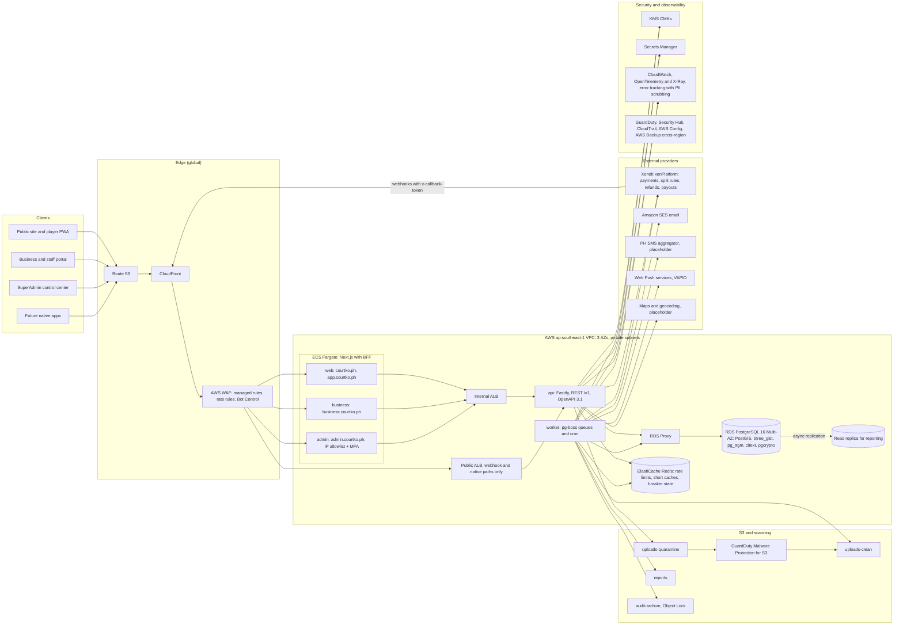
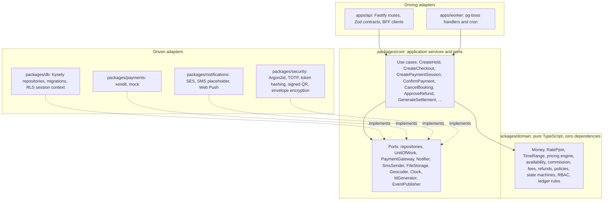

# 11 — System Architecture

| Item | Value |
|---|---|
| Document | 11 of 23, CourtKo design package |
| Scope | Production system diagram, component responsibilities, request lifecycle, hexagonal layering, module catalog, booking and payment data flow, background jobs, scalability and partitioning, caching, search, failure modes, architecture decisions |
| Decided by the product owner | TypeScript monorepo; first payment adapter Xendit xenPlatform; AWS ap-southeast-1 (Singapore) |
| Related | [07](07-booking-state-machine.md), [08](08-payment-state-machine.md), [09](09-refund-and-payout-flow.md), [10](10-multi-tenant-architecture.md), [12](12-database-erd.md), [13](13-api-design.md); deployment details in doc 21, monitoring in doc 22 |

## 1. Quality goals

| Goal | Architectural response |
|---|---|
| Correctness of bookings and money | Database-enforced invariants (exclusion constraint, guard triggers, deferred checks), idempotency everywhere, append-only ledger, provider re-query before any money state |
| Tenant isolation | Defence in depth ending in PostgreSQL RLS with a non-owner role (doc 10) |
| Security and privacy | Hosted payment pages (PCI DSS SAQ A target), BFF with server-side opaque sessions, KMS envelope encryption for sensitive fields, PII redaction in telemetry |
| Operability | Small number of deployables (5 services), one relational database, structured logs, traces, metrics, SLO-based alerting |
| Evolvability | Hexagonal core with ports; provider adapters swappable (Xendit, mock); modular monolith that can be split along module boundaries later |
| Cost fit for launch | ECS Fargate, managed data services; no Kubernetes, no separate search cluster in the MVP |

Performance targets (p95 page response, search, booking, payment processing, availability, RPO/RTO) are set as SLOs in
doc 22. They are **initial targets, not guarantees**, and are validated with k6 load tests before launch.

## 2. System diagram



## 3. Component responsibilities

| Component | Responsibilities | Does not |
|---|---|---|
| `apps/web` (Next.js App Router, PWA) | Public pages (SEO, ISR for published venues), player app, BFF route handlers at `/api/bff/*`, host-only session cookie, CSRF protection, server components calling the API | Hold business logic, compute money, trust client state |
| `apps/business` | Owner/staff portal, permission-filtered navigation (cosmetic only; the server enforces), calendar views, walk-in flow, BFF | Enforce authorization |
| `apps/admin` | SuperAdmin control center, maker-checker screens, support mode with banner, reconciliation views | Be reachable outside the WAF IP allowlist; skip MFA |
| `apps/api` (Fastify, Node.js 24 LTS) | Versioned REST `/v1`, authentication, authorization, validation (Zod), idempotency, rate limiting, use-case orchestration, webhook ingestion, OpenAPI generation | Call providers while holding DB locks; run long jobs |
| `apps/worker` | pg-boss queues and cron: outbox dispatch, webhook processing, holds expiry, reconciliation, refunds/payouts sync, notifications, reports, images, search, settlements, retention, audit archive | Serve HTTP (health endpoint only) |
| PostgreSQL 16 (RDS Multi-AZ) | System of record: tenancy, bookings, payments, ledger, audit; invariants via constraints/triggers; RLS; job queue (pg-boss) | Be accessed by any role that owns objects at runtime |
| Read replica | Reporting and exports (`app_reporting`) | Serve booking or payment decisions |
| Redis (ElastiCache) | Rate-limit buckets, short-lived caches, circuit-breaker state, authz snapshot cache | Be a source of truth (loss is tolerated) |
| S3 + GuardDuty Malware Protection | Upload quarantine and scanning, clean images, reports, audit archive with Object Lock (compliance mode) | Serve unscanned files |
| SES / SMS aggregator / Web Push | Delivery channels behind the `Notifier` and `SmsSender` ports | Receive PII beyond what the message needs |
| Xendit | Hosted checkout, e-wallets, QR Ph, cards (3DS), split rules, refunds, payouts, reports | Be trusted without re-query |
| Maps/geocoding (placeholder) | Geocoding venue addresses; map tiles on the client | Receive player locations server-side beyond the rounded query point |

## 4. Request lifecycle (authenticated state-changing request)

| # | Stage | Where | Detail |
|---|---|---|---|
| 1 | TLS + edge | CloudFront, WAF | TLS 1.2+, HSTS preload, managed rules, rate-based rules, Bot Control; admin host IP allowlist |
| 2 | BFF | Next.js route handler | Reads the `__Host-` cookie; CSRF check (SameSite + `Origin`/`Sec-Fetch-Site` + token for mutations); forwards to the internal ALB with the session token as `Authorization: Bearer`; propagates `X-Correlation-Id` and W3C `traceparent`; strips client-supplied `X-Forwarded-*` except the edge-appended values |
| 3 | Correlation | API `onRequest` | Accepts a well-formed incoming `X-Correlation-Id` (UUID or ULID) or generates one; binds it to the logger and OTel context; echoes it on the response |
| 4 | Rate limit | API, Redis | Token bucket per surface + principal (doc 10 §10); `429 RATE_LIMITED` with `RateLimit-*` and `Retry-After` |
| 5 | Authentication | API → `app.fn_auth_resolve_session()` | SHA-256 of the token → active session (idle and absolute timeouts), user status, MFA freshness, support session |
| 6 | Surface guard | API router | `/v1/admin/*` requires a platform role + MFA; `/v1/businesses/{id}/*` requires membership; `/v1/me/*` requires an authenticated user |
| 7 | Validation | Zod (`packages/contracts`) | Strict schemas (unknown keys rejected), size limits (body ≤ 64 KB default), content type `application/json`; `400/422 VALIDATION_FAILED` with `errors[]` |
| 8 | Authorization | Policy engine | Permission + resource scope + support mode + step-up MFA for high-risk permissions |
| 9 | Idempotency | `idempotency_keys` | Required POSTs: replay, conflict or in-progress handling (doc 13 §2.6) |
| 10 | Transaction | `withTenantTx` (unit of work) | `SET LOCAL app.scope/business_id/user_id`; use case in `packages/core`; domain rules in `packages/domain`; state change + `outbox_events` + `audit.audit_logs` + idempotency completion in **one** transaction |
| 11 | Response | Fastify serializer | Response schema validation, money as `{amount, currency}`, RFC 3339 UTC timestamps, `ETag` for versioned resources |
| 12 | After commit | Worker | `outbox.dispatch` (LISTEN/NOTIFY wake-up + 1 s polling fallback) enqueues pg-boss jobs: notifications, search reindex, cache invalidation, provider calls |
| 13 | Telemetry | `packages/observability` | pino JSON logs with PII redaction, OTel spans (HTTP, SQL, provider), RED metrics per route and tenant |

## 5. Hexagonal layering



Dependency rules, enforced in CI with dependency-cruiser:

| Package | May depend on | Must not depend on |
|---|---|---|
| `packages/domain` | Nothing (standard library only) | Any framework, I/O, `Date.now()` (time comes from the `Clock` port) |
| `packages/core` | `domain` | Fastify, Next.js, Kysely, provider SDKs |
| `packages/db`, `packages/payments`, `packages/notifications`, `packages/security` | `core` (ports), `domain` | `apps/*` |
| `apps/api`, `apps/worker` | Everything above, `contracts`, `observability` | Each other |
| `apps/web`, `apps/business`, `apps/admin` | `ui`, `web-kit`, `contracts` | `core`, `db`, `payments` (browsers never compute money or authorization) |

The same `packages/domain` powers the interactive demo in the browser, with the mock payment adapter behind the same
`PaymentGateway` port.

## 6. Module catalog (modular monolith inside `apps/api` + `apps/worker`)

| Module | Responsibilities | Owns tables | Emits (outbox) |
|---|---|---|---|
| Identity | Registration, verification, login, sessions, MFA, identities, devices | `users`, `user_profiles`, `user_addresses`, `user_preferences`, `identities`, `sessions`, `mfa_factors`, `mfa_recovery_codes`, `verification_tokens` | `user.registered`, `security.password_changed`, `session.revoked` |
| Tenancy & RBAC | Businesses, verification, members, roles, permissions, platform roles, lifecycle | `businesses`, `business_verifications`, `business_members`, `business_member_roles`, `roles`, `permissions`, `role_permissions`, `platform_member_roles` | `business.approved`, `business.suspended`, `membership.changed`, `role.changed` |
| Venues & courts | Venues, courts, hours, special hours, blocks, amenities, holidays | `venues`, `venue_operating_hours`, `venue_special_hours`, `venue_amenities`, `courts`, `court_blocks`, `holidays`, `amenities`, `court_types` | `venue.published`, `court_block.created` |
| Pricing & promotions | Rule evaluation, quotes, promo validation, commission and fee resolution | `pricing_rules`, `promotions`, `promotion_redemptions`, `commission_agreements`, `fee_schedules` | `pricing.changed`, `promotion.redeemed` |
| Availability & booking | Availability timeline, holds, bookings, participants, reschedules, check-in, completion | `booking_slots`, `booking_holds`, `bookings`, `booking_participants`, `booking_price_snapshots`, `booking_status_history`, `cancellation_policies`, `cancellation_policy_versions` | `booking.*` |
| Checkout | Checkout aggregate (booking + products + events), quote locking, reservations | `checkouts`, `checkout_items` | `checkout.paid`, `checkout.expired` |
| Payments | Provider sessions, webhook ingestion, re-query, reconciliation, saved methods, disputes | `payments`, `payment_events`, `webhook_events`, `payment_customers`, `payment_method_tokens`, `payment_method_types`, `payment_provider_accounts`, `disputes`, `reconciliation_runs`, `reconciliation_exceptions` | `payment.*`, `dispute.*` |
| Ledger & settlement | Journals, commissions, statements, payouts, payout accounts, adjustments | `ledger_accounts`, `ledger_journals`, `financial_ledger_entries`, `commissions`, `settlements`, `settlement_lines`, `payouts`, `payout_accounts` | `payout.*`, `settlement.finalized` |
| Refunds | Refund calculation, approvals, submission, sync | `refunds`, `approval_requests` (shared) | `refund.*` |
| Events | Events, divisions, registrations, waitlists, teams, matches | `events`, `event_divisions`, `event_registrations`, `event_waitlists`, `teams`, `team_members`, `matches`, `event_types` | `event.*`, `waitlist.offered` |
| Products & orders | Catalog, variants, inventory, orders, pickup claims | `products`, `product_variants`, `product_categories`, `inventory_movements`, `orders`, `order_items`, `pickup_claims` | `order.*` |
| Players & ratings | Activity stats, favorites, ratings (labelled sources) | `favorites`, `player_ratings`, `rating_history` | `rating.recorded` |
| Trust & safety | Restrictions, appeals, reviews, reports, moderation | `venue_user_restrictions`, `reviews`, `reports` | `restriction.created`, `review.published` |
| Notifications | Templates, preferences, delivery, push subscriptions | `notifications`, `notification_deliveries`, `notification_preferences`, `push_subscriptions` | none (sink) |
| Support | Cases, support mode | `support_cases`, `support_sessions` | `support.session_started` |
| Privacy | Consents, data subject requests, retention | `consents`, `data_subject_requests` | `dsr.completed` |
| Files | Uploads, scanning, image processing | `uploads` | `upload.clean` |
| Platform ops & audit | Settings, flags, locations, audit, security events, outbox, idempotency | `platform_settings`, `feature_flags`, `ph_locations`, `audit.audit_logs`, `audit.security_events`, `outbox_events`, `idempotency_keys` | none |

Modules talk through application services in-process, or asynchronously through outbox events. A module never writes
another module's tables directly; shared transactions (for example B06 confirming a booking and posting the capture
journal) are coordinated by one use case that calls each module's repository within the same unit of work.

## 7. Booking and payment data flow

| Step | Actor | Reads | Writes (same transaction) | Async follow-up |
|---|---|---|---|---|
| 1 Availability | Player (public scope) | `venues`, `courts`, hours, special hours, `holidays`, `v_public_court_occupancy`, active `pricing_rules` | none | none |
| 2 Hold (B01) | Player | Eligibility function, holds count | `bookings` (draft → slot_held), `booking_slots`, `booking_holds`, history, outbox, idempotency | `booking.slot_held` → cache invalidation for availability |
| 3 Checkout | Player | Commission and fee resolution functions, promotions, products/stock, cancellation policy version | `checkouts`, `checkout_items`, `booking_price_snapshots`, `promotion_redemptions` (reserved), `product_variants.stock_reserved`, `inventory_movements` (reservation) | none |
| 4 Payment session (B02) | Player → API → Xendit | Provider account, circuit state | tx1 `payments` (created), hold extension; tx2 provider ids, P01, B02 | none |
| 5 Customer pays | Player ↔ Xendit | none | none | Webhook |
| 6 Webhook | Xendit → API | Callback token | `webhook_events`, outbox | `webhooks.process` |
| 7 Verify + confirm (P04, B06) | Worker | Provider re-query | Payment, bookings, checkout (`paid`), slot (permanent), hold (`converted`), promo (`redeemed`), stock (`sale`), `commissions`, ledger journal, audit, outbox | Confirmation email/push/in-app, receipt, venue alert, search/cache updates |
| 8 Fee and settlement | Worker (daily) | Provider transactions/report | Provider-fee and variance journals, `provider_settled_at`, reconciliation rows | Statement refresh |
| 9 Payout | Worker (schedule) | Settlement | `payouts`, payout journal | "Payout completed" notification |

## 8. Background job catalog

All jobs are pg-boss queues in the `apps/worker` service. They are idempotent, retry with exponential backoff and
jitter, and dead-letter to `{queue}.dlq` with an alert. Job payloads carry tenant context (doc 10 §9).

| Job | Trigger / schedule | Scope | Work unit and idempotency | Retry | Dead letter / alert |
|---|---|---|---|---|---|
| `outbox.dispatch` | LISTEN/NOTIFY + every 1 s | system | Batches of `outbox_events` `pending`, `FOR UPDATE SKIP LOCKED`; event id is the consumer idempotency key | 10 attempts, 1 s → 5 min | Events `dead` after 10 attempts; P2 alert when any event is > 5 min old |
| `webhooks.process` (added) | Enqueued by outbox `webhook.received` | system | One `webhook_events` row (singleton key = row id); re-query + transition; replays marked `ignored` | 12 attempts over about 24 h | P2; `payments.reconcile` still covers |
| `holds.expire` | Every 1 min | system → per booking | `booking_holds` active and expired, 500 per run, `SKIP LOCKED`; B04/B07 (doc 07 §5.7) | Next run | P2 if the backlog of expired holds is > 1,000 or older than 5 min |
| `payments.reconcile` | Every 5 min (pending > 5 min, recent expiries, captured-but-unconfirmed); daily 02:00 Asia/Manila full provider match | system | Per payment re-query; per day/account run (UNIQUE `reconciliation_runs_daily_uniq`) | 3 attempts per item; daily run retried hourly until 08:00 | P1 on `amount_mismatch`, `missing_provider`, reverse `status_mismatch` |
| `refunds.sync` | Outbox `refund.approved` + every 5 min | system | Refund by `reference_id` / `rf_{id}` key; submit, then re-query | Schedule in doc 09 §4 | P2 after the final attempt |
| `payouts.sync` | Every 15 min + schedule (Tuesday 10:00) | system | Payout by `po_{id}` key; imports MANAGED withdrawals | 5 attempts | P1 on payout failures and reversals |
| `bookings.complete` | Every 5 min | system | Bookings past `ends_at` in `confirmed`/`checked_in`; B14/B15 | Next run | P3 on backlog |
| `bookings.remind` | Every 5 min, selecting 24 h and 2 h windows | system → per user | `notifications.dedupe_key = booking.reminder.{24h\|2h}:{bookingId}` | Next run | none |
| `notifications.deliver` | Outbox events → per channel | per user | `notification_deliveries UNIQUE(notification_id, channel)`; provider message id stored | 5 attempts; SMS falls back to email | P3 on bounce/complaint rate thresholds (SES) |
| `reports.generate` | On request (`reports.export`) + scheduled statements | business / platform | One report id; output `reports/t/{businessId}/{reportId}` on the read replica | 3 attempts | P3 |
| `images.process` | Outbox `upload.clean` (after GuardDuty marks clean) | business / user | One upload; renditions written to `uploads.variants` | 3 attempts | P3; the image stays hidden until processed |
| `search.reindex` | Outbox `venue.*`, `pricing.changed`, `review.published` + nightly full | public | One venue (denormalized `starting_rate_minor`, `rating_avg`, `rating_count`) | 5 attempts | P3 |
| `settlements.generate` | Daily 01:00 Asia/Manila; weekly close Monday | business | UNIQUE `(business_id, period_start, period_end)`; lines rebuilt from ledger until finalized | 3 attempts | P2 if blocked by P1 reconciliation exceptions |
| `events.waitlist_offers.expire` | Every 1 min | system → per event | `event_waitlists` `offered` past `offer_expires_at` → `expired`, next in line offered (row lock on the division) | Next run | none |
| `courts.apply_block` (added) | Delayed job at the earliest conflicting hold expiry (doc 07 §6 #11) | business | One `court_blocks` row (singleton key); inserts the block slot or reschedules itself | Until the block start time | P3 if the block could not be applied before its start |
| `retention.enforce` | Daily 03:00 Asia/Manila | system | Per retention class and table (doc 12 §4); purges expired `idempotency_keys`, `sessions`, `verification_tokens`, old `outbox_events`/`webhook_events`; anonymizes deleted accounts; detaches expired audit partitions after archive | Next run | P2 on failure |
| `audit.archive` | Daily 00:30 UTC | system | Exports the previous day's `audit.audit_logs` and `audit.security_events` to S3 Object Lock (NDJSON + SHA-256 manifest); pre-creates 3 months of partitions | Retry hourly | P1 if 2 consecutive days fail |

Queue priorities (highest first): `webhooks.process`, `holds.expire`, `payments.reconcile`, `refunds.sync`,
`notifications.deliver`, `outbox.dispatch`, others. Booking correctness does not depend on job latency. Stale holds are
also released inline inside the next hold transaction (doc 07 §5.2), so a lagging `holds.expire` delays only cleanup.

## 9. Scalability and partitioning plan

### 9.1 Approach

| Tier | Scaling | Notes |
|---|---|---|
| Next.js apps, API, worker | Stateless ECS Fargate tasks across 3 AZs; minimum 2 tasks per service; target tracking on CPU and p95 latency (API) or queue depth (worker) | Sessions live in PostgreSQL, rate limits in Redis; no sticky sessions |
| PostgreSQL | Vertical scaling of the Multi-AZ primary first; RDS Proxy for connection multiplexing; read replica for reports and exports; pg-boss on the primary until job throughput warrants a dedicated queue database | Booking writes are short transactions with row-level locks; hot rows are per court, not global |
| Redis | Single primary + replica (Multi-AZ); loss-tolerant by design | Rate limiting fails open to in-process limits if Redis is unavailable |
| S3 / CloudFront | Managed | Images served from `uploads-clean` through CloudFront with signed URLs where private |

Planning assumptions for the first 12 months (to be validated, **not performance claims**): up to 300 venues,
1,500 courts, 100,000 bookings per month, peak 20 hold attempts per second during evening release windows. Load tests
(k6) must cover a peak of 10× the assumption before launch.

### 9.2 Partitioning plan

| Table | Plan | Key | Trigger to act | Caveats |
|---|---|---|---|---|
| `audit.audit_logs` | Partitioned **now** (monthly, UTC) | `occurred_at`; PK `(id, occurred_at)` | Implemented in `schema.sql` (`audit.ensure_monthly_partitions`) | Retention by detaching and dropping partitions after the S3 Object Lock archive; append-only triggers on the parent apply to all partitions; partitions have RLS enabled with no policies and are never granted |
| `audit.security_events` | Partitioned **now** (monthly) | `occurred_at` | Implemented | Same as above |
| `app.financial_ledger_entries` | Unpartitioned in the MVP; convert to monthly range partitions | `posted_at`; PK `(id, posted_at)` | > 50 M rows or archive requirement | Verify in CI that the deferred constraint trigger `trg_fle_journal_balanced` and the append-only triggers behave identically on the partitioned table in PostgreSQL 16 before converting; journals (`ledger_journals`) stay unpartitioned as the FK target; retention ≥ 10 years means old partitions are archived, not dropped |
| `app.webhook_events` | Unpartitioned in the MVP; convert to monthly partitions | `received_at` | > 20 M rows | Deduplication must stay **global**: a unique constraint on a partitioned table must include the partition key, which would let a retry that crosses a month boundary slip through. On conversion, move uniqueness to a slim unpartitioned `webhook_event_keys (provider, provider_event_id)` table (retained ≥ 30 days, longer than Xendit's 24 h retry window) inserted in the same transaction |
| `app.outbox_events` | Unpartitioned; purge dispatched rows after 7 days | n/a | > 5 M rows/day | Daily partitions + drop if purge cost grows |
| `app.booking_slots` | Not partitioned | n/a | n/a | The exclusion constraint must see all rows of a court. If ever needed, hash partitioning by `court_id` keeps it valid (the partition key participates with `=`) |
| `app.notifications`, `app.notification_deliveries` | Unpartitioned; retention R2 | n/a | > 100 M rows | Monthly partitions by `created_at` |

## 10. Caching strategy

| Data | Cache | TTL | Invalidation | Never cached |
|---|---|---|---|---|
| Public venue pages | Next.js ISR + CloudFront | 60 s revalidate | `venue.published`/`venue.updated` → on-demand revalidation | Pages with a session |
| Discovery results (PSGC or rounded-geo query) | Redis `pub:search:{hash}` | 30 s | Time-based | Player identity or exact location |
| Public availability (venue, date) | Redis micro-cache `pub:avail:{venueId}:{date}` | 5 s | `booking.slot_held`, `booking.confirmed`, `booking.cancelled`, `booking.expired`, `court_block.created` | Hold decisions: the database exclusion constraint is always authoritative |
| Pricing rule set | Redis `t:{businessId}:pricing:{venueId}:v{maxVersion}` | 5 min | `pricing.changed` | Final quotes (always recomputed and snapshotted) |
| Authorization snapshot | Redis `authz:{userId}:{businessId}:v{permissionsVersion}` | 60 s | `membership.changed`, `role.changed` | Support-mode sessions (always recomputed) |
| Platform settings, feature flags | In-process LRU | 30 s | Redis pub/sub on change | Secrets (Secrets Manager with SDK caching) |
| Geocoding results | Redis | 30 days (if the provider licence permits) | Address change | Player locations |
| Idempotency responses | PostgreSQL only | 24 h | Expiry | n/a |

Rules: keys contain ids only (no PII); tenant data keys always carry the tenant prefix (doc 10 §9); money,
availability decisions and authorization outcomes for mutations are never served from cache.

## 11. Search and discovery

MVP search runs in PostgreSQL:

| Need | Implementation |
|---|---|
| Nearby venues (location permission granted) | PostGIS `geography(Point, 4326)` on `venues.location` with a partial GiST index (published only); `ST_DWithin` radius filter + KNN `<->` ordering; distance shown rounded ("about 2.4 km") |
| Manual search (permission denied or not asked) | PSGC hierarchy (`ph_locations`: region → province → city/municipality → barangay) + `pg_trgm` similarity on venue name and landmark; never blocks the user |
| Filters | Date and time availability (occupancy join), price band (`starting_rate_minor`), court type, indoor/outdoor/covered, amenities (`venue_amenities`), rating, events available |
| Privacy | The client sends coordinates rounded to 3 decimal places (about 110 m); the API uses them for the query only and never stores them. No continuous tracking |

```sql
-- Nearby published venues within 5 km (synthetic point near Pasig), nearest first
SELECT v.id, v.slug, v.name,
       round(ST_Distance(v.location, ST_SetSRID(ST_MakePoint(121.061, 14.576), 4326)::geography)) AS distance_m
  FROM app.venues v
 WHERE v.status = 'published' AND v.deleted_at IS NULL
   AND ST_DWithin(v.location, ST_SetSRID(ST_MakePoint(121.061, 14.576), 4326)::geography, 5000)
 ORDER BY v.location <-> ST_SetSRID(ST_MakePoint(121.061, 14.576), 4326)::geography
 LIMIT 25;
```

**Future (Phase 2/3):** Amazon OpenSearch Service fed by `search.reindex` from the outbox, when typo-tolerant full text,
faceting at scale, recommendations or multi-country search justify the extra infrastructure. PostgreSQL remains the
source of truth.

## 12. Failure modes and degradation

| Failure | Detection | Behaviour | Recovery |
|---|---|---|---|
| RDS primary failure | RDS event, health checks | Multi-AZ failover (typically 1–2 minutes); API returns `503` with `Retry-After`; clients retry safely with the same `Idempotency-Key` | Automatic; post-incident reconciliation run |
| Replica lag | CloudWatch `ReplicaLag` | Reports show "data as of {time}"; exports wait if lag > 5 min | Automatic |
| Redis unavailable | Health check | Rate limiting falls back to in-process buckets; caches bypassed; circuit-breaker state local per task | Automatic |
| Xendit outage or degradation | Circuit breaker, error rate | `PROVIDER_UNAVAILABLE`; holds kept; reconciliation catches up (doc 08 §8) | Breaker half-open probing |
| Webhook delivery delayed | Reconcile finds captures before webhooks | Pending sweep every 5 min confirms bookings; late payment recovery | Automatic |
| SES or SMS outage | Delivery failures | In-app notification always created; SMS falls back to email; email retried | Automatic retry; P3 |
| Maps provider outage | Error rate | Manual search by city/barangay still works; map view shows a list fallback | Provider recovery |
| Malware scan delayed | Pending uploads age | Uploads stay in quarantine; images hidden; verification review waits | Automatic |
| Worker backlog | Queue depth, oldest job age | Priority queues; inline stale-hold release keeps bookings correct | Autoscale worker tasks |
| AZ failure | ALB/ECS health | Tasks rescheduled in the remaining AZs; RDS Multi-AZ | Automatic |
| Region failure | Regional health | Declared disaster: restore from AWS Backup cross-region copy (destination region subject to Data Privacy Act cross-border review) | DR runbook (doc 21); RPO/RTO targets in doc 22 |
| Bad deploy | Error-rate SLO burn, synthetic checks | Blue/green (ECS + ALB) rollback; forward-only migrations with expand/contract keep the previous version compatible | Rollback < 10 minutes (target) |

## 13. Architecture decisions (summary)

| # | Decision | Alternatives | Rationale |
|---|---|---|---|
| ADR-01 | TypeScript monorepo (pnpm workspaces + Turborepo) | Polyrepo; mixed languages | Shared domain logic between API, worker, three web apps and the demo; one toolchain |
| ADR-02 | Modular monolith (`api` + `worker`) with hexagonal modules | Microservices from day 1 | Transactional integrity across booking, payment and ledger; lower operational cost; module boundaries allow later extraction |
| ADR-03 | PostgreSQL 16 + PostGIS as the only database | Separate search/geo engine; NoSQL | Constraints, RLS, transactions and geo in one engine; OpenSearch deferred |
| ADR-04 | Double booking prevented by a GiST exclusion constraint on `booking_slots` | Redis locks, application checks, SERIALIZABLE | Correct under any concurrency and any code path; holds, blocks and events share one mechanism |
| ADR-05 | Shared schema + `business_id` + FORCE RLS with a non-owner role | Schema or database per tenant | Cheap per tenant, supports cross-tenant player and platform views; RLS as a backstop to application checks |
| ADR-06 | BFF per surface with opaque server-side sessions in `__Host-` cookies | JWT access tokens in the browser | Revocation, no tokens exposed to JavaScript, CSRF controllable, per-surface isolation |
| ADR-07 | Transactional outbox + pg-boss | SQS/EventBridge now; direct calls after commit | Exactly-once effects without two-phase commit; one fewer managed dependency; SQS can be added behind the dispatcher |
| ADR-08 | Xendit xenPlatform, Option A `provider_split` as default | Option B platform collects and pays out | Platform never holds venue funds in the MVP (RA 11127 exposure); ledger supports Option B when cleared |
| ADR-09 | Webhooks treated as untrusted notifications + provider re-query | Trust webhook payloads | Xendit uses a shared token, not payload signatures; re-query is authoritative |
| ADR-10 | Integer minor units + ppm rates + half-up rounding once per component | Decimal types in JS; floats | Exact, reproducible arithmetic across browser demo, API and database |
| ADR-11 | Append-only double-entry ledger with deferred balance check | Mutable balance columns | Auditability, reversals instead of edits, reconciliation-friendly |
| ADR-12 | UUIDv7 generated in the application | bigserial; UUIDv4 | Time-ordered index locality, no enumeration of counts, ids known before insert (idempotency, outbox) |
| ADR-13 | PostgreSQL enums for code-owned statuses; lookup tables for data-managed catalogs | All lookup tables; all text + CHECK | Type safety and compact storage for state machines; admins manage catalogs without migrations (doc 12 §2.5) |
| ADR-14 | AWS ap-southeast-1 with ECS Fargate | EKS; PH-local hosting | Managed, multi-AZ, low latency to PH; cross-border transfer handled under the Data Privacy Act (doc 15) |
| ADR-15 | Zod contracts as the single source → OpenAPI 3.1 | Hand-written OpenAPI | No drift between validation, types and documentation |
| ADR-16 | Hosted payment pages and SDKs only (PCI DSS SAQ A target) | Direct card APIs | Card data never touches CourtKo systems |
| ADR-17 | Next.js App Router for three separate apps | One SPA with role-based routing | Separate hosts, cookies and WAF policies per surface; SEO for public pages |
