# 12 — Database ERD and Table Catalog

| Item | Value |
|---|---|
| Document | 12 of 23, CourtKo design package |
| Scope | Data conventions, domain-grouped entity-relationship diagrams, retention classes, full table catalog, and mapping to the product brief's minimum table list |
| Reference DDL | [`schema.sql`](schema.sql): PostgreSQL 16, 98 tables, 87 enum types, RLS policies, triggers, privileged functions, grants. *Reference schema — not yet executed against a live database; validate in CI with a PostGIS container before use.* |
| Related | [07](07-booking-state-machine.md), [08](08-payment-state-machine.md), [09](09-refund-and-payout-flow.md), [10](10-multi-tenant-architecture.md), [11](11-system-architecture.md) |

## 1. Overview

| Schema | Contents | Tables |
|---|---|---|
| `app` | Domain tables, views for public availability | 96 |
| `audit` | `audit_logs`, `security_events` (append-only, partitioned monthly) | 2 |
| `reporting` | `security_invoker` views for the reporting replica (`v_booking_facts`, `v_payment_facts`, `v_venue_payable_balances`) | 0 (views) |
| `extensions` | `postgis`, `btree_gist`, `pg_trgm`, `citext`, `pgcrypto` | n/a |

| Domain (ERD section) | Tables |
|---|---:|
| 3.1 Identity and access | 11 |
| 3.2 Tenancy and RBAC | 8 |
| 3.3 Venues and courts | 11 |
| 3.4 Availability and booking | 8 |
| 3.5 Pricing, promotions and policies | 5 |
| 3.6 Payments, ledger and settlement | 21 |
| 3.7 Events and ratings | 10 |
| 3.8 Products and orders | 7 |
| 3.9 Trust, safety and reviews | 3 |
| 3.10 Notifications and support | 6 |
| 3.11 Platform ops and audit | 8 |
| **Total** | **98** |

## 2. Conventions

### 2.1 Identifiers: UUIDv7

- Primary keys are `uuid` holding **UUIDv7** (RFC 9562): a 48-bit millisecond timestamp prefix plus random bits.
- They are generated in the application (`packages/db` `IdGenerator` port), so ids exist before insert. This lets
  idempotency records, outbox events and provider `reference_id`s be written before or alongside the row. `app.uuidv7()`
  is the SQL default for rows inserted by migrations or jobs.
- Why: time-ordered B-tree locality (unlike UUIDv4), no guessable sequence or business-volume leakage (unlike
  `bigserial`), globally unique across tenants and environments.
- Ids are **not secrets**. Access control never relies on unguessable ids (doc 10 §6).
- Human-facing codes are separate: `bookings.booking_code` and `orders.claim_code` are 8-character Crockford base32,
  unique per business, and signed QR tokens are derived on the fly (`packages/security`).

### 2.2 Money

- `bigint` **minor units** (centavos) in columns suffixed `_minor`, always paired with a `currency char(3)` column
  (ISO 4217, CHECK `^[A-Z]{3}$`). MVP currency is `PHP`; multi-currency is Phase 3 and requires no schema change.
- API JSON: `{ "amount": 41500, "currency": "PHP" }`. Display: `Intl.NumberFormat('en-PH', { style: 'currency', currency: 'PHP' })` → "₱415.00".
- Arithmetic formulas are enforced as CHECK constraints where a row carries its own totals (`checkouts_total_formula`,
  `orders_total_formula`, `order_items_total_formula`, `refunds_components_sum`, `settlements_net_formula`).
- Signed amounts are used only where the sign has a documented meaning (`settlement_lines.amount_minor`,
  `settlements.opening_balance_minor`, `refunds.platform_share_minor`). Ledger lines are always positive, with
  `direction` debit/credit.

### 2.3 Rates

Integer **parts-per-million** in columns suffixed `_ppm` (5% = 50,000). Examples: `commission_agreements.rate_ppm`,
`fee_schedules.percent_ppm`, `promotions.percent_ppm`, cancellation tiers `refund_ppm`. Rounding is half-up to the
centavo, once per computed component, in `packages/domain` (BigInt).

### 2.4 Time

- Instants are `timestamptz`, stored in UTC (`created_at`, `captured_at`, `starts_at`, ...).
- Local wall-clock rules are `date` / `time` plus the venue's IANA timezone (`venues.timezone`, default `Asia/Manila`,
  UTC+08:00, no DST): `venue_operating_hours.opens_at`, `pricing_rules.local_start_time`, `holidays.holiday_date`.
- Occupancy uses half-open `tstzrange` `[start, end)` (`booking_slots.play_range`, `occupied_range`).
- Every table has `created_at`. Mutable tables have `updated_at`, maintained by the trigger `app.tg_set_updated_at()`
  (attached automatically to every table with that column).
- Report date bases are distinct columns and never mixed: booking date `bookings.created_at`, play date
  `bookings.starts_at` / `play_local_date`, payment date `payments.captured_at`, settlement date
  `payments.provider_settled_at`, payout date `payouts.paid_at`, refund date `refunds.succeeded_at`.

### 2.5 Enum strategy (decision)

| Kind of catalog | Representation | Examples | Why |
|---|---|---|---|
| Code-owned state machines and closed technical catalogs, changed only with a code release | **PostgreSQL `ENUM` types** in schema `app` | `booking_status`, `payment_status`, `refund_status`, `payout_status`, `dispute_status`, `order_status`, `event_registration_status`, `business_status`, `venue_status`, `restriction_status`, `appeal_status`, `ledger_entry_type`, `ledger_direction`, `slot_status` | Type safety in the database and in generated Kysely types (TypeScript unions); 4-byte storage; invalid values impossible; statuses mirror the domain state machines exactly |
| Data-managed catalogs that the SuperAdmin edits (labels, icons, activation, ordering) | **Lookup tables** with a text `code` primary key | `amenities`, `court_types`, `event_types`, `product_categories`, `payment_method_types`, `permissions`, `roles` | Changing them needs no migration; they can carry metadata (labels, capabilities, sort order) |
| Small sets that belong to one column and are unlikely to be shared | `text` + CHECK | `courts.environment`, `booking_participants.status`, `support_cases.priority` | Lightweight; easy to extend |

Enum evolution rules: only `ALTER TYPE … ADD VALUE` (expand phase). A value is never renamed or removed in place.
Removal is a contract-phase migration that swaps the column to a new type once no code writes the old value. A value
added in a migration cannot be used in the same transaction, so migrations that add a value and backfill it are split.

### 2.6 Tenancy columns and same-tenant integrity

- Every tenant-owned row carries `business_id uuid NOT NULL` (nullable only where a NULL means a platform template or a
  platform-level row: `roles`, `holidays`, `cancellation_policies`, `commission_agreements`, `fee_schedules`, `promotions`,
  `venue_user_restrictions` with `level = 'platform'`, `approval_requests`, `uploads`, `ledger_journals`).
- Child rows repeat `business_id` (denormalized) so RLS never needs joins.
- **Composite same-tenant foreign keys** pin children to the parent's tenant, for example
  `(business_id, booking_id) → bookings (business_id, id)` and `(business_id, court_id) → courts (business_id, id)`.
  Parents expose `UNIQUE (business_id, id)`.
- Tenant indexes lead with `business_id` (or a tenant-owned parent id) so RLS predicates are index-driven.

### 2.7 Deletion model

| Model | Tables | Mechanism |
|---|---|---|
| Soft delete (`deleted_at`) | `users` (then anonymization), `businesses`, `venues`, `courts`, `products`, `roles`, `uploads`, `user_addresses` | Excluded from reads by default (partial indexes `WHERE deleted_at IS NULL`) |
| Append-only (no UPDATE/DELETE for any role) | `financial_ledger_entries`, `ledger_journals`, `payment_events`, `inventory_movements`, `booking_price_snapshots`, `booking_status_history`, `cancellation_policy_versions`, `consents`, `audit.audit_logs`, `audit.security_events` | `app.tg_forbid_mutation()` BEFORE UPDATE OR DELETE (and TRUNCATE on money tables); UPDATE revoked from runtime roles |
| Status-based lifecycle (never deleted) | `bookings`, `payments`, `refunds`, `payouts`, `settlements`, `orders`, `event_registrations`, `disputes` | Terminal statuses; retention class R4 |
| Hard delete (disposable rows) | `favorites`, `notification_preferences`, `push_subscriptions`, `venue_amenities`, `business_member_roles`, `role_permissions`, `booking_participants`, `team_members`; expired `sessions`, `verification_tokens`, `idempotency_keys`, dispatched `outbox_events` | `DELETE` granted only for these; retention job for expired rows |

### 2.8 Optimistic concurrency

Mutable aggregates carry `version integer` (bookings, payments, refunds, payouts, checkouts, pricing rules, promotions,
products, restrictions, …). Writers update `WHERE id = $1 AND version = $2`. The booking and payment guard triggers
bump `version` on status changes. The API exposes `version` as a strong `ETag` and requires `If-Match` for edits of
versioned configuration (doc 13 §2.10).

### 2.9 JSONB usage

JSONB is used only for (a) immutable snapshots (`booking_price_snapshots.slices/lines`, `checkouts.quote_lines`),
(b) provider payloads after redaction (`webhook_events.payload_redacted`), (c) small extensible settings
(`platform_settings.value`, `feature_flags.rollout`, `payment_provider_accounts.capabilities`) and (d) structured
policy definitions (`cancellation_policy_versions.tiers`). Queryable business facts are never hidden in JSONB.

### 2.10 Naming

Tables are snake_case plural; foreign keys are `{entity}_id`; booleans are `is_*` / `has_*` or clear predicates
(`check_in_required`); timestamps are `*_at`; money is `*_minor`; rates are `*_ppm`; constraint names are
`{table}_{rule}`; indexes are `{table}_{columns}_idx`, or `_uniq` / `_gix` (GiST) / `_trgm`.

### 2.11 Partitioning

`audit.audit_logs` and `audit.security_events` are range-partitioned monthly (UTC) from day one.
`financial_ledger_entries` and `webhook_events` start unpartitioned, with a documented conversion plan. The global
webhook deduplication constraint is the reason `webhook_events` cannot simply be partitioned. See doc 11 §9.2.

## 3. Entity-relationship diagrams by domain

Diagrams show keys and the columns that matter for relationships and rules. The full column list is in `schema.sql`
and §5. Tables from other domains appear without attributes, as references.

### 3.1 Identity and access

```mermaid
erDiagram
    users ||--o| user_profiles : "has"
    users ||--o{ user_addresses : "has"
    users ||--o| user_preferences : "has"
    users ||--o{ identities : "links"
    users ||--o{ sessions : "opens"
    users ||--o{ mfa_factors : "enrolls"
    users ||--o{ mfa_recovery_codes : "holds"
    users ||--o{ verification_tokens : "receives"
    users ||--o{ consents : "records"
    users ||--o{ data_subject_requests : "files"
    support_sessions |o--o{ sessions : "impersonation"
    users {
        uuid id PK
        citext email UK
        text phone_e164 UK
        text password_hash "Argon2id PHC, nullable"
        user_status status
        boolean is_platform_staff
        boolean mfa_enrolled
        timestamptz anonymized_at
        timestamptz deleted_at
    }
    user_profiles {
        uuid user_id PK, FK
        text display_name
        text self_declared_level
        visibility_level profile_visibility
        text home_psgc_code FK
    }
    user_preferences {
        uuid user_id PK, FK
        text location_permission
        boolean marketing_opt_in
        jsonb cookie_preferences
    }
    identities {
        uuid id PK
        uuid user_id FK
        identity_provider provider
        text provider_subject "UK with provider"
    }
    sessions {
        uuid id PK
        uuid user_id FK
        session_surface surface
        bytea token_hash UK "SHA-256 of opaque token"
        timestamptz idle_expires_at
        timestamptz absolute_expires_at
        uuid support_session_id FK
        timestamptz revoked_at
    }
    mfa_factors {
        uuid id PK
        uuid user_id FK
        bytea secret_ciphertext "KMS envelope"
        bigint last_used_step
    }
    verification_tokens {
        uuid id PK
        uuid user_id FK
        token_purpose purpose
        bytea token_hash UK
        timestamptz expires_at
    }
    consents {
        uuid id PK
        uuid user_id FK
        text purpose
        text document_version
        boolean granted
        timestamptz captured_at
    }
    data_subject_requests {
        uuid id PK
        uuid user_id FK
        dsr_type request_type
        dsr_status status
        timestamptz due_at
    }
```

### 3.2 Tenancy and RBAC

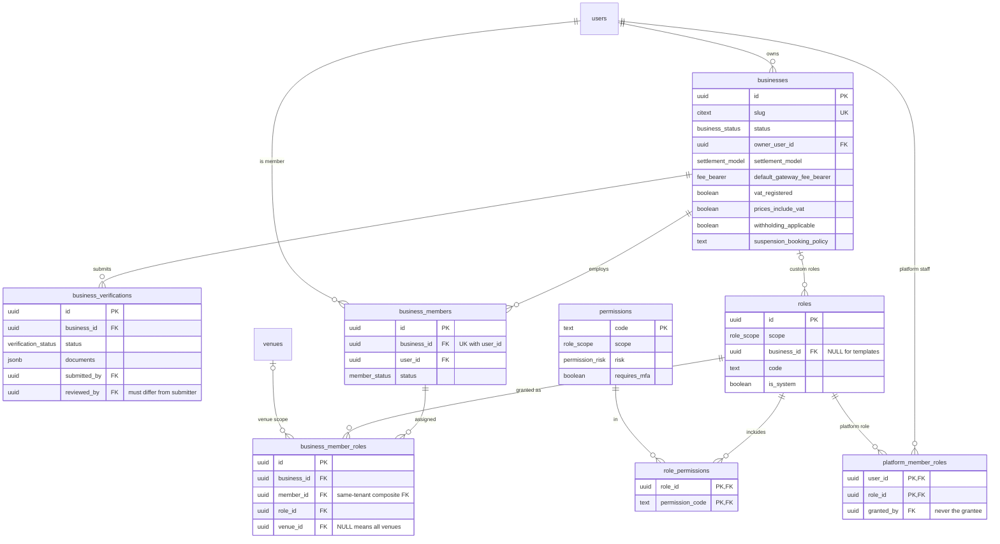

### 3.3 Venues and courts

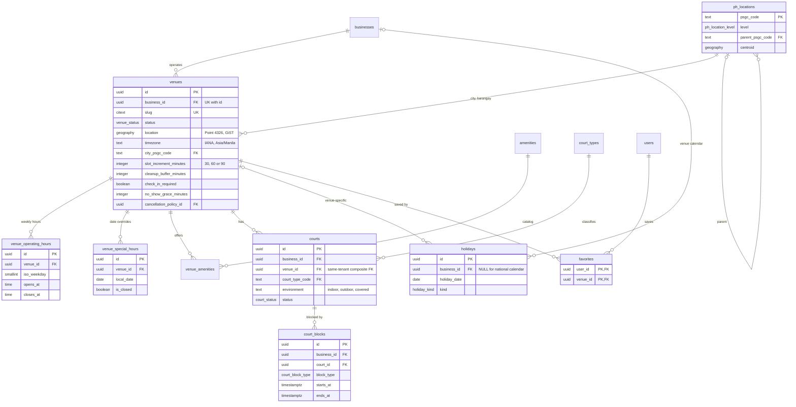

### 3.4 Availability and booking

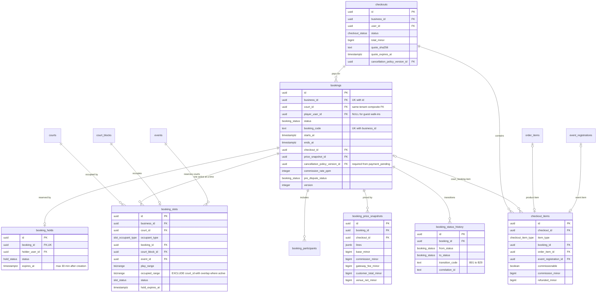

### 3.5 Pricing, promotions and policies

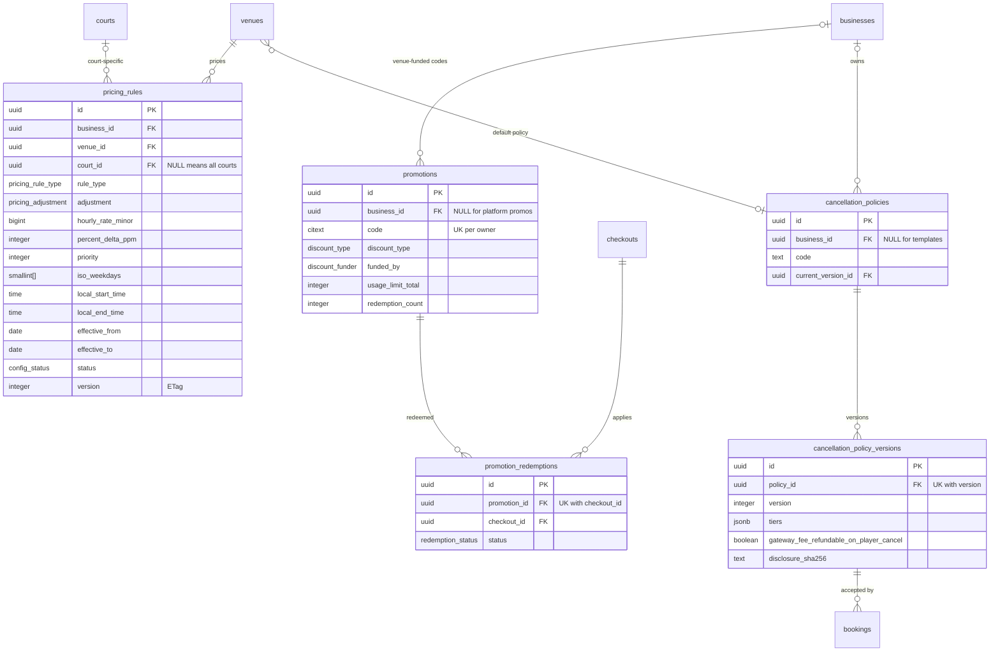

### 3.6 Payments, ledger and settlement

Payments, refunds and disputes:

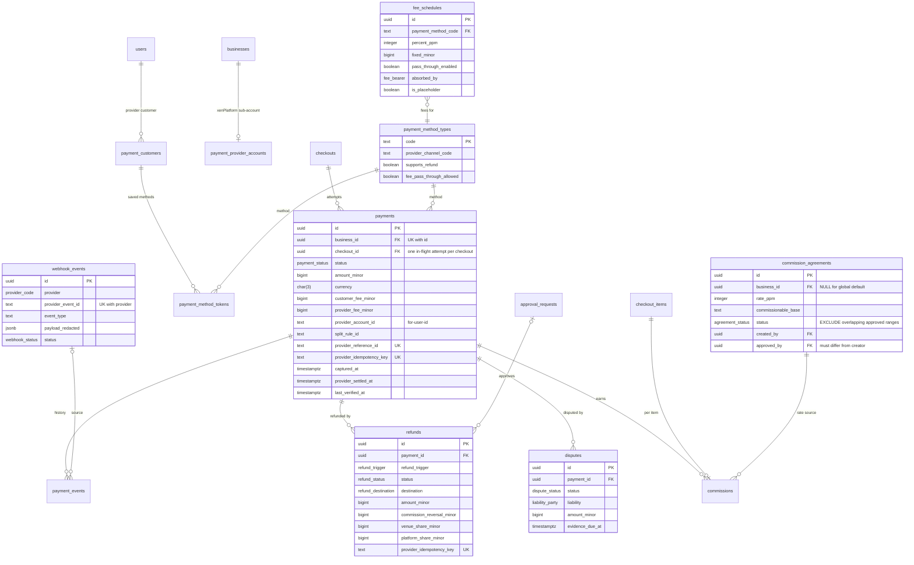

Ledger, settlement, payouts and reconciliation:

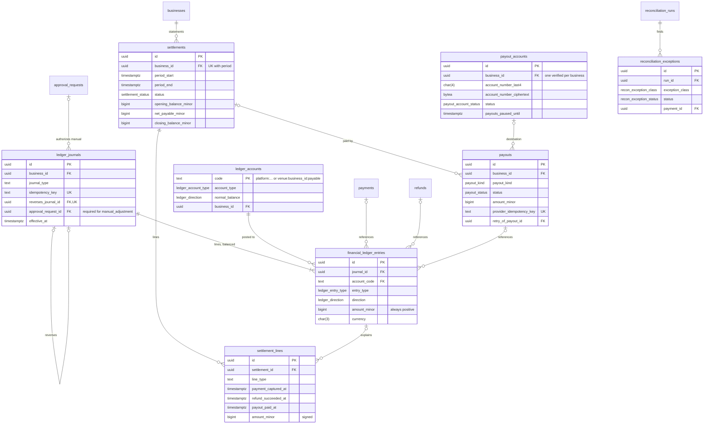

### 3.7 Events and ratings

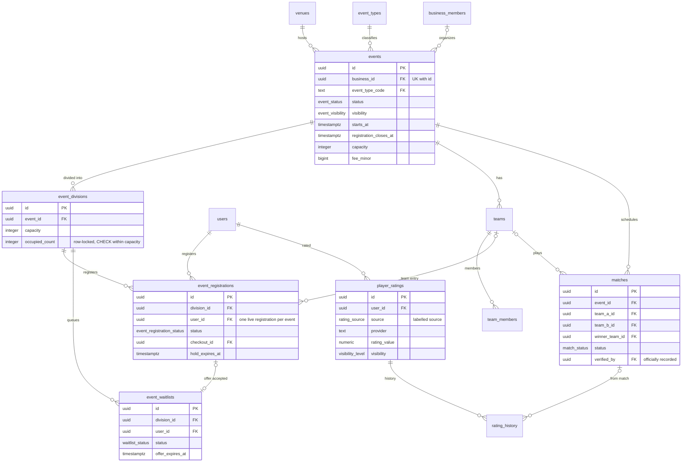

### 3.8 Products and orders

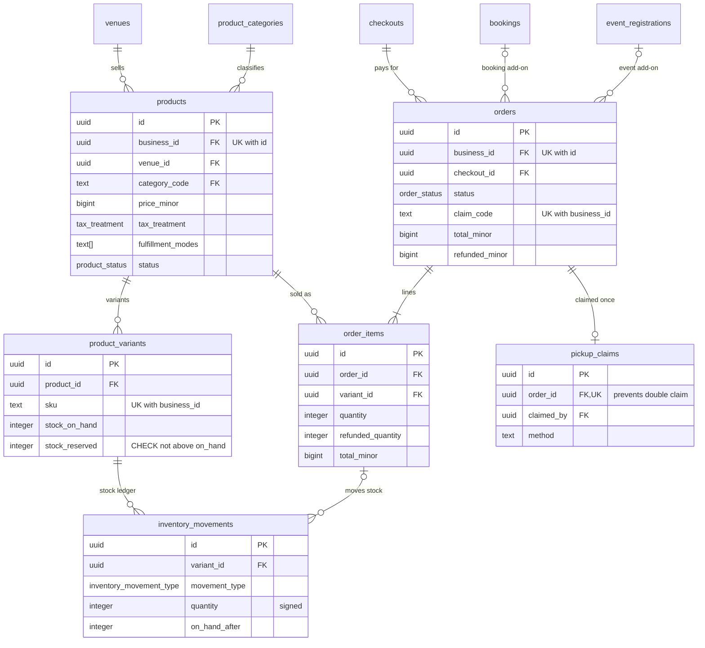

### 3.9 Trust, safety and reviews

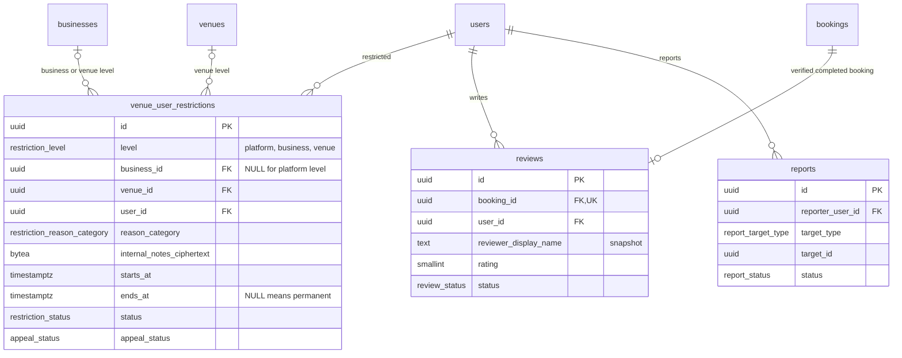

### 3.10 Notifications and support

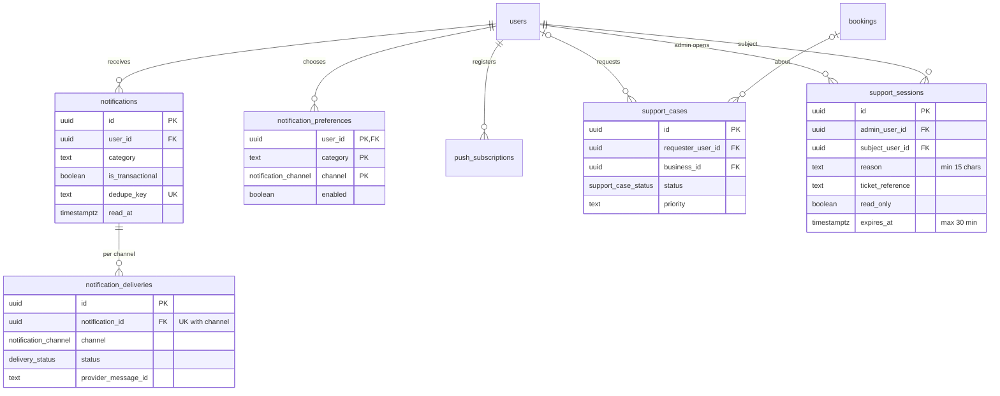

### 3.11 Platform ops and audit

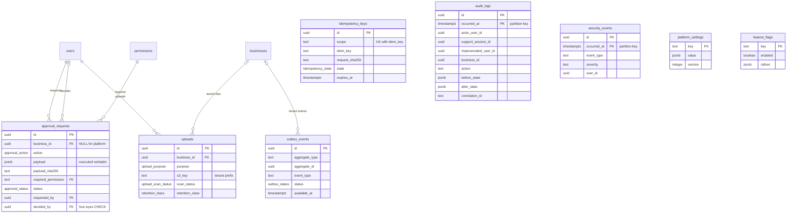

## 4. Retention classes

Retention durations are defaults pending confirmation by counsel and the DPO (doc 15 holds the privacy matrix).
`retention.enforce` applies them daily; `R6_legal_hold` suspends deletion for affected subjects or businesses.

| Class (`app.retention_class`) | Default | Basis | Deletion behaviour |
|---|---|---|---|
| `R1_session` | Until expiry + 30 days (idempotency keys: 24 h) | Security operations | Hard delete |
| `R2_operational` | 13 months after last activity or closure (per-table overrides in §5) | Operations; covers card dispute windows (about 6 months) | Hard delete or partition drop; configuration history lives in `audit.audit_logs` |
| `R3_account` | Life of the account. On deletion request: 30-day grace, then deletion or anonymization within 30 days | Contract / consent (RA 10173) | Personal fields scrubbed (`users.anonymized_at`); rows needed by R4/R5 keep pseudonymous ids only |
| `R4_financial` | 10 years after the end of the transaction's calendar year | NIRC Sec. 235 as amended by RA 11976 requires 5 years from the filing deadline (longer if a case is pending); 10 years also covers civil-law prescription of written contracts. **Confirm with counsel** | Archive, then delete; personal data minimized once R3 ends |
| `R5_audit` | 13 months hot in PostgreSQL; archive in S3 Object Lock for 10 years (`audit_logs`) or 2 years (`security_events`); consent and DSR evidence 5 years after closure | Accountability, incident response, NPC demonstrations of compliance | Detach and drop partitions after a verified archive |
| `R6_legal_hold` | Until released | Litigation, regulator or law-enforcement request | Blocks deletion |

## 5. Table catalog

Legend. **Tenant:** tenant column (`business_id`) or "global". **RLS:** policy families (doc 10 §5.1), or "grants"
where RLS is not used. **Delete:** `soft` (`deleted_at`), `append-only`, `status` (never deleted, lifecycle by status),
`hard` (disposable), `expire` (retention job). **Ret.:** retention class (§4).

### 5.1 Identity and access

| Table | Purpose and key columns | Keys and constraints | Indexes | Tenant · RLS · Delete · Ret. |
|---|---|---|---|---|
| `users` | Global identity: `email` (citext), `phone_e164`, `password_hash` (Argon2id PHC), `status`, `is_platform_staff`, `mfa_enrolled`, lockout counters | PK `id`; UK `email`, `phone_e164`; CHECK contact present, E.164 format, `password_hash LIKE '$argon2id$%'` | `users_status_idx` | global · `users_self`, `users_platform`, definer · soft + anonymize · R3 |
| `user_profiles` | Display name, names, avatar, self-declared level (labelled), home PSGC, visibility | PK/FK `user_id`; FK `avatar_upload_id`, `home_psgc_code`; CHECK level format | PK | global · `self_access`, `platform_access` · cascade with user · R3 |
| `user_addresses` | Billing addresses (optional, for invoices) with PSGC codes | PK `id`; FK `user_id`; CHECK postal code; one default per user | `user_addresses_user_idx`, `user_addresses_one_default` (unique partial) | global · self · soft · R3 |
| `user_preferences` | Location permission state (no coordinates stored), marketing opt-in, cookie preferences, language | PK/FK `user_id`; CHECK permission values | PK | global · self · cascade · R3 |
| `identities` | External identity providers (OIDC subject) | PK `id`; UK `(provider, provider_subject)`; CHECK provider ≠ password | `identities_user_idx` | global · self · hard on unlink · R3 |
| `sessions` | Opaque session token hash per surface, refresh-rotation family, timeouts, device and IP, support session link | PK `id`; UK `token_hash`, `refresh_token_hash`; CHECK 32-byte hashes, idle ≤ absolute, revoke reasons | `sessions_user_active_idx`, `sessions_expiry_idx` | global · self, platform, definer (`fn_auth_resolve_session`) · expire · R1 |
| `mfa_factors` | TOTP secret (KMS envelope ciphertext), replay step | PK `id`; FK `user_id` | `mfa_factors_user_idx` | global · self, system only · hard on disable + 30 d · R3 |
| `mfa_recovery_codes` | Hashed one-time recovery codes | PK `id`; FK `user_id` | `mfa_recovery_codes_user_idx` | global · self, system · hard · R3 |
| `verification_tokens` | Email/phone verification, password reset, email change, staff invitation, login OTP (hash only) | PK `id`; UK `token_hash`; CHECK attempts 0–10 | `verification_tokens_user_idx` | global (+ `business_id` for invitations) · self, `business_invitations`, system, definer · expire · R1 |
| `consents` | Consent log per purpose and document version (grant or withdrawal rows) | PK `id`; FK `user_id`; CHECK purpose and source values | `consents_latest_idx` | global · self, platform · append-only · R5 (5 years after closure) |
| `data_subject_requests` | Access, export, correction, deletion, objection requests with due dates | PK `id`; FK `user_id`, `export_upload_id`; CHECK `due_at > received_at` | `data_subject_requests_open_idx` | global · self, platform · status · R5 |

### 5.2 Tenancy and RBAC

| Table | Purpose and key columns | Keys and constraints | Indexes | Tenant · RLS · Delete · Ret. |
|---|---|---|---|---|
| `businesses` | Tenant: legal/display name, slug, status, owner, TIN (ciphertext + last 4), VAT flags, withholding flags, `settlement_model`, default fee bearer, suspension policy | PK `id`; UK `slug`; FK `owner_user_id`, `approved_by`; CHECK active ⇒ approved, suspended ⇒ reason, bearer ≠ customer | `businesses_status_idx`, `businesses_owner_idx`, `businesses_name_trgm` | is the tenant · `business_self`, `owner_onboarding`, `public_read` (active), `platform_all` · soft · R4 |
| `business_verifications` | Verification submissions, documents (upload refs), Internet Transactions Act checklist, review decision | PK `id`; FK `business_id`, `submitted_by`, `reviewed_by`; CHECK review fields consistent, reviewer ≠ submitter | `business_verifications_business_idx`, `…_queue_idx` | `business_id` · tenant_isolation · status · R4 |
| `business_members` | Staff membership (invited, active, suspended, removed) | PK `id`; UK `(business_id, user_id)`, `(business_id, id)`; FK `user_id` | `business_members_user_idx` | `business_id` · tenant_isolation, `self_read` · status · R5 (access history) |
| `business_member_roles` | Role assignment, optionally venue-scoped | PK `id`; composite FK `(business_id, member_id)`; FK `role_id`, `venue_id`; UK `(member_id, role_id, venue or all)` | `business_member_roles_uniq`, `…_business_idx` | `business_id` · tenant_isolation, `self_read` · hard (history in audit) · R2 |
| `roles` | System templates (`business_id` NULL) and per-business copies/custom roles; platform roles | PK `id`; UK `(scope, business or NULL, code)` among non-deleted; CHECK platform roles have no business | `roles_code_uniq`, `roles_business_idx` | `business_id` (nullable) · tenant_isolation, template_read · soft · R2 |
| `permissions` | Permission catalog with risk and MFA requirement (exact codes from the brief) | PK `code`; CHECK dotted format | PK | global · ref_read / ref_write · none · R2 |
| `role_permissions` | Role → permission grants | PK `(role_id, permission_code)`; FK both; `business_id` denormalized | `role_permissions_business_idx` | `business_id` (nullable) · tenant_isolation, template_read · hard · R2 |
| `platform_member_roles` | Platform staff role grants with optional expiry | PK `(user_id, role_id)`; CHECK granter ≠ grantee | PK | global · `self_read`, `platform_all` · hard (history in audit) · R5 |

### 5.3 Venues and courts

| Table | Purpose and key columns | Keys and constraints | Indexes | Tenant · RLS · Delete · Ret. |
|---|---|---|---|---|
| `ph_locations` | PSGC region/province/city/municipality/barangay hierarchy with centroids and release tag | PK `psgc_code`; FK parent; CHECK code format | `ph_locations_parent_idx`, `…_name_trgm`, `…_centroid_gix` | global · ref_read/ref_write · none · R2 (replaced per PSGC release) |
| `amenities` | Amenity catalog (label, category, icon) | PK `code` | PK | global · ref · none · R2 |
| `court_types` | Court type catalog (full, half, custom) | PK `code` | PK | global · ref · none · R2 |
| `venues` | Venue profile, address (PSGC), `location` geography, timezone, rules, booking settings (min/max duration, increment 30/60/90, advance days, cleanup buffer, check-in, no-show grace), default cancellation policy, discovery denormalizations | PK `id`; UK `slug`, `(business_id, id)`; FKs to PSGC, uploads, policy; CHECK duration bounds and increments, published ⇒ location | `venues_location_gix` (GiST, published), `venues_name_trgm`, `venues_landmark_trgm`, `venues_city_idx`, `venues_barangay_idx`, `venues_business_idx` | `business_id` · tenant_isolation, `public_read` · soft · R2 (kept while referenced) |
| `venue_operating_hours` | Weekly hours (ISO weekday, local times, past-midnight flag) | PK `id`; UK `(venue_id, iso_weekday, opens_at)`; CHECK order | `…_business_idx` | `business_id` · tenant_isolation, public_read · hard (history in audit) · R2 |
| `venue_special_hours` | Date overrides and closures | PK `id`; unique `(venue_id, local_date, opens_at)`; CHECK closed vs open shape | `…_business_idx` | `business_id` · tenant_isolation, public_read · hard · R2 |
| `venue_amenities` | Venue ↔ amenity | PK `(venue_id, amenity_code)` | `venue_amenities_amenity_idx` | `business_id` · tenant_isolation, public_read · hard · R2 |
| `courts` | Courts with type, environment, surface, status | PK `id`; UK `(business_id, id)`; composite FK `(business_id, venue_id)`; unique name per venue | `courts_name_per_venue`, `courts_business_idx` | `business_id` · tenant_isolation, public_read · soft · R2 (kept while referenced) |
| `court_blocks` | Maintenance, closures, private use, weather blocks (occupy `booking_slots`) | PK `id`; composite FK `(business_id, court_id)`; CHECK `ends_at > starts_at` | `court_blocks_court_time_idx`, `…_business_idx` | `business_id` · tenant_isolation · `removed_at` · R2 |
| `holidays` | National calendar (`business_id` NULL) and venue/business closures or holiday pricing days | PK `id`; unique `(business, venue, date, name)`; CHECK venue ⇒ business | `holidays_uniq`, `holidays_date_idx` | `business_id` (nullable) · tenant_isolation, template_read, public_read · hard · R2 |
| `favorites` | Player ↔ venue favorites | PK `(user_id, venue_id)` | `favorites_venue_idx` | global · self · hard · R3 |

### 5.4 Availability and booking

| Table | Purpose and key columns | Keys and constraints | Indexes | Tenant · RLS · Delete · Ret. |
|---|---|---|---|---|
| `bookings` | Booking aggregate: court, times, player or guest, status, code, checkout, accepted policy version, commission snapshot, summary amounts, lifecycle timestamps, `pre_dispute_status`, `version` | PK `id`; UK `(business_id, booking_code)`, `(business_id, id)`; composite FKs to venue and court; CHECK time order, customer present, policy/commission/checkout required from `payment_pending`, `confirmed_at` for paid states, dispute restore, refund ≤ total; guard trigger; deferred slot-invariant trigger | `bookings_business_start_idx`, `…_venue_date_idx`, `…_court_start_idx`, `…_player_idx`, `…_checkout_idx`, `…_to_complete_idx`, `…_reminders_idx`, `…_status_idx` | `business_id` · tenant_isolation, player_own, definer · status · R4 |
| `booking_holds` | Temporary reservation contract: holder, expiry (one extension), release reason | PK `id`; UK `booking_id`; composite FKs to booking and court; CHECK expiry ≤ 30 min, release consistency | `booking_holds_active_user_idx`, `…_expiry_idx` | `business_id` · tenant_isolation, player_own, definer · status · R2 |
| `booking_slots` | Court occupancy for bookings (holds included), court blocks and event reservations | PK `id`; **EXCLUDE USING gist (court_id WITH =, occupied_range WITH &&) WHERE status = 'active'**; CHECK one occupant, range shape (half-open, bounded, occupied ⊇ play), hold only for bookings, release consistency; composite FKs | exclusion index; `booking_slots_one_active_per_booking` (unique partial), `…_one_active_per_block`, `…_stale_holds_idx`, `…_business_idx`, `…_event_idx` | `business_id` · tenant_isolation, player_via_booking, public_read (active), definer · status (released rows kept) · R4 |
| `booking_participants` | Players invited to a booking | PK `id`; composite FK to booking; unique `(booking_id, user_id)` | `booking_participants_user_idx` | `business_id` · tenant_isolation, player_via_booking · hard · R2 |
| `booking_price_snapshots` | Immutable pricing: slices with rule ids/versions, lines, base, discounts by funder, commission (agreement, rate, amount), fee and bearer, taxes, customer total, venue net, quote expiry | PK `id`; composite FK to booking; FK checkout, agreement, fee schedule, promotion, superseded snapshot; CHECK commissionable ≤ base | `booking_price_snapshots_booking_idx` | `business_id` · tenant_isolation, player_via_booking · append-only · R4 |
| `booking_status_history` | Every transition (B01–B29) with actor, support session, reason, correlation id | PK `id`; composite FK to booking; CHECK code format, actor type | `booking_status_history_booking_idx` | `business_id` · tenant_isolation, player_via_booking, definer · append-only · R4 |
| `checkouts` | Checkout aggregate: quote lines and hash, totals, method, fee schedule, promotion, accepted policy version, quote expiry | PK `id`; CHECK total formula, `paid_at` consistency | `checkouts_user_idx`, `…_business_idx`, `…_open_expiry_idx` | `business_id` · tenant_isolation, player_own · status · R4 |
| `checkout_items` | Line items (court booking, product, event registration) with discounts by funder, tax, commissionable base, commission, refunded amount | PK `id`; FKs to checkout, booking (composite), order item, registration; CHECK reference shape, gross = unit × qty, commission flag, refund bound | `checkout_items_checkout_idx`, `…_booking_idx` | `business_id` · tenant_isolation, player_via_checkout · status · R4 |

### 5.5 Pricing, promotions and policies

| Table | Purpose and key columns | Keys and constraints | Indexes | Tenant · RLS · Delete · Ret. |
|---|---|---|---|---|
| `pricing_rules` | Base, time-of-day, peak/off-peak, weekday/weekend, holiday, date override, seasonal, event, member, promotional, minimum charge, temporary override; scope venue/court; weekdays, local time window, date window, priority, refundable flag, version | PK `id`; FKs venue, court, creators; CHECK adjustment shape, time window, date window, weekday set, priority range | `pricing_rules_lookup_idx` (active by priority), `…_court_idx`, `…_business_idx` | `business_id` · tenant_isolation, public_read (active) · status `archived` · R2 (history in audit) |
| `promotions` | Promo codes: owner (business or platform), percent or fixed, cap, min spend, funder, applicability, venues, window, usage limits, counter | PK `id`; unique `(owner, code)` among non-archived; CHECK funder matches owner, value shape, window, count ≤ limit | `promotions_code_uniq`, `…_business_idx` | `business_id` (nullable) · tenant_isolation, template_read, public_read (active) · status · R4 |
| `promotion_redemptions` | Reservation then redemption of a promo per checkout | PK `id`; UK `(promotion_id, checkout_id)` | `…_user_idx`, `…_business_idx` | `business_id` · tenant_isolation, player_own · status · R4 |
| `cancellation_policies` | Named policies (Standard, Flexible, Strict, Non-refundable templates, or custom) | PK `id`; unique `(owner, code)`; FK current version | `cancellation_policies_code_uniq` | `business_id` (nullable) · tenant_isolation, template_read, public_read · status · R4 |
| `cancellation_policy_versions` | Immutable versions: tiers (hours before start → refund ppm), fee refundability, reschedule allowance, no-show rule, disclosure text + SHA-256 | PK `id`; UK `(policy_id, version)`; CHECK tiers array, reschedule bounds | UK | `business_id` (nullable) · tenant_isolation, template_read, public_read · append-only · R4 |

### 5.6 Payments, ledger and settlement

| Table | Purpose and key columns | Keys and constraints | Indexes | Tenant · RLS · Delete · Ret. |
|---|---|---|---|---|
| `payment_method_types` | PH method catalog with provider channel code and capabilities (refund, partial refund, window, fee return, tokenization, fee pass-through allowed). **Provider-dependent** | PK `code`; UK `(provider, provider_channel_code)` | UK | global · ref · none · R2 |
| `payment_provider_accounts` | xenPlatform sub-account per business (`provider_account_id` = `for-user-id`), MANAGED/OWNED, status, capabilities | PK `id`; UK `(provider, provider_account_id)`; one pending/active per business | `payment_provider_accounts_one_active` | `business_id` · tenant_read, platform_write · status · R4 |
| `payment_customers` | Provider customer objects for a user | PK `id`; UK `(provider, provider_customer_id)`, `(provider, user_id, scope)` | UKs | global · self · hard with account · R3 |
| `payment_method_tokens` | Saved methods: provider token + masked metadata only (brand, last 4, expiry, masked wallet) | PK `id`; UK `(provider, provider_token_id)`; CHECK last 4 digits, expiry ranges, wallet mask; one default per user | `payment_method_tokens_one_default` | global · self · status `revoked` · R3 |
| `payments` | Payment attempts: amount, currency, customer fee, actual provider fee, split rule and status, provider ids, reference id, provider idempotency key, lifecycle timestamps, verification time, refunded/disputed totals, version | PK `id`; UK `provider_reference_id`, `provider_idempotency_key`, `(business_id, id)`; unique partial one in-flight per checkout; unique provider ids; CHECK refund bound, captured ⇒ `captured_at`, split model ⇒ sub-account; guard trigger | `payments_pending_sweep_idx`, `…_business_captured_idx`, `…_checkout_idx`, `…_user_idx` | `business_id` · tenant_isolation, player_own · status · R4 |
| `payment_events` | Payment history: source (webhook, provider query, reconciliation, …), provider status, from/to status | PK `id`; composite FK to payment; FK webhook event | `payment_events_payment_idx` | `business_id` · tenant_read, platform_write · append-only · R4 |
| `webhook_events` | Inbound provider notifications, redacted headers and payload, hash, processing status | PK `id`; **UK `(provider, provider_event_id)`** | `webhook_events_work_idx`, `…_received_idx`, `…_payment_idx` | global (resolved `business_id`) · **grants** (`app_api` insert/select, `app_worker` select/update/delete) · expire · R2 |
| `refunds` | Refund with trigger, status, destination, component amounts, commission reversal, venue/platform shares, policy version and tier, approval, provider refs, after-payout flag, version | PK `id`; composite FKs to payment and booking; FK order, registration, checkout item, approval; UK provider idempotency key, provider refund id; CHECK components sum, shares sum, `succeeded_at` consistency | `refunds_payment_idx`, `…_business_idx`, `…_sync_idx` | `business_id` · tenant_isolation, player_via_payment · status · R4 |
| `disputes` | Chargebacks/disputes: status, reason code, amount, fee, liability and rule, evidence deadline and uploads, source | PK `id`; composite FK to payment; unique provider dispute id; CHECK resolution consistency | `disputes_open_idx`, `…_business_idx` | `business_id` · tenant_read, platform_write · status · R4 |
| `commission_agreements` | Global default (`business_id` NULL) and per-business agreements: rate ppm, base definition, product/event applicability, effective range, maker-checker approval | PK `id`; **EXCLUDE overlapping approved ranges per business**; CHECK range, approver ≠ creator, approved fields | `commission_agreements_business_idx` | `business_id` (nullable) · tenant_read, template_read, platform_write, definer · status · R4 |
| `fee_schedules` | Gateway fee per method: percent ppm + fixed, VAT on fee, pass-through toggle, bearer when absorbed, effective range, placeholder flag | PK `id`; **EXCLUDE overlapping approved ranges per (business, method)**; CHECK bounds, maker-checker | exclusion index | `business_id` (nullable) · tenant_read, template_read, platform_write, definer · status · R4 |
| `commissions` | Commission per checkout item: agreement, rate, base, amount, reversed amount, status | PK `id`; UK `checkout_item_id`; composite FK to payment; CHECK reversal ≤ amount | `commissions_business_idx` | `business_id` · tenant_read, platform_write · status · R4 |
| `ledger_accounts` | Chart of accounts: 9 platform accounts + one `venue:{business_id}:payable` per business | PK `code`; CHECK code shape matches owner and business | PK | venue rows carry `business_id` · `account_read`, `account_write` · none · R4 |
| `ledger_journals` | Journal header: type, source, idempotency key, reversal link, approval (manual), effective date, correlation id | PK `id`; UK `idempotency_key`, `reverses_journal_id`; CHECK journal types, manual ⇒ approval, reversal link; deferred trigger (≥ 2 lines) | `ledger_journals_source_idx`, `…_business_idx` | `business_id` (nullable) · tenant_read, platform_write, definer · append-only · R4 |
| `financial_ledger_entries` | Double-entry lines: account, entry type, direction, positive amount, currency, source references | PK `id`; FKs to journal, account, payment/refund/payout/dispute/booking/item; CHECK amount > 0; **deferred constraint trigger: journal balances per currency**; tenant trigger (lines match journal tenant) | `fle_journal_idx`, `fle_account_time_idx`, `fle_business_time_idx`, `fle_payment_idx`, `fle_refund_idx`, `fle_payout_idx` | `business_id` · `venue_lines_read`, `platform_post`, definer · append-only · R4 |
| `settlements` | Statement per business and period: model, status, opening/gross/discounts/commission/fees/refunds/chargebacks/adjustments/withholding/net/paid/closing | PK `id`; UK `(business_id, period_start, period_end)`, `(business_id, id)`; CHECK period, net formula, closing formula | UKs | `business_id` · tenant_read, platform_write · status · R4 |
| `settlement_lines` | Statement lines with every date basis and ledger link | PK `id`; composite FK to settlement; FKs to entry, booking, payment, refund, payout; CHECK line types | `settlement_lines_settlement_idx` | `business_id` · tenant_read, platform_write · status · R4 |
| `payouts` | Money leaving the provider to a venue bank: kind (sub-account withdrawal, platform payout), status, amount, provider ids, idempotency key, schedule, failure/reversal, retry link | PK `id`; UK provider idempotency key, provider payout id; composite FK to settlement; CHECK `paid_at`, destination | `payouts_sync_idx`, `…_business_idx` | `business_id` · tenant_read, platform_write · status · R4 |
| `payout_accounts` | Payout destination: channel, holder name, last 4, envelope-encrypted number (worker-only), verification, approval, cooling-off | PK `id`; one verified per business; FK approval | `payout_accounts_one_verified` | `business_id` · tenant_isolation (Owner only via `finance.manage_payout_account`) · status `disabled` · R4 |
| `reconciliation_runs` | Pending sweeps and daily provider matches with stats and raw report file | PK `id`; unique daily run per provider/account/window; CHECK window | `reconciliation_runs_daily_uniq` | global · platform_all · none · R4 |
| `reconciliation_exceptions` | Mismatches by class with auto-heal action and resolution | PK `id`; FK run, payment, refund, payout | `…_open_idx`, `…_business_idx` | global (+ `business_id`) · platform_all · status · R4 |

### 5.7 Events and ratings

| Table | Purpose and key columns | Keys and constraints | Indexes | Tenant · RLS · Delete · Ret. |
|---|---|---|---|---|
| `event_types` | Tournament, league, clinic, training, open play, social, private | PK `code` | PK | global · ref · none · R2 |
| `events` | Event definition: type, organizer, schedule, registration window, capacity, fee, team settings, skill/age category, format, prizes, rules, policy version, visibility, status | PK `id`; UK `(business_id, slug)`, `(business_id, id)`; composite FK organizer; CHECK time order, team size | `events_schedule_idx`, `…_public_idx`, `…_name_trgm` | `business_id` · tenant_isolation, public_read · status · R2 (kept while referenced) |
| `event_divisions` | Divisions with capacity and `occupied_count` (row-locked seat accounting) | PK `id`; composite FK to event; UK `(event_id, name)`; CHECK occupied within capacity | UK | `business_id` · tenant_isolation, public_read · status · R2 |
| `event_registrations` | Registration lifecycle (held → pending_payment → confirmed …), checkout, hold expiry | PK `id`; composite FK to event; UK `(business_id, id)`; one live registration per user per event; CHECK hold expiry for held/offered | `…_one_live_per_user`, `…_division_idx`, `…_user_idx`, `…_hold_expiry_idx` | `business_id` · tenant_isolation, player_own · status · R4 |
| `event_waitlists` | FIFO waitlist with timed offers | PK `id`; one live entry per user per division; CHECK offer shape | `…_queue_idx`, `…_offer_expiry_idx` | `business_id` · tenant_isolation, player_own · status · R2 |
| `teams` | Teams per event/division, captain | PK `id`; unique name per event | `teams_name_per_event` | `business_id` · tenant_isolation, public_read · hard before event · R2 |
| `team_members` | Team membership with invitation status | PK `(team_id, user_id)` | PK | `business_id` · tenant_isolation, player_own · hard · R2 |
| `matches` | Scheduled matches, scores, winner, recorder and verifier ("officially recorded" = verified) | PK `id`; unique `(event, division, round, match)`; CHECK distinct teams, winner is a participant | `matches_slot_uniq` | `business_id` · tenant_isolation, public_read · status · R3 (player stats) |
| `player_ratings` | Ratings by labelled source: self-declared, venue-verified, platform recreational, external provider (Phase 2, official API + user authorization) | PK `id`; unique `(user, source, provider, business)`; CHECK source shape | `player_ratings_uniq` | global (+ verifying `business_id`) · self, platform · hard with account · R3 |
| `rating_history` | Rating changes over time, optional match link | PK `id`; FK rating, match | `rating_history_user_idx` | global · self, platform · hard with account · R3 |

### 5.8 Products and orders

| Table | Purpose and key columns | Keys and constraints | Indexes | Tenant · RLS · Delete · Ret. |
|---|---|---|---|---|
| `product_categories` | Food, drinks, merchandise, balls, paddle rental, equipment, services | PK `code` | PK | global · ref · none · R2 |
| `products` | Product: venue, category, price, tax treatment, fulfillment modes (pickup only, booking add-on, event add-on, standalone), max quantity, pickup instructions, availability schedule, inventory tracking, images | PK `id`; UK `(business_id, id)`; CHECK fulfillment modes subset, quantity bounds | `products_venue_idx`, `products_name_trgm` | `business_id` · tenant_isolation, public_read · soft · R2 |
| `product_variants` | SKU variants with price override and stock (`stock_on_hand`, `stock_reserved`) | PK `id`; UK `(business_id, sku)`, `(business_id, id)`; composite FK to product; CHECK 0 ≤ reserved ≤ on hand | `product_variants_product_idx` | `business_id` · tenant_isolation, public_read · status · R2 |
| `inventory_movements` | Stock ledger: receipt, reservation, release, sale, return, adjustment, write-off with resulting levels | PK `id`; composite FK to variant; FK order item; CHECK non-zero quantity, non-negative results | `inventory_movements_variant_idx` | `business_id` · tenant_isolation · append-only · R4 |
| `orders` | Product order: checkout, optional booking/registration link, status, claim code, totals, refunds, lifecycle timestamps | PK `id`; UK `(business_id, claim_code)`, `(business_id, id)`; composite FKs; CHECK total formula, refund bound, claimed consistency | `orders_venue_status_idx`, `…_user_idx`, `…_checkout_idx` | `business_id` · tenant_isolation, player_own, definer read · status · R4 |
| `order_items` | Lines with name snapshot, quantity, unit price, discount, tax, totals, refunded quantity | PK `id`; composite FKs to order, product, variant; CHECK total formula, refund bounds | `order_items_order_idx` | `business_id` · tenant_isolation, player_via_order · status · R4 |
| `pickup_claims` | Claim record (QR, code or manual) by staff | PK `id`; **UK `order_id` (prevents double claim)**; composite FK | UK | `business_id` · tenant_isolation · none · R4 |

### 5.9 Trust, safety and reviews

| Table | Purpose and key columns | Keys and constraints | Indexes | Tenant · RLS · Delete · Ret. |
|---|---|---|---|---|
| `venue_user_restrictions` | Restrictions at platform, business or venue level: reason category, encrypted internal notes, evidence, effective period (permanent if no end), status, appeal status, approver, lift details | PK `id`; CHECK level shape, period, lifted consistency | `restrictions_active_user_idx`, `…_business_idx`, `…_expiry_idx` | `business_id` (NULL for platform level) · tenant_isolation, definer (`fn_booking_eligibility`) · status · R2 (24 months after lifted or expired) |
| `reviews` | One review per verified completed booking: rating, text, reviewer name snapshot, business response, moderation | PK `id`; UK `booking_id`; composite FK to booking; CHECK rating 1–5, lengths | `reviews_venue_idx` | `business_id` · tenant_isolation, player_own, public_read (published) · status `removed` · R3 |
| `reports` | Reports about users, venues, events, products, reviews, businesses | PK `id`; FK reporter, assignee | `reports_queue_idx`, `…_target_idx` | global (+ `business_id`) · reporter_access, platform_all · status · R2 |

### 5.10 Notifications and support

| Table | Purpose and key columns | Keys and constraints | Indexes | Tenant · RLS · Delete · Ret. |
|---|---|---|---|---|
| `notifications` | In-app notification and delivery root: category, transactional flag, content, deep-link data, dedupe key | PK `id`; UK `dedupe_key`; CHECK category format | `notifications_inbox_idx` | global (+ context `business_id`) · self, platform · expire · R2 |
| `notification_deliveries` | Per-channel delivery attempts (email, SMS, push) with provider message id | PK `id`; UK `(notification_id, channel)` | `…_queue_idx` | global · platform_all (worker) · expire · R2 |
| `notification_preferences` | Per category × channel preference (transactional/security categories cannot be disabled; enforced in the service) | PK `(user_id, category, channel)` | PK | global · self · hard · R3 |
| `push_subscriptions` | Web Push endpoints and keys (auth secret encrypted) | PK `id`; UK `endpoint` | `push_subscriptions_user_idx` | global · self, system · hard · R3 |
| `support_cases` | Support tickets with links to bookings/payments and external ticket reference | PK `id`; CHECK requester present | `support_cases_queue_idx` | `business_id` (nullable) · tenant_isolation, requester_access · status · R2 (24 months) |
| `support_sessions` | Support-mode sessions: admin, subject, reason, ticket, read-only, expiry | PK `id`; CHECK duration ≤ 30 min, reason length, not self; one active per admin | `support_sessions_one_active_per_admin` | global · platform_all · none · R5 |

### 5.11 Platform ops and audit

| Table | Purpose and key columns | Keys and constraints | Indexes | Tenant · RLS · Delete · Ret. |
|---|---|---|---|---|
| `platform_settings` | Typed configuration (timing parameters, thresholds); never secrets | PK `key`; CHECK key format | PK | global · ref (write: platform) · none · R2 (history in audit) |
| `feature_flags` | Flags with rollout rules (business/user allowlists, percentage) | PK `key` | PK | global · ref · none · R2 |
| `approval_requests` | Maker-checker requests: action, target, exact payload + hash, required permission, decision, expiry, execution | PK `id`; CHECK four-eyes, decision consistency, execution after approval | `approval_requests_queue_idx`, `…_business_idx`, `…_target_idx` | `business_id` (nullable) · tenant_isolation · status · R4 |
| `uploads` | File registry: tenant/user prefix, bucket, content type allow-list, size cap (20 MiB), SHA-256, malware scan status, renditions, retention class | PK `id`; UK `(s3_bucket, s3_key)`; CHECK content types, size, hash format | `uploads_business_idx`, `uploads_pending_scan_idx` | `business_id` (nullable) · tenant_isolation, self_uploads · soft · per `retention_class` |
| `outbox_events` | Transactional outbox: aggregate, event type/version, payload, status, attempts | PK `id`; CHECK event type format | `outbox_events_pending_idx`, `…_aggregate_idx` | `business_id` (nullable) · `outbox_append`, `outbox_dispatch` (system), definer · expire (7 days after dispatch) · R2 |
| `idempotency_keys` | API idempotency: scope, key, route, request hash, state, lease, stored response, resource | PK `id`; **UK `(scope, idem_key)`**; CHECK key length, completed ⇒ status | `idempotency_keys_expiry_idx` | scope string · **grants** · expire (24 h) · R1 |
| `audit.audit_logs` | Append-only audit: actor, support session, impersonated subject, scope, business/venue, action, target, outcome, before/after (redacted), IP/device (if permitted), correlation id | PK `(id, occurred_at)`; **partitioned monthly**; CHECK action format, scope, outcome; append-only trigger | business/time, actor/time, target, action/time | `business_id` (nullable) · `audit_append`, `audit_business_read`, `audit_platform_read`, definer · append-only · R5 |
| `audit.security_events` | Logins, failures, lockouts, MFA events, token reuse, webhook token failures, rate limiting, cross-tenant probes, support-mode start/end, double-booking attempts, exports | PK `(id, occurred_at)`; **partitioned monthly**; CHECK event types, severity | user/time, type/time | global (+ `business_id`) · `security_append`, `security_platform_read` · append-only · R5 |

## 6. Coverage of the product brief's minimum table list

| Brief table | Implemented as | Brief table | Implemented as |
|---|---|---|---|
| users, user_profiles, user_addresses, user_preferences, identities, sessions | Same names | businesses, business_verifications | Same names |
| venues, venue_operating_hours, venue_special_hours | Same names | courts, court_blocks, amenities, venue_amenities | Same names |
| roles, permissions, role_permissions | Same names | business_members, business_member_roles | Same names (`venue_id` scope on assignments) |
| booking_slots, booking_holds, bookings | Same names; **booking occupancy is `booking_slots`** (holds, bookings, blocks, events) | booking_participants, booking_price_snapshots | Same names |
| pricing_rules, promotions, promotion_redemptions | Same names | payment_customers, payment_method_tokens | Same names |
| payments, payment_events | Same names | financial_ledger_entries | Same name, plus `ledger_journals` headers and `ledger_accounts` |
| commissions, settlements, payouts, refunds, disputes | Same names | events, event_divisions, event_registrations, event_waitlists | Same names |
| teams, matches, player_ratings, rating_history | Same names (+ `team_members`) | products, product_variants, inventory_movements | Same names |
| orders, order_items, pickup_claims | Same names | venue_user_restrictions | Same name (`level` platform/business/venue) |
| reviews, reports | Same names | notifications, notification_preferences | Same names (+ `notification_deliveries`, `push_subscriptions`) |
| support_cases | Same name | audit_logs, security_events | `audit.audit_logs`, `audit.security_events` |
| webhook_events, idempotency_keys | Same names | feature_flags, platform_settings | Same names |

Additional tables required by the design brief or this design: `checkouts`, `checkout_items`, `ledger_journals`,
`outbox_events`, `approval_requests`, `support_sessions`, `commission_agreements`, `fee_schedules`,
`cancellation_policies`, `cancellation_policy_versions`, `holidays`, `favorites`, `ph_locations`, `uploads`,
`data_subject_requests`, `consents`, `ledger_accounts`, `booking_status_history`, `settlement_lines`,
`payment_provider_accounts`, `payout_accounts`, `payment_method_types`, `reconciliation_runs`,
`reconciliation_exceptions`, `platform_member_roles`, `mfa_factors`, `mfa_recovery_codes`, `verification_tokens`,
`court_types`, `event_types`, `product_categories`, `team_members`, `notification_deliveries`, `push_subscriptions`.

## 7. Migration and validation

| Topic | Rule |
|---|---|
| Tooling | Forward-only SQL migrations in `packages/db/migrations`, applied by the `courtko_migrator` role from CI/CD; Kysely types generated from the migrated database |
| Expand/contract | Additive changes first (new columns nullable or defaulted, new enum values, new tables); code switch; contract (drop old columns/values) in a later release |
| Locks | `CREATE INDEX CONCURRENTLY` for large tables; `ALTER TABLE … ADD CONSTRAINT … NOT VALID` then `VALIDATE CONSTRAINT`; `lock_timeout` 5 s in migrations |
| CI validation | Spin up a PostgreSQL 16 + PostGIS container; apply `schema.sql` / migrations; run the verification queries in the `schema.sql` footer (RLS coverage, policy coverage, fail-closed check); run the RLS matrix and invariant test suites (doc 10 §12, doc 20) |
| Data migrations | Run in `system` scope by the migrator; idempotent; batched; audited |
| Environments | No production data in dev/staging; synthetic seed data only, labelled synthetic |

---

## Addendum CR-01 (2026-10-06): new and changed tables

**New tables:** `sports`, `sport_formats`, `configuration_templates`, `space_units`, `court_configurations`, `court_configuration_units`, `court_conversion_rules`, `court_sports`, `court_media`, `court_equipment`, `court_maintenance_windows`, `venue_sports`, `open_play_sessions`, `open_play_staff`, `open_play_registrations`, `open_play_parties`, `party_invitations`, `attendance_events` (append-only), `open_play_games`, `open_play_queue`, `player_sport_profiles`, `follows`, `user_blocks`, `social_settings`.

**Key change:** `booking_slots` gains `space_unit_id` (one row per occupied unit) and the exclusion constraint becomes `EXCLUDE USING gist (space_unit_id WITH =, occupied_range WITH &&) WHERE (status = 'active')`. The constraint swap uses `NOT VALID` → backfill → `VALIDATE`.

Columns, constraints and the migration plan are in [doc 24 §4](24-change-impact-multisport.md).
