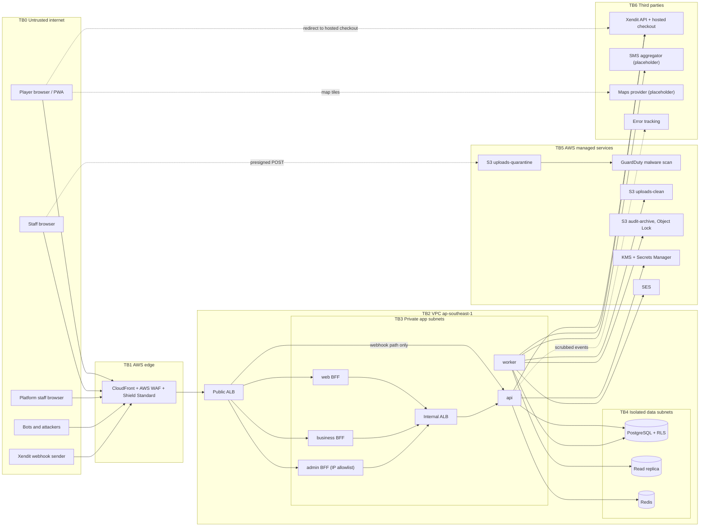
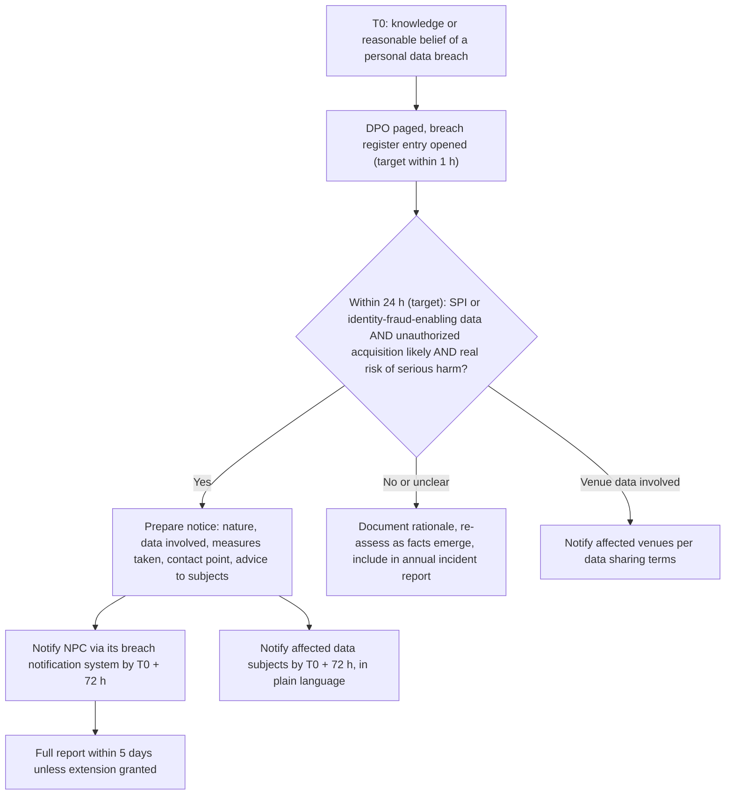

# 14 — Security Threat Model

| | |
|---|---|
| Product | CourtKo (working name) |
| Artifact | Design output 14 of 23 |
| Status | Draft for review. Describes the PRODUCTION system. Provider specifics (Xendit) are placeholders until the contract and KYB exist (doc 23 D-01). |
| Last updated | 2026-09-30 |
| Method | STRIDE per component + domain abuse cases; controls referenced by ID (§6); residual risk L/M/H (§7) |
| Related | [03 Roles & permissions](./03-role-permission-matrix.md) · [15 Privacy & retention](./15-privacy-data-retention-matrix.md) · [20 Testing](./20-testing-strategy.md) · [21 Deployment](./21-deployment-architecture.md) · [22 Monitoring](./22-operational-monitoring.md) · [23 Decisions](./23-assumptions-and-decisions.md) |

## 1. Scope, assets and security objectives

In scope: `apps/web`, `apps/business`, `apps/admin` (Next.js BFFs), `apps/api` (Fastify `/v1`), `apps/worker` (pg-boss), RDS PostgreSQL, ElastiCache Redis, S3 buckets, the Xendit webhook endpoint, support mode, CI/CD and AWS accounts, and integrations (Xendit, SES, SMS aggregator, maps, error tracking). Out of scope: provider-internal security (covered by provider attestations), end-user devices.

| Asset | Why it matters | Objective |
|---|---|---|
| Money movement and the ledger (`payments`, `refunds`, `payouts`, `ledger_journals`, `financial_ledger_entries`) | Direct financial loss, venue trust, tax records | Integrity, non-repudiation |
| Booking integrity (`booking_slots`, `booking_holds`, `bookings`) | Double booking destroys trust | Integrity, availability |
| Tenant data boundary | Cross-business leakage is a critical breach | Confidentiality |
| Personal data, incl. SPI (owner government IDs, individual TINs, age/date of birth if collected) | Data Privacy Act (RA 10173) obligations, 72-hour breach notification | Confidentiality |
| Credentials and secrets (password hashes, session hashes, TOTP secrets, Xendit keys, callback token) | Account takeover, payment fraud | Confidentiality |
| Audit trail (`audit_logs`, `security_events`) | Accountability, forensics | Integrity, availability |
| Payout destinations | Redirected payouts are unrecoverable | Integrity |
| Availability of search, holds, checkout and webhooks | Revenue, reputation | Availability |

## 2. Trust boundaries

Every arrow that crosses a TB is authenticated, encrypted (TLS 1.2+) and input-validated. The public ALB exposes the API only for `/v1/webhooks/{provider}` (and future native apps); BFF traffic reaches the API through the internal ALB.

## 3. Threat actors

| Actor | Motivation | Capability |
|---|---|---|
| Opportunistic bots | Credential stuffing, scraping, card testing | High volume, low sophistication |
| Abusive player | Free play, promo farming, refund fraud, harassment | Legitimate account, multiple accounts |
| Malicious or careless staff | PII harvesting, refund theft, sabotage | Valid business permissions |
| Fraudulent "venue" | Cash-out of stolen cards, fake listings | Completes onboarding with forged documents |
| Competitor | Availability and pricing scraping | Automation |
| External attacker | Data theft, payout redirection, ransomware | Phishing, SIM swap, supply-chain |
| Compromised platform staff account | Full-platform abuse | Admin console access |

## 4. STRIDE analysis per component

| Component | STRIDE | Threat | Controls (§6) | Residual |
|---|---|---|---|---|
| Web apps / BFFs | S | Session theft or fixation | C03, C13, C18 | L |
| | T | Tampering of prices/totals in the browser | C24 (server computes all money), C11 | L |
| | R | User denies booking or cancellation | C29, stored policy version + price snapshot | L |
| | I | XSS exfiltrates data; referrer leaks tokens | C13, C14, C22 | M |
| | D | Page floods, expensive SSR | C16, CloudFront caching | M |
| | E | Hidden UI actions invoked directly | C06 (server-side on every call) | L |
| API | S | Forged session or replayed token | C03, C05 | L |
| | T | Mass assignment, injection, idempotency abuse | C11, C12, idempotency `IDEMPOTENCY_KEY_REUSED` | L |
| | R | Staff denies refund/cancel | C29 with actor, before/after, correlation ID | L |
| | I | IDOR / cross-tenant reads, verbose errors | C06, C07, C08, RFC 9457 errors without internals | L |
| | D | Hold/checkout floods, slow queries | C16, C33, `statement_timeout`, pagination max 100 | M |
| | E | Privilege escalation via role edits | C06, C09 (no-escalation rule) | L |
| Worker | S | Forged job payloads | Jobs only from DB (outbox, pg-boss); job-specific DB role | L |
| | T | Non-idempotent retries double-post ledger or refunds | Idempotent handlers, UNIQUE constraints, provider idempotency keys | L |
| | R | Untraceable automated changes | `actor_type = system` audit + job run IDs | L |
| | I | Report files or logs leak PII | C22, S3 `reports` presigned 5 min, lifecycle 7 days | M |
| | D | Poison messages block queues | Retry with backoff, dead-letter + alert (doc 22) | L |
| | E | Worker IAM role over-privileged | C27 per-service task roles | L |
| PostgreSQL | S | Stolen DB credentials | C21 rotation, SG from app subnets only, `rds.force_ssl` | L |
| | T | Direct edits to ledger or audit | Append-only grants + triggers, C29, deferred balance constraint | L |
| | R | Admin denies data change | pgaudit for DDL/role changes, CloudTrail | L |
| | I | RLS bypass, snapshot exfiltration | C07, C19, snapshot sharing blocked by SCP | L |
| | D | Connection exhaustion, lock storms | Pool limits per task, `idle_in_transaction_session_timeout`, exclusion constraint instead of long locks | M |
| | E | App role gains owner rights | Separate migrator role; app role without `BYPASSRLS` | L |
| Redis | S | Unauthenticated access | In-VPC only, AUTH/RBAC, TLS | L |
| | T | Rate-limit counters reset by attacker | Not reachable from outside; limits also at WAF | L |
| | I | Cached PII | Policy: no PII in Redis; keys use hashed identifiers | L |
| | D | Redis failover breaks rate limiting | Fail-closed for auth/OTP limits, fail-open with WAF backstop for reads | M |
| S3 uploads | S | Upload URL reuse by another user | Presigned POST bound to key prefix, size and content type, 5 min expiry | L |
| | T | Malware or polyglot files; EXIF GPS in photos | C17 (scan, magic-byte check, re-encode, EXIF strip) | L |
| | I | Public exposure of verification documents | Block Public Access, `restricted/` prefix never served by CloudFront, SSE-KMS | L |
| | D | Storage abuse | Size caps, per-user upload quotas, quarantine lifecycle 1 day | L |
| Webhooks | S | Forged Xendit callback (static shared token) | C23: constant-time token check, then authoritative re-query of the payment | L |
| | T | Amount or status altered in payload | Payload never trusted; re-query result used; amount/currency/reference/sub-account cross-check | L |
| | R | Provider dispute about delivery | Raw payload stored (90 days) with receipt time | L |
| | I | Token leakage via logs | Header redaction (§6.6), token only in Secrets Manager | M |
| | D | Webhook floods | WAF path rule, 256 KB body cap, fast 200 + async processing | L |
| | E | Webhook triggers privileged transition without capture | State machine guards; confirmation requires verified `captured` | L |
| Admin console | S | Phished admin credentials | C02 TOTP mandatory, WAF IP allowlist, 15 min idle, Strict cookies | M |
| | T | Unauthorized commission/config changes | C09 maker-checker + step-up | L |
| | R | Admin denies action | C29 incl. IP and device | L |
| | I | Bulk PII browsing | Masking + reveal audit (C39), export step-up | M |
| | E | Functional role self-elevates | Role changes require superadmin + alert (doc 03 §11) | L |
| Support mode | S | Admin impersonates to act as user | Read-only, blocked areas, separate session type, read-only DB role (C10) | L |
| | I | Browsing without cause | Reason + ticket, 30 min cap, 100% weekly review, subject visibility | M |
| | E | Write via crafted request | Non-GET rejected with `SUPPORT_MODE_READ_ONLY` at API and DB layers | L |
| Third parties | S | Fake provider endpoints (DNS/TLS) | TLS verification, pinned hostnames in outbound allowlist (C15) | L |
| | T | Compromised dependency or SDK | C30 supply-chain controls | M |
| | I | PII sent to error tracking, maps, SMS | C22 scrubbing, C38 location minimization, SMS templates without PII beyond name | M |
| | D | Provider outage | Circuit breaker, `PROVIDER_UNAVAILABLE`, reconciliation catch-up (doc 22 runbooks) | M |

## 5. Domain abuse cases

| ID | Abuse case | Scenario | Controls | Detection | Residual |
|---|---|---|---|---|---|
| AB-01 | Slot squatting via holds | Bots or rivals hold prime slots and let them expire | C33: TTL 10 min, max 2 active holds, verified accounts only, hold-create rate limit, 30 min cooldown after 3 expired holds in 60 min (target), Bot Control | Hold-to-payment conversion per user and venue | M |
| AB-02 | Promo code abuse | Enumerating codes, multi-accounting new-user promos | C34: random ≥ 10-char private codes, per-user and global limits, `UNIQUE(promotion_id, user_id)` where limit = 1, 5 invalid attempts / 10 min lockout, redemption finalized only on capture, budget caps + kill switch | Redemption velocity, shared hashed phone/payment fingerprints | M |
| AB-03 | Refund fraud | Staff issues goodwill refunds to accomplices; player claims venue fault | C35: policy-computed amounts, original method only, maker-checker, > ₱5,000 and after-payout need `platform.refunds.approve`, self-dealing block | Refund velocity per staff/venue, refund-to-booking ratio | M |
| AB-04 | Fake venues | Fraudster lists a non-existent venue to collect payments | C36: KYB (owner ID, DTI/SEC/CDA registration, BIR Certificate of Registration as required of e-marketplaces by the ITA IRR), address and photo checks, first-payout delay (D-10), listing moderation, takedown on notice | Reports, zero check-ins, chargebacks | M |
| AB-05 | Collusive chargebacks / cash-out | Venue books with stolen cards then withdraws funds | C36, C40: provider 3DS and risk checks, payout delay for new venues, chargeback ratio per venue, walk-in self-payment flag | Per-venue chargeback ratio above the 0.3% platform guardrail (doc 01), card-attempt velocity | M |
| AB-06 | Availability scraping | Competitor harvests prices and occupancy | Rate limits per IP/session, Bot Control, date-by-date queries (no bulk export), no booker data in public responses, ToS | WAF bot metrics | M (accepted: availability is semi-public) |
| AB-07 | Enumeration of bookings/users | Iterating IDs or booking codes | C08: opaque IDs, 404 for foreign objects, booking codes ≥ 40 bits random (Crockford base32), code lookups only by authenticated staff within venue scope, 60/min limit | `authz.denied` and not-found spikes per actor | L |
| AB-08 | QR check-in replay/forgery | Screenshot reuse, forged QR, reuse after cancel | C37: QR = signed token (KMS HMAC, key ID) bound to booking, venue and check-in window; verify signature + `confirmed` status + staff venue scope; transition is idempotent; token version bumps on reschedule/cancel; pickup claim codes single-use | Duplicate-scan events, invalid signatures | L |
| AB-09 | Webhook spoofing (static token) | Attacker who learns the `x-callback-token` posts "PAID" | C23: token is only a filter; worker re-queries Xendit with the secret key before any state change; mismatch → discard + alert; optional source-IP allowlist (Xendit supplies IPs via support); rotation runbook | Token failures > 5 / 5 min; re-query mismatches | L |
| AB-10 | Staff insider abuse | Harvesting contacts, reading restriction notes, exporting lists | C39: reveal-per-record with audit, exports step-up + watermark + 10/day limit, owner-visible audit log, anomaly alerts, quarterly reviews | Reveal/export volume anomalies, after-hours bulk access | M |
| AB-11 | Account takeover | Credential stuffing, phishing, session theft | C01–C05, WAF account-takeover managed rules on login, breached-password screening, new-device alerts, revoke-all | Failed-login spikes, impossible travel | M |
| AB-12 | SIM swap on SMS OTP | Attacker ports victim's number to intercept OTP | SMS used only to verify phone ownership and low-risk notices; never a second factor for privileged roles (C02); no SMS-only recovery for staff; phone change triggers email alert + 24 h payout hold. Aligns with the BSP direction (Circular 1213 under RA 12010) moving regulated institutions away from SMS OTP | Phone-change then payout-change sequences | L |
| AB-13 | Location privacy leakage | Precise coordinates in logs, caches, analytics or photo EXIF | C38: coordinates used transiently, rounded to 3 decimals before query, never logged or stored, cache keys by coarse geohash, distances rounded, EXIF GPS stripped, activity private by default | Log scanners for coordinate patterns | L |

## 6. Control catalog

### 6.1 Authentication, session, account protection

| ID | Control |
|---|---|
| C01 | Argon2id (m = 19 MiB, t = 2, p = 1 minimum, tuned to ~250 ms), PHC strings, rehash on login. Passwords 12–128 chars, any Unicode, no composition rules or forced rotation, breached/common-password screening (deviation from NIST SP 800-63B-4's 15-char single-factor minimum recorded in D-28). |
| C02 | TOTP (RFC 6238) + hashed single-use recovery codes. Mandatory: platform roles, business_owner, business_manager, holders of MFA-guarded permissions. Optional for players. WebAuthn/passkeys Phase 2. SMS never accepted as a second factor for privileged roles. |
| C03 | Opaque 256-bit session tokens stored as SHA-256 hashes; `__Host-` cookies (Secure, HttpOnly; SameSite=Lax web/business, Strict admin); idle 30 min (admin 15), absolute 12 h; player remember-me 30 days; refresh-token rotation with reuse detection for future native apps; session ID rotation on login and privilege change; revoke-all; device and login history. |
| C04 | Risk-based throttling, progressive delays, CAPTCHA only on risk (AWS WAF CAPTCHA), suspicious-login alerts, security-change notifications, step-up (MFA within 5 min) for sensitive actions. |
| C05 | Verification/reset tokens: random, hashed, single-use; reset 30 min TTL, email verification 24 h. Privileged account recovery requires identity verification by platform_compliance. |

### 6.2 Authorization and tenancy

| ID | Control |
|---|---|
| C06 | Central policy function, deny-by-default route inventory, server-side masking (doc 03 §12) |
| C07 | PostgreSQL RLS with `FORCE ROW LEVEL SECURITY`, per-transaction `app.scope` / `app.business_id` / `app.user_id`, `app.spi_access` flag for SPI tables |
| C08 | 404 for foreign objects; opaque non-sequential IDs; random booking and claim codes |
| C09 | Maker-checker, step-up, self-dealing blocks, no-escalation rule (doc 03 §7–8) |
| C10 | Support-mode restrictions (doc 03 §9) |

### 6.3 Application security

| ID | Control |
|---|---|
| C11 | Zod validation at the API boundary (unknown keys rejected), JSON body ≤ 1 MB (webhooks ≤ 256 KB), allow-listed filter/sort params, cursor pagination ≤ 100 |
| C12 | Kysely parameterized queries; Semgrep rule forbids string-built SQL; least-privilege DB roles; `statement_timeout` per role |
| C13 | React escaping; `dangerouslySetInnerHTML` banned by lint; plain-text user content. Headers: CSP with nonces (`script-src 'nonce-…' 'strict-dynamic'; object-src 'none'; base-uri 'none'; frame-ancestors 'none'`), Trusted Types (report-only first), HSTS with preload, `X-Content-Type-Options: nosniff`, `Referrer-Policy: strict-origin-when-cross-origin`, `Permissions-Policy` (geolocation only on web; camera only on business for QR scanning) |
| C14 | CSRF: SameSite cookies + BFF requires a custom header and verifies `Origin` / `Sec-Fetch-Site` on state-changing requests; the API itself is not cookie-authenticated; webhooks carry no cookies |
| C15 | SSRF: no fetching of user-supplied URLs in MVP; outbound HTTP only through an allowlisted client (Xendit, SMS, maps hostnames); link-local and task-metadata addresses blocked |
| C16 | Redis token-bucket rate limits (targets below) + WAF managed rules, rate-based rules, Bot Control, account-takeover rules on `/v1/auth/login` |
| C17 | Uploads: presigned POST to `uploads-quarantine` with `content-length-range` (images ≤ 10 MB, verification PDFs ≤ 15 MB) and type allowlist (JPEG, PNG, WebP, PDF; no SVG); GuardDuty Malware Protection for S3 tags `GuardDutyMalwareScanStatus`; `images.process` accepts only `NO_THREATS_FOUND`, checks magic bytes, decodes and re-encodes (strips all EXIF incl. GPS), writes `uploads-clean/public/` (served via CloudFront OAC) or `uploads-clean/restricted/` (never public, SSE-KMS, presigned GET 60 s) |

Rate limits (initial targets; tune from production data):

| Endpoint class | Limit |
|---|---|
| Login | 5 failures / account / 15 min (progressive delay), 20 / IP / 5 min, CAPTCHA on risk |
| OTP / verification SMS send | 3 / phone / hour, 10 / phone / day, 10 / IP / hour |
| Password reset request | 3 / account / hour |
| Hold create (`POST /v1/me/booking-holds`) | 10 / user / min, 30 / IP / min, max 2 active holds |
| Payment session create | 5 / checkout, 20 / user / hour |
| Promo validation | 10 / user / hour; lockout after 5 invalid in 10 min |
| Public availability/search | 60 / IP / min; WAF rate-based rule per IP over 5 min |
| Staff booking-code lookup | 60 / staff / min; alert on 20 not-found in 10 min |
| Exports | 10 / user / day, async generation |

### 6.4 Data protection, secrets and payments

| ID | Control |
|---|---|
| C18 | TLS 1.2+ everywhere: CloudFront TLSv1.2_2021 policy, ALB TLS 1.3/1.2 policy, `rds.force_ssl = 1`, Redis in-transit encryption, HSTS |
| C19 | Encryption at rest with KMS CMKs per data class (RDS, S3, ElastiCache, backups, logs) — key list in doc 21 |
| C20 | Envelope encryption (AES-256-GCM data keys from KMS `app-pii` key; encryption context = table, column, row ID, business ID; data-key cache ≤ 5 min) for: government ID numbers and document metadata, individual TINs, date of birth (if collected), TOTP secrets, restriction internal notes. Per-subject keys enable crypto-shredding on deletion. |
| C21 | Secrets in AWS Secrets Manager only; never in images, env files committed to Git, or logs (rotation table below) |
| C22 | Log redaction (list below) via pino `redact` + allowlist serializers; error tracking with `sendDefaultPii: false` and `beforeSend` scrubbing |
| C23 | Webhook: constant-time `x-callback-token` compare → store in `webhook_events` (`UNIQUE(provider, provider_event_id)`) → 200 → worker re-queries Xendit → verify amount, currency, reference, sub-account (`for-user-id`) → transition. Failed-token alerting; optional source-IP allowlist. |
| C24 | Never mark paid from a redirect; `Idempotency-Key` on money-moving POSTs; hosted checkout only; append-only double-entry ledger; `payments.reconcile` (5 min / daily) |
| C25 | Xendit API IP allowlist bound to the NAT gateway Elastic IPs; separate keys per environment; least-privilege key permissions where the provider supports them |

| Secret | Store | Rotation (target) |
|---|---|---|
| RDS master credential | Secrets Manager, RDS-managed | Automatic (managed schedule) |
| App DB roles (api, worker, reporting, support_ro, migrator) | Secrets Manager | 30 days, alternating-user rotation |
| Xendit secret API key (per environment) | Secrets Manager | 90 days and on staff departure or suspicion |
| Xendit callback verification token | Secrets Manager | Annually and on suspicion; accept old + new for ≤ 15 min during cutover |
| SMS aggregator credentials | Secrets Manager | 90 days (provider-dependent) |
| Maps server key (browser key restricted by referrer) | Secrets Manager | 180 days |
| KMS encryption keys | KMS | Annual automatic rotation |
| QR / claim-code HMAC key | KMS HMAC key | Annual via new key + alias; tokens carry key ID |
| Web Push VAPID keys | Secrets Manager | On compromise |

### 6.5 Platform and supply chain

| ID | Control |
|---|---|
| C26 | Network segmentation: private app subnets, isolated data subnets, least-privilege security groups, VPC endpoints, admin host IP allowlist |
| C27 | IAM least privilege, per-service task roles, GitHub OIDC (no long-lived keys), SCPs, IAM Identity Center with MFA, sealed break-glass roles |
| C28 | GuardDuty, Security Hub (AWS FSBP + CIS), CloudTrail organization trail, AWS Config, IAM Access Analyzer, WAF logs, app `security_events` → alerts (doc 22) |
| C29 | Audit logging with append-only storage, hash chain and Object Lock archive (§10) |
| C30 | CI scanning (table below), lockfile-pinned dependencies, Renovate, SBOM (CycloneDX), distroless non-root images, immutable ECR tags, signed images, branch protection with required reviews |
| C31 | Encrypted backups, cross-region copies, restore tests (doc 21) |
| C32 | Separate AWS accounts per environment, synthetic data only outside production, mock payment adapter refuses to start in production |
| C33–C40 | Domain controls referenced in §5 (holds, promotions, refunds, KYB, QR, location, insider, fraud monitoring) |

| CI scan | Tool | Gate |
|---|---|---|
| SAST | Semgrep (custom rules: route without `config.authz`, raw SQL, `dangerouslySetInnerHTML`, logging `req.body`) + CodeQL | No new high/critical |
| Dependencies | OSV-Scanner + `pnpm audit` | No unresolved critical/high without a time-boxed exception |
| Secrets | gitleaks (pre-commit + CI) + GitHub push protection | Block |
| IaC | Checkov + tflint | No high |
| Containers | Trivy + ECR enhanced scanning | No fixable critical |
| DAST | OWASP ZAP baseline (+ authenticated OpenAPI scan) against staging | No high |

### 6.6 Log redaction list

| Treatment | Fields |
|---|---|
| Never logged | Passwords and hashes, session/refresh/reset/verification tokens, `Cookie`, `Set-Cookie`, `Authorization`, `x-callback-token`, provider API keys, OTPs, TOTP codes and secrets, recovery codes, request/response bodies of `/v1/auth/*`, payment and webhook routes, government ID numbers, TINs, bank account numbers, restriction internal notes, free text (reviews, reports, support messages), latitude/longitude parameters, raw provider payloads |
| Masked | Email (`j***@example.com`), mobile (`+63 917 *** 0001`), names (initial), IP truncated to /24 in application logs (full IP only in `security_events` and WAF logs) |
| Allowed | Pseudonymous IDs (user, business, booking), error codes, amounts in centavos with currency, provider reference IDs, correlation/trace IDs |

A unit test feeds synthetic secrets through every logger path and fails if any appears in output.

## 7. Residual risk rating

Rating = likelihood (1–3) × impact (1–3): 1–2 **L**, 3–4 **M**, 6–9 **H**. No residual risk is rated H after controls; the M items below are tracked with owners.

| ID | Residual risk | L × I | Rating | Treatment / owner |
|---|---|---|---|---|
| R-01 | Phishing of an admin despite MFA (real-time proxy) | 1 × 3 | M | Passkeys in Phase 2 (D-28); admin IP allowlist — Security lead |
| R-02 | Insider misuse of legitimately revealed PII | 2 × 2 | M | Reveal audit, anomaly alerts, reviews — DPO |
| R-03 | Fraudulent venue passes KYB | 2 × 2 | M | Payout delay, chargeback monitoring (D-10) — Trust & Safety |
| R-04 | Supply-chain compromise of an npm dependency | 1 × 3 | M | Pinning, SCA, minimal deps in `packages/domain` — Engineering lead |
| R-05 | Provider outage during peak hours | 2 × 2 | M | Circuit breaker, reconciliation, status comms — On-call |
| R-06 | Promo/hold abuse by distributed accounts | 2 × 2 | M | Velocity rules, Bot Control, Phase 3 fraud engine — Product owner |
| R-07 | Callback token leak enabling noise webhooks | 2 × 1 | L | Re-query makes forged webhooks harmless — Engineering |
| R-08 | Cross-tenant leak through a new route | 1 × 3 | M | Route inventory + authz matrix tests, RLS — Engineering lead |
| R-09 | XSS via third-party script | 1 × 2 | L | Strict CSP, no third-party scripts except maps SDK — Engineering |
| R-10 | Regulatory non-compliance (fees, OPS, invoicing) | 2 × 3 | Tracked in doc 23 | Counsel/tax adviser — Product owner |

## 8. Security testing plan

| Activity | Cadence | Exit criteria |
|---|---|---|
| Threat model review (this document) | Each phase and each major feature | Sign-off by security lead |
| SAST, SCA, secrets, IaC, container scans | Every PR; SCA and images also daily | Gates in §6.5 |
| Authorization matrix + tenant isolation suites (doc 20) | Every PR | 100% pass |
| Abuse-case tests AB-01…AB-13 (integration + k6) | Every PR / weekly | Pass |
| OWASP ZAP baseline and authenticated API scan | Nightly on staging + pre-release | No high findings |
| Verification against OWASP ASVS 5.0 (Level 2 target; Level 3 for auth, payments, admin) | Before launch, then annually | Gap list closed or risk-accepted |
| External penetration test | Before launch, annually, after major changes | Critical/high fixed before launch |
| Cloud posture (Security Hub FSBP + CIS) | Continuous | Critical triaged within 24 h |
| Incident tabletop (breach, payout redirection, webhook spoofing) | Semi-annual | Lessons tracked to closure |
| Vulnerability disclosure (`security.txt`, VDP) | From launch | Triage within 3 business days (target) |

## 9. Incident response

### 9.1 Roles

| Role | Responsibility |
|---|---|
| Incident Commander (on-call lead) | Declares severity, coordinates, owns timeline |
| Security lead | Forensics, containment, evidence custody |
| Data Protection Officer (platform_compliance) | Breach assessment, NPC and data-subject notifications, breach register |
| Communications lead | Status page, player/venue notices |
| Finance operations | Payment, refund and payout impact; provider liaison with Xendit |
| Scribe | Timestamped log of actions and decisions |
| External counsel | Legal advice; law-enforcement coordination under RA 10175 |

### 9.2 Severity levels

| Severity | Definition (examples) | Response target |
|---|---|---|
| SEV1 | Confirmed breach of SPI or ≥ 100 data subjects; cross-tenant exposure; bookings confirmed without verified capture or systematic double charges; payout redirection; full outage > 15 min; privileged credential compromise | Acknowledge 5 min; IC within 15 min; updates every 30 min; DPO and product owner informed immediately |
| SEV2 | Suspected breach under investigation; payment/webhook pipeline degraded > 15 min; broad payout failures; limited single-tenant exposure | Acknowledge 15 min; hourly updates |
| SEV3 | Single venue affected; failed security control without evidence of exploitation | Same business day |
| SEV4 | Minor issue, no customer impact | Backlog |

### 9.3 Runbook steps

1. **Declare.** Open an incident record, set T0 (time of knowledge or reasonable belief), assign IC and scribe.
2. **Triage.** Classify severity; determine whether personal data, payments or payouts are involved; page DPO for any personal-data involvement.
3. **Contain.** Revoke sessions or keys, block sources in WAF, flip kill switches (`ff.kill.new_bookings` per venue or globally, `ff.payments.method.<code>` off, `ff.kill.read_only`, `ff.kill.payouts`; doc 21 §13), rotate Xendit key/token, suspend compromised accounts.
4. **Preserve evidence** (§9.5) before eradication, unless harm is ongoing.
5. **Eradicate.** Patch, remove persistence, rotate all potentially exposed secrets.
6. **Recover.** Restore from known-good state, verify ledger balance, audit hash chains and reconciliation, monitor for recurrence.
7. **Notify** per §9.4, plus Xendit (payment-related), affected venues (contractual), card networks via the acquirer when required.
8. **Review.** Blameless post-incident review within 5 business days; action items tracked ([doc 22 §12](./22-operational-monitoring.md#12-incident-post-mortems)).

### 9.4 NPC 72-hour breach notification path

Per NPC Circular 16-03 (https://privacy.gov.ph/wp-content/uploads/2022/01/sgd-npc-circular-16-03-personal-data-breach-management.pdf): notification to the NPC and to affected data subjects within 72 hours of knowledge or reasonable belief of a notifiable breach; no delay when ≥ 100 data subjects are involved or SPI disclosure will harm the subject; full report within 5 days unless the NPC grants more time; annual security incident reporting (NPC Advisory 18-01, https://elibrary.judiciary.gov.ph/thebookshelf/showdocs/10/90575). Exact filing mechanics and deadlines: confirm with counsel.

### 9.5 Evidence preservation

1. Place S3 Object Lock legal holds on relevant log objects; set `legal_hold` flags to pause `retention.enforce` for affected records.
2. Take a manual RDS snapshot and copy it to the security account; export pgaudit and relevant rows from the read replica.
3. Export CloudTrail, VPC Flow Logs, WAF, ALB, CloudFront, GuardDuty findings and application logs to the Object Lock archive.
4. Record ECS task ARNs, task definitions and image digests; stop (do not delete) suspect tasks; ECR tags are immutable.
5. Hash every artifact (SHA-256) and maintain a chain-of-custody log (who, when, where, hash). All timestamps UTC (Amazon Time Sync).
6. Respond to lawful preservation orders (RA 10175 Sec. 13: traffic data preserved for a minimum of six months; https://www.lawphil.net/statutes/repacts/ra2012/ra_10175_2012.html) only through counsel.

## 10. Audit logging specification

### 10.1 Events (minimum set)

| Category | Event codes |
|---|---|
| Authentication | `auth.login.succeeded`, `auth.login.failed`, `auth.mfa.failed`, `auth.session.revoked`, `auth.sessions.revoked_all` (also in `security_events`) |
| Account and security settings | `account.password.changed`, `account.password.reset_completed`, `account.email.changed`, `account.mobile.changed`, `account.mfa.enrolled`, `account.mfa.disabled`, `account.mfa.recovery_used`, `account.export.delivered`, `account.deleted` |
| Roles and permissions | `staff.invited`, `staff.removed`, `staff.role_assigned`, `staff.role_revoked`, `role.created`, `role.updated`, `role.deleted`, `authz.escalation_blocked`, `platform.role_assigned`, `platform.role_revoked` |
| Business lifecycle | `business.submitted`, `business.approved`, `business.rejected`, `business.suspended`, `business.reactivated`, `verification.document.viewed` |
| Venue and court configuration | `venue.updated`, `venue.published`, `venue.suspended`, `venue.hours.updated`, `court.created`, `court.updated`, `court.block.created`, `court.block.removed` |
| Rates and promotions | `pricing_rule.created`, `pricing_rule.updated`, `pricing_rule.deleted`, `promotion.created`, `promotion.updated`, `promotion.deactivated` |
| Booking operations | `booking.walkin.created`, `booking.cancelled_by_venue`, `booking.rescheduled_by_staff`, `booking.checked_in`, `booking.no_show_marked`, `payment.status_recheck_requested` |
| Money | `refund.requested`, `refund.approved`, `refund.rejected`, `payout.account.changed`, `payout.adjustment.created`, `payout.adjustment.approved`, `ledger.manual_adjustment.approved`, `commission.agreement.approved`, `commission.default.changed` |
| Restrictions and moderation | `restriction.created`, `restriction.lifted`, `restriction.appeal_decided`, `restriction.notes.viewed`, `user.suspended`, `moderation.action` |
| Support mode | `support.session.started`, `support.session.ended`, `support.request`, `support.blocked_attempt` |
| Data access and export | `pii.revealed`, `report.exported`, `privacy.request.received`, `privacy.request.fulfilled` |
| Platform configuration | `config.changed`, `feature_flag.changed`, `payment_method.changed`, `webhook.token.rotated`, `approval.requested`, `approval.decided`, `access_review.completed` |

### 10.2 Record fields

| Field | Notes |
|---|---|
| `id`, `occurred_at` | ULID; UTC `timestamptz` from the database clock |
| `chain_id`, `seq` | `platform` or `business:{id}`; monotonic sequence per chain |
| `actor_type`, `actor_user_id`, `actor_roles` | user / platform_staff / system / provider; role codes snapshotted at action time |
| `impersonator_user_id`, `support_session_id` | Set for support-mode requests (both actor and subject recorded) |
| `action`, `target_type`, `target_id` | Event code and target object |
| `business_id`, `venue_id` | Business scope of the event |
| `before`, `after` | Changed fields only, redacted per §6.6; SPI replaced with `[redacted:<field>]` |
| `reason`, `ticket_ref` | Mandatory for support mode, manual adjustments, restrictions, overrides |
| `outcome` | succeeded / denied / failed |
| `ip`, `device_id`, `user_agent_hash` | Recorded for staff and platform actions; for players only where permitted (doc 15) |
| `correlation_id` | `X-Correlation-Id` / W3C `traceparent` |
| `retention_class` | `financial`, `security`, `operational` |
| `prev_hash`, `hash` | SHA-256 chain |

### 10.3 Integrity, retention and access

1. **Append-only.** Application roles have INSERT only on `audit_logs`; a trigger rejects UPDATE/DELETE; only the archival role may detach a monthly partition, and only after the archive is verified.
2. **Hash chain.** `hash = SHA-256(prev_hash || canonical_json(record))`, serialized per chain via the chain-head row lock (per-business chains avoid global contention).
3. **Archive.** `audit.archive` exports each day's records per chain as JSONL plus a manifest (counts, chain heads, file SHA-256) signed with a KMS asymmetric key, to `audit-archive` (S3 Object Lock compliance mode, versioning, dedicated KMS key; bucket in the log-archive account).
4. **Verification.** A daily job recomputes yesterday's chains against the manifest; any mismatch is a SEV1 security alert.
5. **Retention (targets pending D-15).** Hot in RDS 13 months; archive `financial` 10 years, `security` and `operational` 2 years.
6. **Readers.** `audit.view`: own business entries (platform-internal fields such as admin IPs removed; support sessions shown as "CourtKo Support, ticket …"). `platform.audit.view`: all entries. Archive access only through a break-glass role with MFA. Players see their own login and device history, not audit logs. Nobody can edit or delete entries; audit exports are themselves audited.
