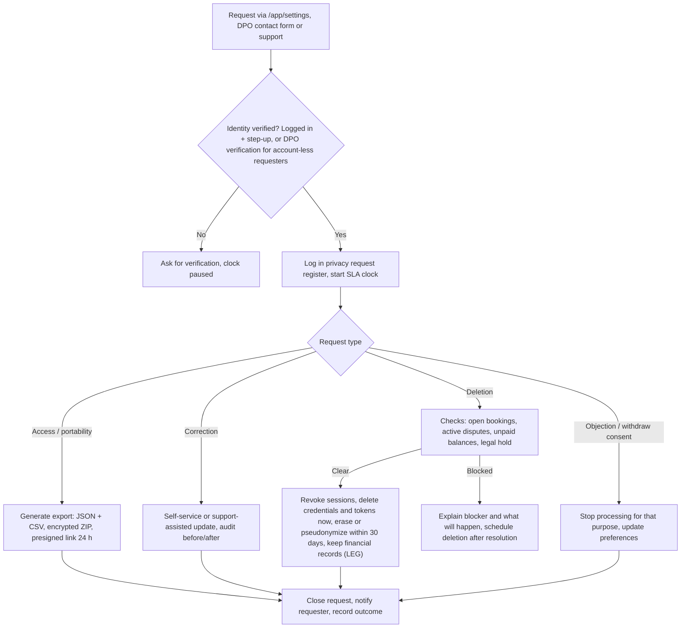

# 15 — Privacy & Data-Retention Matrix

| | |
|---|---|
| Product | CourtKo (working name) |
| Artifact | Design output 15 of 23 |
| Status | Draft for review. Describes the PRODUCTION system. Not legal advice: every legal basis, retention period and regulatory reading below is a requirement to confirm with Philippine counsel (and a tax adviser for tax records). Items marked **unverified** could not be confirmed against primary text. |
| Last updated | 2026-09-30 |
| Related | [03 Roles & permissions](./03-role-permission-matrix.md) · [14 Threat model](./14-security-threat-model.md) · [21 Deployment](./21-deployment-architecture.md) · [23 Decisions](./23-assumptions-and-decisions.md) (D-15 to D-20) |

## 1. Scope and privacy roles

| Party | Role under the Data Privacy Act (RA 10173) | Basis for the determination (confirm with counsel, D-18) |
|---|---|---|
| CourtKo platform operator | Personal information controller (PIC) for accounts, marketplace processing, payments orchestration, safety, support | Decides purposes and means of processing |
| Each business (venue operator) | Independent PIC for customer data it receives to deliver a booking, event or order; PIC for its own staff data | Uses data for its own operations; data sharing terms (NPC Circular 2020-03) embedded in merchant terms |
| Xendit (payment provider) | Independent PIC for its regulated KYC/AML and payment obligations; processor for platform-instructed processing — **to confirm in the provider contract** | Regulated operator of payment systems |
| AWS, SMS aggregator, error tracking, maps provider | Personal information processors (PIPs) | Process on CourtKo's instructions under contract (IRR Secs. 43–44) |

## 2. Privacy principles applied

The DPA requires adherence to transparency, legitimate purpose and proportionality (RA 10173 Sec. 11; https://privacy.gov.ph/data-privacy-act/).

| Principle | Design requirement |
|---|---|
| Transparency | Layered privacy notice at `/privacy`; just-in-time notices for location, contact reveal, KYB uploads and marketing; plain language (en-PH first); child-appropriate wording where minors may participate (NPC Advisory 2024-03) |
| Legitimate purpose | Every field below has a declared purpose; new purposes require a PIA update and, where needed, fresh consent. Data is not collected "just in case" a platform admin may want it. |
| Proportionality | Minimum fields; precise location never stored; SPI collected only for KYB; age collected only for age-category events; provider tokens instead of payment credentials; masking by default (doc 03 §10) |
| Privacy by design | Privacy engineering across the life cycle (NPC Advisory 2025-02): threat model, PIA gates in the definition of done, privacy tests in CI (doc 20) |

## 3. Lawful bases per processing activity

Codes: **CON** consent (Sec. 12(a); SPI Sec. 13(a)) · **CTR** contract (Sec. 12(b)) · **LEG** legal obligation (Sec. 12(c); SPI "provided for by existing laws", Sec. 13(b)) · **LI** legitimate interests (Sec. 12(f); never used for SPI) · **CLM** legal claims (SPI, Sec. 13(f)).

| ID | Processing activity | Data subjects | Lawful basis |
|---|---|---|---|
| PA-01 | Registration, authentication, account management | Players, staff | CTR |
| PA-02 | Security monitoring, fraud and abuse prevention | All users | LI; LEG for lawful preservation orders |
| PA-03 | Nearby discovery using device location | Players | CON (device permission + in-app explanation, revocable) |
| PA-04 | Bookings, event registrations, product orders, participants | Players, invited participants | CTR (participants: LI of the booker, with notice) |
| PA-05 | Payments, refunds, disputes, ledger | Players, business owners | CTR; LEG (tax and accounting records) |
| PA-06 | Sharing booking/customer data with the venue | Players | CTR (fulfilment); contact details only on operational need, per-record reveal |
| PA-07 | Business onboarding and verification (KYB) | Owners, authorized representatives | LEG where RA 11967 and its IRR require merchant identification; CON for any SPI beyond that requirement |
| PA-08 | Payouts and settlement statements | Business owners | CTR; LEG |
| PA-09 | Tax compliance (invoices, withholding certificates) | Business owners (sole proprietors) | LEG |
| PA-10 | Restrictions and safety enforcement | Players | LI (safety of venues and players, enforcement of terms); CLM for evidence |
| PA-11 | Reviews, reports, moderation | Players, staff | CTR (terms of use); LI (platform integrity) |
| PA-12 | Support cases and support mode | All users | CTR; LI |
| PA-13 | Transactional and security notifications | All users | CTR |
| PA-14 | Marketing communications | Opted-in users | CON (opt-in, default off) |
| PA-15 | Product analytics | Users who accept analytics | CON (non-essential cookies); LI for aggregated server metrics without identifiers |
| PA-16 | Activity statistics and ratings | Players | CTR; visibility per user choice; external ratings (Phase 2) CON |
| PA-17 | Age-category events | Players, including minors | CON (parent/guardian for minors), D-20 |
| PA-18 | Audit logging and accountability | Staff, admins, users | LEG (accountability, Sec. 21; records); LI |
| PA-19 | Data subject requests | Requesters | LEG |

## 4. Data classification

| Class | Examples | Handling rules |
|---|---|---|
| Public | Published venues, courts, prices, public reviews, event listings | Integrity controls; cacheable |
| Internal | Aggregated metrics, non-sensitive configuration | Authenticated access |
| Confidential | Names, email, mobile, bookings, orders, business financial reports | RLS + tenant scoping, TLS, KMS at rest, masked in logs, need-to-know |
| Restricted | SPI (government ID data, individual TINs, age/date of birth), restriction notes, payout details, security events, verification documents | Confidential rules + envelope encryption, audited access, MFA-gated roles, excluded from exports except data subject requests |
| Secret | Passwords (hashes), session token hashes, TOTP secrets, API keys, callback token, KMS keys | Secrets Manager/KMS or one-way hashes only; never displayed, logged or exported |

## 5. Per-field privacy and retention matrix

Protection codes: **TLS** in transit · **KMS** encrypted at rest (RDS/S3 CMK) · **RLS** tenant row security · **EE** envelope encryption (AES-256-GCM) · **HASH** one-way hash · **MASK** masked by default · **RED** excluded from logs/error tracking · **TOK** provider token only. All retention periods are **targets pending counsel** (D-15, D-16).

| Field / data element | Purpose | Legal basis | Who can access | Retention | Protection | Req./Opt. | Deletion behaviour |
|---|---|---|---|---|---|---|---|
| User email | Login, verification, receipts, security alerts | CTR | User; `customers.view_contact` holders (reveal); platform_support, platform_trust_safety, platform_compliance, superadmin (reveal) | Life of account; unverified accounts deleted after 30 days | TLS, KMS, MASK, RED | Required (email or mobile) | Deleted within 30 days of verified account deletion; replaced by tombstone |
| Mobile number | Verification, booking-day contact, optional SMS | CTR; CON for marketing SMS | As email | Life of account | TLS, KMS, MASK, RED; E.164 normalized | Required (email or mobile) | As email |
| Name (display and legal) | Identify booker to venue; invoices/receipts | CTR; LEG on issued invoices | User; venue staff in booking context; platform roles | Life of account; name printed on issued tax documents kept with those records | TLS, KMS, RLS | Display name required; legal name only when an invoice requires it | Profile name deleted; replaced by "Deleted user" in history; issued documents retained (LEG) |
| Password hash | Authentication | CTR | Nobody (verification only) | Until changed or account deleted | Argon2id HASH, RED | Required unless identity provider login | Hard-deleted immediately |
| MFA secrets, recovery codes | Second factor | CTR; LI (security) | Nobody (verification only) | Until reset/disabled or account deleted | TOTP secret EE; recovery codes HASH; RED | Required for privileged roles, optional for players | Hard-deleted immediately |
| Sessions, devices, IP addresses | Session management, login history, suspicious-login detection | CTR; LI | User (own devices, 12 months shown); platform_compliance, superadmin (`platform.security.view`) | Session rows purged 30 days after expiry/revocation; security events 24 months | Token HASH; KMS; IP /24 in app logs | Required (automatic) | Deleted on schedule; retained in security events until expiry |
| Precise location (lat/lng) | Nearby venues and approximate distance for one request | CON (device permission) | Nobody; processed in memory only | Not stored: discarded at end of request; never logged, cached or sent to analytics | Rounded to 3 decimals before use; RED | Optional (manual search always available) | Nothing to delete |
| Coarse location (chosen city/municipality/barangay or rounded area) | Default search area | CTR | User | Until changed or account deleted | KMS | Optional | Deleted with account |
| Profile and self-declared skill, privacy settings | Matching, event eligibility, visibility controls | CTR | User; others per visibility (private / connections / event organizers / public) | Life of account | KMS, RLS | Optional | Deleted with account |
| Date of birth or age category (age-category events only; SPI) | Event eligibility; guardian consent for minors | CON (guardian for minors) | User/guardian; `events.manage` holders see eligibility result only | Event completion + 1 year | EE; store "eligible for category X" where possible instead of the date | Optional; required only to join age-restricted events | Hard-deleted at expiry or on request |
| Activity statistics | Personal dashboard (games, hours, venues visited) | CTR | User; others per visibility | Life of account (derived, recomputable) | KMS, RLS | Automatic | Deleted with account; venue aggregates remain anonymous |
| Ratings and rating history (self-declared, venue-verified, platform recreational; external in Phase 2) | Skill display, matching, divisions | CTR; CON for external provider link | User; per visibility; organizers for eligibility | Life of account | KMS, source label on every value | Optional | Deleted; official event results kept pseudonymized ("Former player") |
| Bookings, price snapshots, participants | Deliver the booking, receipts, disputes, accounting | CTR; LEG | User; participants (summary); venue staff per doc 03; platform_support, platform_finance, superadmin | 10 years from transaction (statutory minimum under NIRC Sec. 235 as amended is 5 years; conservative default, D-15); guest participant names removed 90 days after play date | KMS, RLS | Required | Pseudonymized after account deletion (tombstone user ID, names/contact removed); record retained (LEG) |
| Payment method tokens and masked details | Saved-method checkout, refunds to original method | CTR | User (brand, last 4, expiry); venue finance roles (brand, last 4) | Token: until the user removes it, account deletion, or 18 months unused; masked details kept with payment records | TOK (provider), KMS, MASK | Optional (save method) | Token deleted at provider and locally; masked details retained with financial records |
| Payments, refunds, disputes, ledger entries | Payment lifecycle, reconciliation, settlements, tax | CTR; LEG | payments/finance permission holders; platform_finance, superadmin | 10 years (conservative, D-15) | KMS, RLS; ledger append-only | Required | Retained; linked user pseudonymized after account deletion |
| Business owner government IDs and verification documents (SPI) | Merchant identification (KYB), fraud prevention | LEG (RA 11967/IRR merchant identification) + CON beyond that; CLM | Owner (own submission status); platform_compliance and superadmin (audited SPI access) | Raw images: 180 days after the verification decision or end of any appeal/legal hold. Verification record (document type, masked number, expiry, decision, reviewer, date): relationship + 5 years | `uploads-clean/restricted/`, SSE-KMS, EE for extracted numbers, presigned GET 60 s, RED. PhilSys: collect the PhilSys Card Number (PCN) only, never the PhilSys Number (PSN) | Required to activate a business | Images crypto-shredded/deleted at expiry; record deleted after retention |
| Business TIN and registration (DTI/SEC/CDA, BIR Certificate of Registration) | Merchant identification, invoicing, withholding | LEG | Owner; platform_compliance, platform_finance, superadmin | Relationship + 10 years (tax records) | KMS; individual (sole-proprietor) TIN = SPI → EE | Required | Retained for the period, then deleted |
| Payout account details | Settlement to the venue | CTR; LEG | Owner (manage); finance roles and platform_finance (masked: bank, initials, last 4) | Full details held by the provider only; masked metadata kept with payout records (10 years) | TOK/provider-held, MASK | Required for payouts | Masked metadata retained with payout records |
| Restriction records (structured: user, business, venue, category, period, status, created/approved by, appeal) | Enforce bans/limits; appeals | LI; CLM | `restrictions.view` (exists + category), `restrictions.manage` (full), platform_trust_safety, superadmin | Active period + 3 years after lift/expiry (D-16) | KMS, RLS; not public; neutral wording to the player | Required when a restriction is created | Deleted after retention; a keyed hash (HMAC) of normalized email/mobile kept for the same period to detect re-registration evasion (PIA required) |
| Restriction internal notes and evidence references | Accountability for the decision | LI; CLM | `restrictions.manage` holders; platform_trust_safety on escalation; platform_compliance for data subject requests | Same as the record; evidence attachments 1 year after lift unless appeal or legal hold | EE, `pii` access audited, RED | Optional (encouraged, factual) | Deleted/crypto-shredded at expiry; may be disclosable on an access request (counsel to confirm exceptions) |
| Reviews | Venue reputation | CTR; LI | Public (display name per privacy settings); `reviews.respond`; platform_trust_safety | While listing and account active; moderated-out reviews kept 1 year | KMS; plain text only | Optional | Author anonymized on account deletion (text kept unless the user asks for removal) |
| Reports (content/issue reports) | Moderation and safety | LI | Reporter (own); platform_trust_safety; superadmin | 2 years after closure | KMS; reporter identity hidden from the reported party | Optional | Deleted after retention |
| Support cases | Resolve user issues | CTR | Requester; platform_support; superadmin | 3 years after closure | KMS; attachments in restricted prefix | Optional | Deleted after retention |
| Notifications (in-app; email/SMS/push delivery records) | Transactional messages and delivery proof | CTR; CON for marketing | User; platform_support (metadata) | In-app 12 months; delivery metadata 12 months; message bodies 90 days | KMS; templates avoid SPI; SMS contains no links (telco filtering) | Automatic | Deleted after retention or with account |
| Audit logs | Accountability, investigations | LEG; LI | `audit.view` (own business); `platform.audit.view` | Hot 13 months; archive: financial 10 years, security/operational 2 years | Append-only, hash chain, Object Lock, KMS | Automatic | Not editable; expire with the archive |
| Security events | Threat detection, login history | LI; LEG | User (own login history); platform_compliance, superadmin | 24 months | KMS; full IP here only | Automatic | Deleted after retention |
| Webhook payloads (raw) | Payment verification and provider disputes | CTR; LEG | platform_finance, superadmin | Raw 90 days, then minimized to event ID, type, status, reference, amount (kept with `payment_events`, 10 years) | KMS, RED | Automatic | Minimized at 90 days |
| Marketing preferences and consent evidence | Honour choices; demonstrate consent (NPC Circular 2023-04) | CON; LEG (demonstrate consent) | User; platform_compliance | Preferences: life of account; consent evidence: 3 years after withdrawal or account closure | KMS | Optional | Preferences deleted with account; evidence retained 3 years |
| Cookie consent records | Honour and demonstrate cookie choices | CON; LEG | platform_compliance | Choice valid 12 months (then re-prompt); records 3 years | Pseudonymous consent ID | Required to use non-essential cookies | Deleted after retention |

## 6. Location processing explanation (privacy notice text)

> **How CourtKo uses your location.** If you tap "Use my location", your phone or browser asks for permission. If you allow it, CourtKo uses your current location only to show courts near you, sort them by distance and display an approximate distance (for example "2.4 km"). We round your coordinates before using them, and we do not store your precise location, keep a history of where you have been, or track you in the background. Once the search is done, your precise location is discarded. You can deny or withdraw permission at any time in your device or browser settings; you can still search by city, municipality, barangay, landmark or venue name. If you choose a default search area, we save only that area (for example "Pasig City"), and you can change or remove it in Settings. Map tiles are loaded from our maps provider, which receives the map area shown on your screen and your device's IP address under its own terms. Photos uploaded to CourtKo have their location metadata removed.

## 7. Consent, preferences and cookies

Consent design (aligned with NPC Circular 2023-04 guidelines on consent):

1. **Granular and opt-in.** Separate toggles for marketing email, marketing SMS, marketing push, analytics cookies, functional cookies, public profile visibility, and (Phase 2) external rating link. All default off; no pre-ticked boxes; consent is separate from accepting the Terms.
2. **No deceptive design.** Accept and reject have equal prominence; no nagging after refusal; withdrawal is as easy as giving consent.
3. **Evidence.** A consent record stores purpose, notice version, granted/withdrawn timestamp, channel and pseudonymous evidence (hashed IP/user agent). Assumed table `consent_records` (confirm in doc 12).
4. **Effect of withdrawal.** Immediate in-app; marketing email/SMS suppression within 24 h (target); email carries one-click unsubscribe (RFC 8058).
5. **Transactional and security messages** (verification, booking/payment/refund updates, venue closure, security alerts, password/account changes) cannot be switched off entirely; users choose channels where possible, with at least one channel always active.
6. **Material notice changes** trigger re-notification; consent-based processing that changes purpose requires fresh consent.
7. **Preference centre** at `/app/settings`: notifications, privacy and visibility, cookies, connected accounts, download data, delete account.

| Cookie / storage category | Examples | Default | Basis | Lifetime |
|---|---|---|---|---|
| Strictly necessary | `__Host-` session cookie per surface; consent-state cookie; load-balancer/WAF tokens (e.g. CAPTCHA token) | Always on | CTR / LI (security) | Session (12 h absolute; player remember-me 30 days); consent cookie 12 months |
| Functional | Language, last searched area, dismissed tips | Off until accepted | CON | 12 months |
| Analytics | First-party, privacy-preserving usage analytics (no cross-site tracking) | Off until accepted | CON | 13 months |
| Marketing / advertising | None in MVP | n/a | n/a | n/a |

The PWA caches public assets only; no personal data is written to `localStorage`.

## 8. Data subject rights workflows and SLAs

| Right (RA 10173 Secs. 16, 18) | Channel | Target SLA | Regulatory ceiling | Notes |
|---|---|---|---|---|
| To be informed | Privacy notice, just-in-time notices | At collection | — | |
| Access (copy of data) | "Download my data" | 15 working days | 30 working days, extendable by 15 for complex or numerous requests (NPC Advisory 2021-01) | Includes bookings, payments (masked), ratings, preferences, consent history, own security events |
| Data portability | Same export: structured JSON + CSV | 15 working days | As above | Machine-readable, commonly used formats |
| Correction | Self-service; support for locked fields (legal name on issued invoices cannot be rewritten; a correction note is attached) | Self-service immediate; assisted 5 working days | As above | |
| Erasure / blocking | "Delete account" (7-day cancel window) | Completed ≤ 30 calendar days | As above | Financial-record exception: bookings, payments, refunds, ledger, issued invoices retained and pseudonymized; restriction records retained per D-16 |
| Object / withdraw consent | Preference centre, unsubscribe link, DPO | Marketing: immediate in-app, ≤ 24 h email/SMS; other objections 15 working days | As above | |
| Complaint | DPO contact; right to complain to the NPC | Acknowledge within 2 working days | — | |

Fulfilment is performed by `platform.privacy.requests` holders (platform_compliance, superadmin). Exports are released only after step-up; every request and outcome is audited (`privacy.request.*`).

## 9. Retention job design

| Element | Design |
|---|---|
| Policy registry | `retention_policies` (data class, table or bucket, reviewed predicate, action `delete` / `anonymize` / `pseudonymize` / `minimize`, period, legal reference, owner). Changes ship as reviewed migrations approved by the DPO. |
| Job | `retention.enforce`, daily (off-peak PHT). Keyset batches of 1,000 per transaction; skips rows under `legal_hold`; idempotent (predicates re-evaluated each run); resumable; dry-run mode used in staging and for the first production run of any new policy. |
| Evidence | Per-policy run summary (counts only, never contents) written as an `operational` audit event; metrics and failure alerts (doc 22). |
| Object storage | S3 lifecycle: `uploads-quarantine` 1 day, `reports` 7 days, noncurrent versions 30 days; `restricted/` documents deleted by the job (per-object decisions); `audit-archive` expires by Object Lock retention. |
| Logs | CloudWatch log-group retention per doc 22. |
| Backups | Deleted data persists in backups until they expire (PITR 35 days; snapshot schedule in doc 21). Restricted fields are crypto-shredded (per-subject data keys destroyed), so restored backups cannot resurrect them. An erasure log of pseudonymous subject IDs is replayed after any restore. |
| Verification | Monthly DPO sampling of each policy; quarterly report of volumes deleted per class. |

## 10. Vendor / processor inventory

| Vendor (status) | Service | Personal data | Role | Location | Contract requirement | Cross-border notes |
|---|---|---|---|---|---|---|
| Amazon Web Services (selected) | Hosting, database, storage, KMS, SES email, WAF | All platform data | PIP | ap-southeast-1 Singapore; DR copy region per D-17 | AWS customer agreement + data processing terms; confirm they meet DPA/IRR Secs. 43–44 | Transfer PH → Singapore; CourtKo stays accountable (Sec. 21); disclose in privacy notice |
| Xendit (selected, contract pending — D-01) | Payments, xenPlatform sub-accounts, refunds, payouts, venue KYB | Payer name/email/mobile as passed, tokens, masked card data, venue KYB documents | Independent PIC + PIP (confirm) | Philippine entity; processing locations **unverified** | Platform agreement + data processing/sharing terms, breach notification duty, deletion on termination | Confirm processing locations |
| SMS aggregator (placeholder — D-22) | Phone verification, transactional SMS | Mobile number, message text | PIP | Philippines (preferred) | DPA-compliant processing contract; registered sender ID | Prefer in-country |
| Maps / geocoding (placeholder — D-23) | Map tiles, venue address geocoding | Server: venue addresses only. Client SDK: user IP and map viewport | Independent controller under its own terms (confirm) | Global | Provider terms; restricted API keys; caching limits respected | Cross-border; disclosed in §6 notice |
| Error tracking (placeholder — D-27) | Exception and performance events | Pseudonymous IDs only (scrubbed) | PIP | Vendor region or self-hosted in Singapore | Processing contract; scrubbing enabled | Prefer self-hosted or regional |
| Web Push services (browser vendors) | Push delivery | Push endpoint; payload end-to-end encrypted (RFC 8291) | Transport | Global | Browser terms; no SPI in payloads | Minimal content |
| Workforce email, helpdesk, on-call paging (placeholders) | Support mailbox, tickets, alerts | Support content; staff contacts | PIP | TBD | Processing contract; alerts must not contain personal data | TBD |
| GitHub | Source code, CI | None permitted (policy + secret scanning) | — | US | — | No production data in repositories |
| External rating provider, e.g. DUPR (Phase 2 — D-26) | Rating sync | Player ID link, match results | Independent PIC | US | Partner agreement + explicit user authorization | Cross-border; consent-based |

## 11. PIA outline

Privacy impact assessments are a general obligation under NPC Circular 2023-06. Each PIA covers: (1) processing description and data-flow diagram; (2) purpose, necessity and proportionality; (3) lawful basis; (4) data inventory and classification; (5) risks to data subjects (likelihood × impact); (6) controls; (7) residual risk and DPO sign-off; (8) review triggers (new feature, vendor, data category, cross-border change, incident).

PIAs required before launch: core accounts and bookings; location discovery; business KYB (SPI); payments, refunds and payouts; restrictions and re-registration matching; support mode; reviews and moderation; notifications and marketing; events with minors (before enabling age categories); external ratings (before Phase 2).

## 12. Breach response workflow

Follows the incident process and 72-hour NPC path in [doc 14 §9](./14-security-threat-model.md#9-incident-response). Privacy-specific requirements: the DPO maintains a breach register for every incident (notifiable or not) with T0, data categories, subject count, assessment rationale, notifications sent and remediation; processors must notify CourtKo without undue delay (contract clause); affected venues are informed per data sharing terms; notices to data subjects are plain-language and child-appropriate where minors are affected (NPC Advisory 2024-03).

## 13. Access review process

Cadence and populations are defined in [doc 03 §11](./03-role-permission-matrix.md#11-access-review-cadence). The DPO additionally reviews quarterly: all holders of SPI access (`platform.businesses.verify`, `platform.privacy.requests`), volumes of `pii.revealed` and `verification.document.viewed` events per actor, and vendor access lists.

## 14. Secure disposal

| Medium | Method |
|---|---|
| Restricted fields | Crypto-shredding: destroy per-subject data keys, then delete ciphertext |
| Database rows | Hard delete or anonymize via `retention.enforce`; vacuum reclaims storage |
| S3 objects | Delete all versions; lifecycle for noncurrent versions; Object Lock data expires only by retention |
| Snapshots and backups | Expire by schedule; manual snapshots deleted after incident closure |
| KMS keys | Scheduled deletion with waiting period, after dependent data is gone |
| Physical media | Handled by AWS data-centre procedures; no CourtKo-owned servers |
| Workforce devices | MDM-enforced disk encryption; remote wipe on loss or offboarding |
| Vendors | Deletion/return certificate on contract termination |

## 15. Production / test data separation

1. Production personal data never leaves the production account: no production snapshots, dumps or exports in dev, staging, CI, demos or laptops.
2. Lower environments use the seeded synthetic data generator only (labelled SYNTHETIC; `example.com` emails; phones such as +63 917 000 0001; IPs from 203.0.113.0/24).
3. Production debugging uses production tooling under break-glass (doc 03 §8), read-only and audited.
4. The mock payment adapter and Xendit test keys never run in production; live keys never exist outside production (startup assertions, doc 21).
5. The interactive demo contains synthetic data only.

## 16. DPO and NPC registration items

| Item | Requirement | Status / action |
|---|---|---|
| Designate a DPO | Accountable individual(s) (RA 10173 Sec. 21) | Appoint before launch; publish contact in privacy notice (D-19) |
| Register DPO and data processing systems | Mandatory for PICs/PIPs with ≥ 250 employees, processing SPI of ≥ 1,000 individuals, or processing likely to pose risk (NPC Circular 2022-04); new systems/DPO within 20 days | Coverage likely once SPI (owner IDs, TINs, age) or risk criteria are met; recommended conservatively before launch (D-19) |
| Privacy management programme and privacy manual | NPC Circular 2023-06 general obligations | Draft before launch |
| Security measures | NPC Circular 2023-06 (organizational, physical, technical) | Mapped in doc 14 |
| Breach management | NPC Circular 16-03; annual incident reporting (NPC Advisory 18-01) | Breach response team named; register live at launch |
| Data sharing terms with venues | NPC Circular 2020-03 | In merchant terms (D-18) |
| Staff training | NPC Circular 2023-06 | At onboarding and annually |

## 17. References (verified via official or primary-source URLs; interpretation to be confirmed with counsel)

| Source | URL | Relevance |
|---|---|---|
| RA 10173 Data Privacy Act | https://www.officialgazette.gov.ph/2012/08/15/republic-act-no-10173/ · https://privacy.gov.ph/data-privacy-act/ | Principles (Sec. 11), lawful bases (Secs. 12–13), SPI definition (Sec. 3(l), includes age and government-issued identifiers), rights (Secs. 16, 18), accountability incl. cross-border (Sec. 21) |
| IRR of RA 10173 (as amended) | https://privacy.gov.ph/wp-content/uploads/2023/06/IRR_RA-10173-as-amended.pdf | Outsourcing contracts (Secs. 43–44) |
| NPC Circular 16-03 (breach management) | https://privacy.gov.ph/wp-content/uploads/2022/01/sgd-npc-circular-16-03-personal-data-breach-management.pdf | 72-hour notifications, 5-day full report |
| NPC Advisory 18-01 (incident and breach reportorial requirements) | https://elibrary.judiciary.gov.ph/thebookshelf/showdocs/10/90575 | Annual security incident report; filing deadline to confirm |
| NPC Circular 2022-04 (registration) | https://privacy.gov.ph/wp-content/uploads/2023/05/Circular-2022-04-1.pdf | DPO/DPS registration thresholds and 20-day rule |
| NPC Circular 2023-04 (consent) | https://privacy.gov.ph/wp-content/uploads/2023/11/NPC-Circular-No.-2023-04_Guidelines-on-Consent_07Nov2023.pdf | Valid consent; deceptive design invalidates consent; demonstrable consent |
| NPC Circular 2023-06 (security of personal data) | https://privacy.gov.ph/wp-content/uploads/2024/03/NPC-Circular-Repeal-16-01-Signed.pdf | Security obligations, PIA, DPO, training; effective 30 March 2024 |
| NPC Circular 2020-03 (data sharing agreements) | https://privacy.gov.ph/wp-content/uploads/2021/01/Circular-Data-Sharing-Agreement-amending-16-02-21-Dec-2020-clean-copy-FINAL-LYA-and-JDN-signed-minor-edit.pdf | Venue data sharing terms |
| NPC Advisory 2021-01 (data subject rights) | https://privacy.gov.ph/wp-content/uploads/2021/02/NPC-Advisory-2021-01-FINAL.pdf | 30 working days (+15) response ceiling |
| NPC Advisory 2024-03 (child-oriented transparency) | https://privacy.gov.ph/wp-content/uploads/2024/12/FAQs-Advisory-on-Guidelines-on-Child-Oriented-Transparency.pdf | Child = below 18; age-appropriate notices; consent via parental authority |
| NPC Advisory 2025-02 (privacy engineering) | https://privacy.gov.ph/wp-content/uploads/2025/12/NPC_Advisory2025-02.pdf | Privacy by design across the system life cycle |
| RA 11967 Internet Transactions Act + IRR (JAO 24-03) | https://www.lawphil.net/statutes/repacts/ra2023/ra_11967_2023.html · https://ecommerce.dti.gov.ph/wp-content/uploads/2024/06/Joint-Administrative-Order-No.-24-03.pdf | Merchant identification before listing (incl. BIR Certificate of Registration); record keeping (reported minimum 2 years — **unverified**) |
| RA 11055 PhilSys Act | https://www.lawphil.net/statutes/repacts/ra2018/ra_11055_2018.html | Use PCN for verification; do not store the PSN (confirm with counsel) |
| RA 11976 (EOPT) — NIRC Sec. 235 as amended | https://www.lawphil.net/statutes/repacts/ra2024/ra_11976_2024.html | Books/records preserved 5 years from the filing deadline of the relevant return |
| RA 10175 Cybercrime Prevention Act | https://www.lawphil.net/statutes/repacts/ra2012/ra_10175_2012.html | Sec. 13 preservation of traffic data (≥ 6 months) when applicable |
| RA 6809 (age of majority) | https://elibrary.judiciary.gov.ph/thebookshelf/showdocs/2/7025 | Majority at 18 |
