# 20 — Testing Strategy

| | |
|---|---|
| Product | CourtKo (working name) |
| Artifact | Design output 20 of 23 |
| Status | Draft for review. Describes testing for the PRODUCTION system. Until a Xendit account exists (doc 23 D-01) payment tests run against the mock adapter; provider contract tests are added when sandbox credentials are available. |
| Last updated | 2026-09-30 |
| Related | [03 Roles & permissions](./03-role-permission-matrix.md) · [14 Threat model](./14-security-threat-model.md) · [21 Deployment](./21-deployment-architecture.md) · [22 Monitoring](./22-operational-monitoring.md) · doc 07 (booking state machine) · doc 08 (payment state machine) · doc 09 (refund & payout flow) |

## 1. Principles

1. **Money, availability and authorization are proven, not assumed.** Every rule that moves money, occupies a court or grants access has deterministic automated tests at the lowest possible level plus at least one end-to-end proof.
2. **The database is part of the system under test.** Exclusion constraints, RLS and ledger triggers are tested against real PostgreSQL + PostGIS, never mocks.
3. **Time is injected.** The `Clock` port lets tests move time across hold TTLs, cancellation cutoffs and late-webhook grace deterministically.
4. **Synthetic data only**, labelled SYNTHETIC, in every environment except production.
5. **Performance numbers are targets** until k6 evidence exists (doc 22 §3).

## 2. Test pyramid and tooling

Target distribution by test count: ~70% unit, ~20% integration/API, ~10% E2E/UI.

| Level | Tool | Scope |
|---|---|---|
| Unit — domain | `node:test` + `node:assert` (keeps `packages/domain` dependency-free); fast-check property tests as a dev dependency | Money, pricing, availability, commission, fees, policies, state machines, RBAC |
| Unit — other packages | Vitest (+ Testing Library for `packages/ui`) | Use cases in `packages/core` with in-memory port fakes; contracts; formatting (peso, dates, time zones) |
| Integration | Vitest + Testcontainers (`postgis/postgis` 16 image, Redis) | Repositories, migrations, RLS, exclusion constraint, ledger triggers, outbox, pg-boss jobs |
| API | Fastify `inject` | Contracts, RFC 9457 errors, idempotency, rate-limit headers, authentication, authorization matrix |
| Provider contract | Shared suite run against `payments/mock` and `payments/xendit` (sandbox, nightly once available) | Behavioural parity of the `PaymentGateway` port |
| E2E | Playwright (Chromium, WebKit at 390×844 mobile viewport, Firefox) | Critical journeys across web, business and admin apps |
| Accessibility | `@axe-core/playwright` + manual NVDA/VoiceOver passes | WCAG 2.2 AA |
| Load | k6 | SLO targets, contention, soak |
| DAST | OWASP ZAP baseline + authenticated OpenAPI scan | Staging |
| SAST / SCA / secrets / containers / IaC | Semgrep + CodeQL · OSV-Scanner + `pnpm audit` · gitleaks · Trivy · Checkov | Every PR (SCA and images also daily) |
| Migration safety / API compatibility | squawk (PostgreSQL migration linter) · oasdiff (OpenAPI 3.1 breaking changes) | Every PR |
| DR | Scripted restore + validation queries | Monthly / quarterly (§5, suite 14) |

## 3. Environments and synthetic test data policy

| Environment | Purpose | Data | Payment adapter |
|---|---|---|---|
| Local | Development | Seeded synthetic | `mock` |
| CI (ephemeral containers) | Automated suites | Per-test synthetic fixtures | `mock`; nightly Xendit sandbox contract tests (when available) |
| Dev (AWS dev account) | Shared integration | Synthetic | `mock` or Xendit test mode |
| Staging (AWS staging account) | Pre-production, E2E, DAST, load, DR drills | Synthetic at year-1 volume | Xendit test mode |
| Production | Live | Real | Xendit live; only the hidden synthetic canary venue is used by synthetic monitors (doc 22 §10) |

Synthetic data rules:

1. Deterministic generator `pnpm seed:synthetic --seed <n> --scale pilot|year1`; every record carries a SYNTHETIC label (e.g. "Sample Pickle Hub (SYNTHETIC)").
2. Emails `@example.com`; phones `+63 917 000 0000`–`+63 917 000 9999`; IPs from 203.0.113.0/24; fictional addresses ("Barangay Demo, Pasig City"); placeholder TINs `000-000-000-000`.
3. Card data only from the provider's published test values in test mode; never real card numbers, never production data, dumps or snapshots.
4. Test artifacts (screenshots, videos, traces, k6 outputs) may contain only synthetic data.
5. Staging is re-seeded weekly and after every DR drill.

## 4. Coverage targets

Coverage is a floor, not a goal; all figures are targets.

| Area | Target |
|---|---|
| `packages/domain` | ≥ 95% lines and branches; 100% of allowed **and** disallowed transitions for booking, payment, refund, payout, dispute, order and registration state machines |
| Money functions | Property tests for every invariant; mutation score ≥ 80% (Stryker, optional) |
| `packages/core` | ≥ 85% |
| `packages/payments` | ≥ 85% + contract-suite parity between adapters |
| `packages/db` | Every repository method exercised by an integration test |
| API | 100% of routes in the authorization matrix; every error code in the catalog produced at least once |
| `packages/ui` | ≥ 70%; every component has an axe check |
| E2E | 100% of the critical journeys in §5 (suite 8) |

## 5. Required test suites

| # | Suite | What it proves | Example cases | Level / trigger |
|---|---|---|---|---|
| 1 | Unit | Domain rules are correct in isolation | Canonical example: base 40,000, pass-through fee 1,500 → total 41,500, commission 2,000 (50,000 ppm), venue net 38,000, capture journal balanced. Pass-through OFF (platform bearer): total 40,000, commission 2,000, provider fee 1,500 → platform net 500, venue net 38,000. Gross-up `fee = ceil_to_centavo((net + fixed) / (1 − pct)) − net` with placeholder rates. Slot pricing across a peak boundary (18:30–20:00 with peak from 19:00). Half-up rounding once per component. Cancellation cutoffs at exactly 24 h and 6 h. Illegal transition → `INVALID_STATE_TRANSITION`. | Every PR |
| 2 | Integration | SQL and infrastructure behave as designed | Exclusion constraint rejects overlap including cleanup buffer; stale hold released inside the insert transaction; RLS returns 0 rows without context; deferred trigger rejects an unbalanced journal; outbox row committed atomically with the state change; migrations apply from empty and from the previous release | Every PR |
| 3 | API | Contracts, errors and protocol behaviour | Missing `Idempotency-Key` on a required POST → `VALIDATION_FAILED`; same key + different body → 422 `IDEMPOTENCY_KEY_REUSED`; concurrent same key → `IDEMPOTENCY_IN_PROGRESS`; cursor pagination ≤ 100; `RateLimit-*` + `Retry-After`; `X-Correlation-Id` echoed; money as `{ amount, currency }` | Every PR |
| 4 | Authorization | Every route × role behaves per doc 03 | See §7 | Every PR |
| 5 | Tenant isolation | No data crosses business boundaries | Businesses A and B with mirrored structures; every A actor probing B IDs → 404; lists, reports, exports and aggregates exclude B; raw-SQL RLS checks; `settlements.generate` statements contain only own-tenant lines | Every PR |
| 6 | Payment webhook | Webhooks cannot forge or duplicate state | Missing/invalid token → 401; duplicate `provider_event_id` → one row; out-of-order events; payload says paid but re-query says pending → no transition; amount/currency/sub-account mismatch → discard + alert; late webhook after expiry | Every PR |
| 7 | Booking concurrency | No double booking under contention | 50 parallel holds on one slot → exactly one success; hold vs maintenance block race; atomic reschedule under contention; 2-active-hold limit under parallel requests | Every PR; k6 nightly |
| 8 | E2E | Journeys work across apps | Discover → book → pay → confirmation → check-in; cancel within policy; business onboarding → approval → publish; walk-in with payment link; refund approval; admin reconciliation; support mode banner | Staging on merge; release |
| 9 | Accessibility | Usable by keyboard and screen-reader users | axe: 0 serious/critical on every page; keyboard-only booking; dialog focus management; labels and errors announced; contrast tokens; `prefers-reduced-motion`; touch targets ≥ 44×44 px | Merge; release manual pass |
| 10 | Security | Controls in doc 14 work | ZAP baseline; CSP/HSTS/cookie flags; cross-origin POST rejected; session rotation on login; EICAR upload quarantined; EXIF GPS stripped; SVG and oversize uploads rejected; log redaction; brute-force throttling; outbound allowlist | PR (static), nightly (dynamic) |
| 11 | Load | SLO targets hold at expected peak | k6 profiles in §5.1 with thresholds from doc 22 | Nightly smoke; pre-release full |
| 12 | Refund | Policies and ledger reversals are exact | Tier boundaries; gateway fee non-refundable for player cancellations, refunded when venue-initiated; partial refund of one order item; proportional commission reversal; provider failure → retry → `failed` → manual; > ₱5,000 needs `platform.refunds.approve`; maker ≠ checker | Every PR |
| 13 | Payout reconciliation | Internal ledger ties to provider records | Daily statement: opening balance + venue payable movements − payouts = closing balance; provider report vs ledger (matched / missing internally / missing at provider / amount mismatch); fee variance posted to `platform:gateway_fee_variance`; failed and reversed payouts journaled | Every PR + daily job test in staging |
| 14 | DR | Backups restore within targets | Restore latest snapshot and PITR (T − 15 min) into an isolated environment; validate row counts, ledger balance (Σ debit = Σ credit), audit hash chains, smoke tests; record achieved RPO/RTO against doc 21 targets | Monthly restore; quarterly PITR + cross-region restore drill; annual region-failover exercise |

### 5.1 Load profiles (k6)

| Profile | Shape | Pass criteria |
|---|---|---|
| Baseline | Year-1 evening peak (assumption A-07): 200 availability req/s, 50 holds/min, 30 checkouts/min for 30 min | All doc 22 latency targets met; error rate < 0.5% (excluding expected `SLOT_UNAVAILABLE`) |
| Peak × 2 | Double baseline for 15 min | p95 within 1.5 × target; autoscaling reacts; no 5xx storms |
| Tournament spike | 500 virtual users request 64 registrations within 60 s | Capacity never exceeded; fair `EVENT_FULL`/waitlist responses; no deadlocks |
| Soak | Baseline for 4 h | No memory growth, connection leaks or queue lag |

## 6. Critical scenarios

All scenarios run against synthetic data with an injected clock and the mock provider (Xendit sandbox once available).

| # | Scenario | Level | Setup | Steps | Expected result | Automated? |
|---|---|---|---|---|---|---|
| 1 | Two users same slot | Integration + API + k6 | Court C1 free 18:00–19:00; verified users U1, U2 | Fire both `POST /v1/me/booking-holds` behind a barrier; repeat 100×; 50-way in k6 | Exactly one 201 (`slot_held`); other `SLOT_UNAVAILABLE`; one active `booking_slots` row; no deadlocks | Yes |
| 2 | Payment succeeds after checkout timeout | Integration (worker) | Hold TTL 10 min; mock captures at T+12 min | Hold → checkout → payment session; advance clock; `holds.expire` marks `expired`; deliver capture webhook; run worker | Slot free: `expired → confirmed` (late payment recovery), slot re-acquired. Slot taken: `expired → refund_pending` → automatic full refund incl. gateway fee; player notified; charge and refund journals balance | Yes |
| 3 | Duplicate webhook | Integration + API | Payment captured at provider | Deliver same event 2× sequentially and 5× concurrently | One `webhook_events` row; all 200; one capture journal, one confirmation, one notification | Yes |
| 4 | User banned during checkout | Integration | U1 in checkout at venue V | Staff creates restriction for U1 at V; provider then captures | New payment sessions → `BOOKING_NOT_ALLOWED`; captured payment → `payment_pending → refund_pending`, automatic full refund; neutral notification; slot released; audit trail | Yes |
| 5 | Rate change during checkout | Integration + API | Rule ₱400/h; U1 holds a quote | Manager changes rule to ₱500/h; U1 pays | U1 charged the quoted ₱400 base; `booking_price_snapshots` = quote; new quotes use ₱500; expired quote → `QUOTE_EXPIRED` with re-acceptance | Yes |
| 6 | Court blocked during checkout | Integration + API | U1 holds C1 18:00–19:00 | court_manager creates block 17:30–19:30 | Block rejected with `SLOT_UNAVAILABLE` listing the hold; U1 completes; urgent case handled by venue cancellation after confirmation → full refund incl. gateway fee + maintenance-conflict notification | Yes |
| 7 | Refund after payout | Integration | Booking settled and paid out to venue | Goodwill refund requested and approved by business | Without platform approval → `APPROVAL_REQUIRED`; with `platform.refunds.approve` → refund `succeeded`; reversing journal drives venue payable negative (receivable); commission reversed proportionally; next statement shows recovery | Yes |
| 8 | Cross-business access attempt | API + integration | Businesses A and B; A's owner | Read/patch B's booking via B path and via A path; filter by B's venue; export; raw SQL under A's RLS | 404 everywhere (never 403); no B data; `authz.denied` events; alert over threshold; RLS 0 rows | Yes |
| 9 | Unauthorized staff refund | API | Receptionist R; manager M (`refunds.request`); owner O | R calls request/approve; M requests then approves own; O approves | R → `FORBIDDEN`; M request → `pending_approval`; M self-approve → `FORBIDDEN`; O approves after step-up → `approved → processing → succeeded`; all attempts audited | Yes |
| 10 | Support impersonation | API + E2E | platform_support S; player P | Start with 10-char reason; start validly; read; POST cancel; open payment methods; export; wait 30 min | Short reason → `VALIDATION_FAILED`; banner shown; reads masked; writes → `SUPPORT_MODE_READ_ONLY`; blocked areas denied; auto-end at 30 min; every request audited with admin and subject | Yes |
| 11 | Product out of stock during checkout | Integration | Stock 1; U1 add-on; U2 standalone | U2 reserves last unit; U1 creates checkout | U1 → `OUT_OF_STOCK` before payment, can continue without item; stock never negative; post-capture unavailability → partial refund of that line (`partially_refunded`), booking unaffected | Yes |
| 12 | Event reaches capacity during payment | Integration + k6 | Capacity 16, 15 confirmed | U1, U2 register concurrently; U1's capture arrives after its hold expired and seat went to waitlist offer | Capacity never exceeded; loser `EVENT_FULL` or `waitlisted`; late capture without seat → automatic full refund; offer expiry by `events.waitlist_offers.expire` | Yes |
| 13 | Dispute after completion | Integration | Booking `completed`, payment `captured`, paid out | Dispute webhook; evidence submitted; resolve won, then repeat lost | `completed → disputed`; dispute `open → evidence_submitted`; won → booking `completed`, payment `captured`; lost → booking `refunded`, payment `chargeback`, chargeback journal per agreement (venue payable or `platform:chargeback_losses`) | Yes |
| 14 | Provider temporarily unavailable | Integration + API | Mock returns 503/timeouts for 5 min | Create payment sessions; no webhooks; provider recovers | `PROVIDER_UNAVAILABLE` + `Retry-After`; hold kept to TTL; circuit breaker opens then half-opens; retries reuse provider idempotency key; `payments.reconcile` settles pending payments; alert fired; nothing confirmed without verified capture | Yes |

Additional robustness scenarios (requirements §3):

| # | Scenario | Expected result | Automated? |
|---|---|---|---|
| 15 | Repeated payment submission (double tap) | Same `Idempotency-Key` returns the stored response; one provider session | Yes |
| 16 | Browser closed during payment | Webhook + re-query confirm; returning to `/app/checkout/:id` shows `confirmed` | Yes (E2E) |
| 17 | Capture succeeds but confirmation transaction fails (worker crash) | Transaction rolls back; job retried; confirmed exactly once | Yes |
| 18 | Redirect reports success, provider still pending | Booking stays `payment_pending` until verified capture | Yes |
| 19 | E-wallet payment stays pending past hold | `payments.reconcile` re-queries; expires or late-recovers per scenario 2 | Yes |
| 20 | Expired checkout reused | `HOLD_EXPIRED` / `QUOTE_EXPIRED` | Yes |
| 21 | Booking inside maintenance block via direct API | `SLOT_UNAVAILABLE` | Yes |
| 22 | Double pickup claim | Second claim rejected; code single-use | Yes |

## 7. Authorization matrix testing (every route x role)

1. **Route inventory.** A Fastify `onRoute` hook exports every route with its `config.authz` metadata at build time; a route without metadata fails the build.
2. **Actor fixtures** (seeded for businesses A and B): anonymous; player; restricted player; each business template (business-wide); receptionist scoped to venue A1; a custom role; owner without MFA (`pending_mfa`); owner with stale step-up; business B owner; each platform role; an active support-mode session.
3. **Expected outcomes** are derived from route metadata plus the doc 03 matrices: public → 2xx; `/v1/me/*` → 401 anonymous, 2xx own objects, 404 others'; business routes → 404 for non-members and out-of-venue objects, 403 `FORBIDDEN` for missing permission, `MFA_REQUIRED` for MFA-guarded permissions without MFA or fresh step-up; admin routes → 404 for non-platform actors, 403 for platform roles lacking the permission; support mode → allowlisted GETs 2xx, everything else `SUPPORT_MODE_READ_ONLY`.
4. **Execution** via Fastify `inject`, in parallel, per PR:

```ts
// tests/authz/matrix.test.ts (Vitest)
for (const route of routeInventory) {
  for (const actor of fixtures.actors) {
    test(`${route.method} ${route.url} as ${actor.label}`, async () => {
      const res = await app.inject({
        method: route.method, url: fillParams(route, actor),
        headers: await authHeaders(actor), payload: samplePayload(route),
      });
      const want = expectedOutcome(route, actor);           // { status, code? }
      expect(res.statusCode).toBe(want.status);
      if (want.code) expect(res.json().code).toBe(want.code);
      expect(containsForeignIds(res.body, actor)).toBe(false);
    });
  }
}
```

5. **Reviewable snapshot.** The computed route × actor table is committed (`tests/authz/matrix.snapshot.md`) so any permission change appears in the PR diff and needs security review.
6. **Extra negative tests:** mass assignment (`business_id`, `status`, `amount` in bodies ignored or rejected), nested-ID IDOR (valid parent, foreign child), method-override headers ignored, escalation attempts (manager grants `refunds.approve`; creating a custom role with `roles.manage`) → `FORBIDDEN` + `authz.escalation_blocked`.

## 8. CI pipeline gates

```mermaid
flowchart LR
  PR["Pull request"] --> S1["Lint, typecheck, format, squawk, oasdiff"]
  S1 --> S2["Unit + property tests"]
  S2 --> S3["Integration: PostGIS + Redis containers"]
  S3 --> S4["API, authz matrix, tenant isolation, webhook, concurrency, refund, reconciliation"]
  S4 --> S5["Semgrep, CodeQL, OSV, gitleaks, Checkov, Trivy"]
  S5 --> S6["Build images, SBOM, sign, push to ECR"]
  S6 --> MAIN["Merge to main"]
  MAIN --> STG["Staging: migrate, deploy, E2E + axe, ZAP baseline, k6 smoke"]
  STG --> RC["Release candidate: k6 full, checklist, approvals"]
  RC --> PROD["Production rollout per doc 21"]
```



| Gate | Blocking criteria |
|---|---|
| Static | Zero lint/type errors; squawk passes (no locking or non-backward-compatible migration in the expand phase); oasdiff shows no unapproved breaking change |
| Tests | 100% pass; coverage floors in §4; no newly quarantined flaky test without an owner and a 7-day fix date |
| Security | No new critical/high SAST finding; no unresolved critical/high dependency or container vulnerability without a time-boxed exception approved by the security lead; zero secrets detected; no high Checkov finding |
| Build | Reproducible image; SBOM attached; image signed; immutable tag |
| Staging | E2E and axe green; ZAP baseline no high; k6 smoke thresholds met; migrations applied cleanly |
| Release | Checklist (§9) complete; approvals from engineering lead and product owner; change window respected |

## 9. Release test checklist

1. All CI gates green on the release commit; release notes list migrations and feature flags.
2. Expand-phase migrations applied in staging and verified reversible at the application layer (old version still runs).
3. Critical scenarios 1–14 passed in staging on the release build.
4. Authorization matrix snapshot diff reviewed; no unexpected permission change.
5. Money checks: canonical example, refund tiers and reconciliation suite green; no ledger imbalance in staging.
6. k6 full profile results attached and compared with doc 22 targets; regressions > 10% explained.
7. Accessibility: axe clean; manual keyboard and screen-reader pass on booking, checkout, business calendar, admin refunds.
8. Security: ZAP report reviewed; new endpoints threat-modelled; CSP violations checked.
9. Observability: new metrics, alerts and dashboards in place for new features; runbooks updated.
10. Feature flags defaulted safely (new payment methods, fee pass-through and settlement model B off).
11. Rollback plan confirmed (previous task definitions available; contract-phase migrations not in this release).
12. Synthetic canaries green in production after deploy; smoke tests passed.

## 10. Defect severity policy

| Severity | Definition | Examples | Fix target | Release impact |
|---|---|---|---|---|
| S1 Critical | Security vulnerability exploitable in production, cross-tenant exposure, incorrect money, double booking, booking confirmed without verified capture, data loss | RLS bypass; wrong commission; duplicate refunds | Hotfix start immediately; fix or mitigate within 24 h (target) | Blocks release; may trigger rollback or kill switch |
| S2 High | Core journey broken for many users, or a security weakness requiring conditions | Checkout fails for one payment method; missing audit event for refunds | Within 3 business days | Blocks release unless mitigated and accepted by product owner + engineering lead |
| S3 Medium | Degraded but workable; single venue or edge case | Calendar misrenders a rare timezone case; report column wrong | Within 2 sprints | Does not block |
| S4 Low | Cosmetic or minor | Copy typo; minor spacing | Backlog | Does not block |

Severity is set by QA and confirmed by the engineering lead; security findings use the higher of the scanner severity and the doc 14 residual-risk rating. Every S1/S2 gets a regression test before closure.
