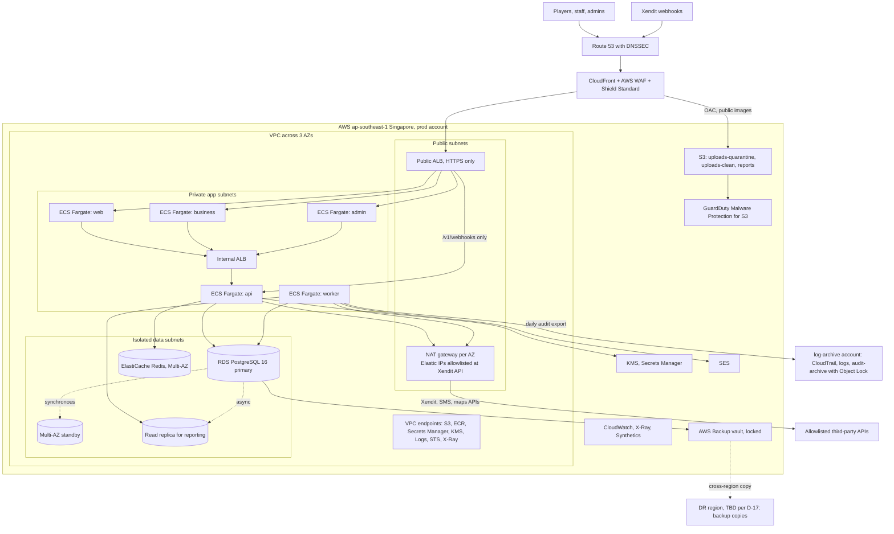

# 21 — Deployment Architecture

| | |
|---|---|
| Product | CourtKo (working name) |
| Artifact | Design output 21 of 23 |
| Status | Draft for review. PRODUCTION target on AWS ap-southeast-1 (Singapore). Sizes, schedules and RPO/RTO values are **starting points and targets**, to be validated by load tests (doc 20) and restore drills. Provider values (Xendit keys, IPs, fees) are placeholders (doc 23 D-01). |
| Last updated | 2026-09-30 |
| Related | [14 Threat model](./14-security-threat-model.md) · [15 Privacy & retention](./15-privacy-data-retention-matrix.md) · [20 Testing](./20-testing-strategy.md) · [22 Monitoring](./22-operational-monitoring.md) · [23 Decisions](./23-assumptions-and-decisions.md) · doc 11 (system architecture) |

## 1. Principles

1. Everything is code (Terraform); no console-only changes in staging or production.
2. Separate AWS accounts per environment; production data never leaves the production account.
3. Private by default: only CloudFront and the public ALB face the internet; data stores live in isolated subnets.
4. Immutable, signed images promoted by digest from dev → staging → prod.
5. Zero-downtime releases through expand/contract migrations and blue/green or canary traffic shifting with automatic rollback.
6. Least privilege everywhere: per-service IAM roles, per-data-class KMS keys, GitHub OIDC with no long-lived keys.

## 2. AWS accounts and environments

| Account (AWS Organizations) | Purpose | Notes |
|---|---|---|
| management | Organizations, consolidated billing, SCPs, IAM Identity Center | No workloads |
| security | Delegated admin for GuardDuty, Security Hub, Config aggregator, IAM Access Analyzer, Inspector | Security team only |
| log-archive | CloudTrail organization trail, Config history, ALB/CloudFront/WAF/VPC flow logs, `audit-archive` bucket (Object Lock) | Write-only for producers; read via break-glass |
| shared-services | ECR (images replicated to workload accounts), CI deploy role federation | No personal data |
| dev · staging · prod | Workloads per environment | Identical Terraform modules, different variables |
| dr-restore (optional) | Isolated monthly restore tests | No network path to prod |

Service control policies (all workload accounts): deny leaving the organization; deny disabling CloudTrail, GuardDuty, Config or Security Hub; deny regions other than ap-southeast-1, the DR region (D-17) and global services; deny root-user actions; deny IAM users and access keys (except sealed break-glass); deny making RDS snapshots or AMIs public; deny disabling S3 Block Public Access.

## 3. Production deployment diagram



## 4. Network

| Tier | Prod CIDR (example, VPC 10.30.0.0/16) | Contents | Routing |
|---|---|---|---|
| Public (a, b, c) | 10.30.0.0/24 · 10.30.1.0/24 · 10.30.2.0/24 | Public ALB, NAT gateways | Internet gateway |
| Private app (a, b, c) | 10.30.16.0/20 · 10.30.32.0/20 · 10.30.48.0/20 | ECS tasks, internal ALB, interface endpoints | NAT gateway in same AZ |
| Isolated data (a, b, c) | 10.30.64.0/24 · 10.30.65.0/24 · 10.30.66.0/24 | RDS, ElastiCache | VPC-local only, no internet route |

- **NAT:** one per AZ in prod; one shared in dev and staging (cost). Egress security groups allow only 443 plus DB/Redis ports; the application's outbound HTTP client enforces a hostname allowlist (doc 14 C15). AWS Network Firewall domain filtering is a Phase 2 option.
- **VPC endpoints:** S3 (gateway); ECR API, ECR Docker, Secrets Manager, KMS, CloudWatch Logs, CloudWatch monitoring, STS, X-Ray (interface). They remove NAT dependency and cost for AWS API traffic.
- **Security groups:** public ALB accepts 443 only from the CloudFront origin-facing managed prefix list and requires a rotating origin-verification header; app services accept traffic only from their load balancer; `api` accepts from the internal ALB and (webhook target group only) the public ALB; `worker` has no inbound; RDS 5432 and Redis 6379 only from `api`, `worker` and the migrator task.
- **Flow logs** from every VPC to the log-archive account. No peering between environment VPCs.
- The AWS Local Zone in Manila (part of ap-southeast-1) is not used for the data tier; it can be evaluated later for latency-sensitive edge workloads.

## 5. Edge

| Component | Configuration |
|---|---|
| Route 53 | Hosted zone for the production domain (placeholder `courtko.ph`, D-25); DNSSEC signing; CAA records restricting issuance to Amazon; health checks on public endpoints |
| Certificates | ACM (us-east-1 for CloudFront, ap-southeast-1 for ALBs); automatic renewal; expiry alarm |
| CloudFront | Distributions for `courtko.ph`/`app.courtko.ph`, `business.courtko.ph`, `admin.courtko.ph`, `api.courtko.ph`; security policy TLSv1.2_2021; HTTP→HTTPS; response-headers policy (HSTS, nosniff, referrer policy; CSP set by the apps with nonces); `/v1/*` uses caching-disabled policy and forwards required headers; static assets cached with immutable hashes; public images from `uploads-clean/public/` via Origin Access Control |
| AWS WAF (per distribution) | Managed rules: Amazon IP reputation, Common Rule Set, Known Bad Inputs, SQLi; Bot Control (targeted) on auth, signup, holds and availability; Account Takeover Prevention on `POST /v1/auth/login`; Account Creation Fraud Prevention on signup; rate-based rules (e.g. per IP 2,000 / 5 min general, 100 / 5 min on `/v1/auth/*`, 300 / 5 min on hold creation — targets); CAPTCHA/challenge actions only on risk signals |
| Admin distribution | IP allowlist (office/VPN egress) + anonymous-IP block; no public fallback |
| Webhook path | Allow only `POST /v1/webhooks/xendit`, JSON, ≤ 256 KB, `x-callback-token` present; optional Xendit source-IP set once supplied by Xendit support |
| WAF logging | To log-archive with redacted fields `authorization`, `cookie`, `x-callback-token` |
| Shield | Shield Standard (automatic). Shield Advanced is a cost decision for later scale. |

Geo-blocking is not enabled (players abroad book trips home); geography is logged for risk scoring.

## 6. Compute — ECS Fargate

All services run on Fargate ARM64 (Graviton), Node.js 24 LTS, distroless non-root images with read-only root filesystems, spread across 3 AZs, logs to CloudWatch, traces via an AWS Distro for OpenTelemetry collector sidecar.

| Service | Task size (starting point) | Prod min / max tasks | Scaling signal (target tracking) | Notes |
|---|---|---|---|---|
| web | 0.5 vCPU / 1 GB | 3 / 12 | CPU 60% and ALB requests per target | Next.js standalone build |
| business | 0.5 vCPU / 1 GB | 2 / 6 | CPU 60% | |
| admin | 0.25 vCPU / 0.5 GB | 2 / 3 | CPU 60% | Allowlisted host |
| api | 1 vCPU / 2 GB | 3 / 18 | CPU 55% and ALB requests per target | DB pool 10 per task |
| worker | 0.5 vCPU / 1 GB | 2 / 8 | pg-boss queue depth and oldest-job age (custom metrics) | Cron schedules via pg-boss; graceful drain on stop |
| migrator | 0.5 vCPU / 1 GB | one-off per deploy | — | Runs with the migration DB role only |

- Scale-out cooldown 60 s, scale-in 300 s; scheduled minimum increase for the evening peak (17:00–23:00 PHT) and announced tournament openings.
- Connection budget: Σ(max tasks × pool size) must stay below 70% of RDS `max_connections`; introduce RDS Proxy if it approaches that limit.
- Dev and staging: minimum 1 task per service (staging keeps the 3-AZ topology to exercise failover).

## 7. Data tier

### 7.1 RDS PostgreSQL 16 (Multi-AZ) with PostGIS

| Item | Setting |
|---|---|
| Instance (starting point) | Prod `db.r7g.large` Multi-AZ; staging `db.t4g.medium`; dev `db.t4g.small` — validate with k6 |
| Storage | gp3, 100 GiB start, storage autoscaling cap 1 TiB, encrypted with the `rds` CMK |
| Extensions | `postgis`, `btree_gist`, `pg_trgm`, `citext`, `pgcrypto`, `pg_stat_statements`, `pgaudit` |
| Parameter hardening | `rds.force_ssl = 1`; `ssl_min_protocol_version = TLSv1.2`; `password_encryption = scram-sha-256`; `log_connections` and `log_disconnections` on; `log_statement = ddl`; `log_min_duration_statement = 500 ms` with `log_parameter_max_length = 0` and `log_parameter_max_length_on_error = 0` (no bind values, which may contain PII); `pgaudit.log = 'ddl, role'`; `idle_in_transaction_session_timeout = 60 s`; `shared_preload_libraries = pg_stat_statements, pgaudit` |
| Per-role limits | App roles: `statement_timeout` 15 s, `lock_timeout` 5 s; reporting role 120 s; migrator `lock_timeout` 5 s with retries |
| Roles | `courtko_owner` (migrations, owns schema), `app_api` and `app_worker` (DML, no `BYPASSRLS`), `app_reporting` (replica, reporting views), `app_support_ro` (SELECT only, support mode), `app_archiver` (audit partitions). The master user is never used by applications. |
| Read replica | One replica in a different AZ for `reports.generate` and analytics; RLS applies identically |
| Backups | PITR retention 35 days (prod), 7 (staging), 1 (dev); AWS Backup daily snapshots kept 35 days and monthly kept 12 months (targets); vault lock on the prod vault; daily copy to the DR region (D-17: destination subject to Data Privacy Act cross-border review) |
| Protection | Deletion protection; Performance Insights; Enhanced Monitoring 60 s; maintenance window Tuesday 03:00–04:00 PHT; minor upgrades rehearsed in staging |

### 7.2 ElastiCache

Redis OSS-compatible engine (Valkey is an acceptable cost option), Multi-AZ with one replica and automatic failover, TLS in transit, KMS at rest, AUTH/RBAC user per service, persistence off (rate-limit counters and short-lived caches only; no personal data, keys use hashed identifiers).

### 7.3 S3 buckets (per environment)

| Bucket | Purpose | Access | Encryption | Lifecycle |
|---|---|---|---|---|
| `courtko-{env}-uploads-quarantine` | Browser uploads via presigned POST (size/type conditions, 5 min expiry) | Worker and GuardDuty read; nothing served | SSE-KMS `uploads` | Expire after 1 day |
| `courtko-{env}-uploads-clean` | `public/` processed images (CloudFront OAC); `restricted/` KYB documents and evidence (presigned GET 60 s) | Worker writes; API presigns | SSE-KMS `uploads` (public) / `app-pii` (restricted) | Restricted objects by `retention.enforce`; noncurrent versions 30 days |
| `courtko-{env}-reports` | Generated exports | Worker writes; presigned GET 5 min | SSE-KMS `reports` | Expire after 7 days |
| `courtko-{env}-audit-archive` (log-archive account) | Daily audit JSONL + signed manifests | Write-only archive role; read via break-glass | SSE-KMS `audit` | Object Lock compliance mode: 10 years financial, 2 years security/operational (targets) |
| `courtko-{env}-logs` (log-archive account) | ALB, CloudFront, WAF, VPC flow logs | Log delivery services | SSE-KMS `logs` | 1 year (target) |

Every bucket: Block Public Access, ACLs disabled (bucket-owner enforced), versioning, a policy denying non-TLS requests (`aws:SecureTransport = false`) and uploads without the designated KMS key; data buckets additionally deny reads that do not come through the VPC endpoint (CloudFront OAC and presigned browser uploads excepted by explicit statements). Quarantine objects are unreadable by the API unless tagged `GuardDutyMalwareScanStatus = NO_THREATS_FOUND`.

## 8. Security services

KMS customer-managed keys per data class (per account; annual automatic rotation for symmetric keys):

| Alias | Protects | Key-policy highlights |
|---|---|---|
| `alias/courtko/rds` | RDS storage, snapshots, Performance Insights | RDS and AWS Backup service use only |
| `alias/courtko/app-pii` | Envelope encryption of SPI fields; `restricted/` objects | Encrypt/decrypt only by `api`/`worker` task roles with encryption-context conditions |
| `alias/courtko/uploads` | Upload buckets | API (presign), worker, GuardDuty scan role |
| `alias/courtko/reports` | Reports bucket | Worker encrypt; API decrypt for presigning |
| `alias/courtko/audit` | Audit archive (log-archive account) | Archive role encrypt; decrypt via break-glass only |
| `alias/courtko/audit-signing` (asymmetric ECC P-256) | Audit manifest signatures | Sign: archive role; verify: verification job |
| `alias/courtko/qr-hmac` (HMAC-256) | QR and pickup claim tokens | `GenerateMac` / `VerifyMac` by API; rotated by new key + alias |
| `alias/courtko/secrets`, `logs`, `cache`, `backup` (+ DR-region backup key) | Secrets Manager, CloudWatch Logs, ElastiCache, backup vaults | Service-scoped |

- **Secrets Manager:** all credentials; rotation schedule in doc 14 §6.4 (RDS-managed master secret, 30-day app-role rotation, 90-day Xendit key rotation, callback-token dual-accept cutover).
- **IAM:** humans via IAM Identity Center with MFA — permission sets `ReadOnly`, `Developer` (dev; limited staging), `Operator` (prod deploy and logs, no data-plane access), `SecurityAudit`, sealed `BreakGlassAdmin` (alarm on use). Workloads: one task role per service (e.g. `api` may presign `uploads-quarantine/*`, read its own secrets and use `app-pii` with context; `worker` adds SES send and `reports` write). Permission boundaries on Terraform-created roles; IAM Access Analyzer for unused access.
- **Detection:** GuardDuty in all accounts (S3 protection, RDS login activity, ECS runtime monitoring, Malware Protection for S3); Security Hub (AWS Foundational Security Best Practices + CIS AWS Foundations); CloudTrail organization trail with S3 data events for `restricted/` and `audit-archive` and KMS events; AWS Config recorder + conformance packs; Inspector enhanced scanning for ECR. Findings route per doc 22.

## 9. Email (SES)

1. Domain identity for the production domain (placeholder) with Easy DKIM (2048-bit) and a custom MAIL FROM subdomain (MX + SPF `v=spf1 include:amazonses.com -all`) for SPF alignment.
2. DMARC published at `p=none` with aggregate reports, moved to `quarantine` and then `reject` after several weeks of clean reports.
3. Separate subdomains for transactional and marketing mail to isolate reputation; marketing carries one-click unsubscribe (RFC 8058).
4. Configuration sets with event destinations (delivery, bounce, complaint, reject) → EventBridge → worker updates `notifications` and the suppression list; account-level suppression enabled.
5. Production access (sandbox exit) requested before launch; targets: bounce < 2%, complaint < 0.1% (alarms in doc 22).
6. Dev/staging stay in the SES sandbox or deliver to a mail sink.

## 10. CI/CD (GitHub Actions)

```mermaid
flowchart LR
  B["Build: pnpm frozen lockfile, Turborepo affected"] --> T["Test suites (doc 20)"]
  T --> SC["Scans: Semgrep, CodeQL, OSV, gitleaks, Checkov, Trivy"]
  SC --> IMG["ARM64 images, SBOM, signature, push to ECR by digest"]
  IMG --> MIG["Migrate: one-off migrator task, expand phase"]
  MIG --> DEP["Deploy: ECS blue/green or canary with test listener"]
  DEP --> SMK["Smoke tests on green before traffic"]
  SMK --> PROG["Progressive traffic: canary 10%, bake, 100%"]
  PROG --> BAKE["Bake time with CloudWatch alarms"]
  BAKE -->|alarm| RB["Automatic rollback to blue"]
  BAKE -->|healthy| DONE["Release marker on dashboards"]
```



- **Authentication:** GitHub OIDC to per-environment roles (`ci-plan`, `ci-deploy-dev|staging|prod`); trust restricted to this repository and GitHub environment (`repo:<org>/courtko:environment:prod`); the production environment requires approval by a designated reviewer with self-review prevented (the person who triggered the deploy cannot approve it), on top of the two-reviewer branch protection for merges. No long-lived AWS keys exist.
- **Migrations (forward-only, expand/contract):** expand steps (new tables, nullable columns, `CREATE INDEX CONCURRENTLY`, constraints `NOT VALID` then `VALIDATE`, batched backfills, dual writes) ship before dependent code; contract steps (drop old columns) ship in a later release once no running version uses them (≥ 1 release and ≥ 7 days). squawk blocks unsafe DDL in CI.
- **Deploy strategy:** `api`, `web`, `business`, `admin` use ECS built-in blue/green or canary deployments with ALB test listeners (pre-traffic smoke tests via lifecycle hooks), a 10-minute bake time (target) and CloudWatch alarm-driven rollback (5xx rate, p95 latency, payment-session error rate). `worker` uses rolling updates with the ECS deployment circuit breaker (rollback enabled) and graceful pg-boss drain; jobs are idempotent.
- **Deploy windows:** outside 17:00–22:00 PHT; change freeze during major tournaments (target).

Rollback procedure:

1. **Fastest:** turn off the feature flag or kill switch involved.
2. **Automatic:** an alarm during canary or bake shifts traffic back to blue.
3. **Manual:** run the `rollback` workflow (`workflow_dispatch`) with the previous task-definition revision per service; expand-only migrations guarantee the previous version runs on the current schema.
4. **Data:** fix forward with a reviewed migration or reversing journals; restore from backup only for catastrophic corruption (doc 22 runbook "Restore from backup").
5. Record the rollback in the incident or change log; add a regression test before redeploying.

## 11. Infrastructure as code (Terraform)

```
infra/terraform/
  org/                 accounts, SCPs, Identity Center, organization trail (management account)
  modules/
    network/           VPC, subnets, NAT, endpoints, flow logs, security groups
    data/              RDS + parameter groups, read replica, ElastiCache, S3 buckets, AWS Backup
    compute/           ECS cluster/services/task definitions, ALBs, target groups, autoscaling, ECR
    edge/              Route 53, ACM, CloudFront, WAF web ACLs
    security/          KMS keys, Secrets Manager, IAM roles, GuardDuty, Security Hub, Config
    observability/     log groups, metric filters, alarms, dashboards, Synthetics canaries, SNS topics
  envs/
    dev/  staging/  prod/     main.tf, backend.tf, terraform.tfvars (no secrets)
```

- **State:** one S3 state bucket per workload account (versioned, SSE-KMS, Block Public Access, TLS-only policy) with a DynamoDB lock table; Terraform's S3-native lockfile can replace DynamoDB later.
- **Workflow:** `plan` on every PR (posted as a comment, Checkov + tflint), `apply` on merge per environment, production apply gated by approval; nightly drift detection (`plan -detailed-exitcode`) alerts on drift; provider and module versions pinned; `default_tags` applies cost tags.

## 12. Secrets and configuration management

| Kind | Store | Delivery |
|---|---|---|
| Secrets (DB credentials, Xendit key and callback token, SMS credentials, VAPID keys) | Secrets Manager `courtko/{env}/…` | ECS task-definition `secrets` by ARN; rotation events trigger a rolling restart, DB credentials refresh in the driver |
| Non-secret infrastructure config (bucket names, key ARNs, hostnames) | SSM Parameter Store `/courtko/{env}/{service}/…` | Task environment at deploy |
| Business configuration (commission defaults, policies, fee schedules) | PostgreSQL `platform_settings` (versioned, audited, maker-checker) | Runtime |

Every service validates its configuration with a Zod schema at startup and refuses to start when invalid. Production additionally asserts `PAYMENT_ADAPTER=xendit` with a live-mode key and fails fast if the mock adapter or a test key is configured; non-production asserts the opposite.

## 13. Feature flags

- DB-backed `feature_flags` (key, environment, default, targeting by business, venue or user cohort, owner, expiry date), cached in-process for 30 s; changes audited (`feature_flag.changed`), money-affecting flags require maker-checker. Flag keys use the `ff.` prefix so they can never be mistaken for permission codes.
- Initial feature flags (all off unless stated): `ff.payments.method.<code>` (per-method enablement); `ff.payments.fee_pass_through.<method>` (off for every method until D-05 is resolved); `ff.settlement.model_b`; `ff.payments.split` (Phase 2); `ff.sms` (until D-22); `ff.events.age_categories` (until D-20); `ff.ratings.external` (Phase 2).
- Kill switches (off = normal operation; on = protective action): `ff.kill.new_bookings` (global or per venue), `ff.kill.payouts`, `ff.kill.read_only` (platform-wide read-only mode).
- Each flag has an owner and a removal date; stale flags are reported monthly.

## 14. Environment separation

| | dev | staging | prod |
|---|---|---|---|
| AWS account | Separate | Separate | Separate |
| Data | Synthetic | Synthetic, year-1 volume | Real |
| Payments | Mock / Xendit test mode | Xendit test mode | Xendit live |
| Email / SMS | SES sandbox or sink / disabled | Sink | SES production / aggregator when contracted |
| Human access | Developers | Limited | `Operator` and break-glass only |
| Backups | Minimal | 7-day PITR | Full plan (§15) |

The same image digest is promoted through all environments. There is no network path between environment VPCs, and production data (including snapshots) cannot be copied to lower environments (SCP + KMS key policies).

## 15. Backup, restore and disaster recovery

| Scenario | Mechanism | RPO target | RTO target |
|---|---|---|---|
| Single AZ or primary-component failure | Multi-AZ RDS failover; ECS across 3 AZs; Redis replica | ≈ 0 | ≤ 5 min (upper bound 4 h per doc 01 NFR) |
| Logical corruption, bad migration, operator error | PITR to a new instance, validate, cut over | ≤ 5 min | ≤ 4 h |
| Accidental S3 deletion | Versioning and noncurrent retention | ≈ 0 | ≤ 1 h |
| Ransomware or account compromise | Locked AWS Backup vault; cross-account copy | ≤ 24 h | ≤ 24 h |
| Region loss | Daily cross-region snapshot copies + Terraform redeploy in the DR region | ≤ 24 h | ≤ 48 h (Phase 2: cross-region replica to reduce both) |

Restore test cadence: **monthly** automated snapshot restore into the isolated `dr-restore` account (row counts, ledger balance Σ debit = Σ credit, audit hash-chain verification, application smoke tests, elapsed time recorded); **quarterly** game day combining a PITR restore and a cross-region restore from the DR-region copy; **semi-annual** full-stack rebuild from Terraform; **annual** region-failover exercise. After any restore, the privacy erasure log is replayed (doc 15 §9). Results are reported to the product owner and tracked against the targets above.

## 16. Cost monitoring and cost drivers

- **AWS Budgets** per account with alerts at 50%, 80% and 100% of actual and forecast spend; per-service budgets for the top drivers.
- **Cost Anomaly Detection** monitors per linked account and per service, with a daily digest and immediate alerts above threshold.
- **Tagging:** `app`, `env`, `service`, `component`, `owner`, `data_class`, `cost_center` via Terraform `default_tags`, enforced by tag policies; cost allocation tags activated.
- **Reporting:** cost and usage data exports to S3 for monthly FinOps review; Compute Optimizer and Savings Plans evaluated after ~3 months of baseline usage.

| Cost driver | What makes it grow | Main levers |
|---|---|---|
| NAT gateways | Hours per AZ and GB processed | VPC endpoints for AWS APIs; single NAT outside prod |
| RDS Multi-AZ + read replica | Instance class, storage, I/O, backup storage, cross-region copies | Right-size after load tests; Graviton; snapshot retention tuning |
| ECS Fargate | vCPU/GB-hours × task count | ARM64, autoscaling, scheduled minimums, Savings Plans |
| CloudFront and data transfer | Traffic, image sizes | Caching, modern image formats, compression |
| AWS WAF | Web ACLs, rules, requests; Bot Control, ATP and ACFP per-request fees | Scope intelligent rules to sensitive paths only |
| GuardDuty (incl. S3 malware scanning) | Event volume, scanned GB | Scan only upload buckets |
| CloudWatch Logs and metrics | Ingestion GB, custom metrics, retention | Sampling, log levels, retention per log group |
| KMS and Secrets Manager | Keys, secrets, API requests | Data-key caching |
| SES and SMS | Message volume (SMS is usually the larger per-message cost) | Email/push first; SMS only where needed |
| Maps / geocoding | Map loads and geocoding calls | Geocode venue addresses once; lazy-load maps; respect provider caching terms |
